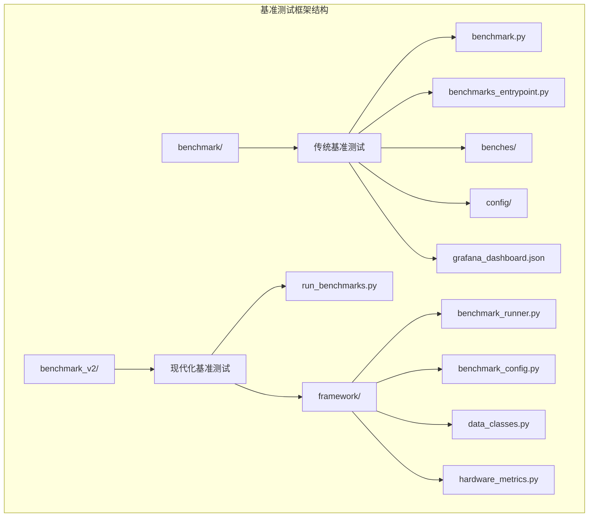
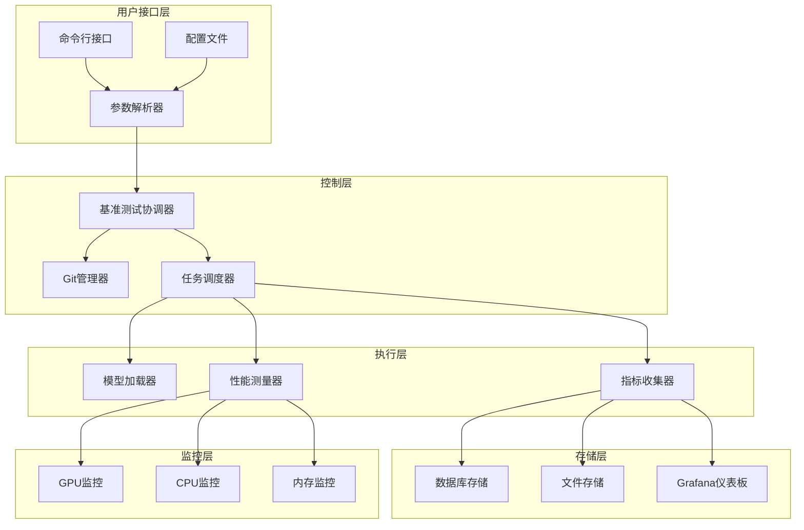
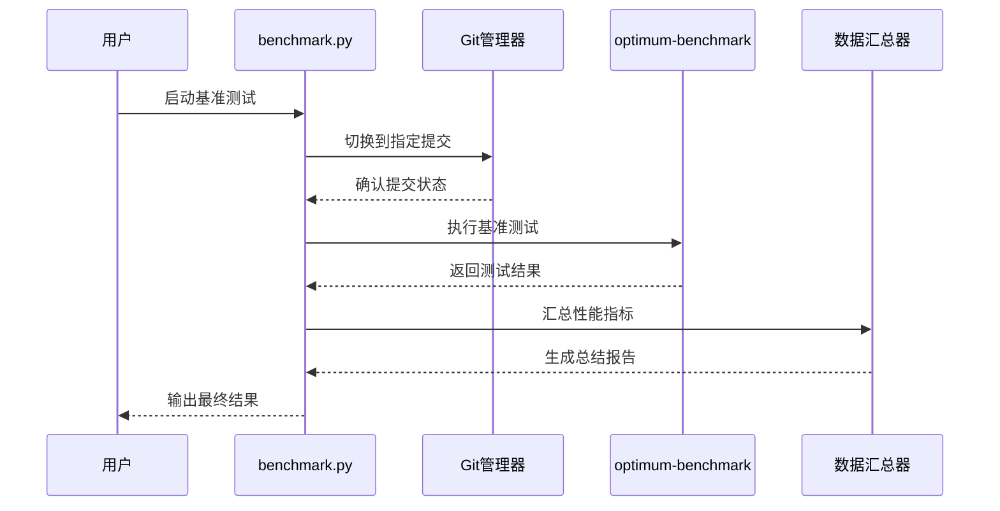
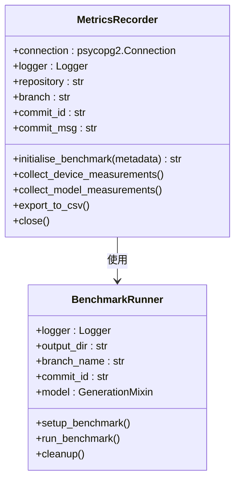
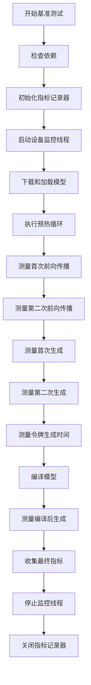
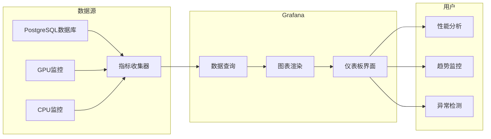
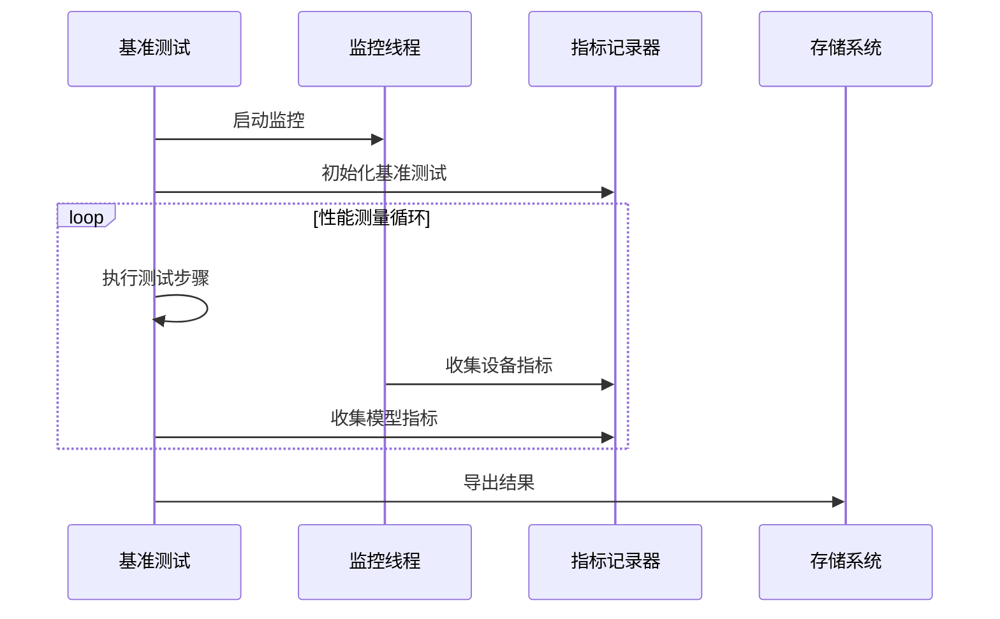

# 基准测试框架

<cite>
**本文档中引用的文件**
- [benchmark.py](file://benchmark/benchmark.py)
- [benchmarks_entrypoint.py](file://benchmark/benchmarks_entrypoint.py)
- [generation.yaml](file://benchmark/config/generation.yaml)
- [grafana_dashboard.json](file://benchmark/grafana_dashboard.json)
- [llama.py](file://benchmark/benches/llama.py)
- [optimum_benchmark_wrapper.py](file://benchmark/optimum_benchmark_wrapper.py)
- [README.md](file://benchmark/README.md)
- [run_benchmarks.py](file://benchmark_v2/run_benchmarks.py)
- [benchmark_runner.py](file://benchmark_v2/framework/benchmark_runner.py)
- [requirements.txt](file://benchmark/requirements.txt)
- [requirements.txt](file://benchmark_v2/requirements.txt)
</cite>

## 目录
1. [简介](#简介)
2. [项目结构](#项目结构)
3. [核心组件](#核心组件)
4. [架构概览](#架构概览)
5. [详细组件分析](#详细组件分析)
6. [配置系统](#配置系统)
7. [Grafana监控集成](#grafana监控集成)
8. [运行和扩展基准测试](#运行和扩展基准测试)
9. [性能数据分析](#性能数据分析)
10. [硬件环境支持](#硬件环境支持)
11. [故障排除指南](#故障排除指南)
12. [结论](#结论)

## 简介

transformers库的基准测试框架是一个全面的性能评估系统，专门用于评估大型语言模型（LLM）的推理性能、生成速度和资源消耗。该框架提供了两个主要版本：传统版本（benchmark/）和现代化版本（benchmark_v2/），支持多种硬件环境（GPU、TPU）和丰富的监控指标。

该框架的核心目标是：
- 提供标准化的性能基准测试流程
- 支持多维度性能指标收集（延迟、吞吐量、内存使用等）
- 集成Grafana监控和数据库存储
- 支持不同硬件平台的性能对比
- 提供可扩展的基准测试扩展机制

## 项目结构

基准测试框架采用模块化设计，分为两个主要版本：



**图表来源**
- [benchmark.py](file://benchmark/benchmark.py#L1-L50)
- [benchmarks_entrypoint.py](file://benchmark/benchmarks_entrypoint.py#L1-L50)
- [run_benchmarks.py](file://benchmark_v2/run_benchmarks.py#L1-L50)

**章节来源**
- [benchmark.py](file://benchmark/benchmark.py#L1-L325)
- [benchmarks_entrypoint.py](file://benchmark/benchmarks_entrypoint.py#L1-L503)

## 核心组件

### 传统基准测试框架（benchmark/）

传统基准测试框架基于`optimum-benchmark`库构建，提供以下核心功能：

1. **主控制器** (`benchmark.py`)
   - 处理命令行参数解析
   - 管理Git提交切换
   - 协调基准测试执行流程

2. **入口点管理** (`benchmarks_entrypoint.py`)
   - 自动发现和加载基准测试模块
   - 管理指标记录器（MetricsRecorder）
   - 支持数据库和CSV双重存储模式

3. **基准测试模块** (`benches/`)
   - 包含具体的性能测试实现
   - 支持设备和模型指标收集
   - 提供线程安全的监控机制

### 现代化基准测试框架（benchmark_v2/）

现代化基准测试框架提供了更先进的功能和更好的扩展性：

1. **统一入口** (`run_benchmarks.py`)
   - 自动配置和参数处理
   - 批量测试执行
   - 结果聚合和分析

2. **基准运行器** (`benchmark_runner.py`)
   - 智能的模型设置和清理
   - 多维度性能测量
   - 内置内存管理和优化

**章节来源**
- [benchmark.py](file://benchmark/benchmark.py#L25-L100)
- [benchmarks_entrypoint.py](file://benchmark/benchmarks_entrypoint.py#L50-L150)
- [run_benchmarks.py](file://benchmark_v2/run_benchmarks.py#L25-L80)

## 架构概览

基准测试框架采用分层架构设计，确保了良好的可扩展性和维护性：



**图表来源**
- [benchmark.py](file://benchmark/benchmark.py#L150-L250)
- [benchmarks_entrypoint.py](file://benchmark/benchmarks_entrypoint.py#L300-L400)
- [benchmark_runner.py](file://benchmark_v2/framework/benchmark_runner.py#L100-L200)

## 详细组件分析

### 主基准测试控制器（benchmark.py）

主控制器负责整个基准测试流程的协调和管理：



**图表来源**
- [benchmark.py](file://benchmark/benchmark.py#L250-L325)

主要功能包括：
- Git提交管理：自动切换到指定的代码提交版本
- 参数验证：确保所有必需参数都已正确设置
- 结果汇总：将多个测试结果整合为统一格式
- 数据上传：支持将结果上传到Hugging Face Hub

**章节来源**
- [benchmark.py](file://benchmark/benchmark.py#L25-L100)

### 基准测试入口点（benchmarks_entrypoint.py）

入口点管理器提供了灵活的基准测试模块发现和执行机制：



**图表来源**
- [benchmarks_entrypoint.py](file://benchmark/benchmarks_entrypoint.py#L50-L150)
- [benchmark_runner.py](file://benchmark_v2/framework/benchmark_runner.py#L150-L250)

**章节来源**
- [benchmarks_entrypoint.py](file://benchmark/benchmarks_entrypoint.py#L50-L200)
- [benchmark_runner.py](file://benchmark_v2/framework/benchmark_runner.py#L150-L300)

### LLaMA基准测试示例（llama.py）

LLaMA基准测试展示了如何实现一个完整的性能测试：



**图表来源**
- [llama.py](file://benchmark/benches/llama.py#L50-L200)

**章节来源**
- [llama.py](file://benchmark/benches/llama.py#L1-L100)

## 配置系统

### 传统配置系统（generation.yaml）

传统配置系统基于Hydra框架，提供了灵活的配置管理：

| 配置项 | 类型 | 默认值 | 描述 |
|--------|------|--------|------|
| name | string | pytorch_generate | 基准测试名称 |
| backend.device | string | cuda | 设备类型（cuda/cpu） |
| backend.model | string | meta-llama/Llama-2-7b-hf | 模型标识符 |
| backend.torch_compile | boolean | true | 是否启用torch.compile |
| scenario.batch_size | integer | 1 | 输入批次大小 |
| scenario.sequence_length | integer | 7 | 序列长度 |
| scenario.max_new_tokens | integer | 128 | 最大生成令牌数 |

### 现代化配置系统

现代化配置系统提供了更丰富的参数选项：

| 配置项 | 类型 | 默认值 | 描述 |
|--------|------|--------|------|
| warmup_iterations | integer | 5 | 预热迭代次数 |
| measurement_iterations | integer | 20 | 测量迭代次数 |
| batch_size | list[int] | [1] | 批次大小列表 |
| sequence_length | list[int] | [128] | 序列长度列表 |
| num_tokens_to_generate | list[int] | [128] | 生成令牌数列表 |
| compile_mode | string | None | 编译模式 |
| gpu_monitoring | boolean | False | 是否启用GPU监控 |

**章节来源**
- [generation.yaml](file://benchmark/config/generation.yaml#L1-L57)
- [run_benchmarks.py](file://benchmark_v2/run_benchmarks.py#L25-L80)

## Grafana监控集成

### 监控仪表板架构

Grafana仪表板提供了实时的性能监控和历史数据分析：



**图表来源**
- [grafana_dashboard.json](file://benchmark/grafana_dashboard.json#L1-L100)

### 关键监控指标

仪表板监控以下核心性能指标：

| 指标类别 | 具体指标 | 单位 | 描述 |
|----------|----------|------|------|
| 模型性能 | first_eager_forward_pass_time_secs | 秒 | 首次前向传播时间 |
| 模型性能 | second_eager_forward_pass_time_secs | 秒 | 第二次前向传播时间 |
| 模型性能 | time_to_first_token_secs | 秒 | 首个令牌生成时间 |
| 模型性能 | time_to_next_token_mean_secs | 秒 | 平均令牌生成间隔 |
| 资源使用 | cpu_util | 百分比 | CPU利用率 |
| 资源使用 | gpu_util | 百分比 | GPU利用率 |
| 资源使用 | mem_megabytes | MB | 内存使用量 |
| 资源使用 | gpu_mem_megabytes | MB | GPU内存使用量 |

**章节来源**
- [grafana_dashboard.json](file://benchmark/grafana_dashboard.json#L100-L300)

## 运行和扩展基准测试

### 基本运行命令

#### 传统基准测试运行

```bash
# 基本运行
python benchmark/benchmark.py \
    --config-dir benchmark/config \
    --config-name generation \
    --commit=9b9c7f03da625b13643e99205c691fe046461724 \
    --metrics=decode.latency.mean,per_token.latency.mean

# 多运行模式
python benchmark/benchmark.py \
    --config-dir benchmark/config \
    --config-name generation \
    --multirun \
    benchmark.input_shapes.batch_size=1,2,4 \
    benchmark.input_shapes.sequence_length=512,1024
```

#### 现代化基准测试运行

```bash
# 基本运行
python benchmark_v2/run_benchmarks.py \
    --batch-size 1 2 \
    --sequence-length 512 1024 \
    --num-tokens-to-generate 128 256 \
    --iterations 10 \
    --warmup 3

# 跨生成测试
python benchmark_v2/run_benchmarks.py \
    --cross-generate \
    --batch-size 1 4 \
    --sequence-length 512 2048 \
    --num-tokens-to-generate 128 512
```

### 添加新的基准测试

#### 传统方式

1. 在`benchmark/benches/`目录创建Python文件
2. 实现`run_benchmark`函数
3. 使用`MetricsRecorder`记录指标

```python
def run_benchmark(logger, repository, branch, commit_id, commit_msg, num_tokens_to_generate=100):
    # 实现基准测试逻辑
    metrics_recorder = MetricsRecorder(...)
    benchmark_id = metrics_recorder.initialise_benchmark(metadata)
    
    # 记录设备指标
    metrics_recorder.collect_device_measurements(benchmark_id, cpu_util, mem_megabytes, gpu_util, gpu_mem_megabytes)
    
    # 记录模型指标
    metrics_recorder.collect_model_measurements(benchmark_id, measurements)
```

#### 现代化方式

1. 创建配置类继承自`BenchmarkConfig`
2. 实现`run_benchmark`方法
3. 使用内置的测量和监控功能

**章节来源**
- [README.md](file://benchmark/README.md#L1-L50)
- [run_benchmarks.py](file://benchmark_v2/run_benchmarks.py#L50-L143)

## 性能数据分析

### 数据收集流程



**图表来源**
- [llama.py](file://benchmark/benches/llama.py#L50-L150)
- [benchmarks_entrypoint.py](file://benchmark/benchmarks_entrypoint.py#L100-L200)

### 结果分析方法

#### 统计指标计算

框架自动计算以下统计指标：
- **平均值**：基本性能指标的算术平均
- **标准差**：性能波动程度的度量
- **百分位数**：极端情况下的性能表现
- **趋势分析**：随时间变化的性能趋势

#### 性能对比分析

支持多种对比维度：
- **模型对比**：不同模型间的性能差异
- **配置对比**：相同模型的不同配置效果
- **硬件对比**：不同硬件平台的性能表现
- **版本对比**：同一模型在不同版本间的性能变化

**章节来源**
- [benchmark_runner.py](file://benchmark_v2/framework/benchmark_runner.py#L300-L400)

## 硬件环境支持

### GPU支持

框架原生支持各种GPU平台：

| GPU厂商 | 支持型号 | 监控能力 | 特殊功能 |
|---------|----------|----------|----------|
| NVIDIA | RTX系列、A100、H100 | 完整监控 | CUDA优化 |
| AMD | MI系列、Radeon系列 | 基础监控 | ROCm兼容 |
| Intel | Arc系列 | 基础监控 | XPU支持 |

### TPU支持

通过Docker容器化支持TPU环境：

```yaml
# TPU环境配置示例
docker-compose -f docker/transformers-pytorch-tpu/docker-compose.yml up
```

### 内存管理

框架实现了智能的内存管理策略：
- **自动垃圾回收**：定期清理未使用的内存
- **CUDA缓存重置**：防止内存泄漏
- **动态内存分配**：根据测试需求调整内存使用

**章节来源**
- [llama.py](file://benchmark/benches/llama.py#L30-L50)
- [benchmark_runner.py](file://benchmark_v2/framework/benchmark_runner.py#L100-L150)

## 故障排除指南

### 常见问题及解决方案

#### 内存不足错误

**症状**：CUDA out of memory错误
**解决方案**：
1. 减少批次大小
2. 使用梯度检查点
3. 降低模型精度（float16 → float32）

#### GPU监控失败

**症状**：无法连接到GPU监控服务
**解决方案**：
1. 检查GPU驱动程序版本
2. 验证CUDA安装完整性
3. 确认端口访问权限

#### 数据库连接问题

**症状**：指标无法保存到数据库
**解决方案**：
1. 检查PostgreSQL服务状态
2. 验证数据库凭据
3. 确认网络连接

### 调试技巧

#### 启用详细日志

```bash
export LOG_LEVEL=DEBUG
python benchmark/benchmark.py --config-name generation
```

#### 性能分析

使用内置的性能分析功能：

```bash
python benchmark_v2/run_benchmarks.py \
    --num-tokens-to-profile 100 \
    --output-dir ./profiling_results
```

**章节来源**
- [benchmarks_entrypoint.py](file://benchmark/benchmarks_entrypoint.py#L400-L503)
- [benchmark_runner.py](file://benchmark_v2/framework/benchmark_runner.py#L400-L457)

## 结论

transformers库的基准测试框架提供了一个完整、灵活且可扩展的性能评估解决方案。通过传统和现代化两个版本，框架满足了不同场景的需求：

### 主要优势

1. **全面的监控**：覆盖从模型性能到系统资源的全方位监控
2. **灵活的配置**：支持复杂的测试场景和参数组合
3. **强大的可视化**：通过Grafana提供直观的性能分析界面
4. **易于扩展**：清晰的API设计便于添加新的基准测试
5. **多平台支持**：兼容GPU、TPU等多种硬件环境

### 最佳实践建议

1. **合理设置参数**：根据测试目标选择合适的批次大小和序列长度
2. **充分预热**：确保模型编译和内存分配完成后再开始正式测量
3. **多次重复**：通过多次测量减少偶然误差的影响
4. **及时清理**：测试完成后及时释放资源避免内存泄漏
5. **持续监控**：建立长期的性能监控机制跟踪性能变化

该框架不仅为研究人员提供了可靠的性能评估工具，也为开发者提供了优化模型性能的重要参考，是现代AI应用开发中不可或缺的基础设施。