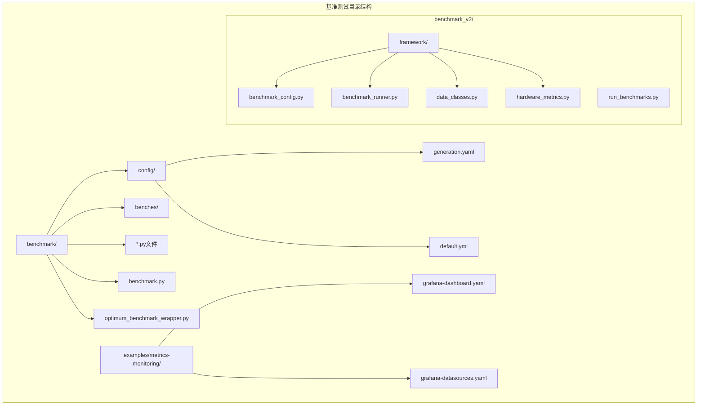
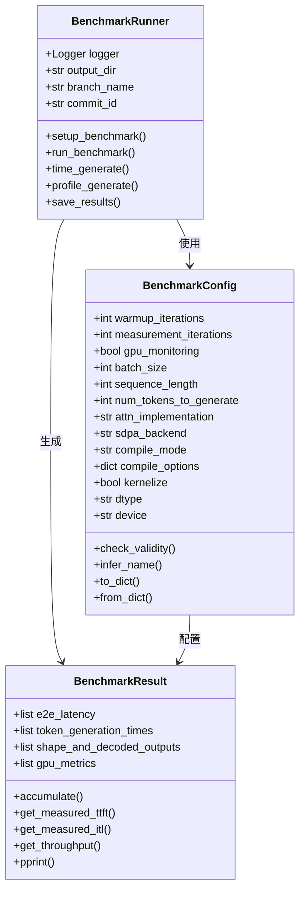
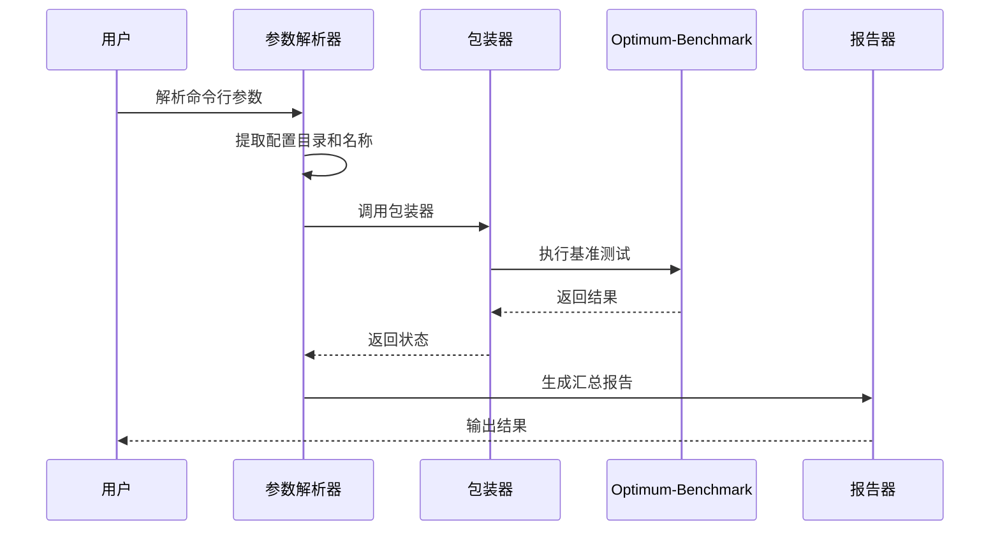
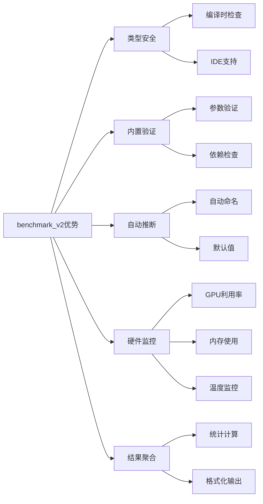
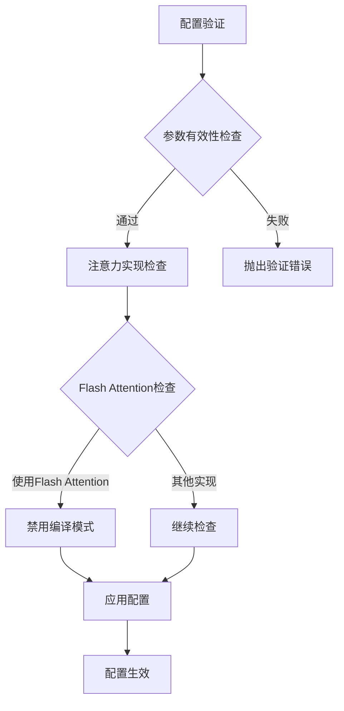

# 基准测试配置详解

<cite>
**本文档引用的文件**
- [generation.yaml](file://benchmark/config/generation.yaml)
- [benchmark.py](file://benchmark/benchmark.py)
- [benchmark_config.py](file://benchmark_v2/framework/benchmark_config.py)
- [benchmark_runner.py](file://benchmark_v2/framework/benchmark_runner.py)
- [data_classes.py](file://benchmark_v2/framework/data_classes.py)
- [run_benchmarks.py](file://benchmark_v2/run_benchmarks.py)
- [default.yml](file://benchmark/default.yml)
- [grafana_datasource.yaml](file://benchmark/grafana_datasource.yaml)
- [optimum_benchmark_wrapper.py](file://benchmark/optimum_benchmark_wrapper.py)
- [README.md](file://benchmark/README.md)
- [README.md](file://benchmark_v2/README.md)
</cite>

## 目录
1. [简介](#简介)
2. [项目结构概览](#项目结构概览)
3. [核心配置系统](#核心配置系统)
4. [generation.yaml配置详解](#generationyaml配置详解)
5. [benchmark.py配置解析](#benchmarkpy配置解析)
6. [新版本配置系统对比](#新版本配置系统对比)
7. [配置参数完整列表](#配置参数完整列表)
8. [复杂配置场景示例](#复杂配置场景示例)
9. [自定义配置文件指南](#自定义配置文件指南)
10. [配置系统扩展指南](#配置系统扩展指南)
11. [故障排除指南](#故障排除指南)
12. [总结](#总结)

## 简介

Transformers库提供了两个主要的基准测试配置系统：传统的benchmark系统和现代化的benchmark_v2系统。这些系统为深度学习模型的性能评估提供了完整的解决方案，支持多种硬件平台、优化技术和测试场景。

本文档深入解析了transformers库中基准测试的配置系统，重点关注generation.yaml文件中的各项参数配置，以及新旧版本配置系统的差异和演进。

## 项目结构概览

基准测试相关文件在transformers库中的组织结构如下：



**图表来源**
- [generation.yaml](file://benchmark/config/generation.yaml)
- [benchmark_config.py](file://benchmark_v2/framework/benchmark_config.py)
- [benchmark_runner.py](file://benchmark_v2/framework/benchmark_runner.py)

## 核心配置系统

Transformers库的基准测试配置系统采用分层架构设计，支持灵活的配置管理和参数传递。

### 配置系统架构



**图表来源**
- [benchmark_config.py](file://benchmark_v2/framework/benchmark_config.py#L15-L85)
- [benchmark_runner.py](file://benchmark_v2/framework/benchmark_runner.py#L150-L200)
- [data_classes.py](file://benchmark_v2/framework/data_classes.py#L100-L167)

**章节来源**
- [benchmark_config.py](file://benchmark_v2/framework/benchmark_config.py#L15-L85)
- [benchmark_runner.py](file://benchmark_v2/framework/benchmark_runner.py#L150-L200)

## generation.yaml配置详解

generation.yaml是传统基准测试系统的核心配置文件，基于Hydra框架提供灵活的配置管理。

### 基础配置结构

```mermaid
graph TD
A[generation.yaml] --> B[defaults]
A --> C[name]
A --> D[launcher]
A --> E[backend]
A --> F[scenario]
A --> G[hydra]
B --> B1[benchmark schema]
B --> B2[scenario: inference]
B --> B3[launcher: process]
B --> B4[backend: pytorch]
D --> D1[start_method: spawn]
D --> D2[device_isolation: true]
D --> D3[device_isolation_action: warn]
E --> E1[device: cuda]
E --> E2[device_ids: 0]
E --> E3[no_weights: true]
E --> E4[model: meta-llama/Llama-2-7b-hf]
E --> E5[cache_implementation: static]
E --> E6[torch_compile: true]
E --> E7[dtype: float16]
E --> E8[torch_compile_config]
F --> F1[input_shapes]
F --> F2[generate_kwargs]
F --> F3[memory: true]
F --> F4[latency: true]
F --> F5[iterations: 2]
F --> F6[duration: 0]
```



**图表来源**
- [generation.yaml](file://benchmark/config/generation.yaml#L1-L57)

### 关键配置参数详解

#### 1. 启动器配置 (Launcher)
- **start_method**: 进程启动方法，支持spawn、fork等
- **device_isolation**: 是否启用设备隔离
- **device_isolation_action**: 设备隔离失败时的动作

#### 2. 后端配置 (Backend)
- **device**: 计算设备，通常为cuda
- **device_ids**: GPU设备ID列表
- **no_weights**: 是否跳过加载模型权重
- **model**: 指定要测试的模型名称或路径
- **cache_implementation**: 缓存实现方式
- **torch_compile**: 是否启用torch.compile优化
- **dtype**: 数据类型，支持float16、bfloat16等
- **torch_compile_config**: torch.compile的详细配置

#### 3. 场景配置 (Scenario)
- **input_shapes**: 输入形状配置
  - batch_size: 批处理大小
  - sequence_length: 序列长度
- **generate_kwargs**: 生成参数
  - max_new_tokens: 最大生成token数
  - min_new_tokens: 最小生成token数
  - do_sample: 是否使用采样
- **memory**: 是否测量内存使用
- **latency**: 是否测量延迟
- **iterations**: 测量迭代次数
- **duration**: 测试持续时间（秒）

**章节来源**
- [generation.yaml](file://benchmark/config/generation.yaml#L1-L57)

## benchmark.py配置解析

benchmark.py是传统基准测试系统的主要入口点，负责配置解析、验证和执行流程控制。

### 配置解析流程



**图表来源**
- [benchmark.py](file://benchmark/benchmark.py#L217-L281)
- [optimum_benchmark_wrapper.py](file://benchmark/optimum_benchmark_wrapper.py#L1-L20)

### 主要功能模块

#### 1. 提交版本管理
- 支持指定特定提交版本进行测试
- 自动检出指定版本并恢复原分支
- 支持版本比较模式（diff）

#### 2. 多模型批量测试
- 支持同时测试多个模型
- 自动处理模型参数传递
- 维护测试结果的模型维度

#### 3. 结果汇总与聚合
- 自动生成测试摘要
- 支持结果合并和对比
- 提供JSON格式输出

**章节来源**
- [benchmark.py](file://benchmark/benchmark.py#L1-L324)

## 新版本配置系统对比

benchmark_v2代表了基准测试系统的现代化升级，在配置灵活性和功能完整性方面有显著改进。

### 配置系统演进对比

| 特性 | 传统系统 (benchmark/) | 新版本系统 (benchmark_v2/) |
|------|---------------------|---------------------------|
| 配置框架 | Hydra + 自定义逻辑 | 纯Python类 + 内置验证 |
| 配置灵活性 | YAML文件为主 | Python类 + 动态配置 |
| 性能监控 | 基础CPU/GPU监控 | 详细的硬件指标收集 |
| 结果格式 | JSON + CSV | 结构化数据类 |
| 扩展性 | 较低 | 高度可扩展 |
| 错误处理 | 基础异常捕获 | 完善的错误恢复机制 |

### 新版本核心优势



**图表来源**
- [benchmark_config.py](file://benchmark_v2/framework/benchmark_config.py#L15-L85)
- [benchmark_runner.py](file://benchmark_v2/framework/benchmark_runner.py#L150-L200)

**章节来源**
- [benchmark_config.py](file://benchmark_v2/framework/benchmark_config.py#L15-L85)
- [benchmark_runner.py](file://benchmark_v2/framework/benchmark_runner.py#L150-L200)

## 配置参数完整列表

### 基础配置参数

| 参数名 | 类型 | 默认值 | 有效范围 | 描述 |
|--------|------|--------|----------|------|
| warmup_iterations | int | 5 | 1-100 | 预热迭代次数 |
| measurement_iterations | int | 20 | 1-1000 | 测量迭代次数 |
| gpu_monitoring | bool | true | true/false | 是否启用GPU监控 |
| batch_size | int | 1 | 1-1024 | 批处理大小 |
| sequence_length | int | 128 | 1-8192 | 输入序列长度 |
| num_tokens_to_generate | int | 128 | 1-4096 | 生成token数量 |

### 优化配置参数

| 参数名 | 类型 | 默认值 | 有效范围 | 描述 |
|--------|------|--------|----------|------|
| attn_implementation | str | "eager" | "eager", "flash_attention_2", "sdpa", "flex_attention" | 注意力实现方式 |
| sdpa_backend | str | None | "math", "flash_attention", "efficient_attention", "cudnn_attention" | SDPA后端选择 |
| compile_mode | str | None | None, "default", "reduce-overhead", "max-autotune", "max-autotune-no-cudagraphs" | 编译模式 |
| compile_options | dict | {} | {} | 编译选项字典 |
| kernelize | bool | false | true/false | 是否内核化 |

### 数据类型和设备配置

| 参数名 | 类型 | 默认值 | 有效范围 | 描述 |
|--------|------|--------|----------|------|
| dtype | str | "torch.bfloat16" | "torch.float32", "torch.bfloat16", "torch.float16" | 数据类型 |
| device | str | "cuda" | "cuda", "cpu", "mps" | 计算设备 |

**章节来源**
- [benchmark_config.py](file://benchmark_v2/framework/benchmark_config.py#L15-L85)

## 复杂配置场景示例

### 多GPU测试配置

```yaml
# 多GPU测试配置示例
defaults:
  - benchmark
  - scenario: inference
  - launcher: process
  - backend: pytorch

name: multi_gpu_test

launcher:
  start_method: spawn
  device_isolation: true
  device_isolation_action: warn

backend:
  device: cuda
  device_ids: [0, 1, 2, 3]  # 使用多个GPU
  no_weights: false
  model: meta-llama/Llama-2-7b-hf
  cache_implementation: static
  torch_compile: true
  dtype: float16
  torch_compile_config:
    backend: inductor
    mode: max-autotune
    fullgraph: true

scenario:
  input_shapes:
    batch_size: 4
    sequence_length: 512
  generate_kwargs:
    max_new_tokens: 256
    min_new_tokens: 256
    do_sample: false
  memory: true
  latency: true
  iterations: 10
  duration: 0
```

### 混合精度设置配置

```yaml
# 混合精度配置示例
name: mixed_precision_test

backend:
  device: cuda
  device_ids: 0
  no_weights: true
  model: google/gemma-2b
  cache_implementation: static
  torch_compile: true
  dtype: bfloat16  # 使用bfloat16混合精度
  torch_compile_config:
    backend: inductor
    mode: reduce-overhead
    fullgraph: true

scenario:
  input_shapes:
    batch_size: 1
    sequence_length: 2048
  generate_kwargs:
    max_new_tokens: 512
    min_new_tokens: 512
    do_sample: false
  memory: true
  latency: true
  iterations: 5
  duration: 0
```

### 长序列生成配置

```yaml
# 长序列生成配置示例
name: long_sequence_test

backend:
  device: cuda
  device_ids: 0
  no_weights: false
  model: meta-llama/Llama-2-13b-hf
  cache_implementation: static
  torch_compile: true
  dtype: float16

scenario:
  input_shapes:
    batch_size: 1
    sequence_length: 4096  # 长序列输入
  generate_kwargs:
    max_new_tokens: 1024  # 长序列生成
    min_new_tokens: 1024
    do_sample: false
  memory: true
  latency: true
  iterations: 3
  duration: 0
```

### 性能基准测试配置

```yaml
# 性能基准测试配置
name: performance_benchmark

launcher:
  start_method: spawn
  device_isolation: true
  device_isolation_action: warn

backend:
  device: cuda
  device_ids: 0
  no_weights: true
  model: meta-llama/Llama-2-7b-hf
  cache_implementation: static
  torch_compile: true
  dtype: float16

scenario:
  input_shapes:
    batch_size: 1
    sequence_length: 128
  generate_kwargs:
    max_new_tokens: 128
    min_new_tokens: 128
    do_sample: false
  memory: true
  latency: true
  iterations: 100  # 大量迭代以获得稳定结果
  duration: 300  # 5分钟持续测试
```

## 自定义配置文件指南

### 创建自定义配置文件

#### 1. 基本配置文件结构

```yaml
# custom_benchmark.yaml
defaults:
  - benchmark
  - scenario: inference
  - launcher: process
  - backend: pytorch

name: custom_benchmark

launcher:
  start_method: spawn
  device_isolation: true
  device_isolation_action: warn

backend:
  device: cuda
  device_ids: 0
  no_weights: false
  model: your/custom-model
  cache_implementation: static
  torch_compile: true
  dtype: float16

scenario:
  input_shapes:
    batch_size: 1
    sequence_length: 512
  generate_kwargs:
    max_new_tokens: 256
    min_new_tokens: 256
    do_sample: false
  memory: true
  latency: true
  iterations: 10
  duration: 0
```

#### 2. 高级配置选项

```yaml
# advanced_custom_benchmark.yaml
name: advanced_custom_benchmark

backend:
  device: cuda
  device_ids: [0, 1]
  no_weights: false
  model: your/model/path
  cache_implementation: static
  torch_compile: true
  dtype: bfloat16
  torch_compile_config:
    backend: inductor
    mode: max-autotune
    fullgraph: true
    options:
      cudagraph: true
      cudagraph_fallback: true

scenario:
  input_shapes:
    batch_size: 1
    sequence_length: 1024
  generate_kwargs:
    max_new_tokens: 512
    min_new_tokens: 512
    do_sample: true
    temperature: 0.8
    top_p: 0.9
    repetition_penalty: 1.1
  memory: true
  latency: true
  iterations: 20
  duration: 0
```

### 配置文件最佳实践

#### 1. 参数验证规则



**图表来源**
- [benchmark_config.py](file://benchmark_v2/framework/benchmark_config.py#L50-L65)

#### 2. 配置继承和覆盖

- 使用Hydra的配置继承机制
- 支持部分参数覆盖
- 提供默认配置模板

**章节来源**
- [benchmark_config.py](file://benchmark_v2/framework/benchmark_config.py#L50-L85)

## 配置系统扩展指南

### 扩展新配置参数

#### 1. 添加自定义配置类

```python
# 在benchmark_config.py中扩展
class ExtendedBenchmarkConfig(BenchmarkConfig):
    def __init__(self, custom_param: str = "default_value", **kwargs):
        super().__init__(**kwargs)
        self.custom_param = custom_param
        
        # 添加自定义验证逻辑
        self.check_custom_validity()
    
    def check_custom_validity(self):
        if not self.custom_param:
            raise ValueError("custom_param cannot be empty")
    
    def to_dict(self):
        base_dict = super().to_dict()
        base_dict["custom_param"] = self.custom_param
        return base_dict
```

#### 2. 扩展配置生成函数

```python
def generate_extended_configs(**kwargs):
    """生成扩展配置组合"""
    base_configs = generate_main_configs(**kwargs)
    
    extended_configs = []
    for config in base_configs:
        # 添加自定义配置变体
        config.custom_param = "variant_1"
        extended_configs.append(config.copy())
        
        config.custom_param = "variant_2"
        extended_configs.append(config.copy())
    
    return extended_configs
```

### 集成自定义基准测试

#### 1. 创建自定义基准测试模块

```python
# benches/custom_benchmark.py
import torch
from transformers import AutoModelForCausalLM, AutoTokenizer

def run_custom_benchmark(logger, branch, commit_id, commit_msg, num_tokens_to_generate=100):
    """自定义基准测试函数"""
    logger.info(f"Running custom benchmark on commit {commit_id}")
    
    # 加载模型和分词器
    model = AutoModelForCausalLM.from_pretrained("your-model")
    tokenizer = AutoTokenizer.from_pretrained("your-model")
    
    # 准备输入
    prompt = "Hello, world!"
    inputs = tokenizer(prompt, return_tensors="pt")
    
    # 执行基准测试
    with torch.no_grad():
        outputs = model.generate(
            **inputs,
            max_new_tokens=num_tokens_to_generate,
            do_sample=False
        )
    
    # 记录指标
    logger.info(f"Generated {outputs.shape[1]} tokens")
    
    return {
        "generated_tokens": outputs.shape[1],
        "model_name": "custom_model"
    }
```

#### 2. 注册自定义基准测试

```python
# benchmarks_entrypoint.py 中的修改
def discover_benchmarks():
    """发现所有基准测试模块"""
    benchmark_modules = []
    
    # 自动扫描benches目录
    benches_folder_path = os.path.join(os.path.dirname(__file__), "benches")
    
    if os.path.exists(benches_folder_path):
        for entry in os.scandir(benches_folder_path):
            if not entry.name.endswith(".py"):
                continue
                
            # 检查是否有run_benchmark函数
            try:
                module = import_from_path(entry.name.split(".")[0], entry.path)
                if hasattr(module, "run_benchmark"):
                    benchmark_modules.append(entry.name)
            except Exception as e:
                logger.debug(f"Failed to load benchmark {entry.name}: {e}")
    
    return benchmark_modules
```

**章节来源**
- [benchmark_config.py](file://benchmark_v2/framework/benchmark_config.py#L15-L85)
- [benchmark_runner.py](file://benchmark_v2/framework/benchmark_runner.py#L150-L200)

## 故障排除指南

### 常见配置问题及解决方案

#### 1. 内存不足错误

**问题描述**: CUDA out of memory错误

**解决方案**:
```yaml
# 减少批处理大小
scenario:
  input_shapes:
    batch_size: 1  # 从更大的值降低
    sequence_length: 512  # 或减少序列长度
```

#### 2. 编译模式冲突

**问题描述**: Flash Attention与编译模式冲突

**解决方案**:
```python
# 在代码中添加检查
def check_validity(self):
    is_fa = self.attn_implementation == "flash_attention_2"
    if is_fa and self.compile_mode:
        logger.warning("Flash attention does not support compile mode. Disabling compile.")
        self.compile_mode = None
```

#### 3. 设备兼容性问题

**问题描述**: 不同GPU架构的兼容性

**解决方案**:
```yaml
backend:
  device: cuda
  device_ids: 0  # 明确指定GPU ID
  dtype: float16  # 使用更节省内存的数据类型
```

### 调试配置问题

#### 1. 启用详细日志

```bash
# 设置环境变量启用调试日志
export LOG_LEVEL=DEBUG
python benchmark/benchmark.py --config-dir benchmark/config --config-name generation --metrics=*
```

#### 2. 验证配置语法

```python
# 使用配置验证函数
config = BenchmarkConfig.from_dict(custom_config_dict)
config.check_validity()  # 触发验证
```

#### 3. 检查硬件兼容性

```python
# 检查GPU可用性
import torch
if not torch.cuda.is_available():
    print("CUDA not available, switching to CPU")
    config.device = "cpu"
```

**章节来源**
- [benchmark_config.py](file://benchmark_v2/framework/benchmark_config.py#L50-L65)
- [benchmark_runner.py](file://benchmark_v2/framework/benchmark_runner.py#L150-L200)

## 总结

Transformers库的基准测试配置系统提供了强大而灵活的性能评估工具。通过本文档的详细解析，我们可以看到：

### 主要特点总结

1. **双系统架构**: 传统benchmark系统和现代化benchmark_v2系统并存
2. **灵活配置**: 支持YAML和Python类两种配置方式
3. **全面监控**: 包含性能、内存、GPU利用率等多维度指标
4. **易于扩展**: 提供清晰的扩展接口和最佳实践指南

### 选择建议

- **新项目**: 推荐使用benchmark_v2系统，享受更好的类型安全和扩展性
- **现有项目**: 可以逐步迁移至新系统，保持向后兼容性
- **特殊需求**: 可以通过自定义配置和扩展功能满足特定测试场景

### 未来发展方向

1. **云原生支持**: 更好的容器化和分布式测试支持
2. **自动化集成**: 与CI/CD流水线更深度的集成
3. **可视化增强**: 更丰富的图表和仪表板功能
4. **多模态支持**: 扩展到视觉、音频等多模态模型测试

通过掌握这些配置知识，开发者可以更好地利用transformers库的基准测试能力，为模型性能优化提供有力支撑。