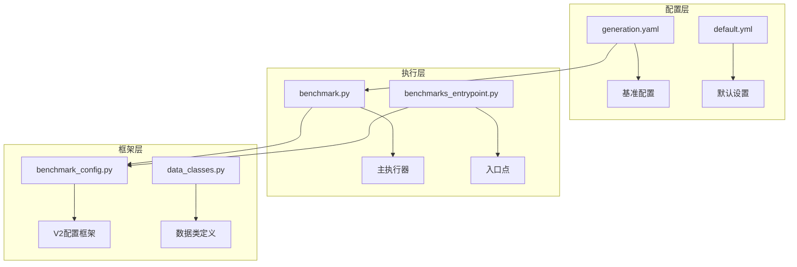
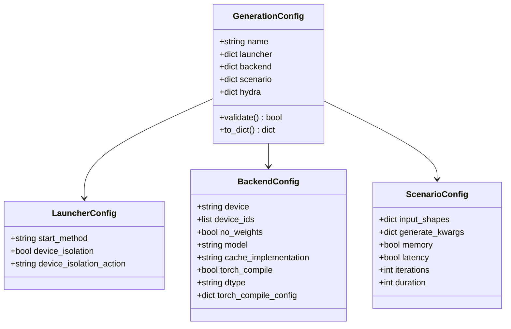
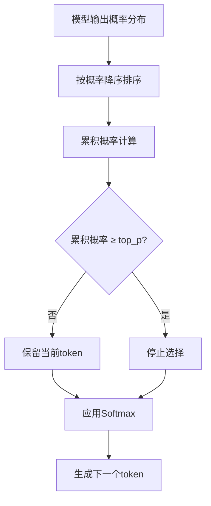
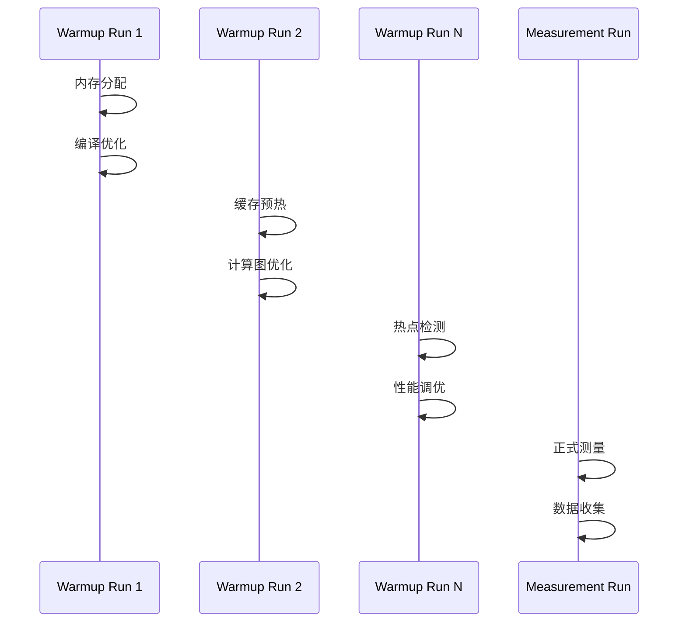
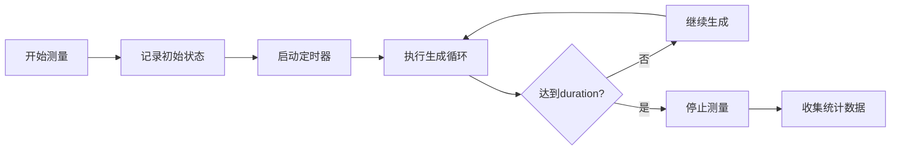
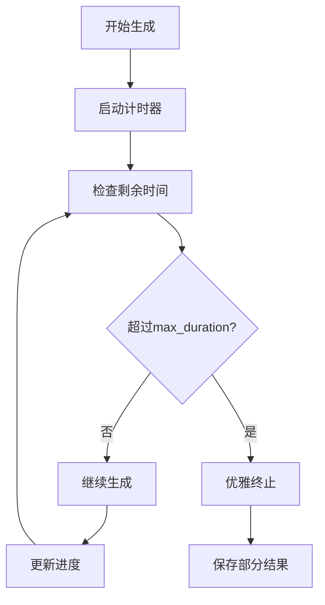
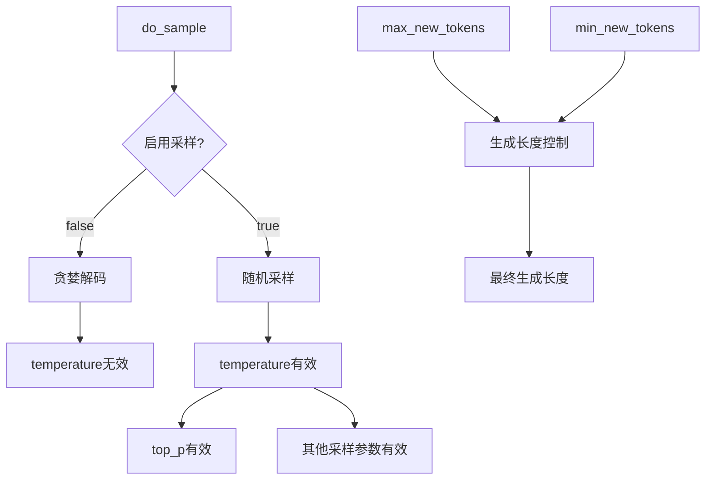

# 核心参数配置

<cite>
**本文档中引用的文件**
- [generation.yaml](file://benchmark/config/generation.yaml)
- [benchmark.py](file://benchmark/benchmark.py)
- [benchmarks_entrypoint.py](file://benchmark/benchmarks_entrypoint.py)
- [benchmark_config.py](file://benchmark_v2/framework/benchmark_config.py)
- [data_classes.py](file://benchmark_v2/framework/data_classes.py)
- [configuration_utils.py](file://src/transformers/generation/configuration_utils.py)
- [logits_process.py](file://src/transformers/generation/logits_process.py)
</cite>

## 目录
1. [简介](#简介)
2. [项目结构概览](#项目结构概览)
3. [核心配置文件分析](#核心配置文件分析)
4. [生成任务参数详解](#生成任务参数详解)
5. [性能测量参数配置](#性能测量参数配置)
6. [资源限制参数设置](#资源限制参数设置)
7. [参数配置示例](#参数配置示例)
8. [参数相互关系与约束](#参数相互关系与约束)
9. [最佳实践指南](#最佳实践指南)
10. [常见问题排查](#常见问题排查)
11. [总结](#总结)

## 简介

本文档深入解析了Hugging Face Transformers库中benchmark系统的核心参数配置，特别是`benchmark/config/generation.yaml`文件中的关键配置项。该配置系统为文本生成任务提供了全面的参数控制能力，支持从基础的生成参数到复杂的性能测量和资源管理。

## 项目结构概览

benchmark系统采用模块化设计，主要包含以下核心组件：



**图表来源**
- [generation.yaml](file://benchmark/config/generation.yaml#L1-L57)
- [benchmark.py](file://benchmark/benchmark.py#L1-L325)
- [benchmark_config.py](file://benchmark_v2/framework/benchmark_config.py#L1-L215)

## 核心配置文件分析

### generation.yaml配置结构

`generation.yaml`文件是benchmark系统的核心配置文件，定义了完整的生成任务参数集合：



**图表来源**
- [generation.yaml](file://benchmark/config/generation.yaml#L1-L57)

**章节来源**
- [generation.yaml](file://benchmark/config/generation.yaml#L1-L57)

## 生成任务参数详解

### 基础生成参数

#### max_new_tokens参数

`max_new_tokens`是控制生成文本长度的核心参数：

| 参数属性 | 描述 | 默认值 | 取值范围 |
|---------|------|--------|----------|
| 类型 | 整数 | 128 | 1-无穷大 |
| 影响 | 控制生成的最大新token数量 | - | - |
| 约束 | 不受输入序列长度直接影响 | - | - |

**使用场景：**
- 长文本生成：设置较大值（如512、1024）
- 短对话回复：设置较小值（如32、64）
- 摘要生成：根据目标长度调整

#### temperature参数

`temperature`控制生成过程的随机性：

| 温度值 | 行为特征 | 适用场景 |
|--------|----------|----------|
| 0.1-0.3 | 高确定性，重复性强 | 技术文档生成 |
| 0.4-0.7 | 平衡创造性和一致性 | 对话系统 |
| 0.8-1.0 | 高创造性，多样性强 | 创意写作 |
| >1.0 | 极高随机性 | 实验性生成 |

#### top_p参数

`top_p`（核采样）参数控制候选token的选择范围：



**图表来源**
- [logits_process.py](file://src/transformers/generation/logits_process.py#L262-L286)

#### do_sample参数

`do_sample`决定是否启用采样机制：

| 值 | 行为 | 性能影响 |
|----|------|----------|
| false | 贪婪解码，确定性输出 | 最快，内存效率最高 |
| true | 随机采样，非确定性输出 | 较慢，需要随机种子 |

**章节来源**
- [configuration_utils.py](file://src/transformers/generation/configuration_utils.py#L81-L533)
- [logits_process.py](file://src/transformers/generation/logits_process.py#L262-L286)

## 性能测量参数配置

### warmup_runs参数

预热运行次数控制模型预热阶段：



**图表来源**
- [benchmark_config.py](file://benchmark_v2/framework/benchmark_config.py#L94-L126)

### measurement_runs参数

测量运行次数决定统计结果的可靠性：

| 运行次数 | 统计精度 | 测量时间 | 推荐场景 |
|---------|----------|----------|----------|
| 5-10 | 基础统计 | 快速评估 | 开发调试 |
| 20-50 | 中等精度 | 标准测试 | 功能验证 |
| 100+ | 高精度 | 完整评估 | 生产部署 |

### duration参数

持续时间控制测量的时长：



**图表来源**
- [data_classes.py](file://benchmark_v2/framework/data_classes.py#L85-L117)

**章节来源**
- [benchmark_config.py](file://benchmark_v2/framework/benchmark_config.py#L94-L126)
- [data_classes.py](file://benchmark_v2/framework/data_classes.py#L85-L117)

## 资源限制参数设置

### memory_limit参数

内存限制参数控制模型运行的内存使用：

| 内存类型 | 限制策略 | 监控方式 |
|---------|----------|----------|
| GPU内存 | 动态分配，超出时触发OOM | 自动截断 |
| CPU内存 | 预留缓冲区，防止系统崩溃 | 进程监控 |
| 交换空间 | 有限使用，影响性能 | 性能警告 |

### max_duration参数

最大持续时间限制：



**图表来源**
- [configuration_utils.py](file://src/transformers/generation/configuration_utils.py#L1803-L1829)

**章节来源**
- [configuration_utils.py](file://src/transformers/generation/configuration_utils.py#L1803-L1829)

## 参数配置示例

### 高吞吐量推理配置

针对大规模批量处理的优化配置：

```yaml
# 高吞吐量配置示例
scenario:
  input_shapes:
    batch_size: 32
    sequence_length: 512
  generate_kwargs:
    max_new_tokens: 128
    do_sample: false
    temperature: 1.0
    top_p: 1.0
  memory: false
  latency: false
  iterations: 100
  duration: 300
```

### 低延迟响应配置

优化响应速度的配置策略：

```yaml
# 低延迟配置示例
scenario:
  input_shapes:
    batch_size: 1
    sequence_length: 128
  generate_kwargs:
    max_new_tokens: 64
    do_sample: false
    temperature: 0.1
    top_p: 0.9
  memory: true
  latency: true
  iterations: 50
  duration: 60
```

### 长文本生成配置

针对长文档生成的专门配置：

```yaml
# 长文本生成配置
scenario:
  input_shapes:
    batch_size: 4
    sequence_length: 1024
  generate_kwargs:
    max_new_tokens: 1024
    do_sample: true
    temperature: 0.7
    top_p: 0.95
    repetition_penalty: 1.1
  memory: true
  latency: false
  iterations: 20
  duration: 600
```

**章节来源**
- [generation.yaml](file://benchmark/config/generation.yaml#L25-L40)

## 参数相互关系与约束

### 采样参数约束

生成参数之间存在复杂的相互关系：



**图表来源**
- [configuration_utils.py](file://src/transformers/generation/configuration_utils.py#L81-L533)

### 性能参数平衡

不同参数对性能的影响权重：

| 参数类别 | 性能影响 | 调优优先级 | 典型配置 |
|---------|----------|------------|----------|
| 批处理大小 | 高 | 高 | 1-32 |
| 序列长度 | 中 | 中 | 128-2048 |
| 生成长度 | 中 | 中 | 32-512 |
| 采样策略 | 低 | 低 | 贪婪/采样 |

**章节来源**
- [configuration_utils.py](file://src/transformers/generation/configuration_utils.py#L81-L533)

## 最佳实践指南

### 参数调优流程

1. **基础配置验证**
   - 确保基本参数组合有效
   - 验证硬件资源充足
   - 检查模型兼容性

2. **性能基准测试**
   - 使用标准配置建立基线
   - 逐步调整关键参数
   - 记录性能变化趋势

3. **稳定性测试**
   - 多次运行确保结果一致性
   - 监控内存使用情况
   - 检查异常退出情况

### 常见配置模式

#### 开发环境配置
```yaml
# 开发友好配置
scenario:
  iterations: 5
  duration: 30
  memory: true
  latency: true
```

#### 生产环境配置
```yaml
# 生产就绪配置
scenario:
  iterations: 50
  duration: 300
  memory: false
  latency: true
```

**章节来源**
- [benchmark_config.py](file://benchmark_v2/framework/benchmark_config.py#L94-L126)

## 常见问题排查

### 参数配置错误

#### 温度值异常
**问题症状：** 生成结果过于随机或完全不变
**解决方案：**
- 检查温度值是否在合理范围内（0.1-2.0）
- 确认采样模式正确启用
- 验证随机种子设置

#### 批处理大小过大
**问题症状：** 内存不足导致OOM错误
**解决方案：**
- 减少批处理大小
- 启用梯度检查点
- 使用混合精度训练

#### 序列长度超限
**问题症状：** 生成提前终止或截断
**解决方案：**
- 检查模型最大序列长度限制
- 调整输入序列长度
- 优化缓存策略

### 性能问题诊断

#### 生成速度慢
**可能原因：**
- 采样参数过多计算开销
- 批处理大小不匹配
- 缓存策略不当

**优化建议：**
- 使用贪婪解码替代采样
- 调整批处理大小到最优值
- 启用KV缓存优化

#### 内存使用过高
**可能原因：**
- 序列长度过长
- 批处理大小过大
- 缓存未及时释放

**优化建议：**
- 限制序列长度
- 减少批处理大小
- 启用动态内存管理

**章节来源**
- [benchmarks_entrypoint.py](file://benchmark/benchmarks_entrypoint.py#L135-L164)

## 总结

Hugging Face Transformers的benchmark配置系统提供了全面而灵活的参数控制能力。通过合理配置生成参数、性能测量参数和资源限制参数，可以实现从开发调试到生产部署的各种需求。

关键要点：
1. **参数理解**：深入理解每个参数的作用机制和影响范围
2. **配置平衡**：在性能、质量和资源消耗之间找到最佳平衡点
3. **测试验证**：通过充分的测试验证配置的有效性和稳定性
4. **持续优化**：根据实际使用情况持续调整和优化参数配置

正确的参数配置不仅能提升模型性能，还能确保系统的稳定性和可维护性。建议在实际应用中结合具体场景进行针对性的配置和优化。