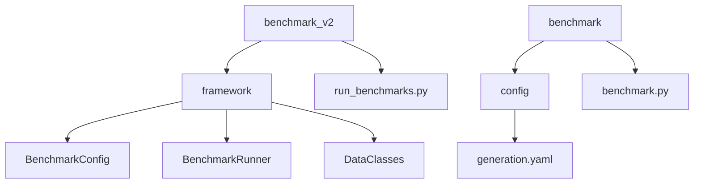
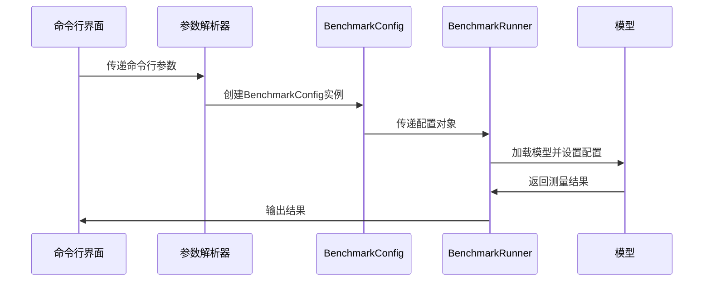
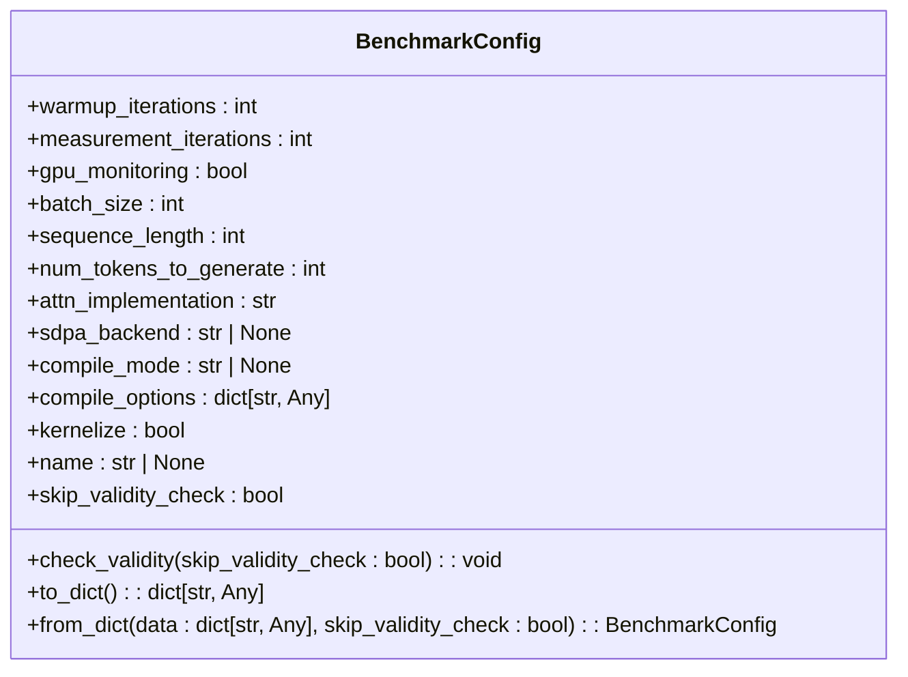
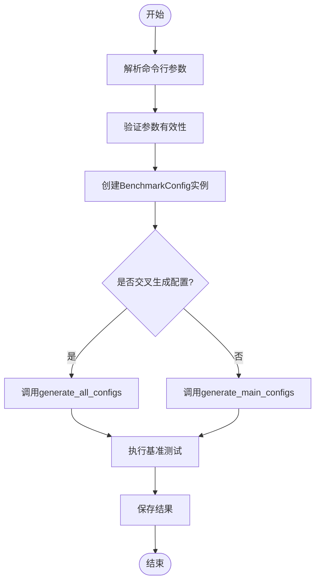
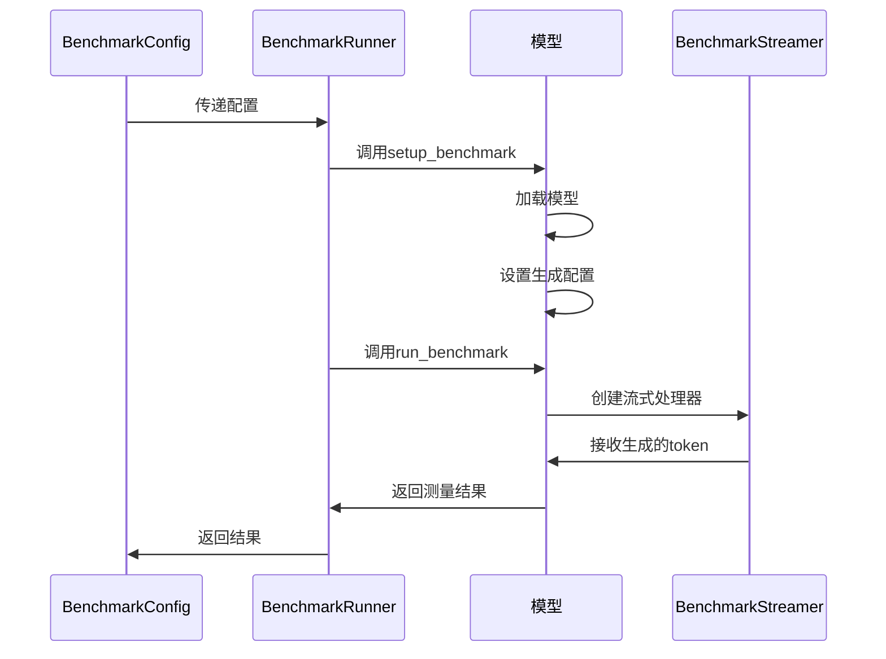

# 配置系统扩展开发

<cite>
**本文档引用的文件**
- [benchmark_config.py](file://benchmark_v2/framework/benchmark_config.py)
- [benchmark_runner.py](file://benchmark_v2/framework/benchmark_runner.py)
- [data_classes.py](file://benchmark_v2/framework/data_classes.py)
- [run_benchmarks.py](file://benchmark_v2/run_benchmarks.py)
- [generation.yaml](file://benchmark/config/generation.yaml)
</cite>

## 目录
1. [简介](#简介)
2. [项目结构](#项目结构)
3. [核心组件](#核心组件)
4. [架构概述](#架构概述)
5. [详细组件分析](#详细组件分析)
6. [依赖分析](#依赖分析)
7. [性能考虑](#性能考虑)
8. [故障排除指南](#故障排除指南)
9. [结论](#结论)

## 简介
本文档旨在为transformers项目的配置系统扩展开发提供全面指导。文档重点介绍benchmark_v2中基于类的配置系统设计，详细说明如何定义新的配置参数类型和验证规则，解释配置类的继承机制和扩展点。通过实际代码示例展示配置系统与测试执行引擎的集成方式，并提供调试扩展功能的最佳实践和常见陷阱规避指南。

## 项目结构
transformers项目的配置系统主要分布在benchmark和benchmark_v2两个目录中。benchmark_v2采用了现代化的基于类的配置系统设计，而benchmark目录则使用了传统的YAML配置文件方式。这种双轨制设计为开发者提供了从传统配置向现代化配置系统迁移的路径。

**图示来源**
- [benchmark_v2](file://benchmark_v2)
- [benchmark](file://benchmark)

**章节来源**
- [benchmark_v2](file://benchmark_v2)
- [benchmark](file://benchmark)

## 核心组件
配置系统的核心组件包括BenchmarkConfig类、BenchmarkRunner类和相关数据类。BenchmarkConfig类定义了基准测试的所有配置参数，包括预热迭代次数、测量迭代次数、GPU监控、批处理大小、序列长度等。BenchmarkRunner类负责协调基准测试的执行，管理模型加载、配置设置和结果收集。数据类如BenchmarkMetadata和BenchmarkResult用于存储和传输基准测试的元数据和测量结果。

**章节来源**
- [benchmark_config.py](file://benchmark_v2/framework/benchmark_config.py#L1-L215)
- [benchmark_runner.py](file://benchmark_v2/framework/benchmark_runner.py#L1-L457)
- [data_classes.py](file://benchmark_v2/framework/data_classes.py#L1-L168)

## 架构概述
benchmark_v2的配置系统采用基于类的设计模式，通过Python类和方法来定义和管理配置。这种设计提供了类型安全、代码可读性和扩展性优势。系统通过argparse解析命令行参数，然后将这些参数转换为BenchmarkConfig对象，再由BenchmarkRunner执行基准测试。

**图示来源**
- [run_benchmarks.py](file://benchmark_v2/run_benchmarks.py#L1-L143)
- [benchmark_runner.py](file://benchmark_v2/framework/benchmark_runner.py#L1-L457)

## 详细组件分析

### BenchmarkConfig分析
BenchmarkConfig类是配置系统的核心，它通过__init__方法定义了所有可配置的参数，并提供了to_dict和from_dict方法实现配置的序列化和反序列化。类中的check_validity方法用于验证配置的有效性，例如检查Flash Attention是否与编译模式兼容。

**图示来源**
- [benchmark_config.py](file://benchmark_v2/framework/benchmark_config.py#L1-L215)

**章节来源**
- [benchmark_config.py](file://benchmark_v2/framework/benchmark_config.py#L1-L215)

### 配置解析器扩展
配置解析器的扩展主要通过run_benchmarks.py中的argparse实现。开发者可以通过添加新的参数来扩展配置系统，例如添加对新模型架构或硬件平台的支持。自定义参数处理器和默认值生成器可以通过在BenchmarkConfig类中添加新的字段和验证逻辑来实现。

**图示来源**
- [run_benchmarks.py](file://benchmark_v2/run_benchmarks.py#L1-L143)

**章节来源**
- [run_benchmarks.py](file://benchmark_v2/run_benchmarks.py#L1-L143)

### 配置系统与测试执行引擎集成
配置系统与测试执行引擎的集成通过BenchmarkRunner类实现。Runner接收BenchmarkConfig对象，根据配置设置模型和生成参数，然后执行基准测试并收集结果。这种设计实现了配置与执行的解耦，使得配置可以独立于具体的测试逻辑进行修改和扩展。

**图示来源**
- [benchmark_runner.py](file://benchmark_v2/framework/benchmark_runner.py#L1-L457)
- [benchmark_config.py](file://benchmark_v2/framework/benchmark_config.py#L1-L215)

**章节来源**
- [benchmark_runner.py](file://benchmark_v2/framework/benchmark_runner.py#L1-L457)

## 依赖分析
配置系统的依赖关系清晰，主要依赖于Python标准库、PyTorch和Hugging Face生态系统组件。benchmark_v2框架内部组件之间通过明确定义的接口进行交互，降低了耦合度。外部依赖包括datasets库用于结果存储，tqdm用于进度显示，以及huggingface_hub用于结果上传。

```mermaid
graph TD
benchmark_v2 --> torch[PyTorch]
benchmark_v2 --> datasets[datasets]
benchmark_v2 --> huggingface_hub[huggingface_hub]
benchmark_v2 --> tqdm[tqdm]
benchmark_v2 --> numpy[numpy]
benchmark_v2 --> json[json]
benchmark_v2 --> argparse[argparse]
benchmark_v2 --> logging[logging]
benchmark_v2 --> os[os]
benchmark_v2 --> pathlib[pathlib]
benchmark_v2 --> tempfile[tempfile]
benchmark_v2 --> time[time]
benchmark_v2 --> gc[gc]
benchmark_v2 --> uuid[uuid]
benchmark_v2 --> hashlib[hashlib]
benchmark_v2 --> re[re]
benchmark_v2 --> queue[queue]
benchmark_v2 --> datetime[datetime]
benchmark_v2 --> contextlib[contextlib]
benchmark_v2 --> dataclasses[dataclasses]
```

**图示来源**
- [benchmark_runner.py](file://benchmark_v2/framework/benchmark_runner.py#L1-L457)
- [benchmark_config.py](file://benchmark_v2/framework/benchmark_config.py#L1-L215)

**章节来源**
- [benchmark_runner.py](file://benchmark_v2/framework/benchmark_runner.py#L1-L457)

## 性能考虑
配置系统的设计考虑了性能因素。通过使用__slots__和轻量级数据结构来减少内存占用，避免不必要的对象创建。配置验证在初始化时完成，避免在运行时重复验证。结果收集采用增量方式，避免在内存中存储大量中间数据。对于大规模基准测试，系统支持结果的流式保存和上传，减少内存压力。

## 故障排除指南
在扩展配置系统时，常见的陷阱包括参数类型不匹配、配置验证失败、依赖库版本不兼容等。调试时应首先检查参数类型和默认值，确保与预期一致。使用日志记录关键步骤的执行情况，便于定位问题。对于复杂的配置组合，建议从小规模测试开始，逐步增加复杂度。

**章节来源**
- [benchmark_runner.py](file://benchmark_v2/framework/benchmark_runner.py#L1-L457)
- [benchmark_config.py](file://benchmark_v2/framework/benchmark_config.py#L1-L215)

## 结论
transformers项目的配置系统扩展开发提供了灵活且强大的机制，支持开发者定制和扩展基准测试功能。通过基于类的配置设计，系统实现了类型安全、可读性和可扩展性的平衡。开发者可以轻松定义新的配置参数类型和验证规则，扩展配置类以支持新模型架构或硬件平台，并通过自定义参数处理器和默认值生成器增强配置解析器的功能。配置系统与测试执行引擎的紧密集成确保了配置变更能够无缝地影响测试行为，为性能评估和优化提供了可靠的基础。