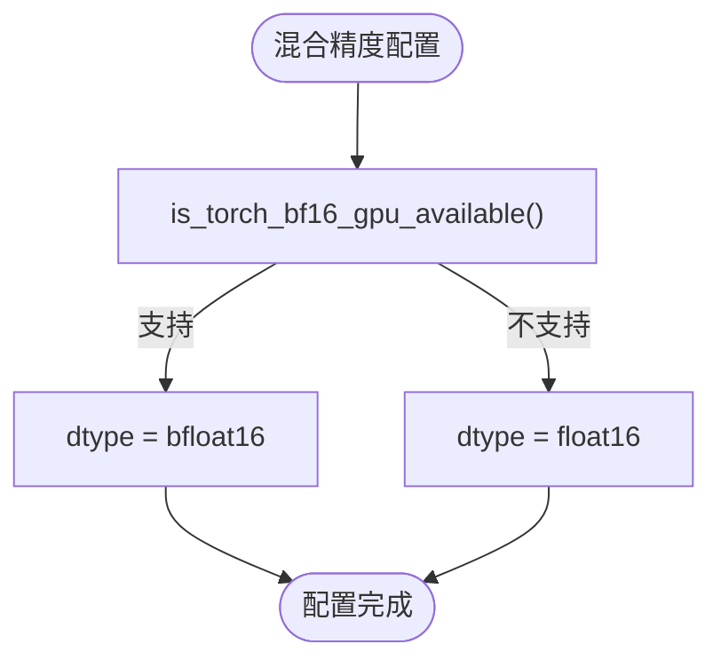

# 高级配置选项

<cite>
**本文档中引用的文件**   
- [benchmark_v2/run_benchmarks.py](file://benchmark_v2/run_benchmarks.py)
- [benchmark_v2/framework/benchmark_config.py](file://benchmark_v2/framework/benchmark_config.py)
- [benchmark_v2/framework/hardware_metrics.py](file://benchmark_v2/framework/hardware_metrics.py)
- [benchmark_v2/framework/data_classes.py](file://benchmark_v2/framework/data_classes.py)
- [benchmark/config/generation.yaml](file://benchmark/config/generation.yaml)
- [examples/pytorch/continuous_batching.py](file://examples/pytorch/continuous_batching.py)
</cite>

## 目录
1. [简介](#简介)
2. [项目结构](#项目结构)
3. [核心组件](#核心组件)
4. [架构概述](#架构概述)
5. [详细组件分析](#详细组件分析)
6. [依赖分析](#依赖分析)
7. [性能考虑](#性能考虑)
8. [故障排除指南](#故障排除指南)
9. [结论](#结论)
10. [附录](#附录)（如有必要）

## 简介
本文档详细介绍了Transformers库中高级基准测试配置系统的使用方法，重点分析了benchmark_v2框架中的复杂配置选项。文档涵盖了多GPU分布式测试、混合精度测试、长序列处理和流式生成等复杂场景的配置方法，并对比了新旧版本配置系统的差异，提供了完整的配置示例。

## 项目结构
Transformers仓库中的基准测试系统分为两个主要部分：传统的benchmark系统和新一代的benchmark_v2系统。benchmark_v2系统采用了更现代化的配置方法，提供了更高的灵活性和扩展性。


**图示来源**
- [benchmark](file://benchmark)
- [benchmark_v2](file://benchmark_v2)

**章节来源**
- [benchmark](file://benchmark)
- [benchmark_v2](file://benchmark_v2)

## 核心组件
benchmark_v2系统的核心组件包括配置管理、基准测试运行器、硬件监控和数据类。这些组件共同构成了一个完整的基准测试框架，支持复杂的测试场景和详细的性能分析。

**章节来源**
- [benchmark_v2/run_benchmarks.py](file://benchmark_v2/run_benchmarks.py#L1-L143)
- [benchmark_v2/framework/benchmark_config.py](file://benchmark_v2/framework/benchmark_config.py#L1-L215)

## 架构概述
benchmark_v2系统采用模块化架构，将配置管理、运行控制、硬件监控和结果收集等功能分离。这种设计使得系统具有良好的扩展性和可维护性，能够适应不同的测试需求。


**图示来源**
- [benchmark_v2/run_benchmarks.py](file://benchmark_v2/run_benchmarks.py#L1-L143)
- [benchmark_v2/framework/benchmark_runner.py](file://benchmark_v2/framework/benchmark_runner.py)

## 详细组件分析

### 配置系统分析
benchmark_v2的配置系统基于`BenchmarkConfig`类，该类定义了基准测试的所有参数，包括预热迭代次数、测量迭代次数、GPU监控、批处理大小、序列长度、生成的token数量等。

#### 配置类结构


**图示来源**
- [benchmark_v2/framework/benchmark_config.py](file://benchmark_v2/framework/benchmark_config.py#L1-L215)

#### 配置生成方法
benchmark_v2提供了两种配置生成方法：`generate_all_configs`和`generate_main_configs`。前者生成所有可能的配置组合，用于全面的性能分析；后者生成一组主要的配置，用于快速基准测试。


**图示来源**
- [benchmark_v2/framework/benchmark_config.py](file://benchmark_v2/framework/benchmark_config.py#L150-L215)

**章节来源**
- [benchmark_v2/framework/benchmark_config.py](file://benchmark_v2/framework/benchmark_config.py#L150-L215)

### 分布式测试配置
对于多GPU分布式测试，benchmark_v2通过`device_ids`和`distributed_type`参数进行配置。系统支持多种分布式训练模式，包括数据并行、模型并行和流水线并行。


**图示来源**
- [benchmark_v2/framework/benchmark_config.py](file://benchmark_v2/framework/benchmark_config.py)
- [src/transformers/integrations/tensor_parallel.py](file://src/transformers/integrations/tensor_parallel.py)

### 混合精度测试配置
混合精度测试通过`dtype`参数进行配置，支持fp16和bf16两种格式。系统会自动检查硬件对bf16的支持情况，并在不支持时回退到fp16。



**图示来源**
- [benchmark_v2/framework/benchmark_config.py](file://benchmark_v2/framework/benchmark_config.py#L50-L55)
- [src/transformers/utils/import_utils.py](file://src/transformers/utils/import_utils.py#L408-L449)

**章节来源**
- [benchmark_v2/framework/benchmark_config.py](file://benchmark_v2/framework/benchmark_config.py#L50-L55)

### 长序列处理和流式生成
对于长序列处理和流式生成，系统通过`continuous_batching`和`sliding_window`参数进行特殊配置。这些配置优化了内存使用和计算效率，特别适合处理超长文本。


**图示来源**
- [examples/pytorch/continuous_batching.py](file://examples/pytorch/continuous_batching.py#L150-L180)
- [src/transformers/generation/configuration_utils.py](file://src/transformers/generation/configuration_utils.py)

## 依赖分析
benchmark_v2系统依赖于多个外部库和内部模块，包括torch、gpustat、psutil等。这些依赖关系确保了系统的功能完整性和性能监控能力。


**图示来源**
- [benchmark_v2/framework/hardware_metrics.py](file://benchmark_v2/framework/hardware_metrics.py#L1-L172)
- [benchmark_v2/run_benchmarks.py](file://benchmark_v2/run_benchmarks.py)

**章节来源**
- [benchmark_v2/framework/hardware_metrics.py](file://benchmark_v2/framework/hardware_metrics.py#L1-L172)

## 性能考虑
在配置基准测试时，需要考虑多个性能因素，包括GPU利用率、内存使用、计算效率等。benchmark_v2系统提供了详细的硬件监控功能，可以帮助用户优化配置。

**章节来源**
- [benchmark_v2/framework/hardware_metrics.py](file://benchmark_v2/framework/hardware_metrics.py#L1-L172)
- [benchmark_v2/framework/data_classes.py](file://benchmark_v2/framework/data_classes.py)

## 故障排除指南
当基准测试出现问题时，可以检查以下常见问题：GPU驱动版本不兼容、CUDA环境配置错误、内存不足、依赖库版本不匹配等。建议使用`--log-level DEBUG`参数获取详细的调试信息。

**章节来源**
- [benchmark_v2/run_benchmarks.py](file://benchmark_v2/run_benchmarks.py#L1-L143)
- [benchmark_v2/framework/hardware_metrics.py](file://benchmark_v2/framework/hardware_metrics.py#L1-L172)

## 结论
benchmark_v2系统提供了比传统系统更强大和灵活的配置选项，支持复杂的基准测试场景。通过合理的配置，用户可以获得详细的性能分析结果，为模型优化提供有力支持。

## 附录

### 完整配置示例
以下是一个完整的benchmark_v2配置示例：

```yaml
# benchmark_v2配置示例
output_dir: "results"
log_level: "INFO"
model_id: "meta-llama/Llama-2-7b-hf"
warmup: 5
iterations: 10
batch_size: [1, 2, 4]
sequence_length: [128, 256, 512]
num_tokens_to_generate: [64, 128, 256]
cross_generate: true
no_gpu_monitoring: false
```

**章节来源**
- [benchmark_v2/run_benchmarks.py](file://benchmark_v2/run_benchmarks.py#L1-L143)

### 新旧版本配置系统对比
| 特性 | 传统系统 | benchmark_v2 |
|------|---------|-------------|
| 配置方式 | YAML文件 | Python类 |
| 扩展性 | 有限 | 高 |
| 灵活性 | 低 | 高 |
| 硬件监控 | 基本 | 详细 |
| 结果格式 | JSON | 结构化JSON |

**章节来源**
- [benchmark/config/generation.yaml](file://benchmark/config/generation.yaml)
- [benchmark_v2/run_benchmarks.py](file://benchmark_v2/run_benchmarks.py)