# 仪表板使用指南

<cite>
**本文档中引用的文件**
- [grafana_dashboard.json](file://benchmark/grafana_dashboard.json)
- [continuous-batching-dashboard.json](file://examples/metrics-monitoring/continuous-batching-dashboard.json)
- [grafana_datasource.yaml](file://benchmark/grafana_datasource.yaml)
- [grafana-dashboard.yaml](file://examples/metrics-monitoring/grafana-dashboard.yaml)
- [docker-compose.yml](file://examples/metrics-monitoring/docker-compose.yml)
- [prometheus.yml](file://examples/metrics-monitoring/prometheus.yml)
- [grafana-datasources.yaml](file://examples/metrics-monitoring/grafana-datasources.yaml)
- [tempo.yaml](file://examples/metrics-monitoring/tempo.yaml)
- [README.md](file://benchmark/README.md)
- [README.md](file://examples/metrics-monitoring/README.md)
</cite>

## 目录
1. [简介](#简介)
2. [项目结构概览](#项目结构概览)
3. [核心仪表板分析](#核心仪表板分析)
4. [Grafana仪表板架构](#grafana仪表板架构)
5. [详细仪表板配置](#详细仪表板配置)
6. [数据源配置](#数据源配置)
7. [部署和启动](#部署和启动)
8. [高级功能配置](#高级功能配置)
9. [监控最佳实践](#监控最佳实践)
10. [故障排除指南](#故障排除指南)
11. [总结](#总结)

## 简介

本指南详细介绍了transformers项目中Grafana仪表板的配置和使用方法。项目包含两个主要的监控仪表板：用于基准测试的`grafana_dashboard.json`和用于连续批处理的`continuous-batching-dashboard.json`。这些仪表板提供了全面的模型推理性能和系统资源监控能力。

## 项目结构概览

transformers项目中的监控和仪表板配置主要分布在以下目录结构中：

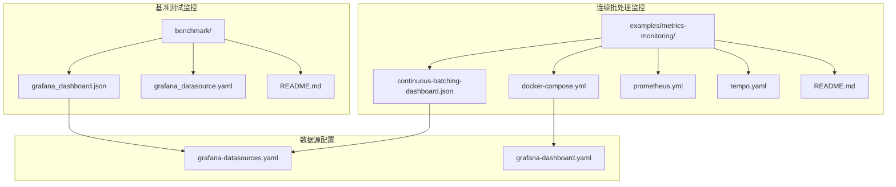

**图表来源**
- [benchmark/grafana_dashboard.json](file://benchmark/grafana_dashboard.json#L1-L50)
- [examples/metrics-monitoring/continuous-batching-dashboard.json](file://examples/metrics-monitoring/continuous-batching-dashboard.json#L1-L50)

## 核心仪表板分析

### 基准测试仪表板 (grafana_dashboard.json)

基准测试仪表板专注于模型推理性能的详细监控，包含以下关键面板：

#### 面板布局结构

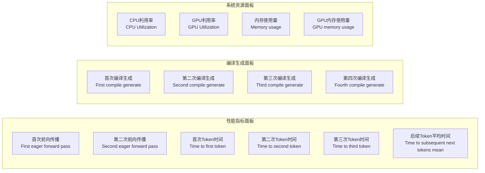

**图表来源**
- [benchmark/grafana_dashboard.json](file://benchmark/grafana_dashboard.json#L64-L200)

#### 关键查询语句分析

仪表板使用PostgreSQL数据源执行以下核心查询：

1. **性能指标查询**：
   ```sql
   SELECT CAST(m.measurements->'first_eager_forward_pass_time_secs' AS double precision) 
   FROM benchmarks as b JOIN model_measurements AS m ON b.benchmark_id = m.benchmark_id
   ```

2. **系统资源查询**：
   ```sql
   SELECT d.cpu_util, d.time 
   FROM benchmarks AS b JOIN device_measurements AS d ON b.benchmark_id = d.benchmark_id
   ```

**节来源**
- [benchmark/grafana_dashboard.json](file://benchmark/grafana_dashboard.json#L64-L2376)

### 连续批处理仪表板 (continuous-batching-dashboard.json)

连续批处理仪表板专门用于监控实时推理系统的性能指标：

#### 面板配置概览

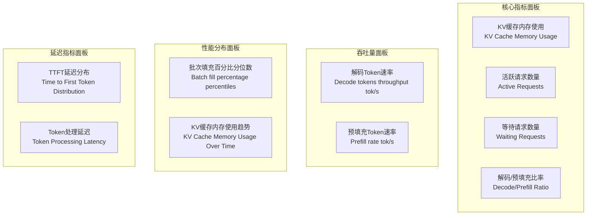

**图表来源**
- [examples/metrics-monitoring/continuous-batching-dashboard.json](file://examples/metrics-monitoring/continuous-batching-dashboard.json#L1-L100)

**节来源**
- [examples/metrics-monitoring/continuous-batching-dashboard.json](file://examples/metrics-monitoring/continuous-batching-dashboard.json#L1-L974)

## Grafana仪表板架构

### 数据流架构

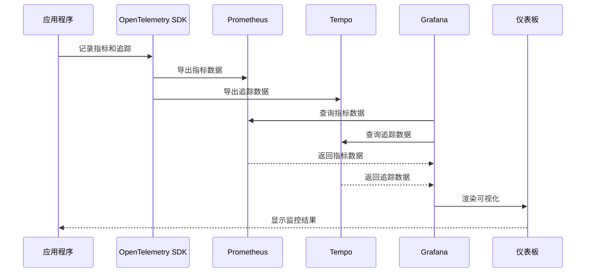

**图表来源**
- [docker-compose.yml](file://examples/metrics-monitoring/docker-compose.yml#L1-L56)
- [prometheus.yml](file://examples/metrics-monitoring/prometheus.yml#L1-L4)

### 变量和模板配置

仪表板支持多个动态变量，允许用户自定义监控视图：

| 变量名称 | 类型 | 描述 | 默认值 |
|---------|------|------|--------|
| branch | 查询变量 | Git分支选择 | main |
| gpu_name | 查询变量 | GPU型号选择 | NVIDIA A10G |
| last_n_commits | 文本框 | 显示的提交数量 | 10 |
| StartTime | 查询变量 | 开始时间 | 自动计算 |
| EndTime | 查询变量 | 结束时间 | 自动计算 |

**节来源**
- [benchmark/grafana_dashboard.json](file://benchmark/grafana_dashboard.json#L2259-L2376)

## 详细仪表板配置

### 基准测试仪表板配置

#### 面板配置详解

每个性能指标面板都采用统一的配置模式：

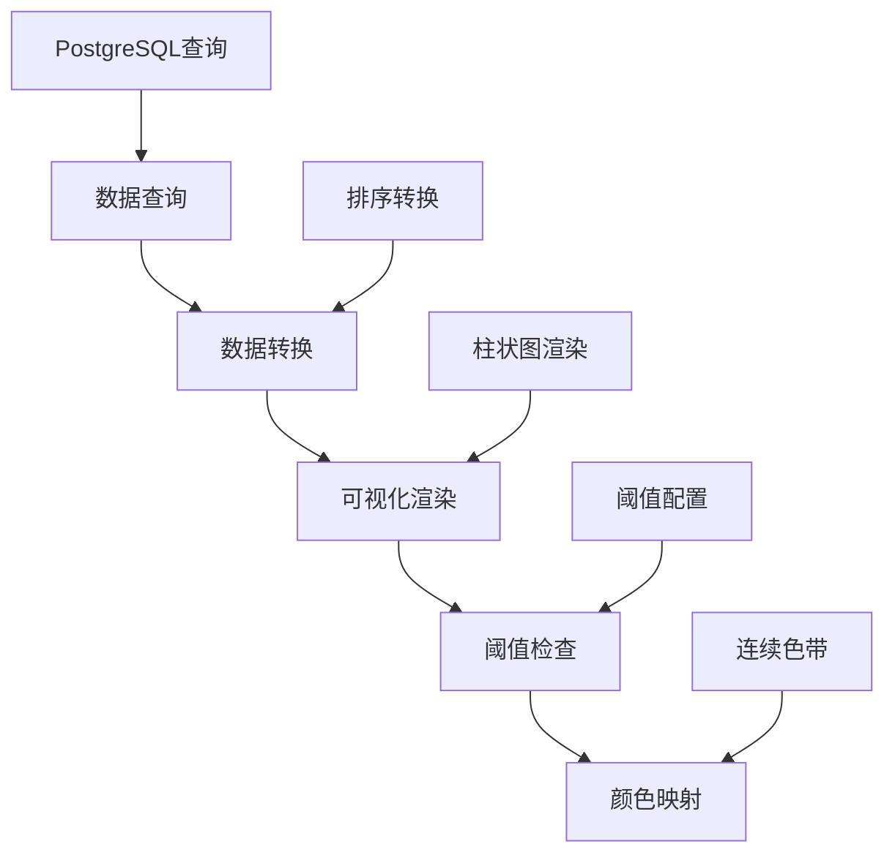

**图表来源**
- [benchmark/grafana_dashboard.json](file://benchmark/grafana_dashboard.json#L64-L200)

#### 性能指标面板配置

1. **首次前向传播时间**
   - 数据源：PostgreSQL
   - 查询字段：`first_eager_forward_pass_time_secs`
   - 单位：秒
   - 可视化类型：柱状图
   - 颜色映射：连续YlBl色带

2. **时间到首个Token**
   - 数据源：PostgreSQL
   - 查询字段：`time_to_first_token_secs`
   - 单位：秒
   - 可视化类型：柱状图
   - 阈值设置：绿色表示正常，红色表示异常

**节来源**
- [benchmark/grafana_dashboard.json](file://benchmark/grafana_dashboard.json#L150-L400)

### 连续批处理仪表板配置

#### 核心指标面板配置

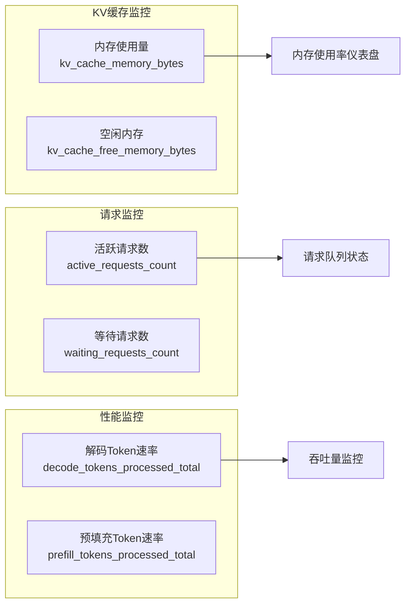

**图表来源**
- [examples/metrics-monitoring/continuous-batching-dashboard.json](file://examples/metrics-monitoring/continuous-batching-dashboard.json#L50-L200)

#### Prometheus查询配置

连续批处理仪表板使用Prometheus作为数据源，配置以下关键查询：

1. **内存使用监控**：
   ```promql
   kv_cache_memory_bytes
   ```

2. **请求计数监控**：
   ```promql
   active_requests_count
   waiting_requests_count
   ```

3. **Token处理速率**：
   ```promql
   rate(decode_tokens_processed_total[$__rate_interval])
   rate(prefill_tokens_processed_total[$__rate_interval])
   ```

**节来源**
- [examples/metrics-monitoring/continuous-batching-dashboard.json](file://examples/metrics-monitoring/continuous-batching-dashboard.json#L50-L300)

## 数据源配置

### PostgreSQL数据源配置

基准测试仪表板使用PostgreSQL作为主要数据源：

```yaml
datasources:
  - name: grafana-postgresql-datasource
    uid: be28nkzirtb0gd
    type: postgres
    url: $GRAFANA_POSTGRES_DATASOURCE_URL
    user: $GRAFANA_POSTGRES_DATASOURCE_USER
    secureJsonData:
      password: $GRAFANA_POSTGRES_DATASOURCE_PWD
    jsonData:
      database: metrics
      maxOpenConns: 100
      maxIdleConns: 100
      postgresVersion: 1000
      timescaledb: false
```

#### 环境变量配置

| 环境变量 | 描述 | 示例值 |
|---------|------|--------|
| GRAFANA_POSTGRES_DATASOURCE_URL | 数据库连接URL | postgres://localhost:5432 |
| GRAFANA_POSTGRES_DATASOURCE_USER | 数据库用户名 | grafana_user |
| GRAFANA_POSTGRES_DATASOURCE_PWD | 数据库密码 | secure_password |

**节来源**
- [benchmark/grafana_datasource.yaml](file://benchmark/grafana_datasource.yaml#L1-L18)

### Prometheus数据源配置

连续批处理仪表板使用Prometheus进行时序数据监控：

```yaml
datasources:
  - name: Prometheus
    type: prometheus
    access: proxy
    url: http://prometheus:9090
    isDefault: true
    
  - name: Tempo
    type: tempo
    access: proxy
    url: http://tempo:3200
    uid: tempo
```

**节来源**
- [examples/metrics-monitoring/grafana-datasources.yaml](file://examples/metrics-monitoring/grafana-datasources.yaml#L1-L15)

## 部署和启动

### 完整部署流程

#### 1. 环境准备

```bash
# 克隆项目
git clone https://github.com/huggingface/transformers.git
cd transformers/examples/metrics-monitoring

# 检查Docker环境
docker --version
docker-compose --version
```

#### 2. 启动监控服务

```bash
# 使用Docker Compose启动所有服务
docker compose up -d

# 查看服务状态
docker compose ps

# 查看日志输出
docker compose logs -f grafana
```

#### 3. 仪表板导入配置

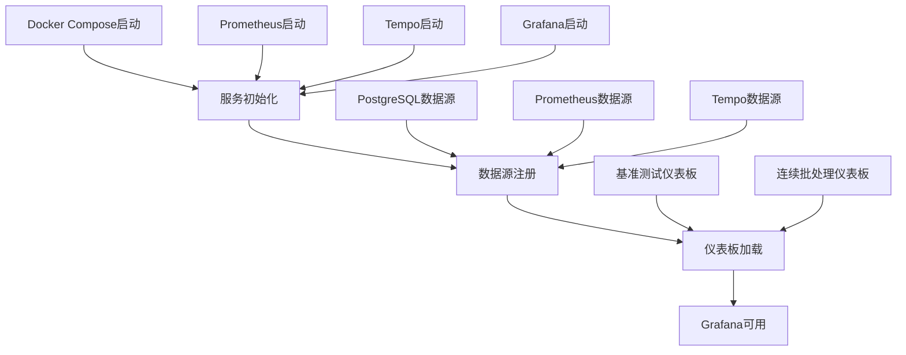

**图表来源**
- [docker-compose.yml](file://examples/metrics-monitoring/docker-compose.yml#L1-L56)

#### 4. 初始访问配置

- **Grafana访问地址**：http://localhost:3000
- **默认登录凭据**：
  - 用户名：admin
  - 密码：admin
- **数据源验证**：确保PostgreSQL、Prometheus和Tempo连接正常

**节来源**
- [docker-compose.yml](file://examples/metrics-monitoring/docker-compose.yml#L30-L56)

### 手动仪表板导入

如果需要手动导入仪表板：

1. **访问Grafana界面**
   ```
   http://localhost:3000
   ```

2. **导入基准测试仪表板**
   - 路径：`/etc/grafana/provisioning/dashboards/continuous-batching-dashboard.json`
   - 提供者：Transformers Dashboards

3. **配置数据源**
   - 添加PostgreSQL数据源（基准测试）
   - 添加Prometheus数据源（连续批处理）

## 高级功能配置

### 时间范围选择

仪表板支持灵活的时间范围配置：

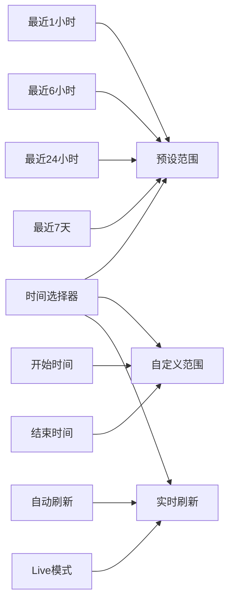

#### 时间范围配置选项

| 配置项 | 默认值 | 描述 |
|-------|--------|------|
| 时间范围 | now-1h | 显示最近1小时的数据 |
| 实时刷新 | 启用 | 自动更新最新数据 |
| Live模式 | 启用 | 实时显示最新指标 |

### 变量过滤配置

#### 分支过滤器

```yaml
{
  "current": {
    "selected": false,
    "text": "main",
    "value": "main"
  },
  "definition": "SELECT DISTINCT branch FROM benchmarks;",
  "label": "branch",
  "multi": false,
  "name": "branch",
  "type": "query"
}
```

#### GPU型号过滤器

```yaml
{
  "current": {
    "selected": false,
    "text": "NVIDIA A10G",
    "value": "NVIDIA A10G"
  },
  "definition": "SELECT DISTINCT metadata->>'gpu_name' FROM benchmarks;",
  "label": "GPU",
  "multi": false,
  "name": "gpu_name",
  "type": "query"
}
```

### 告警设置配置

#### 性能阈值告警

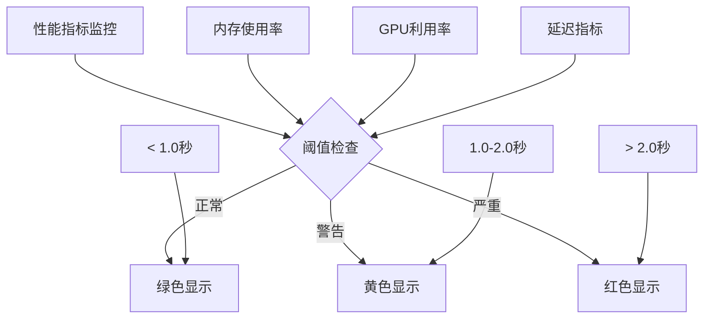

#### 内存使用告警配置

对于KV缓存内存使用，配置如下阈值：

| 阈值级别 | 使用量 | 颜色 | 建议操作 |
|---------|--------|------|----------|
| 正常 | < 5GB | 绿色 | 继续监控 |
| 警告 | 5-8GB | 黄色 | 检查内存使用 |
| 严重 | > 8GB | 红色 | 立即优化 |

### 自定义仪表板

#### 添加新面板

1. **创建新面板**
   - 点击"新建面板"按钮
   - 选择数据源（PostgreSQL或Prometheus）
   - 配置查询语句

2. **面板配置示例**
   ```json
   {
     "title": "自定义性能指标",
     "type": "timeseries",
     "datasource": "Prometheus",
     "targets": [
       {
         "expr": "custom_metric_name",
         "legendFormat": "{{instance}}"
       }
     ]
   }
   ```

#### 修改现有面板

1. **编辑面板**
   - 点击面板标题
   - 选择"编辑"模式
   - 修改查询或可视化设置

2. **保存更改**
   - 点击"应用"按钮
   - 保存仪表板

## 监控最佳实践

### 性能监控策略

#### 1. 关键性能指标(KPI)监控

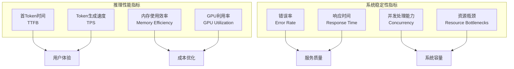

#### 2. 监控频率建议

| 指标类型 | 监控频率 | 告警阈值 | 处理建议 |
|---------|---------|---------|----------|
| 实时性能 | 1秒 | TTFB > 2秒 | 立即调查 |
| 系统资源 | 15秒 | CPU > 80% | 优化负载 |
| 内存使用 | 30秒 | 内存 > 90% | 清理缓存 |
| 错误率 | 1分钟 | 错误率 > 5% | 检查服务状态 |

### 故障诊断流程

#### 1. 性能下降诊断

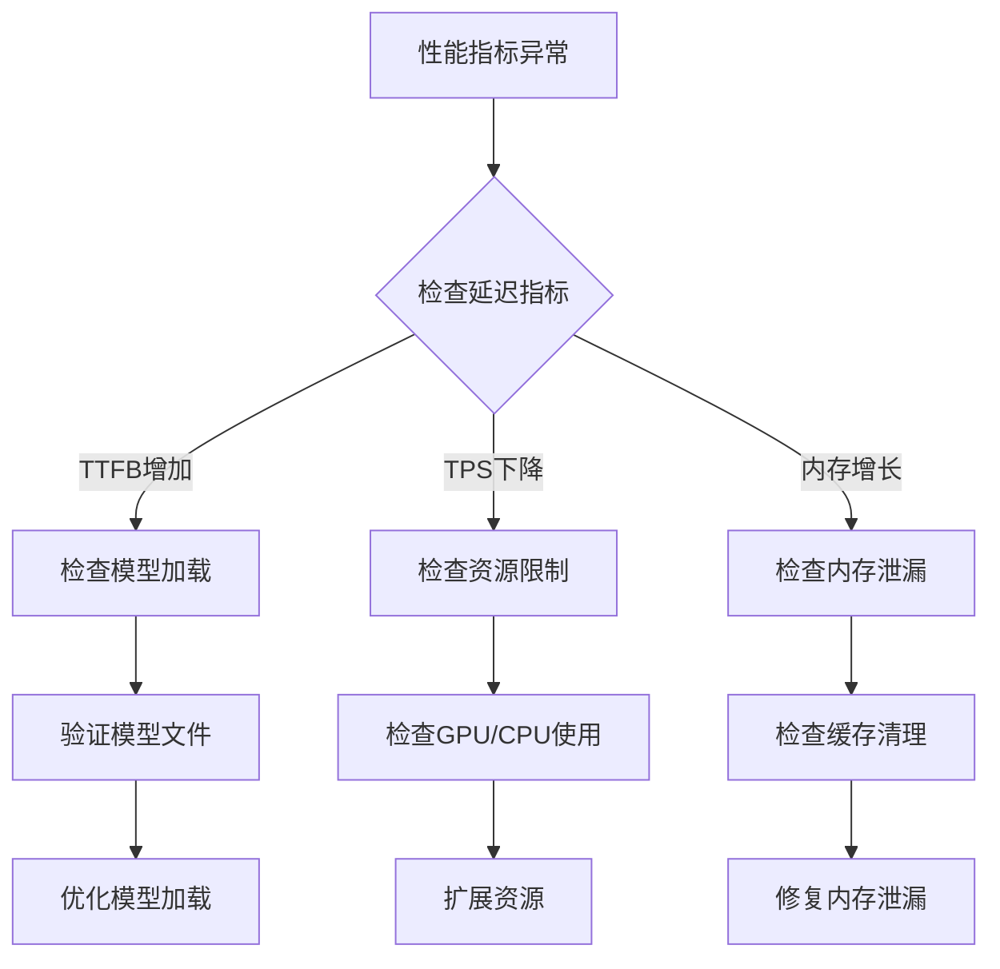

#### 2. 系统故障排查

1. **检查数据源连接**
   - 验证PostgreSQL连接
   - 检查Prometheus抓取状态
   - 确认Tempo追踪服务

2. **验证仪表板配置**
   - 检查变量定义
   - 验证查询语法
   - 确认权限设置

3. **监控告警配置**
   - 设置合理的阈值
   - 配置通知渠道
   - 测试告警机制

### 成本优化建议

#### 1. 资源使用优化

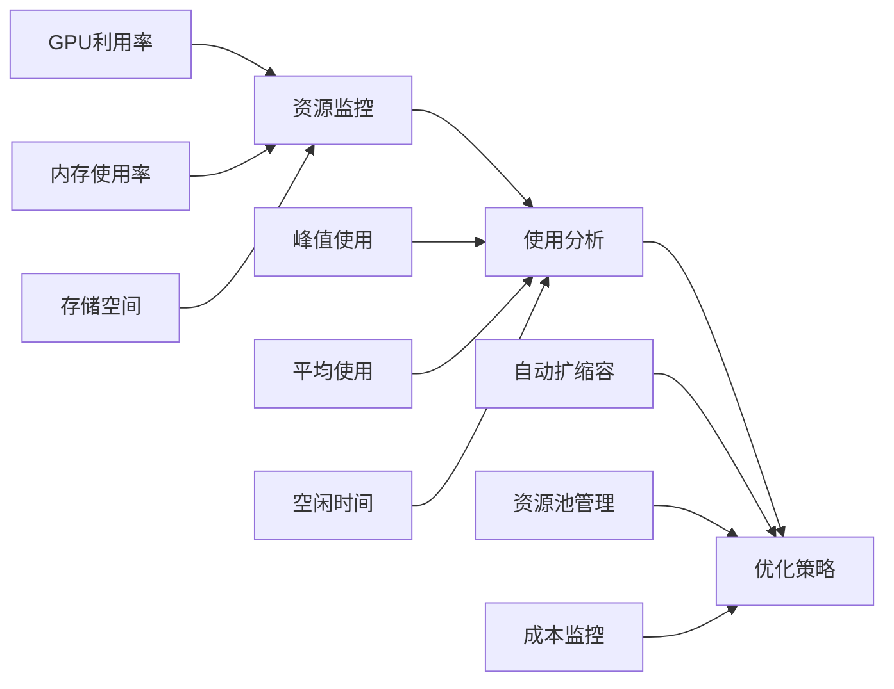

#### 2. 监控成本控制

| 优化措施 | 预期效果 | 实施难度 |
|---------|---------|---------|
| 数据保留策略 | 减少存储成本 | 中等 |
| 查询优化 | 降低计算开销 | 高 |
| 资源池共享 | 提高资源利用率 | 高 |
| 告警去重 | 减少通知成本 | 低 |

## 故障排除指南

### 常见问题及解决方案

#### 1. 数据源连接问题

**问题症状**：
- 仪表板显示"无数据"
- 查询超时错误
- 连接拒绝

**解决方案**：

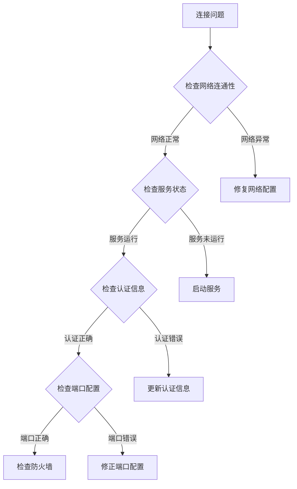

#### 2. 查询性能问题

**问题症状**：
- 仪表板加载缓慢
- 查询超时
- 内存不足

**解决方案**：

1. **优化查询语句**
   ```sql
   -- 优化前：全表扫描
   SELECT * FROM benchmarks WHERE branch = 'main';
   
   -- 优化后：添加索引
   CREATE INDEX idx_benchmarks_branch ON benchmarks(branch);
   SELECT * FROM benchmarks WHERE branch = 'main';
   ```

2. **调整查询参数**
   - 限制返回记录数
   - 使用时间范围过滤
   - 优化JOIN条件

#### 3. 仪表板显示问题

**问题症状**：
- 图表显示异常
- 数据格式错误
- 布局错乱

**解决方案**：

1. **检查数据格式**
   - 验证数值类型
   - 检查时间戳格式
   - 确认单位设置

2. **调整面板配置**
   - 修改轴范围
   - 调整颜色映射
   - 更新显示格式

### 性能调优指南

#### 1. 数据库性能优化

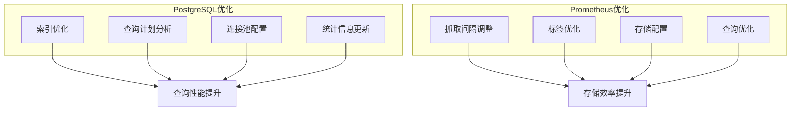

#### 2. Grafana性能优化

| 优化项目 | 配置参数 | 推荐值 | 说明 |
|---------|---------|--------|------|
| 最大数据点 | maxDataPoints | 10000 | 控制内存使用 |
| 并发查询 | maxConcurrentQueries | 10 | 避免服务器过载 |
| 缓存设置 | cacheTimeout | 300 | 平衡实时性和性能 |
| 图表类型 | renderMode | svg | 提升渲染质量 |

### 监控告警配置

#### 1. 关键指标告警

```yaml
# Prometheus告警规则示例
groups:
  - name: transformers_monitoring
    rules:
      - alert: HighMemoryUsage
        expr: memory_usage_percent > 80
        for: 5m
        labels:
          severity: warning
        annotations:
          summary: "High memory usage detected"
          
      - alert: HighLatency
        expr: avg_latency_seconds > 2
        for: 2m
        labels:
          severity: critical
        annotations:
          summary: "High latency detected"
```

#### 2. 通知配置

```yaml
# Alertmanager配置
receivers:
  - name: 'email-notifications'
    email_configs:
      - to: 'admin@company.com'
        from: 'alertmanager@company.com'
        
  - name: 'slack-notifications'
    slack_configs:
      - api_url: 'https://hooks.slack.com/services/YOUR/SLACK/WEBHOOK'

route:
  receiver: 'email-notifications'
  group_by: ['alertname']
  group_wait: 30s
  group_interval: 5m
  repeat_interval: 12h
```

## 总结

本指南详细介绍了transformers项目中Grafana仪表板的完整配置和使用方法。通过基准测试仪表板和连续批处理仪表板，用户可以全面监控模型推理性能和系统资源使用情况。

### 主要功能特性

1. **多维度监控**：涵盖性能指标、系统资源、业务指标等多个维度
2. **实时数据展示**：支持实时数据更新和历史数据分析
3. **灵活配置**：支持多种变量过滤和自定义面板
4. **集成式部署**：提供完整的Docker部署方案
5. **告警机制**：支持基于阈值的智能告警

### 最佳实践要点

1. **合理设置监控指标**：关注关键性能指标，避免过度监控
2. **优化查询性能**：定期审查和优化数据库查询
3. **建立告警机制**：设置合理的阈值和通知策略
4. **定期维护仪表板**：及时更新和优化面板配置
5. **成本控制**：平衡监控精度和系统成本

通过遵循本指南的配置和使用方法，用户可以充分发挥Grafana仪表板在transformers项目中的监控价值，实现高效、可靠的系统监控和性能优化。