# 性能优化建议

<cite>
**本文档中引用的文件**
- [metrics_example.py](file://examples/metrics-monitoring/metrics_example.py)
- [tempo.yaml](file://examples/metrics-monitoring/tempo.yaml)
- [hardware_metrics.py](file://benchmark_v2/framework/hardware_metrics.py)
- [continuous_batching.py](file://examples/pytorch/continuous_batching.py)
- [prometheus.yml](file://examples/metrics-monitoring/prometheus.yml)
- [docker-compose.yml](file://examples/metrics-monitoring/docker-compose.yml)
- [benchmark.py](file://benchmark/benchmark.py)
- [custom_quantization.py](file://examples/quantization/custom_quantization.py)
- [metrics.py](file://src/transformers/utils/metrics.py)
- [cache.py](file://src/transformers/generation/continuous_batching/cache.py)
- [tensor_parallel.py](file://src/transformers/integrations/tensor_parallel.py)
- [accelerate.py](file://src/transformers/integrations/accelerate.py)
- [context_parallel.py](file://examples/pytorch/context_parallel.py)
</cite>

## 目录
1. [简介](#简介)
2. [监控基础设施](#监控基础设施)
3. [性能基准测试框架](#性能基准测试框架)
4. [量化与压缩技术](#量化与压缩技术)
5. [并行化策略](#并行化策略)
6. [内存管理优化](#内存管理优化)
7. [硬件特定优化](#硬件特定优化)
8. [性能基线建立与A/B测试](#性能基线建立与ab测试)
9. [持续监控最佳实践](#持续监控最佳实践)
10. [性能回归检测](#性能回归检测)
11. [总结](#总结)

## 简介

本指南基于Hugging Face Transformers库中的监控数据和基准测试框架，提供了全面的性能优化策略。通过分析transformers项目的监控基础设施、量化技术、并行化方案和内存管理机制，我们将展示如何在不同硬件环境下实现最优性能。

## 监控基础设施

### OpenTelemetry集成

transformers项目集成了OpenTelemetry来提供细粒度的性能监控能力。

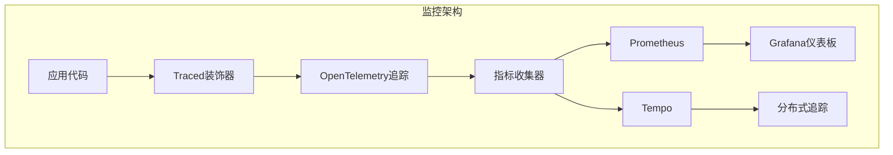

**图表来源**
- [metrics_example.py](file://examples/metrics-monitoring/metrics_example.py#L1-L49)
- [metrics.py](file://src/transformers/utils/metrics.py#L1-L199)

### 指标收集配置

项目使用多种监控工具来收集不同维度的性能指标：

| 监控组件 | 功能 | 配置文件 |
|---------|------|----------|
| Prometheus | 时间序列指标收集 | prometheus.yml |
| Tempo | 分布式追踪 | tempo.yaml |
| Grafana | 可视化仪表板 | grafana-dashboard.yaml |
| Memcached | 缓存服务 | docker-compose.yml |

**章节来源**
- [prometheus.yml](file://examples/metrics-monitoring/prometheus.yml#L1-L4)
- [tempo.yaml](file://examples/metrics-monitoring/tempo.yaml#L1-L91)
- [docker-compose.yml](file://examples/metrics-monitoring/docker-compose.yml#L1-L56)

### 性能指标定义

系统监控以下关键性能指标：

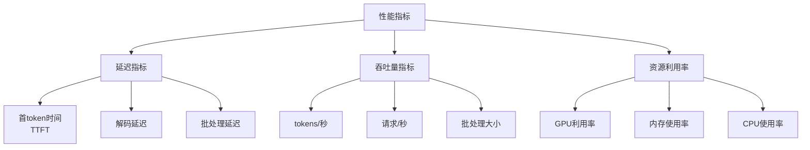

**图表来源**
- [hardware_metrics.py](file://benchmark_v2/framework/hardware_metrics.py#L1-L172)

## 性能基准测试框架

### 基准测试执行流程

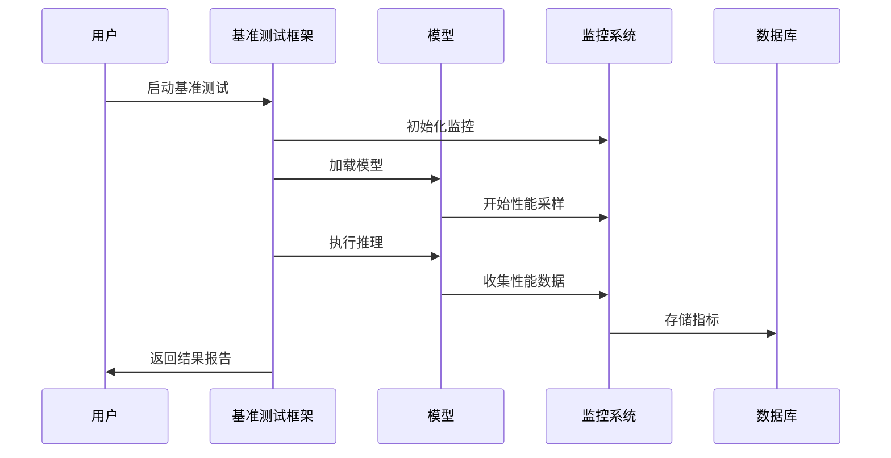

**图表来源**
- [benchmark.py](file://benchmark/benchmark.py#L1-L199)

### 关键性能指标

基准测试框架收集以下核心指标：

| 指标类别 | 具体指标 | 单位 | 描述 |
|---------|----------|------|------|
| 延迟 | 首次token时间 | 秒 | 第一个token生成耗时 |
| 延迟 | 解码延迟 | 秒 | 完整序列生成耗时 |
| 吞吐量 | tokens/秒 | tokens/s | 每秒生成的token数量 |
| 内存 | GPU内存使用 | GB | GPU显存占用情况 |
| 并发 | 批处理大小 | tokens | 单次批处理的最大token数 |

**章节来源**
- [benchmark.py](file://benchmark/benchmark.py#L50-L150)

## 量化与压缩技术

### 量化配置系统

transformers提供了灵活的量化配置系统，支持多种量化方法：

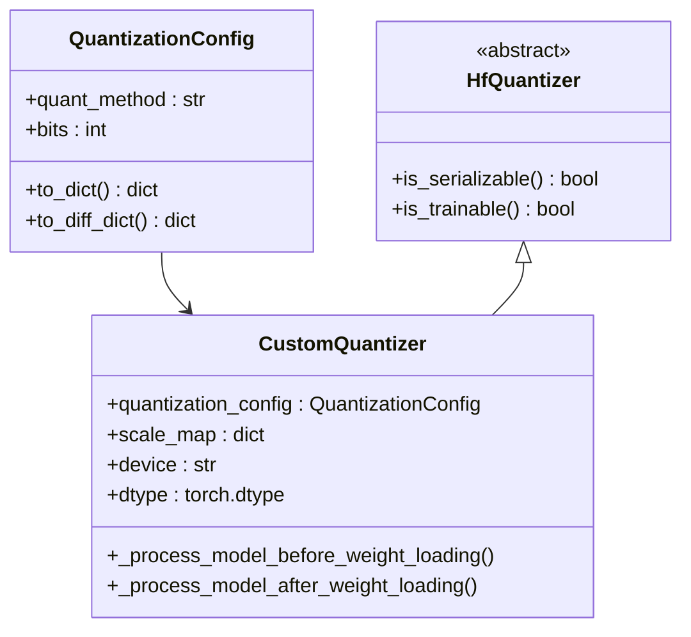

**图表来源**
- [custom_quantization.py](file://examples/quantization/custom_quantization.py#L1-L79)

### 量化技术对比

| 量化方法 | 精度损失 | 内存节省 | 推理速度 | 兼容性 |
|---------|----------|----------|----------|--------|
| INT8 | 低 | 50% | 提升 | 广泛 |
| FP16 | 极低 | 50% | 略提升 | 良好 |
| INT4 | 中等 | 75% | 显著提升 | 需要特殊支持 |
| 动态量化 | 低 | 25-30% | 略提升 | 良好 |

### 自定义量化实现

系统支持自定义量化策略，允许开发者根据具体需求调整量化参数：

**章节来源**
- [custom_quantization.py](file://examples/quantization/custom_quantization.py#L15-L79)

## 并行化策略

### 多维并行架构

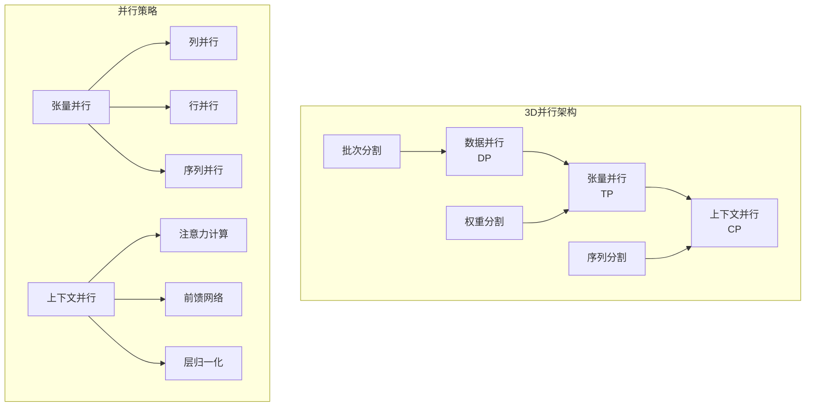

**图表来源**
- [tensor_parallel.py](file://src/transformers/integrations/tensor_parallel.py#L765-L783)
- [context_parallel.py](file://examples/pytorch/context_parallel.py#L1-L95)

### 张量并行优化

张量并行通过将模型权重分布在多个设备上来提高推理效率：

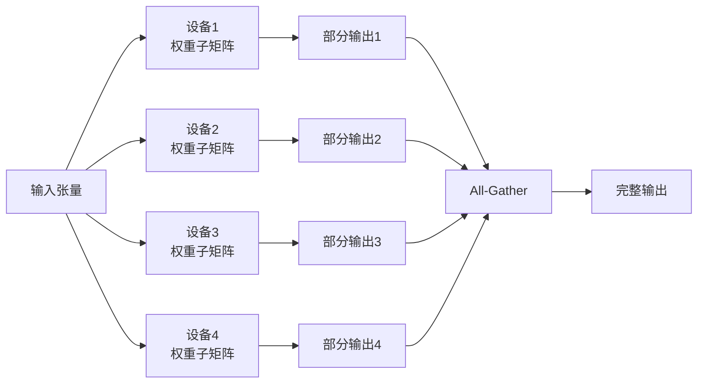

**图表来源**
- [tensor_parallel.py](file://src/transformers/integrations/tensor_parallel.py#L919-L960)

### 上下文并行

上下文并行允许同时处理多个序列，特别适用于连续批处理场景：

**章节来源**
- [context_parallel.py](file://examples/pytorch/context_parallel.py#L40-L95)

## 内存管理优化

### 分页注意力缓存

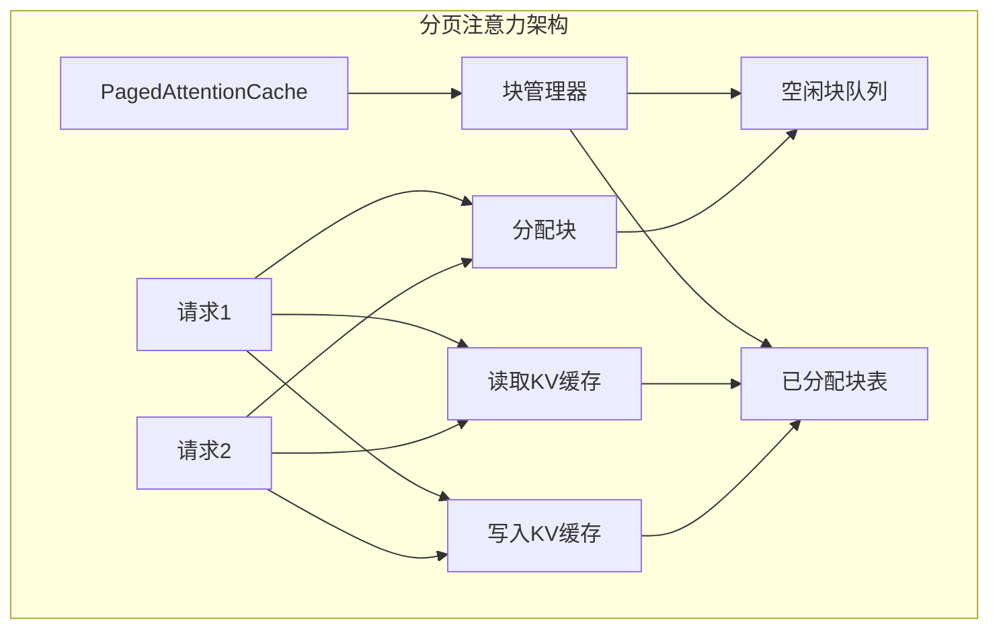

**图表来源**
- [cache.py](file://src/transformers/generation/continuous_batching/cache.py#L217-L239)

### 内存优化策略

| 优化技术 | 内存节省 | 性能影响 | 适用场景 |
|---------|----------|----------|----------|
| KV缓存分页 | 30-50% | 轻微下降 | 长序列推理 |
| 梯度检查点 | 50-70% | 显著下降 | 内存受限环境 |
| 动态批处理 | 20-30% | 轻微提升 | 不规则负载 |
| 混合精度 | 40-50% | 轻微提升 | GPU推理 |

### 缓存管理算法

系统实现了智能的缓存分配算法来最大化内存利用率：

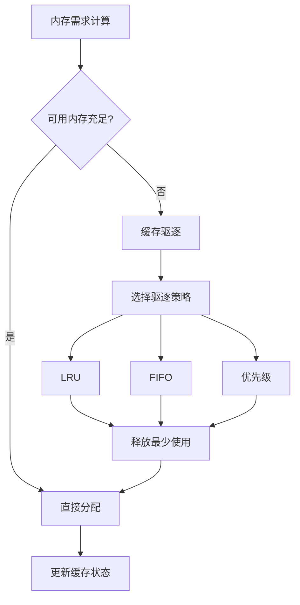

**图表来源**
- [cache.py](file://src/transformers/generation/continuous_batching/cache.py#L443-L488)

**章节来源**
- [cache.py](file://src/transformers/generation/continuous_batching/cache.py#L321-L343)

## 硬件特定优化

### GPU优化策略

不同GPU厂商的优化重点有所不同：

| GPU类型 | 主要优化点 | 推荐配置 | 注意事项 |
|---------|------------|----------|----------|
| NVIDIA A100 | Flash Attention | 启用paged_attention | 需要CUDA 11.8+ |
| NVIDIA V100 | FP16混合精度 | 设置matmul_precision | 注意精度损失 |
| AMD MI250 | ROCm优化 | 使用rocm-smi监控 | 需要ROCm驱动 |
| Intel GPU | XPU优化 | 启用Intel Extension | 需要专用扩展 |

### TPU优化配置

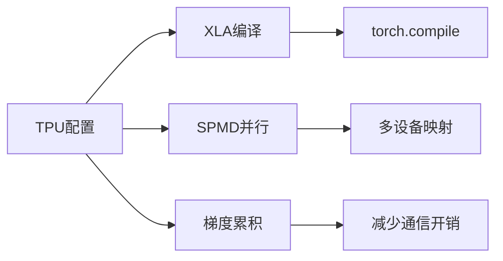

### CPU优化策略

对于CPU部署，重点关注以下优化：

- **NUMA感知调度**：确保内存访问本地化
- **线程池优化**：合理配置工作线程数量
- **SIMD指令**：利用AVX-512等向量指令
- **内存预取**：优化数据加载模式

**章节来源**
- [hardware_metrics.py](file://benchmark_v2/framework/hardware_metrics.py#L40-L172)

## 性能基线建立与A/B测试

### 基线建立流程

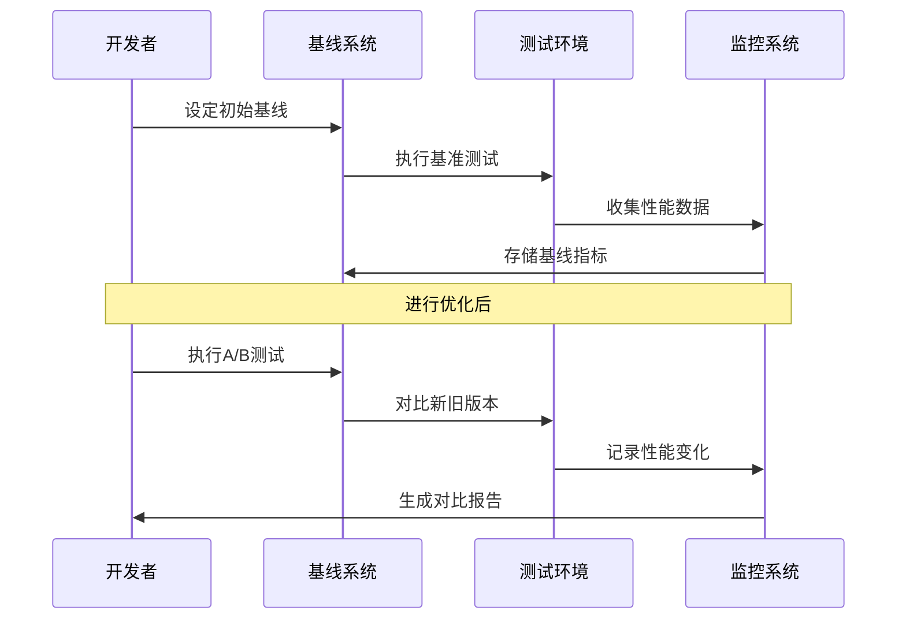

### A/B测试设计

有效的A/B测试需要考虑以下因素：

| 测试维度 | 控制变量 | 待测变量 | 评估指标 |
|---------|----------|----------|----------|
| 批处理大小 | 模型配置 | batch_size | 吞吐量vs延迟 |
| 量化策略 | 硬件环境 | quantization_method | 精度vs速度 |
| 并行策略 | 数据分布 | parallel_mode | 资源利用率 |
| 缓存策略 | 序列长度 | cache_type | 内存使用率 |

### 性能回归检测

系统自动检测性能回归：

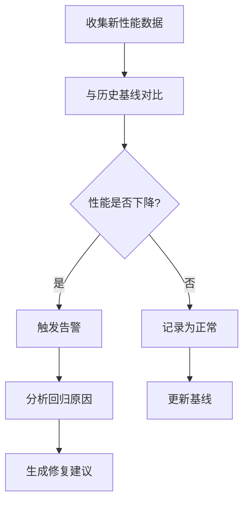

**章节来源**
- [benchmark.py](file://benchmark/benchmark.py#L50-L150)

## 持续监控最佳实践

### 监控仪表板设计

推荐的监控仪表板应包含以下面板：

| 面板类型 | 监控内容 | 更新频率 | 告警阈值 |
|---------|----------|----------|----------|
| 实时性能 | TTFT、吞吐量 | 1秒 | >基准值20% |
| 资源使用 | GPU/CPU利用率 | 5秒 | >80% |
| 错误率 | 请求失败率 | 1分钟 | >5% |
| 资源瓶颈 | 内存使用趋势 | 30秒 | >90% |

### 告警策略

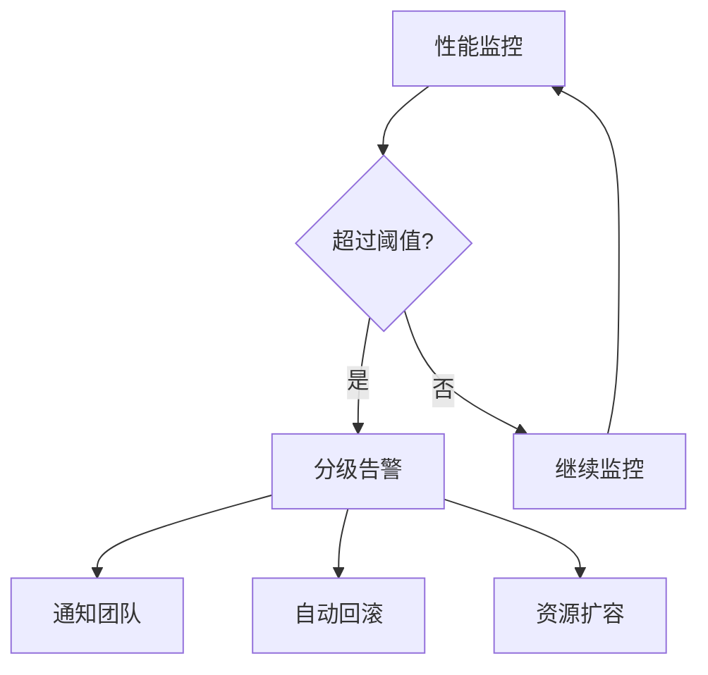

### 日志分析

系统日志分析的关键指标：

- **错误频率**：每小时错误请求数
- **响应时间分布**：P50、P95、P99延迟
- **资源使用峰值**：内存、GPU使用率
- **并发连接数**：活跃请求数量

**章节来源**
- [metrics.py](file://src/transformers/utils/metrics.py#L150-L199)

## 性能回归检测

### 自动化检测流程

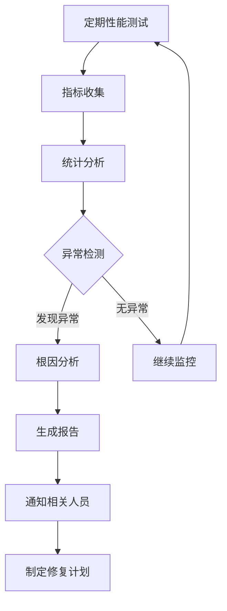

### 回归检测算法

系统使用以下算法检测性能回归：

| 算法类型 | 适用场景 | 检测灵敏度 | 计算复杂度 |
|---------|----------|-----------|-----------|
| 移动平均 | 趋势检测 | 中等 | 低 |
| Z-score | 异常检测 | 高 | 中等 |
| 机器学习 | 复杂模式 | 最高 | 高 |
| 统计检验 | 假设验证 | 高 | 中等 |

### 修复优先级评估

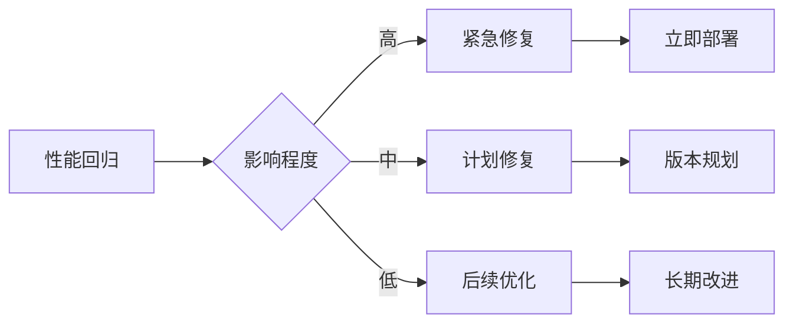

## 总结

本指南涵盖了transformers项目中的主要性能优化技术：

1. **监控基础设施**：通过OpenTelemetry和相关工具建立了完整的性能监控体系
2. **基准测试框架**：提供了标准化的性能评估方法
3. **量化压缩**：支持多种量化技术以平衡精度和性能
4. **并行化策略**：实现了张量、上下文和数据的多维并行
5. **内存管理**：采用分页缓存和智能分配算法优化内存使用
6. **硬件适配**：针对不同硬件平台提供专门的优化策略

通过系统性地应用这些优化技术，可以在各种硬件环境下获得最佳的推理性能。持续的监控和A/B测试确保了性能优化的有效性和稳定性。

建议在实际部署中：
- 根据具体硬件配置选择合适的优化策略组合
- 建立完善的性能基线和监控体系
- 定期进行性能回归测试
- 保持对新技术和优化方法的关注