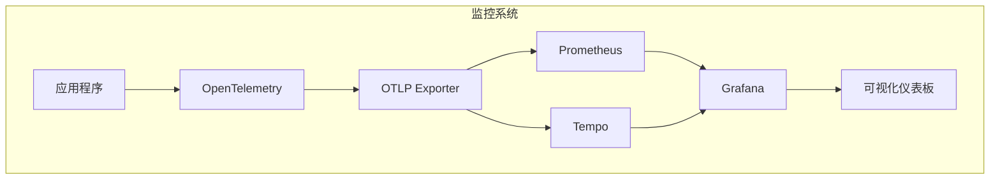
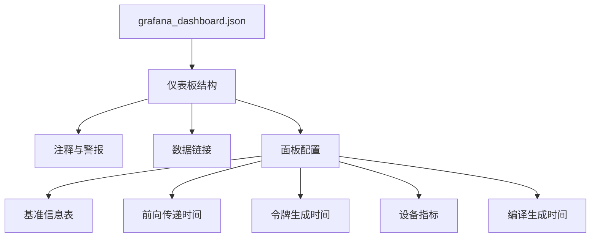
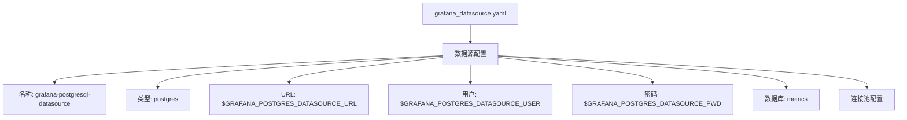
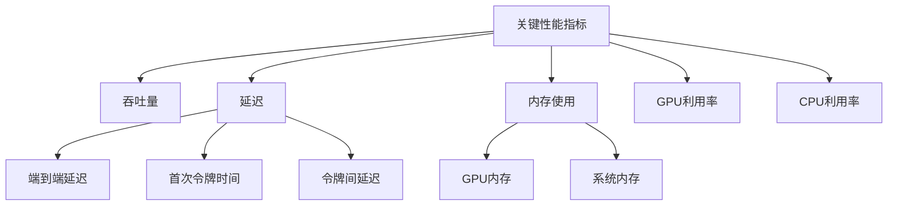
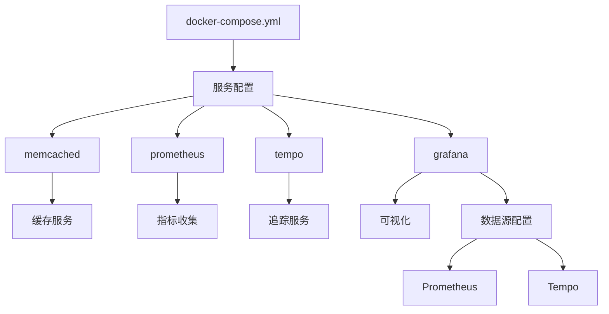
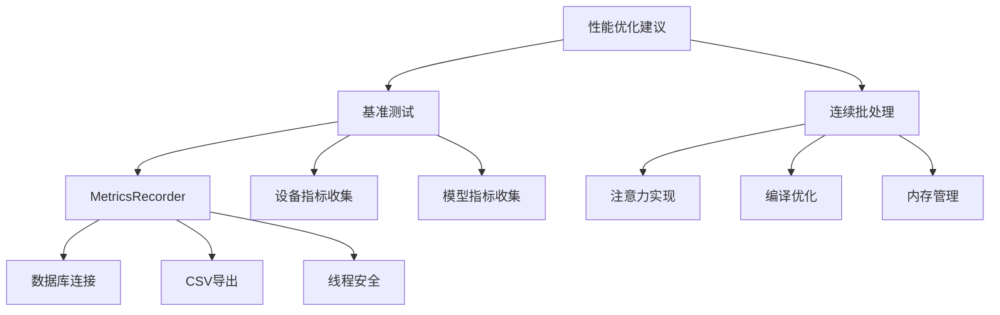
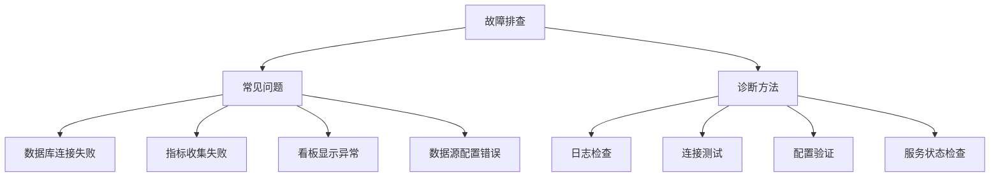

# 监控与结果分析

<cite>
**本文档引用的文件**   
- [grafana_dashboard.json](file://benchmark/grafana_dashboard.json)
- [grafana_datasource.yaml](file://benchmark/grafana_datasource.yaml)
- [docker-compose.yml](file://examples/metrics-monitoring/docker-compose.yml)
- [prometheus.yml](file://examples/metrics-monitoring/prometheus.yml)
- [grafana-dashboard.yaml](file://examples/metrics-monitoring/grafana-dashboard.yaml)
- [grafana-datasources.yaml](file://examples/metrics-monitoring/grafana-datasources.yaml)
- [metrics_example.py](file://examples/metrics-monitoring/metrics_example.py)
- [README.md](file://examples/metrics-monitoring/README.md)
- [README.md](file://benchmark/README.md)
- [benchmarks_entrypoint.py](file://benchmark/benchmarks_entrypoint.py)
- [hardware_metrics.py](file://benchmark_v2/framework/hardware_metrics.py)
- [data_classes.py](file://benchmark_v2/framework/data_classes.py)
- [continuous_batching.py](file://examples/pytorch/continuous_batching.py)
</cite>

## 目录
1. [简介](#简介)
2. [监控系统架构](#监控系统架构)
3. [Grafana看板配置](#grafana看板配置)
4. [数据源设置](#数据源设置)
5. [关键性能指标分析](#关键性能指标分析)
6. [监控管道设置](#监控管道设置)
7. [性能优化建议](#性能优化建议)
8. [故障排查指南](#故障排查指南)

## 简介
本文档详细介绍了transformers基准测试的可视化和性能分析系统。系统通过集成Grafana、Prometheus和Tempo等工具，为transformers模型的性能监控提供了完整的解决方案。文档重点说明了grafana_dashboard.json仪表板的布局、指标和使用方法，以及grafana_datasource.yaml中数据源的配置。同时，分析了监控系统收集的关键性能指标，如吞吐量、延迟、内存使用和GPU利用率，并指导用户如何从原始数据中提取有价值的洞察，识别性能瓶颈。

**Section sources**
- [grafana_dashboard.json](file://benchmark/grafana_dashboard.json)
- [grafana_datasource.yaml](file://benchmark/grafana_datasource.yaml)

## 监控系统架构

**Diagram sources**
- [docker-compose.yml](file://examples/metrics-monitoring/docker-compose.yml)
- [continuous_batching.py](file://examples/pytorch/continuous_batching.py)

**Section sources**
- [docker-compose.yml](file://examples/metrics-monitoring/docker-compose.yml)
- [continuous_batching.py](file://examples/pytorch/continuous_batching.py)

## Grafana看板配置

**Diagram sources**
- [grafana_dashboard.json](file://benchmark/grafana_dashboard.json)

**Section sources**
- [grafana_dashboard.json](file://benchmark/grafana_dashboard.json)

## 数据源设置

**Diagram sources**
- [grafana_datasource.yaml](file://benchmark/grafana_datasource.yaml)

**Section sources**
- [grafana_datasource.yaml](file://benchmark/grafana_datasource.yaml)

## 关键性能指标分析

**Diagram sources**
- [data_classes.py](file://benchmark_v2/framework/data_classes.py)
- [hardware_metrics.py](file://benchmark_v2/framework/hardware_metrics.py)

**Section sources**
- [data_classes.py](file://benchmark_v2/framework/data_classes.py)
- [hardware_metrics.py](file://benchmark_v2/framework/hardware_metrics.py)

## 监控管道设置

**Diagram sources**
- [docker-compose.yml](file://examples/metrics-monitoring/docker-compose.yml)
- [grafana-datasources.yaml](file://examples/metrics-monitoring/grafana-datasources.yaml)

**Section sources**
- [docker-compose.yml](file://examples/metrics-monitoring/docker-compose.yml)
- [grafana-datasources.yaml](file://examples/metrics-monitoring/grafana-datasources.yaml)

## 性能优化建议

**Diagram sources**
- [benchmarks_entrypoint.py](file://benchmark/benchmarks_entrypoint.py)
- [continuous_batching.py](file://examples/pytorch/continuous_batching.py)

**Section sources**
- [benchmarks_entrypoint.py](file://benchmark/benchmarks_entrypoint.py)
- [continuous_batching.py](file://examples/pytorch/continuous_batching.py)

## 故障排查指南

**Diagram sources**
- [benchmarks_entrypoint.py](file://benchmark/benchmarks_entrypoint.py)
- [README.md](file://benchmark/README.md)

**Section sources**
- [benchmarks_entrypoint.py](file://benchmark/benchmarks_entrypoint.py)
- [README.md](file://benchmark/README.md)