# 创建示例脚本详细指南

<cite>
**本文档中引用的文件**
- [templates/adding_a_new_example_script/README.md](file://templates/adding_a_new_example_script/README.md)
- [templates/adding_a_new_example_script/cookiecutter.json](file://templates/adding_a_new_example_script/cookiecutter.json)
- [examples/pytorch/language-modeling/run_clm.py](file://examples/pytorch/language-modeling/run_clm.py)
- [examples/pytorch/text-classification/run_glue.py](file://examples/pytorch/text-classification/run_glue.py)
- [examples/pytorch/text-classification/README.md](file://examples/pytorch/text-classification/README.md)
- [examples/pytorch/test_pytorch_examples.py](file://examples/pytorch/test_pytorch_examples.py)
- [examples/pytorch/README.md](file://examples/pytorch/README.md)
- [src/transformers/trainer.py](file://src/transformers/trainer.py)
- [src/transformers/hf_argparser.py](file://src/transformers/hf_argparser.py)
- [src/transformers/utils/import_utils.py](file://src/transformers/utils/import_utils.py)
</cite>

## 目录
1. [简介](#简介)
2. [项目结构概览](#项目结构概览)
3. [模板系统](#模板系统)
4. [脚本结构详解](#脚本结构详解)
5. [参数解析系统](#参数解析系统)
6. [数据集加载与处理](#数据集加载与处理)
7. [模型训练与评估](#模型训练与评估)
8. [硬件兼容性](#硬件兼容性)
9. [CI测试集成](#ci测试集成)
10. [最佳实践](#最佳实践)
11. [故障排除指南](#故障排除指南)
12. [总结](#总结)

## 简介

本指南详细介绍了如何在🤗 Transformers项目中创建新的示例脚本，基于`templates/adding_a_new_example_script`模板。示例脚本是展示特定模型或功能使用方法的重要工具，它们必须遵循严格的结构和最佳实践，以确保代码的可读性、可复现性和跨平台兼容性。

示例脚本的主要目标：
- 展示模型的实际使用方法
- 提供可直接运行的完整工作流程
- 遵循统一的代码风格和架构模式
- 支持多种硬件环境（GPU、TPU等）
- 包含详细的文档和README说明

## 项目结构概览

Transformers项目的示例脚本组织结构清晰，按任务类型分类：

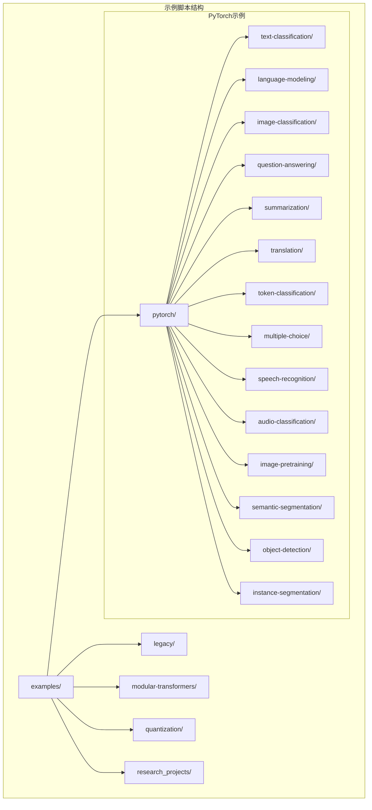

**图表来源**
- [examples/pytorch/README.md](file://examples/pytorch/README.md#L1-L50)

**章节来源**
- [examples/pytorch/README.md](file://examples/pytorch/README.md#L1-L100)

## 模板系统

### Cookiecutter模板

Transformers使用Cookiecutter模板系统来自动生成新的示例脚本框架。模板配置允许快速创建标准化的脚本结构。

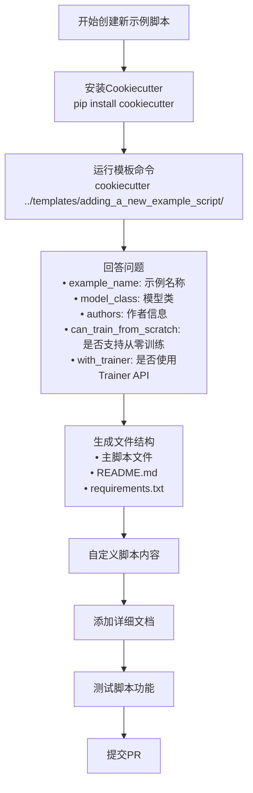

**图表来源**
- [templates/adding_a_new_example_script/README.md](file://templates/adding_a_new_example_script/README.md#L15-L35)
- [templates/adding_a_new_example_script/cookiecutter.json](file://templates/adding_a_new_example_script/cookiecutter.json#L1-L9)

### 模板配置选项

模板提供了以下关键配置选项：

| 配置项 | 类型 | 描述 | 默认值 |
|--------|------|------|--------|
| example_name | 字符串 | 示例任务名称 | "text classification" |
| directory_name | 字符串 | 目录名称（自动转换） | "{{cookiecutter.example_name\|lower\|replace(' ', '-')}}" |
| example_shortcut | 字符串 | 示例快捷方式 | "{{cookiecutter.directory_name}}" |
| model_class | 字符串 | 使用的模型类 | "AutoModel" |
| authors | 字符串 | 脚本作者 | "The HuggingFace Team" |
| can_train_from_scratch | 布尔列表 | 是否支持从零训练 | ["True", "False"] |
| with_trainer | 布尔列表 | 是否使用Trainer API | ["True", "False"] |

**章节来源**
- [templates/adding_a_new_example_script/README.md](file://templates/adding_a_new_example_script/README.md#L1-L39)
- [templates/adding_a_new_example_script/cookiecutter.json](file://templates/adding_a_new_example_script/cookiecutter.json#L1-L9)

## 脚本结构详解

### 标准化头部结构

所有示例脚本都遵循统一的头部格式，包含版权信息、依赖声明和简要描述：

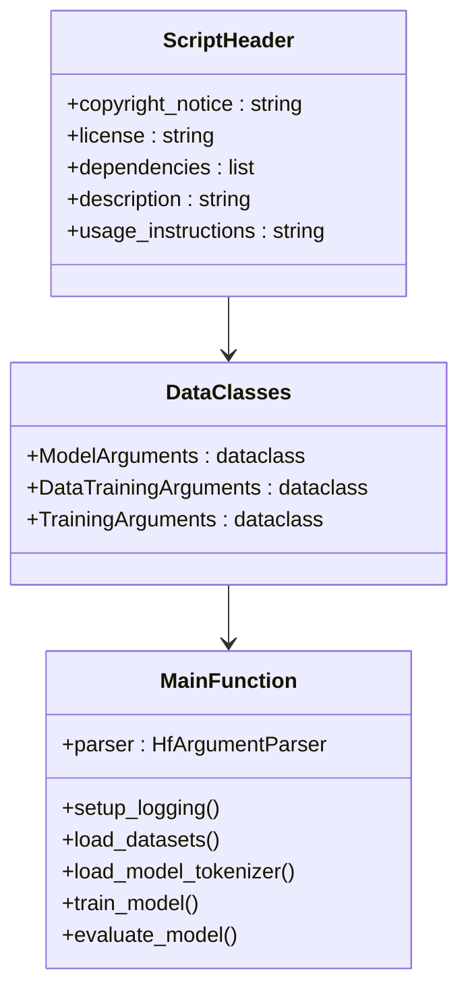

**图表来源**
- [examples/pytorch/language-modeling/run_clm.py](file://examples/pytorch/language-modeling/run_clm.py#L1-L50)
- [examples/pytorch/text-classification/run_glue.py](file://examples/pytorch/text-classification/run_glue.py#L1-L50)

### 数据类设计模式

示例脚本使用Python的`dataclass`装饰器来定义参数结构，提供类型安全和自动文档生成功能：

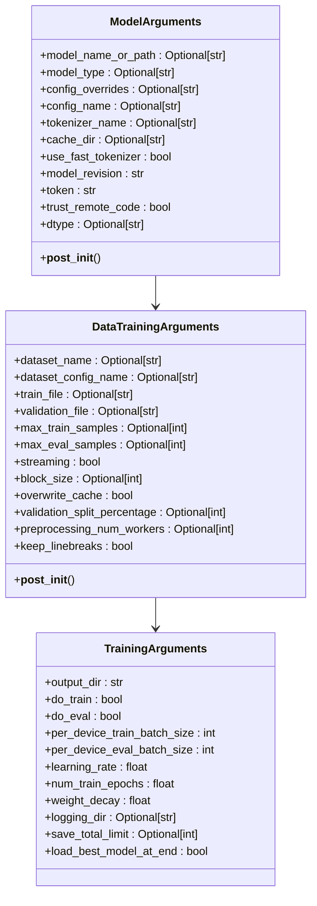

**图表来源**
- [examples/pytorch/language-modeling/run_clm.py](file://examples/pytorch/language-modeling/run_clm.py#L60-L200)
- [examples/pytorch/text-classification/run_glue.py](file://examples/pytorch/text-classification/run_glue.py#L80-L200)

**章节来源**
- [examples/pytorch/language-modeling/run_clm.py](file://examples/pytorch/language-modeling/run_clm.py#L60-L300)
- [examples/pytorch/text-classification/run_glue.py](file://examples/pytorch/text-classification/run_glue.py#L80-L300)

## 参数解析系统

### HfArgumentParser使用

Transformers提供了专门的`HfArgumentParser`类来处理命令行参数解析，它继承自标准库的`argparse.ArgumentParser`但增加了对数据类的支持。

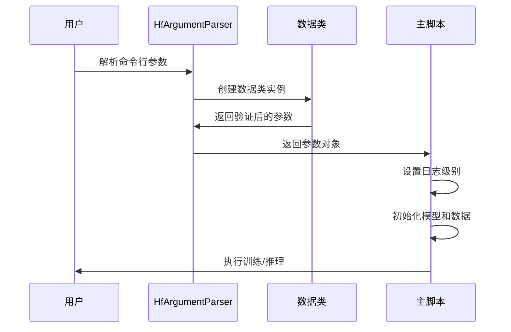

**图表来源**
- [examples/pytorch/language-modeling/run_clm.py](file://examples/pytorch/language-modeling/run_clm.py#L300-L350)

### 参数解析流程

参数解析过程包含多个步骤，确保输入的有效性和一致性：

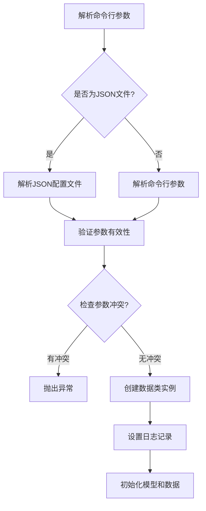

**图表来源**
- [examples/pytorch/language-modeling/run_clm.py](file://examples/pytorch/language-modeling/run_clm.py#L300-L380)

**章节来源**
- [examples/pytorch/language-modeling/run_clm.py](file://examples/pytorch/language-modeling/run_clm.py#L300-L400)

## 数据集加载与处理

### 数据集加载策略

示例脚本支持多种数据源和加载策略，包括公共数据集、本地文件和流式数据处理：

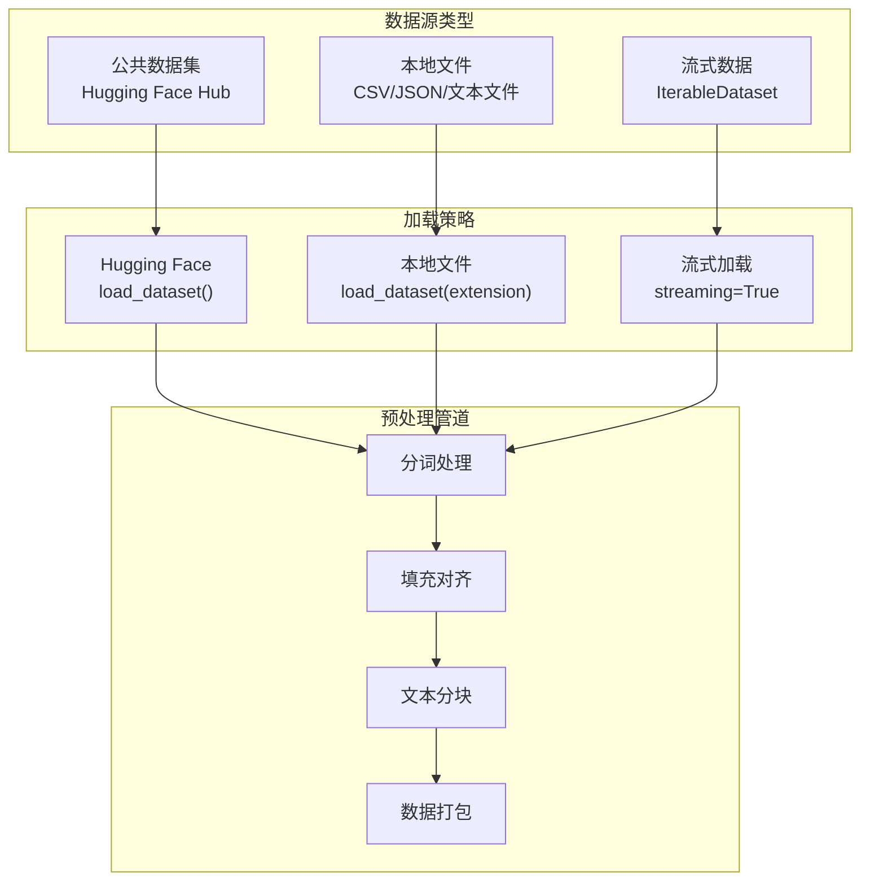

**图表来源**
- [examples/pytorch/language-modeling/run_clm.py](file://examples/pytorch/language-modeling/run_clm.py#L400-L600)

### 数据预处理流水线

数据预处理是机器学习工作流中的关键环节，示例脚本展示了完整的预处理流水线：

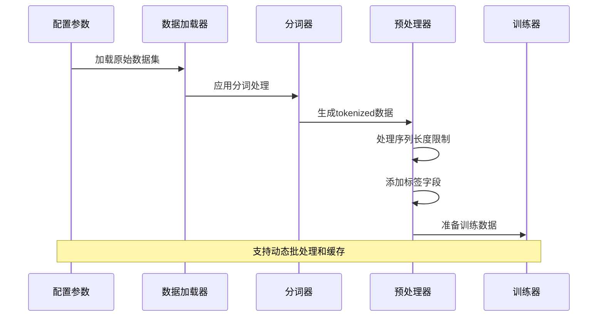

**图表来源**
- [examples/pytorch/language-modeling/run_clm.py](file://examples/pytorch/language-modeling/run_clm.py#L600-L700)

**章节来源**
- [examples/pytorch/language-modeling/run_clm.py](file://examples/pytorch/language-modeling/run_clm.py#L400-L712)

## 模型训练与评估

### Trainer API vs 自定义训练循环

Transformers提供了两种主要的训练方式：基于`Trainer` API的高级封装和自定义训练循环。

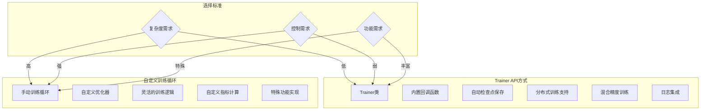

**图表来源**
- [src/transformers/trainer.py](file://src/transformers/trainer.py#L1-L200)

### 训练流程管理

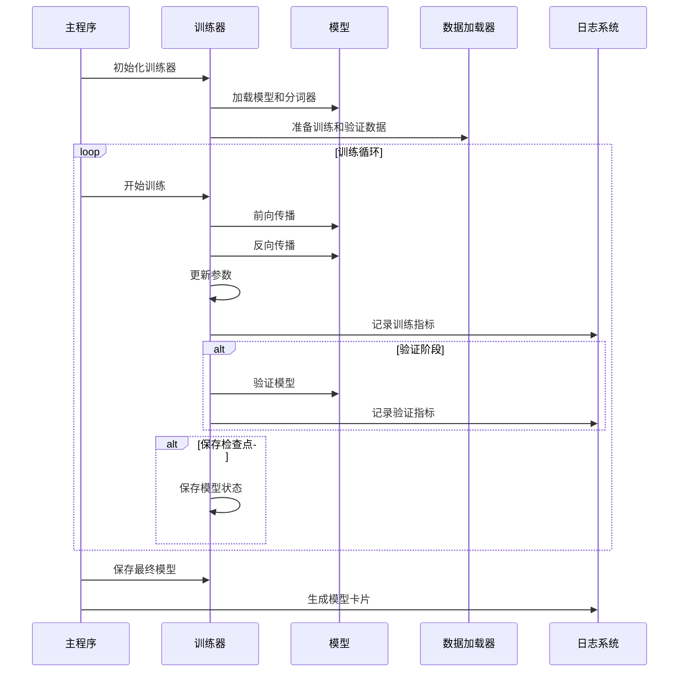

**图表来源**
- [src/transformers/trainer.py](file://src/transformers/trainer.py#L3700-L3800)

**章节来源**
- [src/transformers/trainer.py](file://src/transformers/trainer.py#L1-L200)

## 硬件兼容性

### 多硬件平台支持

Transformers示例脚本设计时充分考虑了不同硬件平台的兼容性，支持GPU、TPU、HPU等多种加速器。

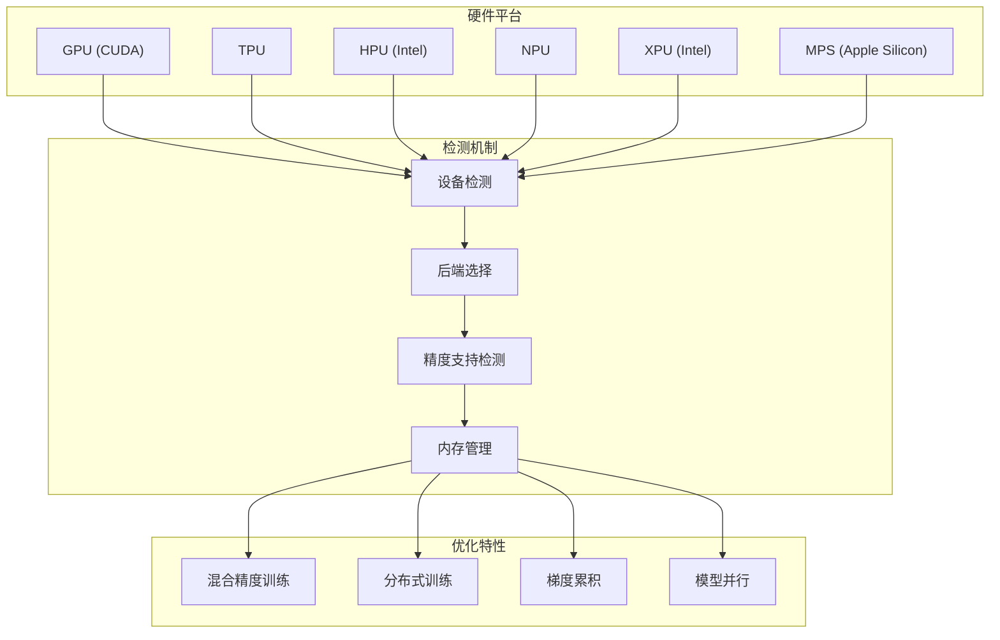

**图表来源**
- [src/transformers/utils/import_utils.py](file://src/transformers/utils/import_utils.py#L279-L449)

### 平台特定优化

不同硬件平台具有各自的优化特性和限制：

| 硬件类型 | 支持的精度 | 分布式训练 | 特殊优化 | 注意事项 |
|----------|------------|------------|----------|----------|
| NVIDIA GPU | FP16/BF16/FP32 | NCCL | Flash Attention | 需要CUDA驱动 |
| AMD GPU | FP16/BF16/FP32 | RCCL | ROCm优化 | 需要ROCm环境 |
| Google TPU | BF16/FP32 | AllReduce | XLA编译 | 需要TPU环境 |
| Intel HPU | BF16/FP32 | GLOO | Habana优化 | 需要Habana驱动 |
| Intel XPU | FP16/BF16/FP32 | GLOO | IPEX优化 | 需要IPEX库 |
| Apple MPS | FP32 | 内置 | Metal优化 | 软件模拟 |

**章节来源**
- [src/transformers/utils/import_utils.py](file://src/transformers/utils/import_utils.py#L279-L449)

## CI测试集成

### 自动化测试框架

Transformers项目使用完善的CI测试系统来确保示例脚本的质量和稳定性：

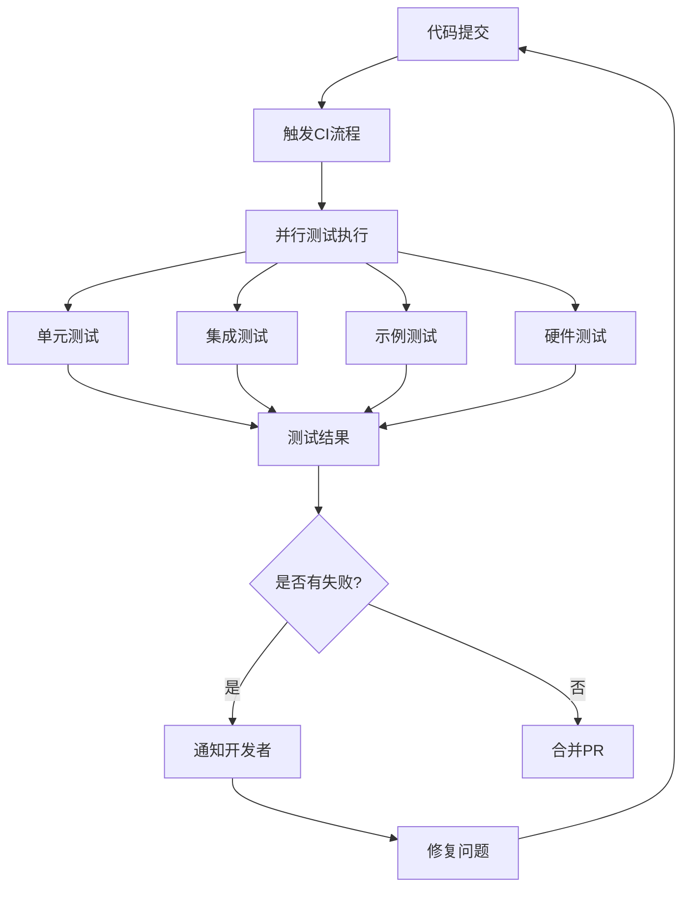

**图表来源**
- [examples/pytorch/test_pytorch_examples.py](file://examples/pytorch/test_pytorch_examples.py#L1-L100)

### 示例脚本测试策略

示例脚本测试采用多层次的方法，确保功能正确性和性能稳定性：

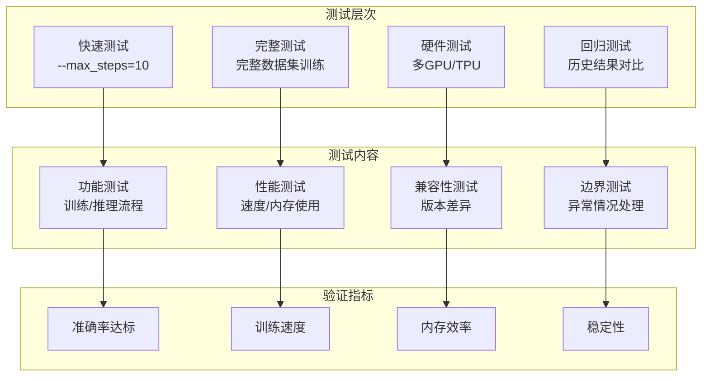

**图表来源**
- [examples/pytorch/test_pytorch_examples.py](file://examples/pytorch/test_pytorch_examples.py#L80-L200)

**章节来源**
- [examples/pytorch/test_pytorch_examples.py](file://examples/pytorch/test_pytorch_examples.py#L1-L200)

## 最佳实践

### 代码质量标准

为了确保示例脚本的质量和可维护性，遵循以下最佳实践：

```mermaid
mindmap
root((最佳实践))
结构设计
清晰的模块划分
适当的抽象层次
单一职责原则
错误处理
完善的异常捕获
友好的错误提示
渐进式验证
性能优化
内存高效使用
并行处理支持
缓存策略
文档规范
详细的README
代码注释
使用示例
兼容性
向后兼容
多版本支持
平台适配
测试覆盖
功能测试
边界测试
回归测试
```

### 代码组织原则

1. **模块化设计**：将功能分解为独立的函数和类
2. **参数验证**：在脚本开头进行参数完整性检查
3. **资源管理**：正确处理文件和内存资源
4. **日志记录**：提供详细的进度和调试信息
5. **错误恢复**：实现优雅的错误处理和恢复机制

### 性能优化建议

- 使用混合精度训练减少内存占用
- 实现梯度累积处理大数据集
- 利用数据并行和模型并行
- 启用编译优化（如torch.compile）
- 合理设置批处理大小和序列长度

### 可复现性保证

- 固定随机种子
- 记录环境信息
- 保存配置参数
- 提供基准结果

## 故障排除指南

### 常见问题及解决方案

| 问题类型 | 症状 | 可能原因 | 解决方案 |
|----------|------|----------|----------|
| 内存不足 | CUDA OOM错误 | 批处理过大 | 减少batch_size或启用gradient_checkpointing |
| 训练不收敛 | 损失不下降 | 学习率过高/过低 | 调整学习率或使用学习率调度器 |
| 数据加载慢 | 训练启动缓慢 | 预处理耗时 | 启用多进程预处理或使用缓存 |
| 硬件兼容性 | 设备检测失败 | 驱动版本不匹配 | 更新驱动或调整设备配置 |
| 权限错误 | 文件访问被拒绝 | 目录权限不足 | 修改目录权限或使用不同的输出路径 |

### 调试技巧

1. **启用详细日志**：设置`--logging_steps=1`查看每步进展
2. **使用小数据集**：先用`--max_train_samples 100`快速验证
3. **检查参数配置**：确认所有必需参数已正确设置
4. **监控资源使用**：观察CPU、GPU和内存使用情况
5. **逐步调试**：从简单场景开始，逐步增加复杂度

**章节来源**
- [examples/pytorch/README.md](file://examples/pytorch/README.md#L200-L380)

## 总结

创建高质量的示例脚本需要综合考虑代码结构、功能实现、性能优化和用户体验等多个方面。通过遵循本指南提供的最佳实践和标准流程，开发者可以创建出既实用又易于维护的示例脚本。

关键要点回顾：
- 使用Cookiecutter模板快速生成标准化脚本结构
- 遵循统一的参数解析和数据处理模式
- 根据需求选择合适的训练方式（Trainer API vs 自定义循环）
- 确保跨平台硬件兼容性
- 完善的测试覆盖和持续集成
- 详细的文档和使用说明

通过这些步骤，您可以为Transformers社区贡献有价值的示例脚本，帮助更多用户理解和使用先进的自然语言处理技术。