# 扩展开发指南

<cite>
**本文档中引用的文件**
- [templates/adding_a_new_model/README.md](file://templates/adding_a_new_model/README.md)
- [templates/adding_a_new_model/ADD_NEW_MODEL_PROPOSAL_TEMPLATE.md](file://templates/adding_a_new_model/ADD_NEW_MODEL_PROPOSAL_TEMPLATE.md)
- [templates/adding_a_new_example_script/README.md](file://templates/adding_a_new_example_script/README.md)
- [templates/adding_a_missing_tokenization_test/README.md](file://templates/adding_a_missing_tokenization_test/README.md)
- [CONTRIBUTING.md](file://CONTRIBUTING.md)
- [src/transformers/cli/add_new_model_like.py](file://src/transformers/cli/add_new_model_like.py)
- [src/transformers/cli/__init__.py](file://src/transformers/cli/__init__.py)
- [src/transformers/pipelines/base.py](file://src/transformers/pipelines/base.py)
- [src/transformers/utils/hub.py](file://src/transformers/utils/hub.py)
- [src/transformers/testing_utils.py](file://src/transformers/testing_utils.py)
- [Makefile](file://Makefile)
- [utils/modular_model_converter.py](file://utils/modular_model_converter.py)
- [examples/modular-transformers/README.md](file://examples/modular-transformers/README.md)
</cite>

## 目录
1. [简介](#简介)
2. [项目结构概览](#项目结构概览)
3. [添加新模型的完整流程](#添加新模型的完整流程)
4. [创建示例脚本](#创建示例脚本)
5. [分词器测试开发](#分词器测试开发)
6. [自定义Pipeline开发](#自定义pipeline开发)
7. [代码质量规范](#代码质量规范)
8. [Hugging Face Hub集成](#hugging-face-hub集成)
9. [调试技巧和最佳实践](#调试技巧和最佳实践)
10. [代码审查注意事项](#代码审查注意事项)
11. [总结](#总结)

## 简介

Transformers库是一个功能强大的自然语言处理库，支持数百种预训练模型。本指南将详细介绍如何为该库贡献新功能，包括添加新模型、创建示例脚本、开发自定义Pipeline等。

Transformers库采用模块化架构设计，遵循以下核心原则：
- **组合优于抽象**：优先使用组合而非复杂的继承层次
- **代码可读性优先**：即使需要重复代码也要确保清晰易懂
- **自包含设计**：每个模型文件尽可能独立完整

## 项目结构概览

Transformers库采用清晰的目录结构，主要包含以下关键部分：

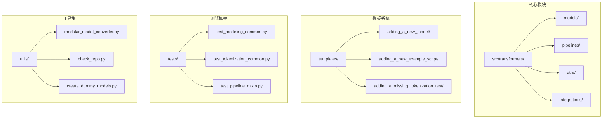

**图表来源**
- [src/transformers/cli/add_new_model_like.py](file://src/transformers/cli/add_new_model_like.py#L1-L50)
- [templates/adding_a_new_model/README.md](file://templates/adding_a_new_model/README.md#L1-L24)

## 添加新模型的完整流程

### 模型添加模板系统

Transformers提供了强大的Cookiecutter模板系统来简化新模型的添加过程。

#### 使用add_new_model_like CLI工具

```bash
# 安装依赖
pip install cookiecutter libcst

# 运行模型添加工具
python -m transformers.cli add_new_model_like
```

该工具会引导你完成以下步骤：

1. **选择基础模型**：选择一个相似的现有模型作为起点
2. **输入新模型信息**：提供新模型的名称和论文标题
3. **配置组件选项**：决定是否添加新的分词器、图像处理器等
4. **自动代码生成**：基于模板生成所有必要的文件

#### 模板文件结构

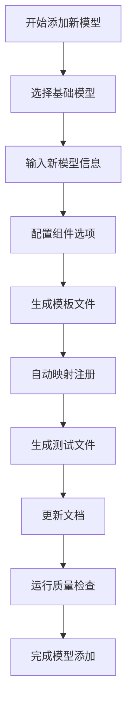

**图表来源**
- [src/transformers/cli/add_new_model_like.py](file://src/transformers/cli/add_new_model_like.py#L100-L200)

#### 关键文件生成

CLI工具会自动生成以下文件结构：

| 文件类型 | 路径 | 用途 |
|---------|------|------|
| 配置类 | `src/transformers/models/{model_name}/configuration_{model_name}.py` | 模型超参数配置 |
| 模型类 | `src/transformers/models/{model_name}/modeling_{model_name}.py` | 核心模型实现 |
| 分词器 | `src/transformers/models/{model_name}/tokenization_{model_name}.py` | 文本分词逻辑 |
| 测试文件 | `tests/models/{model_name}/test_modeling_{model_name}.py` | 模型功能测试 |
| 文档文件 | `docs/source/en/model_doc/{model_name}.md` | 模型使用文档 |

**章节来源**
- [src/transformers/cli/add_new_model_like.py](file://src/transformers/cli/add_new_model_like.py#L300-L400)

### 模型架构设计原则

#### 继承层次结构

Transformers采用简洁的继承模式：

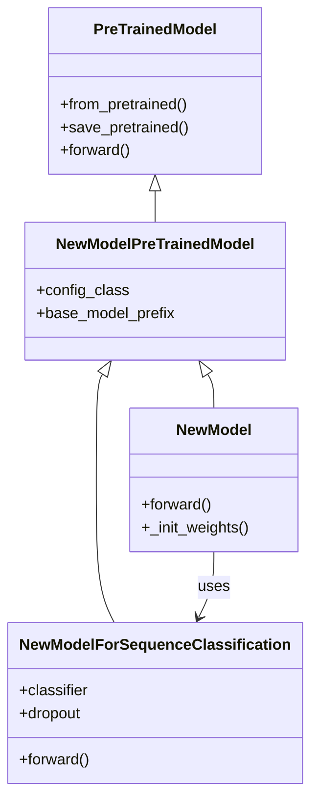

**图表来源**
- [src/transformers/cli/add_new_model_like.py](file://src/transformers/cli/add_new_model_like.py#L150-L250)

#### 模块化架构模式

从版本4.30开始，Transformers引入了模块化架构模式：

```mermaid
flowchart LR
A[modular_{model}.py] --> B[模块化转换器]
B --> C[modeling_{model}.py]
B --> D[configuration_{model}.py]
B --> E[tokenization_{model}.py]
B --> F[测试文件]
G[自动导入结构] --> H[延迟加载机制]
```

**图表来源**
- [utils/modular_model_converter.py](file://utils/modular_model_converter.py#L1-L50)
- [examples/modular-transformers/README.md](file://examples/modular-transformers/README.md#L1-L20)

**章节来源**
- [templates/adding_a_new_model/ADD_NEW_MODEL_PROPOSAL_TEMPLATE.md](file://templates/adding_a_new_model/ADD_NEW_MODEL_PROPOSAL_TEMPLATE.md#L50-L150)

## 创建示例脚本

### 示例脚本模板系统

Transformers提供了专门的模板来帮助创建高质量的示例脚本。

#### 使用模板创建新示例

```bash
# 进入examples目录
cd examples

# 使用模板生成新示例
cookiecutter ../templates/adding_a_new_example_script/
```

#### 模板配置选项

模板会询问以下问题：

| 问题 | 描述 | 示例回答 |
|------|------|----------|
| `directory_name` | 新示例的目录名 | `text-classification-custom` |
| `task_name` | 任务名称 | `Text Classification` |
| `model_name` | 使用的模型 | `bert-base-uncased` |
| `data_path` | 数据路径 | `./data/custom_dataset.csv` |

#### 示例脚本结构

生成的示例脚本应包含以下结构：

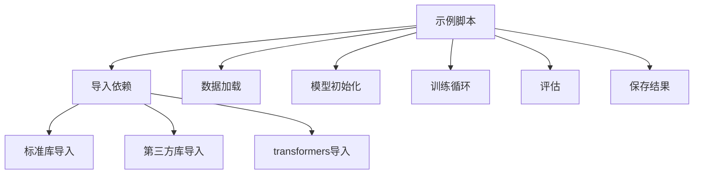

**图表来源**
- [templates/adding_a_new_example_script/README.md](file://templates/adding_a_new_example_script/README.md#L15-L39)

**章节来源**
- [templates/adding_a_new_example_script/README.md](file://templates/adding_a_new_example_script/README.md#L1-L39)

## 分词器测试开发

### 缺失分词器测试模板

当需要为缺失的分词器添加测试时，可以使用专门的模板。

#### 使用模板生成测试文件

```bash
# 安装开发依赖
pip install -e ".[dev]"

# 生成测试模板
cookiecutter path-to-adding_a_missing_tokenization_test/
```

#### 测试覆盖范围

分词器测试应涵盖以下方面：

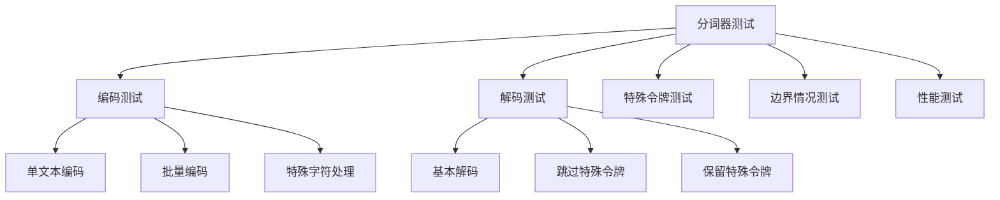

#### 测试验证要点

| 测试类别 | 验证内容 | 实现方法 |
|----------|----------|----------|
| 基础功能 | 编码解码一致性 | `tokenizer.encode(text) == tokenizer.decode(ids)` |
| 特殊令牌 | `[CLS]`, `[SEP]`等处理 | 检查特殊令牌位置和数量 |
| 边界情况 | 空字符串、长文本、特殊字符 | 测试各种输入边界 |
| 性能基准 | 与参考实现对比 | 使用相同输入验证输出差异 < 0.001 |

**章节来源**
- [templates/adding_a_missing_tokenization_test/README.md](file://templates/adding_a_missing_tokenization_test/README.md#L1-L40)

## 自定义Pipeline开发

### Pipeline架构概述

Transformers的Pipeline系统提供了统一的接口来处理各种NLP任务。

#### Pipeline组件结构

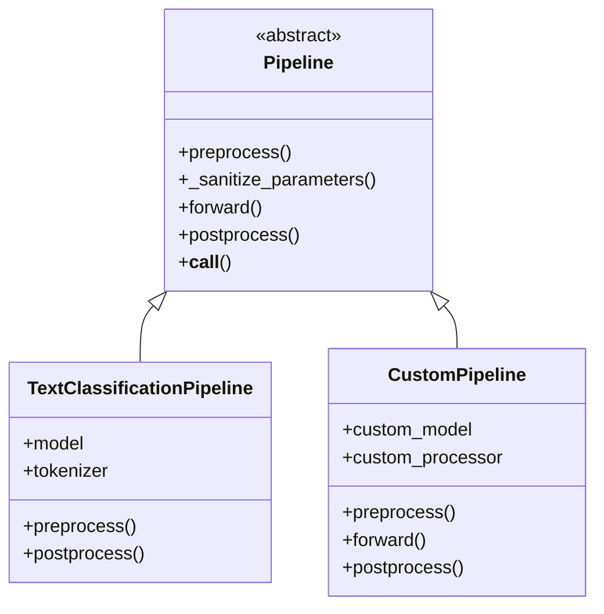

**图表来源**
- [src/transformers/pipelines/base.py](file://src/transformers/pipelines/base.py#L100-L200)

#### 自定义Pipeline开发流程

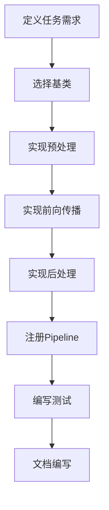

#### 处理器开发

对于多模态任务，可能需要自定义处理器：

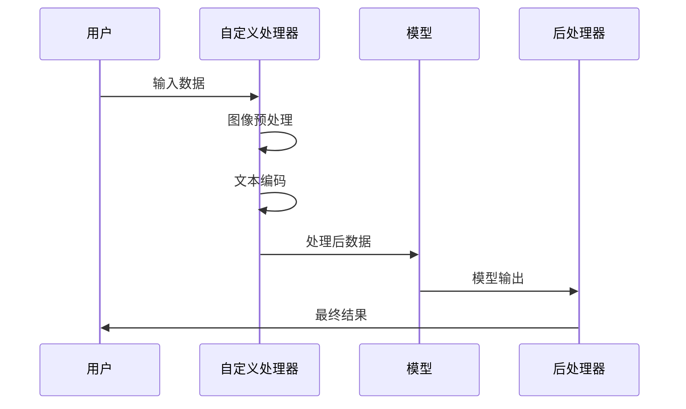

**图表来源**
- [src/transformers/pipelines/base.py](file://src/transformers/pipelines/base.py#L400-L500)

**章节来源**
- [src/transformers/pipelines/base.py](file://src/transformers/pipelines/base.py#L355-L402)

## 代码质量规范

### 代码风格和格式化

Transformers使用Ruff进行代码质量和格式化检查。

#### 质量检查命令

```bash
# 运行完整质量检查
make quality

# 自动修复可修复的问题
make fixup

# 仅格式化代码
make style

# 检查复制代码的一致性
make fix-copies
```

#### 代码质量检查项目

| 检查项目 | 工具 | 目的 |
|----------|------|------|
| 语法检查 | Ruff | 发现语法错误和潜在问题 |
| 格式化 | Ruff | 统一代码风格 |
| 导入排序 | 自动脚本 | 清理导入语句 |
| 文档字符串 | 自动脚本 | 确保文档完整性 |
| 类型注解 | 自动脚本 | 验证类型标注 |

#### 命名约定

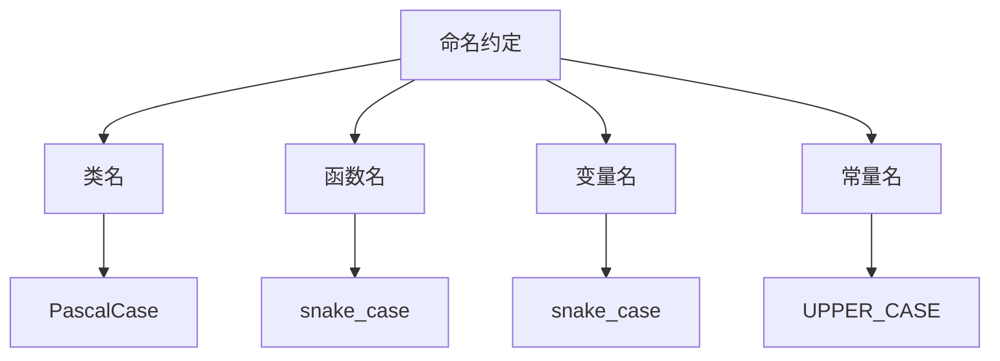

**图表来源**
- [Makefile](file://Makefile#L50-L80)

**章节来源**
- [Makefile](file://Makefile#L1-L50)
- [CONTRIBUTING.md](file://CONTRIBUTING.md#L400-L500)

## Hugging Face Hub集成

### 模型上传和版本管理

#### 模型上传流程

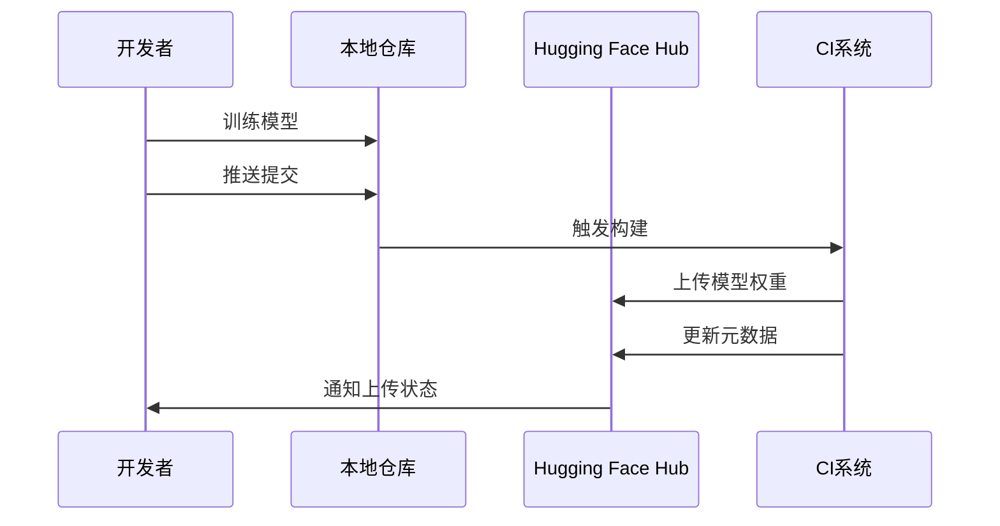

#### 上传工具使用

```python
# 基本上传
model.push_to_hub("my-username/my-model")

# 带描述的上传
model.push_to_hub(
    "my-username/my-model",
    commit_message="Add model",
    create_pr=True
)

# 分支管理
model.push_to_hub(
    "my-username/my-model",
    revision="experimental",
    create_pr=True
)
```

#### 版本控制最佳实践

| 实践 | 描述 | 示例 |
|------|------|------|
| 标签发布 | 使用语义化版本标签 | `v1.0.0`, `v1.1.0` |
| 分支策略 | 主分支稳定，实验分支开发 | `main`, `experimental` |
| 提交消息 | 清晰描述变更内容 | `feat: add new model architecture` |
| 元数据更新 | 包含模型指标和使用示例 | `metrics`, `usage` |

**章节来源**
- [src/transformers/utils/hub.py](file://src/transformers/utils/hub.py#L732-L836)

## 调试技巧和最佳实践

### 调试环境设置

#### 开发环境配置

```bash
# 创建虚拟环境
python -m venv transformers-dev
source transformers-dev/bin/activate

# 安装开发依赖
pip install -e ".[dev]"

# 安装质量检查工具
pip install -e ".[quality]"
```

#### 调试常用命令

```bash
# 运行特定测试
pytest tests/models/new_model/test_modeling_new_model.py::NewModelTest::test_forward_pass

# 运行慢速测试
RUN_SLOW=1 python -m pytest tests/models/new_model/

# 调试模式运行
python -m pdb src/transformers/models/new_model/modeling_new_model.py
```

### 调试策略

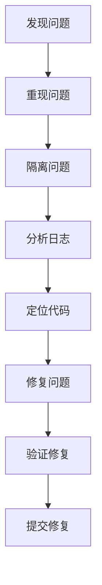

#### 调试工具推荐

| 工具 | 用途 | 使用场景 |
|------|------|----------|
| `pdb` | Python调试器 | 行级调试 |
| `print()` | 简单调试 | 快速验证 |
| `unittest.mock` | 模拟对象 | 单元测试 |
| `pytest` | 测试框架 | 集成测试 |
| `coverage` | 覆盖率分析 | 测试完整性 |

**章节来源**
- [src/transformers/testing_utils.py](file://src/transformers/testing_utils.py#L1-L100)

## 代码审查注意事项

### 审查清单

#### 功能性检查

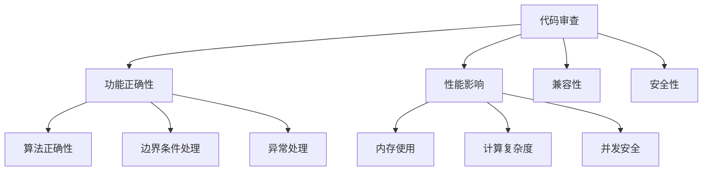

#### 代码质量检查

| 检查项 | 重要性 | 检查要点 |
|--------|--------|----------|
| 文档字符串 | 高 | 完整的功能描述和参数说明 |
| 类型注解 | 高 | 正确的类型标注 |
| 错误处理 | 高 | 适当的异常捕获和处理 |
| 测试覆盖率 | 中 | 关键功能有对应测试 |
| 代码风格 | 中 | 符合项目风格指南 |

#### 性能考虑

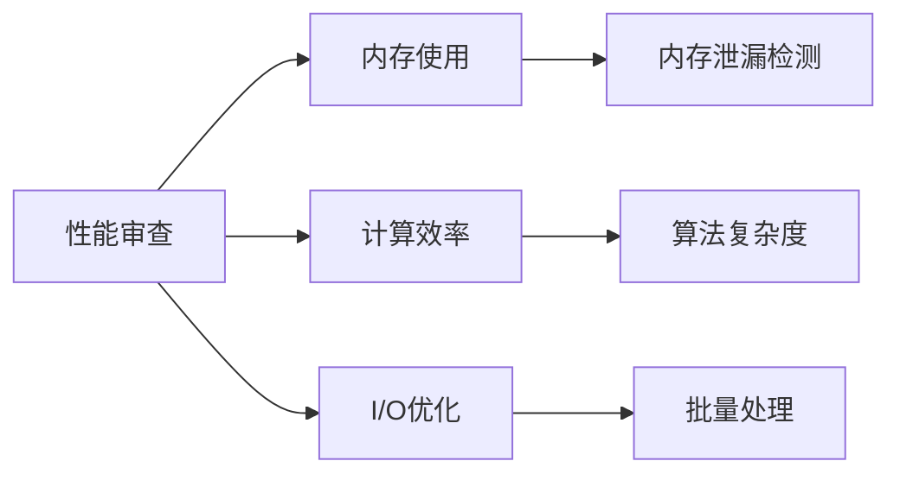

**章节来源**
- [CONTRIBUTING.md](file://CONTRIBUTING.md#L300-L400)

## 总结

Transformers库的扩展开发涉及多个方面，从模型添加到Pipeline开发，每个环节都有其特定的要求和最佳实践。

### 关键成功因素

1. **遵循架构原则**：保持简洁的继承层次和模块化设计
2. **严格的质量控制**：使用自动化工具确保代码质量
3. **完善的测试覆盖**：确保功能正确性和稳定性
4. **清晰的文档**：提供详细的使用说明和技术文档
5. **社区协作**：积极参与讨论和代码审查

### 下一步建议

- 从简单的模型添加开始，逐步掌握整个开发流程
- 参考现有的高质量模型实现，学习最佳实践
- 积极参与社区讨论，获取反馈和建议
- 持续关注最新的技术发展和库更新

通过遵循本指南的建议和最佳实践，您将能够为Transformers库贡献高质量的扩展功能，推动整个社区的发展。