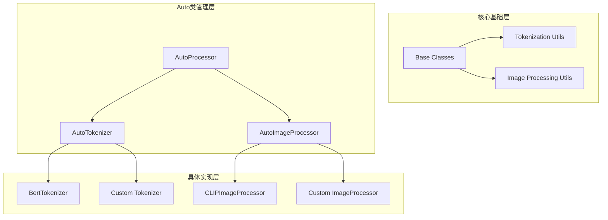
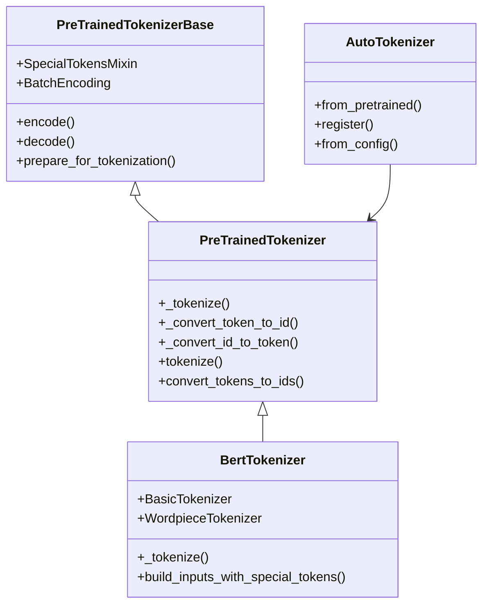
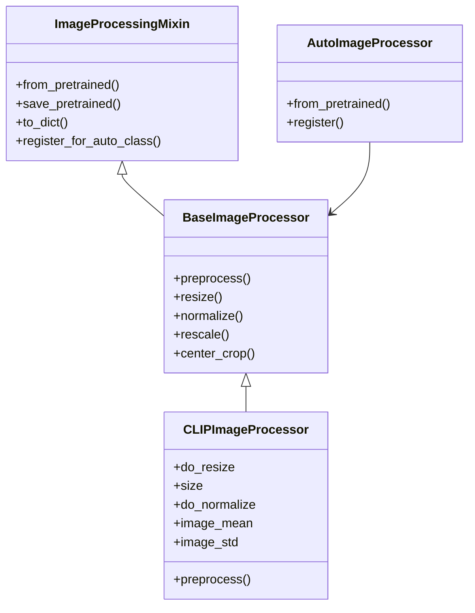

# 分词器与图像处理器实现指南

<cite>
**本文档引用的文件**
- [tokenization_utils_base.py](file://src/transformers/tokenization_utils_base.py)
- [tokenization_utils.py](file://src/transformers/tokenization_utils.py)
- [image_processing_base.py](file://src/transformers/image_processing_base.py)
- [image_processing_utils.py](file://src/transformers/image_processing_utils.py)
- [tokenization_auto.py](file://src/transformers/models/auto/tokenization_auto.py)
- [image_processing_auto.py](file://src/transformers/models/auto/image_processing_auto.py)
- [bert/tokenization_bert.py](file://src/transformers/models/bert/tokenization_bert.py)
- [clip/image_processing_clip.py](file://src/transformers/models/clip/image_processing_clip.py)
- [auto_factory.py](file://src/transformers/models/auto/auto_factory.py)
</cite>

## 目录
1. [简介](#简介)
2. [项目结构概览](#项目结构概览)
3. [核心组件分析](#核心组件分析)
4. [分词器实现指南](#分词器实现指南)
5. [图像处理器实现指南](#图像处理器实现指南)
6. [Auto类注册机制](#auto类注册机制)
7. [最佳实践与模式](#最佳实践与模式)
8. [故障排除指南](#故障排除指南)
9. [总结](#总结)

## 简介

Transformers库提供了强大的分词器（Tokenizer）和图像处理器（ImageProcessor）框架，支持多种模态的数据预处理。本指南详细说明了如何为新模型创建自定义分词器或图像处理器，包括继承相应基类、实现关键方法以及注册到Auto类中的完整流程。

## 项目结构概览

Transformers库采用模块化设计，将不同功能分离到独立的模块中：



**图表来源**
- [tokenization_utils_base.py](file://src/transformers/tokenization_utils_base.py#L1-L50)
- [image_processing_base.py](file://src/transformers/image_processing_base.py#L1-L50)

## 核心组件分析

### 分词器核心架构

分词器系统基于以下核心层次结构：



**图表来源**
- [tokenization_utils_base.py](file://src/transformers/tokenization_utils_base.py#L800-L1200)
- [tokenization_utils.py](file://src/transformers/tokenization_utils.py#L406-L1076)

### 图像处理器核心架构

图像处理器系统采用类似的分层设计：



**图表来源**
- [image_processing_base.py](file://src/transformers/image_processing_base.py#L40-L170)
- [image_processing_utils.py](file://src/transformers/image_processing_utils.py#L38-L170)

**章节来源**
- [tokenization_utils_base.py](file://src/transformers/tokenization_utils_base.py#L800-L1200)
- [image_processing_base.py](file://src/transformers/image_processing_base.py#L40-L170)

## 分词器实现指南

### 继承基类

创建自定义分词器需要继承`PreTrainedTokenizer`基类：

```python
from transformers import PreTrainedTokenizer

class CustomTokenizer(PreTrainedTokenizer):
    def __init__(self, vocab_file, **kwargs):
        # 初始化词汇表和特殊token
        self.vocab = load_vocab(vocab_file)
        self.ids_to_tokens = {v: k for k, v in self.vocab.items()}
        
        # 设置特殊token
        super().__init__(
            unk_token="[UNK]",
            sep_token="[SEP]",
            pad_token="[PAD]",
            cls_token="[CLS]",
            mask_token="[MASK]",
            **kwargs
        )
```

### 实现关键方法

#### tokenize方法

`tokenize`方法是分词器的核心，负责将文本转换为token列表：

```python
def _tokenize(self, text, split_special_tokens=False):
    """实现具体的分词逻辑"""
    split_tokens = []
    
    if self.do_basic_tokenize:
        for token in self.basic_tokenizer.tokenize(
            text, 
            never_split=self.all_special_tokens if not split_special_tokens else None
        ):
            if token in self.basic_tokenizer.never_split:
                split_tokens.append(token)
            else:
                split_tokens += self.wordpiece_tokenizer.tokenize(token)
    else:
        split_tokens = self.wordpiece_tokenizer.tokenize(text)
    
    return split_tokens
```

#### 特殊token处理

特殊token的处理是分词器的重要特性：

```python
@property
def special_tokens_map(self):
    """返回特殊token映射"""
    return {
        "unk_token": self.unk_token,
        "sep_token": self.sep_token,
        "pad_token": self.pad_token,
        "cls_token": self.cls_token,
        "mask_token": self.mask_token,
    }

@property
def all_special_tokens(self):
    """返回所有特殊token列表"""
    return [
        str(self.unk_token),
        str(self.sep_token),
        str(self.pad_token),
        str(self.cls_token),
        str(self.mask_token),
    ]
```

### 预处理逻辑实现

分词器支持灵活的预处理配置：

```python
def prepare_for_tokenization(self, text, is_split_into_words=False, **kwargs):
    """在分词前进行预处理"""
    # 文本清理和标准化
    text = text.strip()
    
    # 处理特殊字符
    if self.do_lower_case:
        text = text.lower()
    
    return text, kwargs
```

**章节来源**
- [bert/tokenization_bert.py](file://src/transformers/models/bert/tokenization_bert.py#L80-L200)
- [tokenization_utils.py](file://src/transformers/tokenization_utils.py#L600-L800)

## 图像处理器实现指南

### 继承基类

创建自定义图像处理器需要继承`BaseImageProcessor`基类：

```python
from transformers import BaseImageProcessor

class CustomImageProcessor(BaseImageProcessor):
    def __init__(self, 
                 do_resize=True,
                 size={"height": 224, "width": 224},
                 do_normalize=True,
                 image_mean=[0.485, 0.456, 0.406],
                 image_std=[0.229, 0.224, 0.225],
                 **kwargs):
        super().__init__(**kwargs)
        
        self.do_resize = do_resize
        self.size = size
        self.do_normalize = do_normalize
        self.image_mean = image_mean
        self.image_std = image_std
```

### 实现预处理方法

#### preprocess方法

`preprocess`方法是图像处理器的核心，负责完整的图像预处理流程：

```python
def preprocess(self, images, **kwargs):
    """实现图像预处理流程"""
    # 参数验证和默认值设置
    do_resize = kwargs.pop("do_resize", self.do_resize)
    size = kwargs.pop("size", self.size)
    do_normalize = kwargs.pop("do_normalize", self.do_normalize)
    image_mean = kwargs.pop("image_mean", self.image_mean)
    image_std = kwargs.pop("image_std", self.image_std)
    
    # 批量处理图像
    processed_images = []
    for image in images:
        # 调整大小
        if do_resize:
            image = self.resize(image, size)
        
        # 归一化
        if do_normalize:
            image = self.normalize(image, image_mean, image_std)
        
        processed_images.append(image)
    
    # 创建BatchFeature对象
    return BatchFeature(data={"pixel_values": processed_images})
```

#### 核心图像变换方法

```python
def resize(self, image, size, resample=PILImageResampling.BICUBIC):
    """调整图像大小"""
    output_size = get_resize_output_image_size(image, size)
    return resize(image, output_size, resample)

def normalize(self, image, mean, std):
    """归一化图像"""
    return normalize(image, mean, std)

def rescale(self, image, scale):
    """重新缩放像素值"""
    return rescale(image, scale)
```

### 配置管理

图像处理器支持灵活的配置管理：

```python
def to_dict(self):
    """序列化处理器配置"""
    output = super().to_dict()
    output.update({
        "do_resize": self.do_resize,
        "size": self.size,
        "do_normalize": self.do_normalize,
        "image_mean": self.image_mean,
        "image_std": self.image_std,
    })
    return output
```

**章节来源**
- [clip/image_processing_clip.py](file://src/transformers/models/clip/image_processing_clip.py#L50-L200)
- [image_processing_utils.py](file://src/transformers/image_processing_utils.py#L40-L200)

## Auto类注册机制

### 注册自定义分词器

使用`register_for_auto_class`方法注册自定义分词器：

```python
from transformers import AutoTokenizer

class CustomTokenizer(PreTrainedTokenizer):
    # 分词器实现...
    
    @classmethod
    def register_for_auto_class(cls, auto_class="AutoTokenizer"):
        """注册到AutoTokenizer"""
        if not isinstance(auto_class, str):
            auto_class = auto_class.__name__
        
        import transformers.models.auto as auto_module
        if not hasattr(auto_module, auto_class):
            raise ValueError(f"{auto_class} is not a valid auto class.")
        
        cls._auto_class = auto_class
```

### 注册自定义图像处理器

```python
from transformers import AutoImageProcessor

class CustomImageProcessor(BaseImageProcessor):
    # 图像处理器实现...
    
    @classmethod
    def register_for_auto_class(cls, auto_class="AutoImageProcessor"):
        """注册到AutoImageProcessor"""
        if not isinstance(auto_class, str):
            auto_class = auto_class.__name__
        
        import transformers.models.auto as auto_module
        if not hasattr(auto_module, auto_class):
            raise ValueError(f"{auto_class} is not a valid auto class.")
        
        cls._auto_class = auto_class
```

### 全局注册机制

Auto类支持全局注册新的处理器：

```python
# 在模型配置中注册
from transformers import AutoConfig, AutoTokenizer

# 注册配置类和分词器类的映射
AutoConfig.register("custom_model", CustomConfig)
AutoTokenizer.register(CustomConfig, CustomTokenizer)

# 使用Auto类加载
tokenizer = AutoTokenizer.from_pretrained("path/to/custom/model")
```

**章节来源**
- [tokenization_auto.py](file://src/transformers/models/auto/tokenization_auto.py#L922-L1193)
- [image_processing_auto.py](file://src/transformers/models/auto/image_processing_auto.py#L338-L654)

## 最佳实践与模式

### 特殊token处理模式

#### 安全的特殊token定义

```python
def __init__(self, **kwargs):
    # 使用AddedToken确保特殊token行为正确
    self.bos_token = AddedToken("<bos>", lstrip=False, rstrip=False)
    self.eos_token = AddedToken("<eos>", lstrip=False, rstrip=False)
    self.pad_token = AddedToken("<pad>", lstrip=False, rstrip=False)
    self.unk_token = AddedToken("<unk>", lstrip=False, rstrip=False)
    
    super().__init__(
        bos_token=self.bos_token,
        eos_token=self.eos_token,
        pad_token=self.pad_token,
        unk_token=self.unk_token,
        **kwargs
    )
```

#### 动态添加特殊token

```python
def add_special_tokens(self, special_tokens_dict):
    """安全地添加特殊token"""
    return self.add_tokens(special_tokens_dict, special_tokens=True)
```

### 预处理流水线模式

#### 可配置的预处理流程

```python
def preprocess(self, images, **kwargs):
    """可配置的预处理流水线"""
    # 默认参数
    default_params = {
        "do_resize": True,
        "size": {"height": 224, "width": 224},
        "do_center_crop": True,
        "crop_size": {"height": 224, "width": 224},
        "do_rescale": True,
        "rescale_factor": 1/255,
        "do_normalize": True,
        "image_mean": [0.485, 0.456, 0.406],
        "image_std": [0.229, 0.224, 0.225],
    }
    
    # 合并用户参数和默认参数
    params = {**default_params, **kwargs}
    
    # 流水线执行
    if params["do_resize"]:
        images = [self.resize(img, params["size"]) for img in images]
    
    if params["do_center_crop"]:
        images = [self.center_crop(img, params["crop_size"]) for img in images]
    
    if params["do_rescale"]:
        images = [self.rescale(img, params["rescale_factor"]) for img in images]
    
    if params["do_normalize"]:
        images = [self.normalize(img, params["image_mean"], params["image_std"]) for img in images]
    
    return BatchFeature(data={"pixel_values": images})
```

### 错误处理和验证

#### 输入验证模式

```python
def preprocess(self, images, **kwargs):
    """包含输入验证的预处理"""
    # 验证输入类型
    if not isinstance(images, (list, tuple)):
        raise ValueError("Images must be a list or tuple")
    
    if not images:
        raise ValueError("Images list cannot be empty")
    
    # 验证尺寸参数
    size = kwargs.get("size", self.size)
    if not isinstance(size, dict):
        raise ValueError("Size must be a dictionary")
    
    if "height" not in size or "width" not in size:
        raise ValueError("Size must contain 'height' and 'width'")
    
    # 验证图像格式
    for i, image in enumerate(images):
        if not is_valid_image(image):
            raise ValueError(f"Image {i} is not a valid image")
    
    # 执行预处理...
```

### 性能优化模式

#### 批量处理优化

```python
def preprocess(self, images, **kwargs):
    """批量处理优化版本"""
    # 检查是否需要批量处理
    if len(images) > 1:
        # 使用向量化操作（如果可能）
        if hasattr(self, '_preprocess_batch'):
            return self._preprocess_batch(images, **kwargs)
    
    # 单个图像处理
    processed_images = []
    for image in images:
        processed_images.append(self._preprocess_single(image, **kwargs))
    
    return BatchFeature(data={"pixel_values": processed_images})
```

## 故障排除指南

### 常见问题及解决方案

#### 分词器相关问题

**问题：特殊token无法正确识别**
```python
# 错误做法
tokenizer.add_tokens(["[NEW_TOKEN]"])  # 可能不会正确处理特殊token

# 正确做法
from tokenizers import AddedToken
tokenizer.add_tokens([AddedToken("[NEW_TOKEN]", special=True)])
```

**问题：编码不一致**
```python
# 确保编码一致性
def encode(self, text, **kwargs):
    tokens = self.tokenize(text, **kwargs)
    return self.convert_tokens_to_ids(tokens)
```

#### 图像处理器相关问题

**问题：图像维度不匹配**
```python
# 错误做法
def preprocess(self, images, **kwargs):
    # 忘记处理通道维度
    return BatchFeature(data={"pixel_values": images})

# 正确做法
def preprocess(self, images, **kwargs):
    processed_images = []
    for image in images:
        # 确保图像有正确的通道维度
        image = self._ensure_correct_channels(image)
        processed_images.append(image)
    
    return BatchFeature(data={"pixel_values": processed_images})
```

**问题：内存使用过高**
```python
# 优化内存使用
def preprocess(self, images, **kwargs):
    # 使用生成器避免一次性加载所有图像
    def process_images():
        for image in images:
            yield self._preprocess_single(image, **kwargs)
    
    return BatchFeature(data={"pixel_values": list(process_images())})
```

### 调试技巧

#### 添加调试信息

```python
def preprocess(self, images, **kwargs):
    logger.info(f"Processing {len(images)} images with params: {kwargs}")
    
    # 记录中间结果
    for i, image in enumerate(images):
        logger.debug(f"Original image {i} shape: {image.shape}")
    
    # 执行预处理...
    
    for i, processed in enumerate(processed_images):
        logger.debug(f"Processed image {i} shape: {processed.shape}")
    
    return BatchFeature(data={"pixel_values": processed_images})
```

**章节来源**
- [tokenization_utils_base.py](file://src/transformers/tokenization_utils_base.py#L800-L1200)
- [image_processing_base.py](file://src/transformers/image_processing_base.py#L40-L170)

## 总结

本指南详细介绍了Transformers库中分词器和图像处理器的实现方法。关键要点包括：

1. **继承适当的基类**：分词器继承`PreTrainedTokenizer`，图像处理器继承`BaseImageProcessor`
2. **实现核心方法**：分词器需要实现`_tokenize`方法，图像处理器需要实现`preprocess`方法
3. **特殊token处理**：使用`AddedToken`确保特殊token行为正确
4. **Auto类注册**：通过`register_for_auto_class`方法注册自定义处理器
5. **配置管理**：实现灵活的配置管理和序列化
6. **性能优化**：考虑批量处理和内存使用优化
7. **错误处理**：添加适当的输入验证和错误处理

遵循这些最佳实践，可以创建高质量、可维护且高性能的自定义分词器和图像处理器，为新模型提供完整的数据预处理能力。