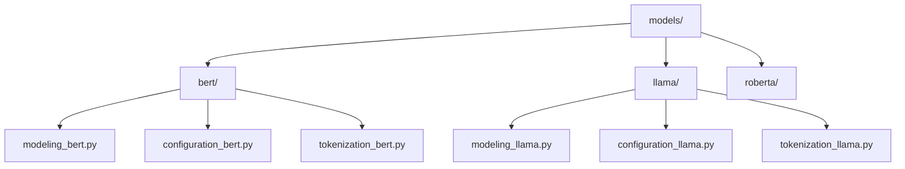
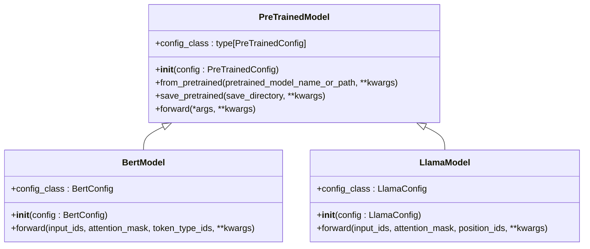
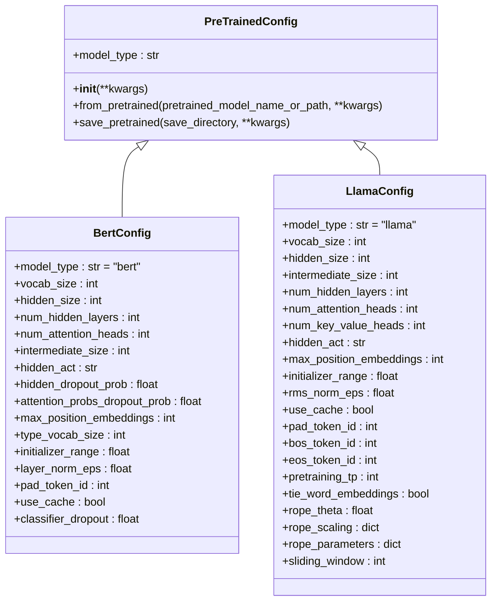
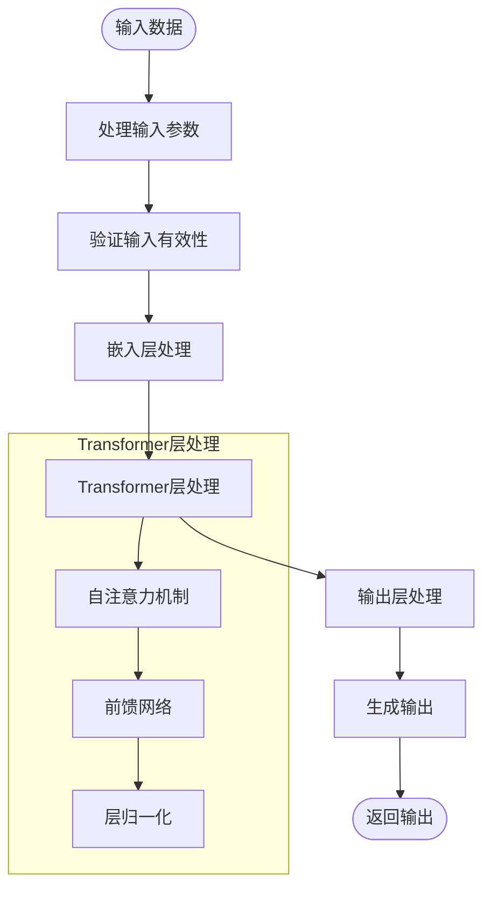
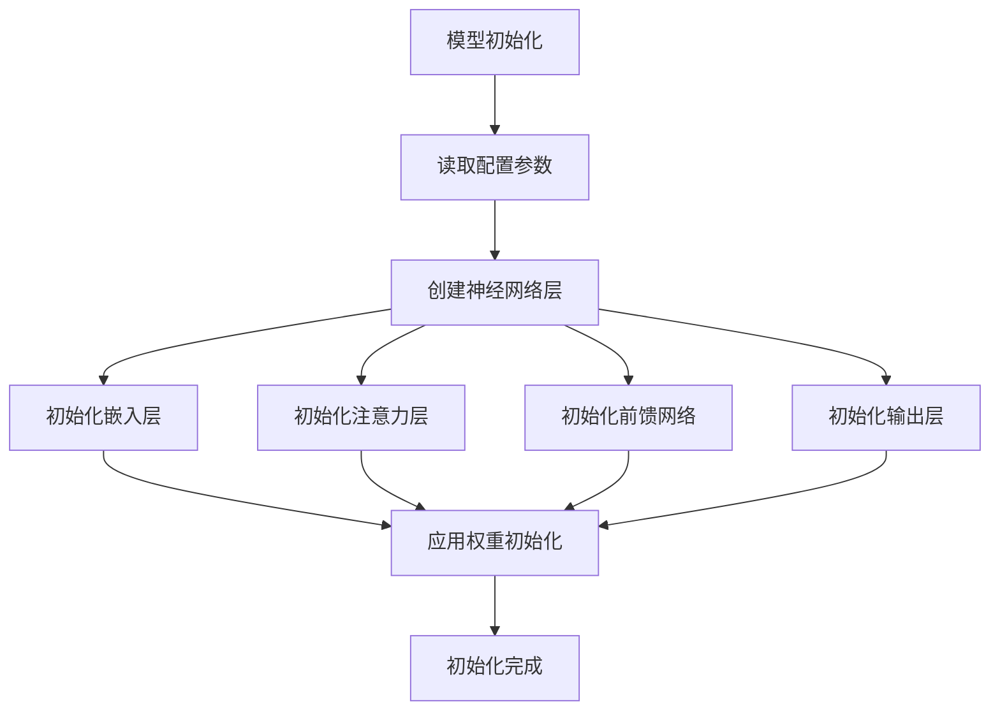
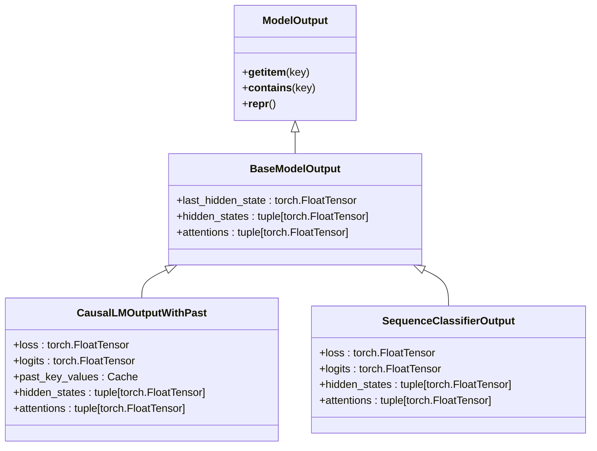
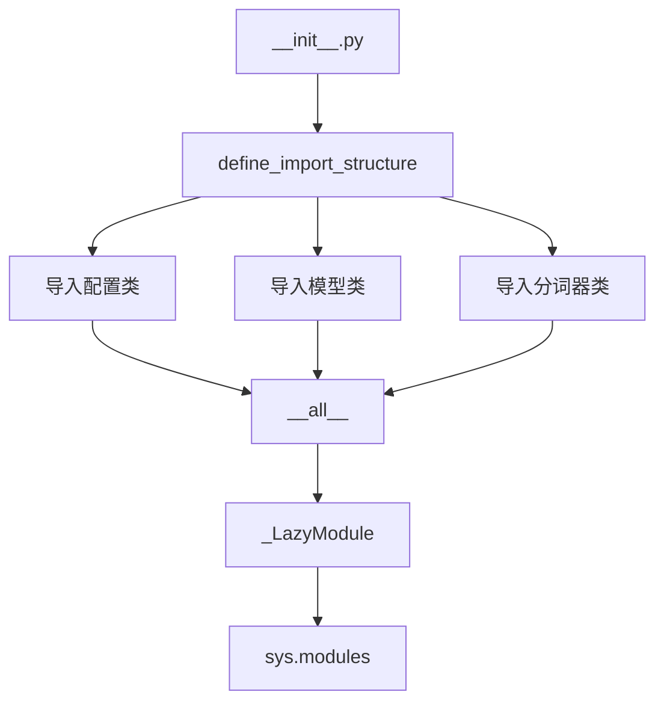

# 模型定义

<cite>
**本文档中引用的文件**  
- [modeling_utils.py](file://src/transformers/modeling_utils.py#L1-L5420)
- [configuration_utils.py](file://src/transformers/configuration_utils.py#L1-L1297)
- [modeling_bert.py](file://src/transformers/models/bert/modeling_bert.py#L1-L1461)
- [configuration_bert.py](file://src/transformers/models/bert/configuration_bert.py#L1-L127)
- [modeling_llama.py](file://src/transformers/models/llama/modeling_llama.py#L1-L533)
- [configuration_llama.py](file://src/transformers/models/llama/configuration_llama.py#L1-L127)
- [__init__.py](file://src/transformers/models/__init__.py#L1-L400)
- [modeling_outputs.py](file://src/transformers/modeling_outputs.py#L1-L1718)
</cite>

## 目录
1. [项目结构](#项目结构)
2. [模型类定义](#模型类定义)
3. [模型配置类](#模型配置类)
4. [前向传播实现](#前向传播实现)
5. [初始化与权重初始化](#初始化与权重初始化)
6. [输出处理](#输出处理)
7. [模型导出](#模型导出)
8. [代码风格与规范](#代码风格与规范)

## 项目结构

transformers库中的模型实现在`src/transformers/models/`目录下组织，每个模型都有独立的子目录。每个模型目录包含多个核心文件：模型定义文件（modeling_*.py）、配置文件（configuration_*.py）、分词器文件（tokenization_*.py）等。这种模块化结构使得新模型的添加遵循一致的模式。

**图示来源**
- [modeling_bert.py](file://src/transformers/models/bert/modeling_bert.py#L1-L1461)
- [configuration_bert.py](file://src/transformers/models/bert/configuration_bert.py#L1-L127)
- [modeling_llama.py](file://src/transformers/models/llama/modeling_llama.py#L1-L533)
- [configuration_llama.py](file://src/transformers/models/llama/configuration_llama.py#L1-L127)

**本节来源**
- [modeling_bert.py](file://src/transformers/models/bert/modeling_bert.py#L1-L1461)
- [configuration_bert.py](file://src/transformers/models/bert/configuration_bert.py#L1-L127)

## 模型类定义

在transformers库中，所有模型类都继承自`PreTrainedModel`基类。这个基类提供了模型加载、保存、序列化等核心功能。模型类通过`config_class`属性指定其对应的配置类，确保模型与配置之间的紧密耦合。

**图示来源**
- [modeling_utils.py](file://src/transformers/modeling_utils.py#L1-L5420)
- [modeling_bert.py](file://src/transformers/models/bert/modeling_bert.py#L1-L1461)
- [modeling_llama.py](file://src/transformers/models/llama/modeling_llama.py#L1-L533)

**本节来源**
- [modeling_utils.py](file://src/transformers/modeling_utils.py#L1-L5420)
- [modeling_bert.py](file://src/transformers/models/bert/modeling_bert.py#L1-L1461)

## 模型配置类

模型配置类继承自`PreTrainedConfig`基类，用于存储模型的所有超参数和配置选项。配置类定义了模型架构的关键参数，如隐藏层大小、注意力头数、层数等。每个配置类通过`model_type`属性标识其对应的模型类型，这对于自动模型加载机制至关重要。

**图示来源**
- [configuration_utils.py](file://src/transformers/configuration_utils.py#L1-L1297)
- [configuration_bert.py](file://src/transformers/models/bert/configuration_bert.py#L1-L127)
- [configuration_llama.py](file://src/transformers/models/llama/configuration_llama.py#L1-L127)

**本节来源**
- [configuration_utils.py](file://src/transformers/configuration_utils.py#L1-L1297)
- [configuration_bert.py](file://src/transformers/models/bert/configuration_bert.py#L1-L127)

## 前向传播实现

模型的前向传播方法（forward）是模型的核心，定义了输入数据如何通过神经网络层产生输出。该方法通常接受输入ID、注意力掩码等参数，并返回包含预测分数、隐藏状态和注意力权重的输出对象。输出对象的类型由`modeling_outputs.py`中定义的数据类确定。

**图示来源**
- [modeling_bert.py](file://src/transformers/models/bert/modeling_bert.py#L1-L1461)
- [modeling_llama.py](file://src/transformers/models/llama/modeling_llama.py#L1-L533)

**本节来源**
- [modeling_bert.py](file://src/transformers/models/bert/modeling_bert.py#L1-L1461)
- [modeling_llama.py](file://src/transformers/models/llama/modeling_llama.py#L1-L533)

## 初始化与权重初始化

模型的初始化过程包括从配置对象读取超参数、创建神经网络层以及初始化权重。`_init_weights`方法负责权重的初始化，通常使用正态分布或截断正态分布来初始化不同的层。这种初始化策略对于模型的训练稳定性和收敛速度至关重要。

**图示来源**
- [modeling_utils.py](file://src/transformers/modeling_utils.py#L1-L5420)
- [modeling_bert.py](file://src/transformers/models/bert/modeling_bert.py#L1-L1461)

**本节来源**
- [modeling_utils.py](file://src/transformers/modeling_utils.py#L1-L5420)
- [modeling_bert.py](file://src/transformers/models/bert/modeling_bert.py#L1-L1461)

## 输出处理

模型的前向传播方法返回特定类型的输出对象，这些对象继承自`ModelOutput`基类。输出对象使用`@dataclass`装饰器定义，包含预测分数、损失值、隐藏状态和注意力权重等字段。这种结构化的输出使得用户可以方便地访问模型的不同部分输出。

**图示来源**
- [modeling_outputs.py](file://src/transformers/modeling_outputs.py#L1-L1718)
- [modeling_bert.py](file://src/transformers/models/bert/modeling_bert.py#L1-L1461)

**本节来源**
- [modeling_outputs.py](file://src/transformers/modeling_outputs.py#L1-L1718)
- [modeling_bert.py](file://src/transformers/models/bert/modeling_bert.py#L1-L1461)

## 模型导出

在`__init__.py`文件中，通过`define_import_structure`函数定义了模块的导入结构。这使得用户可以通过`from transformers import AutoModel`等方式方便地导入模型。每个模型目录的`__init__.py`文件都导出了其核心组件，包括模型类、配置类和分词器类。

**图示来源**
- [__init__.py](file://src/transformers/models/__init__.py#L1-L400)
- [modeling_bert.py](file://src/transformers/models/bert/modeling_bert.py#L1-L1461)
- [configuration_bert.py](file://src/transformers/models/bert/configuration_bert.py#L1-L127)

**本节来源**
- [__init__.py](file://src/transformers/models/__init__.py#L1-L400)
- [modeling_bert.py](file://src/transformers/models/bert/modeling_bert.py#L1-L1461)

## 代码风格与规范

在transformers库中，代码风格和规范至关重要。所有代码都使用类型注解，确保类型安全和更好的IDE支持。文档字符串遵循Google风格，提供清晰的参数说明和返回值描述。此外，代码遵循PEP 8规范，保持一致的代码格式和命名约定。

**本节来源**
- [modeling_bert.py](file://src/transformers/models/bert/modeling_bert.py#L1-L1461)
- [configuration_bert.py](file://src/transformers/models/bert/configuration_bert.py#L1-L127)
- [modeling_llama.py](file://src/transformers/models/llama/modeling_llama.py#L1-L533)
- [configuration_llama.py](file://src/transformers/models/llama/configuration_llama.py#L1-L127)