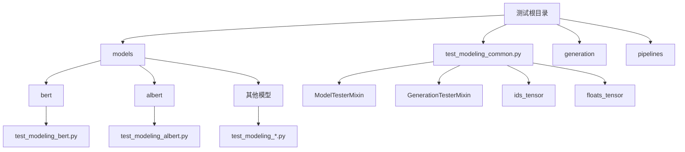
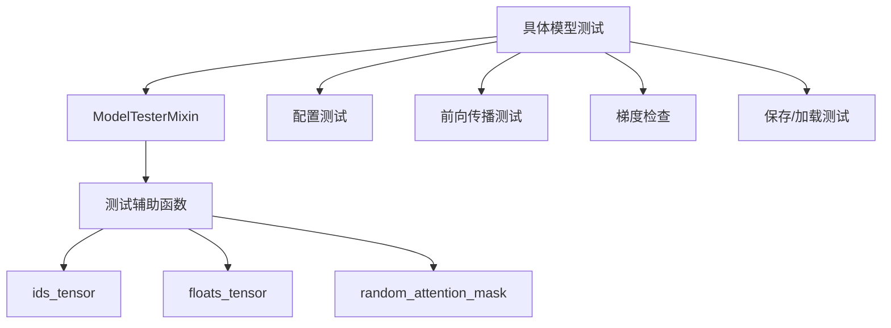
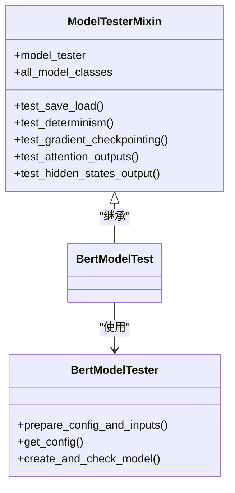
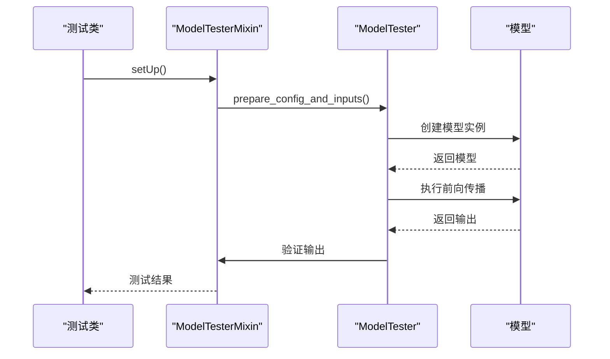
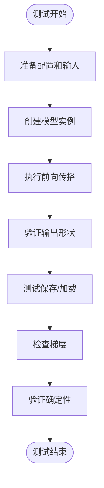
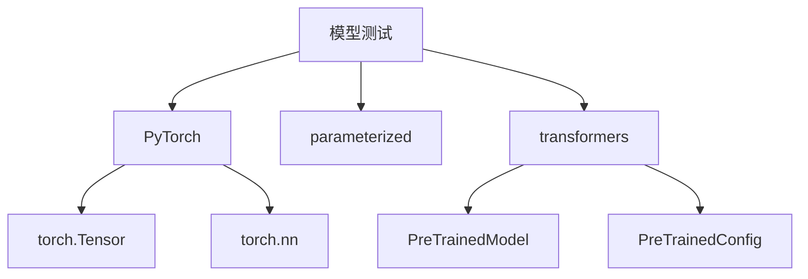

# 模型测试

<cite>
**本文档中引用的文件**  
- [test_modeling_common.py](file://tests/test_modeling_common.py)
- [test_modeling_bert.py](file://tests/models/bert/test_modeling_bert.py)
- [causal_lm_tester.py](file://tests/causal_lm_tester.py)
- [testing_utils.py](file://src/transformers/testing_utils.py)
</cite>

## 目录
1. [简介](#简介)
2. [项目结构](#项目结构)
3. [核心组件](#核心组件)
4. [架构概述](#架构概述)
5. [详细组件分析](#详细组件分析)
6. [依赖分析](#依赖分析)
7. [性能考虑](#性能考虑)
8. [故障排除指南](#故障排除指南)
9. [结论](#结论)
10. [附录](#附录)（如有必要）

## 简介
本文档旨在为Hugging Face Transformers库中的模型测试提供全面的指南。文档详细介绍了如何在`tests/models/`目录下为新模型创建完整的测试套件，包括实现ModelTester类来验证模型的正确性。涵盖了前向传播测试、梯度检查、保存/加载功能测试、不同配置下的行为测试等关键测试类型。文档还解释了如何使用common测试基类确保代码质量，强调了测试覆盖率的重要性，包括边缘情况和错误处理，并提供了与Hugging Face测试框架集成的示例。

## 项目结构
Transformers项目的测试结构遵循模块化设计，每个模型都有独立的测试目录。核心测试逻辑位于`tests/test_modeling_common.py`，为所有模型测试提供通用的基类和工具函数。具体模型的测试文件位于`tests/models/{model_name}/`目录下，如`tests/models/bert/test_modeling_bert.py`。这种结构确保了测试代码的可维护性和一致性。

**图源**  
- [test_modeling_common.py](file://tests/test_modeling_common.py#L0-L3942)
- [test_modeling_bert.py](file://tests/models/bert/test_modeling_bert.py#L0-L745)

**章节源**  
- [test_modeling_common.py](file://tests/test_modeling_common.py#L0-L3942)
- [test_modeling_bert.py](file://tests/models/bert/test_modeling_bert.py#L0-L745)

## 核心组件
模型测试的核心是`ModelTesterMixin`类，它定义了所有模型测试的通用接口和方法。该类通过`model_tester`属性与具体的模型测试器（如`BertModelTester`）交互，实现了测试的可扩展性。`ModelTesterMixin`提供了`test_save_load`、`test_determinism`、`test_gradient_checkpointing`等关键测试方法，确保模型在各种场景下的正确性。

**章节源**  
- [test_modeling_common.py](file://tests/test_modeling_common.py#L1163-L1200)
- [test_modeling_bert.py](file://tests/models/bert/test_modeling_bert.py#L30-L200)

## 架构概述
模型测试框架采用分层架构，上层是具体的模型测试类（如`BertModelTest`），中层是通用的测试混入类（`ModelTesterMixin`），底层是测试辅助工具（如`ids_tensor`）。这种架构实现了测试逻辑的复用和隔离，使得新模型的测试可以快速集成到现有框架中。

**图源**  
- [test_modeling_common.py](file://tests/test_modeling_common.py#L0-L3942)
- [test_modeling_bert.py](file://tests/models/bert/test_modeling_bert.py#L0-L745)

## 详细组件分析

### ModelTesterMixin 分析
`ModelTesterMixin`是所有模型测试的基础，它通过一系列测试方法确保模型的正确性。该类的关键特性包括：

#### 对于面向对象的组件：

**图源**  
- [test_modeling_common.py](file://tests/test_modeling_common.py#L1163-L1200)
- [test_modeling_bert.py](file://tests/models/bert/test_modeling_bert.py#L30-L200)

#### 对于API/服务组件：

**图源**  
- [test_modeling_common.py](file://tests/test_modeling_common.py#L1163-L1200)
- [test_modeling_bert.py](file://tests/models/bert/test_modeling_bert.py#L30-L200)

#### 对于复杂逻辑组件：

**图源**  
- [test_modeling_common.py](file://tests/test_modeling_common.py#L1163-L1200)
- [test_modeling_bert.py](file://tests/models/bert/test_modeling_bert.py#L30-L200)

**章节源**  
- [test_modeling_common.py](file://tests/test_modeling_common.py#L1163-L1200)
- [test_modeling_bert.py](file://tests/models/bert/test_modeling_bert.py#L30-L200)

### 测试覆盖率分析
测试覆盖率是确保模型质量的关键。`ModelTesterMixin`通过多种测试方法确保高覆盖率：

| 测试类型 | 描述 | 关键方法 |
|---------|------|---------|
| 前向传播测试 | 验证模型前向传播的正确性 | `create_and_check_model` |
| 梯度检查 | 确保模型可以正确计算梯度 | `test_training` |
| 保存/加载测试 | 验证模型的序列化和反序列化 | `test_save_load` |
| 确定性测试 | 确保相同输入产生相同输出 | `test_determinism` |
| 注意力输出测试 | 验证注意力机制的正确性 | `test_attention_outputs` |

**章节源**  
- [test_modeling_common.py](file://tests/test_modeling_common.py#L1163-L1200)

## 依赖分析
模型测试框架依赖于多个核心组件，包括PyTorch用于张量操作，parameterized用于参数化测试，以及Hugging Face的配置和模型类。这些依赖关系通过`requirements.txt`和`setup.py`进行管理，确保测试环境的一致性。

**图源**  
- [test_modeling_common.py](file://tests/test_modeling_common.py#L0-L3942)
- [test_modeling_bert.py](file://tests/models/bert/test_modeling_bert.py#L0-L745)

**章节源**  
- [test_modeling_common.py](file://tests/test_modeling_common.py#L0-L3942)
- [test_modeling_bert.py](file://tests/models/bert/test_modeling_bert.py#L0-L745)

## 性能考虑
模型测试需要考虑性能因素，特别是在处理大型模型时。`ModelTesterMixin`通过使用小批量数据和简化配置来优化测试性能。此外，测试框架支持GPU加速，可以通过`require_torch_gpu`装饰器确保测试在合适的硬件上运行。

## 故障排除指南
在模型测试过程中可能遇到的常见问题包括：

1. **梯度检查失败**：确保模型的所有参数都正确初始化，并且没有参数意外地设置为`requires_grad=False`。
2. **保存/加载不一致**：检查模型的`state_dict`是否包含所有必要的参数，并确保`_keys_to_ignore_on_save`设置正确。
3. **注意力输出形状错误**：验证模型的注意力头数和序列长度配置是否正确。
4. **确定性测试失败**：确保随机种子在测试开始时正确设置，并且没有外部随机源影响测试结果。

**章节源**  
- [test_modeling_common.py](file://tests/test_modeling_common.py#L1163-L1200)
- [testing_utils.py](file://src/transformers/testing_utils.py#L639-L1132)

## 结论
本文档提供了Hugging Face Transformers库中模型测试的全面指南。通过遵循本文档中的最佳实践，开发者可以为新模型创建高质量的测试套件，确保模型的正确性和可靠性。测试框架的设计强调了代码复用、测试覆盖率和可维护性，为大规模模型开发提供了坚实的基础。

## 附录

### 测试辅助函数
| 函数 | 描述 |
|------|------|
| ids_tensor | 创建指定形状的随机整数张量 |
| floats_tensor | 创建指定形状的随机浮点数张量 |
| random_attention_mask | 创建随机注意力掩码 |

### 测试装饰器
| 装饰器 | 描述 |
|-------|------|
| @slow | 标记慢速测试 |
| @require_torch | 要求PyTorch可用 |
| @require_torch_gpu | 要求CUDA GPU可用 |
| @require_torch_bf16 | 要求设备支持bf16 |