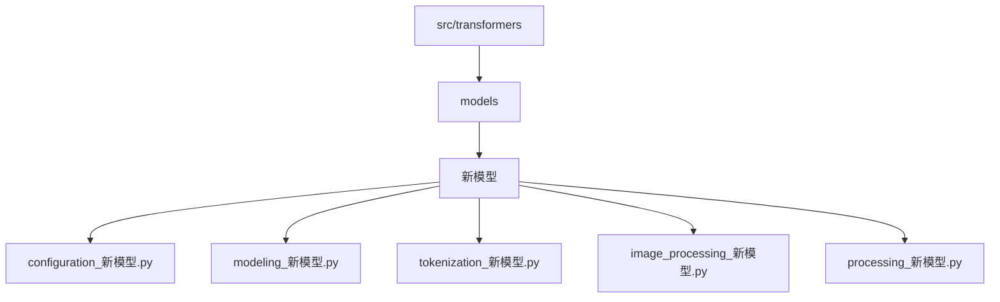
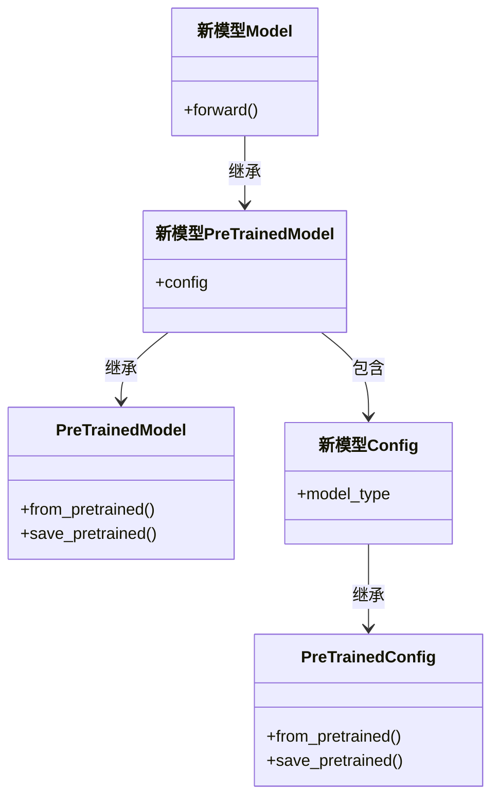
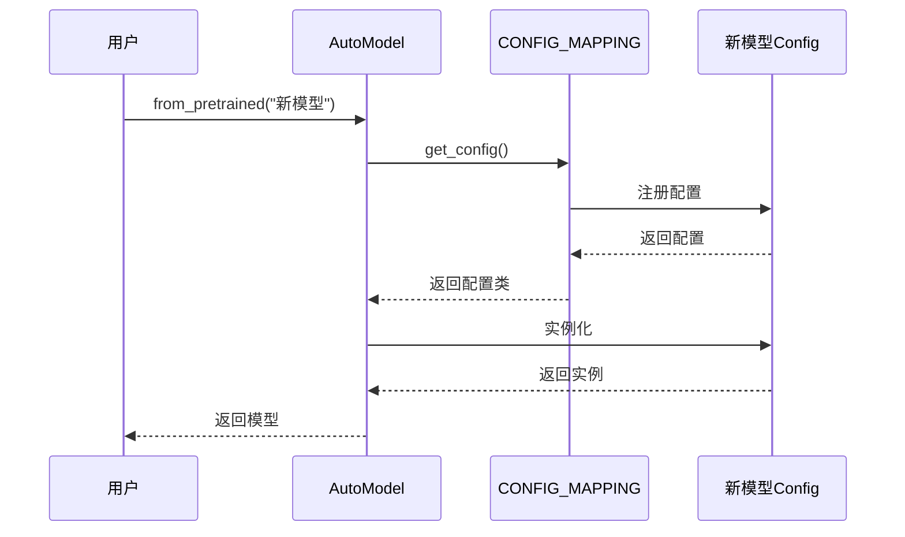
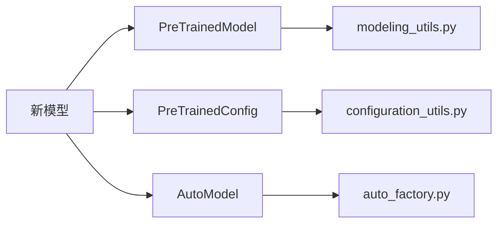

# 添加新模型

<cite>
**本文档中引用的文件**  
- [ADD_NEW_MODEL_PROPOSAL_TEMPLATE.md](file://templates/adding_a_new_model/ADD_NEW_MODEL_PROPOSAL_TEMPLATE.md)
- [configuration_auto.py](file://src/transformers/models/auto/configuration_auto.py)
- [modeling_utils.py](file://src/transformers/modeling_utils.py)
- [configuration_bert.py](file://src/transformers/models/bert/configuration_bert.py)
- [modeling_bert.py](file://src/transformers/models/bert/modeling_bert.py)
- [test_modeling_common.py](file://tests/test_modeling_common.py)
</cite>

## 目录
1. [介绍](#介绍)
2. [项目结构](#项目结构)
3. [核心组件](#核心组件)
4. [架构概述](#架构概述)
5. [详细组件分析](#详细组件分析)
6. [依赖分析](#依赖分析)
7. [性能考虑](#性能考虑)
8. [故障排除指南](#故障排除指南)
9. [结论](#结论)

## 介绍
本文档详细介绍了在Hugging Face Transformers库中添加新模型的完整流程。基于`templates/adding_a_new_model`模板，本文将指导开发者从提案到实现的全过程，包括模型架构定义、配置类、模型类、分词器或图像处理器的实现。文档还涵盖了代码组织、基类继承、自动类注册、测试编写等关键方面。

## 项目结构
Transformers库的项目结构遵循模块化设计，新模型的代码主要位于`src/transformers/models/`目录下。每个模型都有独立的子目录，包含配置、建模、分词和处理相关的文件。



**图源**  
- [configuration_bert.py](file://src/transformers/models/bert/configuration_bert.py#L1-L127)
- [modeling_bert.py](file://src/transformers/models/bert/modeling_bert.py#L1-L1461)

**节源**  
- [configuration_bert.py](file://src/transformers/models/bert/configuration_bert.py#L1-L127)
- [modeling_bert.py](file://src/transformers/models/bert/modeling_bert.py#L1-L1461)

## 核心组件
添加新模型的核心组件包括配置类、模型类、分词器和处理器。这些组件需要遵循Transformers库的设计原则，确保代码的可读性和可维护性。

**节源**  
- [configuration_bert.py](file://src/transformers/models/bert/configuration_bert.py#L1-L127)
- [modeling_bert.py](file://src/transformers/models/bert/modeling_bert.py#L1-L1461)

## 架构概述
Transformers库采用最小化抽象层次的设计，通常只有两层继承关系。新模型继承自`PreTrainedModel`，配置类继承自`PreTrainedConfig`。这种设计确保了模型的自包含性和可读性。



**图源**  
- [modeling_utils.py](file://src/transformers/modeling_utils.py#L1795-L1821)
- [configuration_bert.py](file://src/transformers/models/bert/configuration_bert.py#L71-L125)

## 详细组件分析
### 配置类实现
配置类定义了模型的所有超参数，继承自`PreTrainedConfig`。每个配置类必须设置`model_type`属性，以便自动类能够识别和加载模型。

```python
class 新模型Config(PreTrainedConfig):
    model_type = "新模型"
    
    def __init__(
        self,
        vocab_size=30522,
        hidden_size=768,
        num_hidden_layers=12,
        num_attention_heads=12,
        intermediate_size=3072,
        **kwargs
    ):
        super().__init__(**kwargs)
        self.vocab_size = vocab_size
        self.hidden_size = hidden_size
        self.num_hidden_layers = num_hidden_layers
        self.num_attention_heads = num_attention_heads
        self.intermediate_size = intermediate_size
```

**节源**  
- [configuration_bert.py](file://src/transformers/models/bert/configuration_bert.py#L71-L125)

### 模型类实现
模型类实现核心的神经网络架构，通常包含嵌入层、Transformer层和输出层。模型必须实现`forward`方法，定义前向传播逻辑。

```python
class 新模型Model(PreTrainedModel):
    def __init__(self, config):
        super().__init__(config)
        self.embeddings = BertEmbeddings(config)
        self.encoder = BertEncoder(config)
        self.pooler = BertPooler(config)
```

**节源**  
- [modeling_bert.py](file://src/transformers/models/bert/modeling_bert.py#L1-L1461)

### 自动类注册
新模型需要注册到自动类系统中，以便通过`AutoModel.from_pretrained()`自动加载。这通过在`configuration_auto.py`中注册配置类来实现。



**图源**  
- [configuration_auto.py](file://src/transformers/models/auto/configuration_auto.py#L1369-L1393)
- [auto_factory.py](file://src/transformers/models/auto/auto_factory.py#L152-L180)

## 依赖分析
新模型的实现依赖于Transformers库的核心组件，包括配置系统、模型基类和自动类系统。这些依赖关系确保了模型的一致性和可互操作性。



**图源**  
- [modeling_utils.py](file://src/transformers/modeling_utils.py#L1795-L1821)
- [configuration_auto.py](file://src/transformers/models/auto/configuration_auto.py#L1369-L1393)

**节源**  
- [modeling_utils.py](file://src/transformers/modeling_utils.py#L1795-L1821)
- [configuration_auto.py](file://src/transformers/models/auto/configuration_auto.py#L1369-L1393)

## 性能考虑
在实现新模型时，需要考虑性能优化，包括内存效率、计算效率和推理速度。建议使用梯度检查点、混合精度训练等技术来优化性能。

## 故障排除指南
在开发过程中，可能会遇到各种问题，如模型加载失败、前向传播错误等。建议使用单元测试和集成测试来验证模型的正确性。

**节源**  
- [test_modeling_common.py](file://tests/test_modeling_common.py#L1-L3942)

## 结论
添加新模型到Transformers库是一个系统性的工程，需要遵循严格的设计原则和代码规范。通过本文档的指导，开发者可以高效地实现和集成新模型，为社区做出贡献。