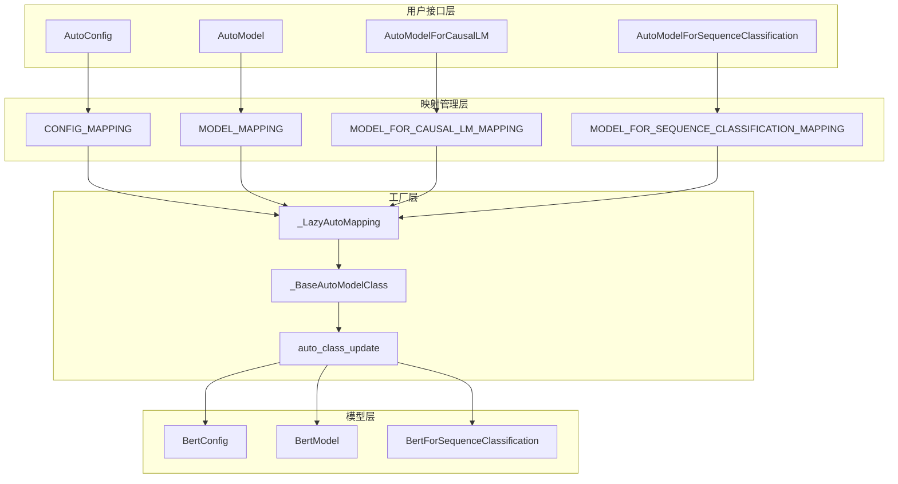
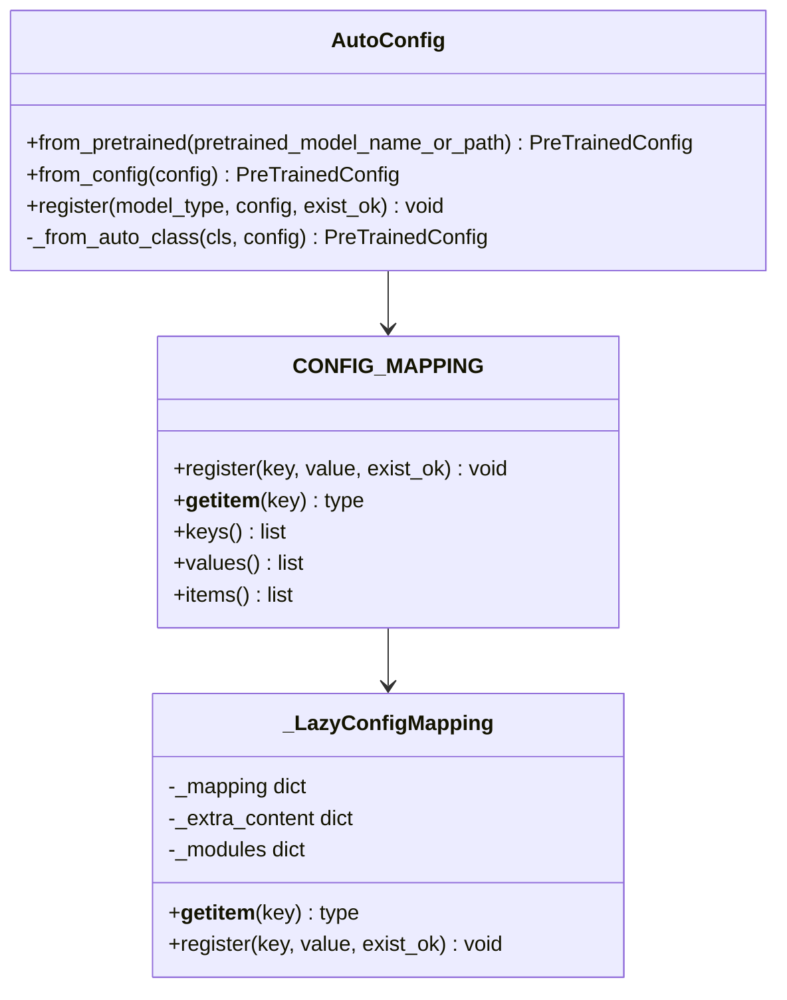
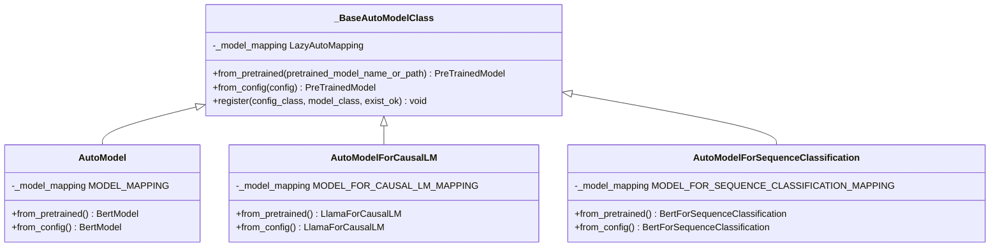
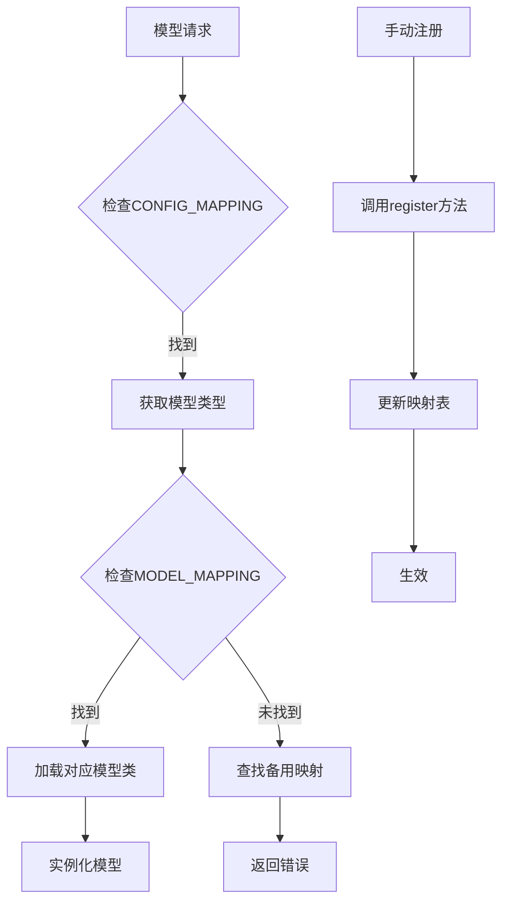
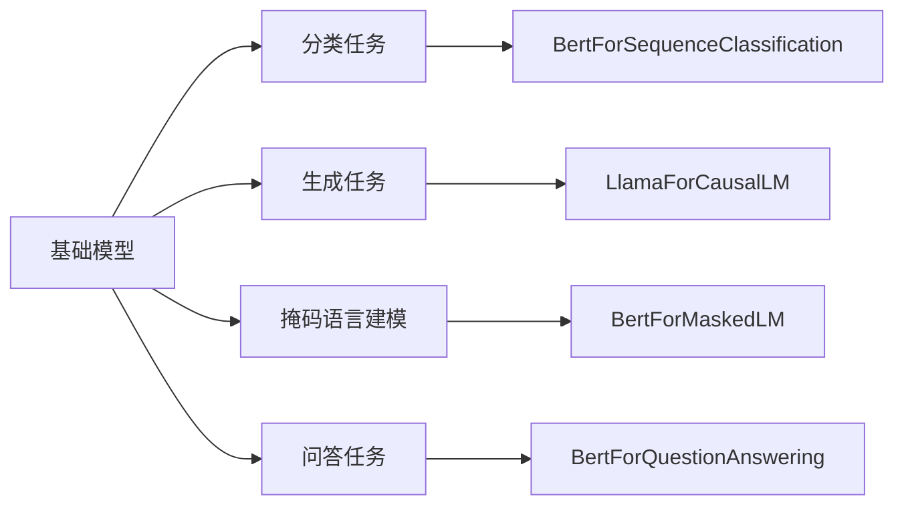

# 自动类集成指南

<cite>
**本文档引用的文件**
- [src/transformers/models/auto/__init__.py](file://src/transformers/models/auto/__init__.py)
- [src/transformers/models/auto/configuration_auto.py](file://src/transformers/models/auto/configuration_auto.py)
- [src/transformers/models/auto/modeling_auto.py](file://src/transformers/models/auto/modeling_auto.py)
- [src/transformers/models/auto/auto_factory.py](file://src/transformers/models/auto/auto_factory.py)
- [src/transformers/models/bert/configuration_bert.py](file://src/transformers/models/bert/configuration_bert.py)
- [tests/models/auto/test_modeling_auto.py](file://tests/models/auto/test_modeling_auto.py)
</cite>

## 目录
1. [简介](#简介)
2. [自动类架构概述](#自动类架构概述)
3. [核心组件分析](#核心组件分析)
4. [注册字典详解](#注册字典详解)
5. [集成步骤指南](#集成步骤指南)
6. [测试与验证](#测试与验证)
7. [最佳实践](#最佳实践)
8. [故障排除](#故障排除)
9. [总结](#总结)

## 简介

Transformers库的自动类系统是一个强大的功能，允许开发者通过统一的接口加载和使用各种预训练模型。本指南详细说明了如何将新模型无缝集成到自动加载系统中，确保AutoModel、AutoConfig等类能够正确识别和加载新模型。

自动类系统的核心优势：
- **统一接口**：所有模型都通过相同的API访问
- **动态加载**：按需加载模型和配置，提高内存效率
- **向后兼容**：保持与现有代码的兼容性
- **扩展性强**：易于添加新的模型类型

## 自动类架构概述

Transformers的自动类系统采用分层架构设计，主要包含以下层次：



**图表来源**
- [src/transformers/models/auto/configuration_auto.py](file://src/transformers/models/auto/configuration_auto.py#L1074-L1116)
- [src/transformers/models/auto/modeling_auto.py](file://src/transformers/models/auto/modeling_auto.py#L1813-L1838)

## 核心组件分析

### 1. AutoConfig类

AutoConfig是配置管理的核心类，负责自动检测和加载模型配置：



**图表来源**
- [src/transformers/models/auto/configuration_auto.py](file://src/transformers/models/auto/configuration_auto.py#L1369-L1393)
- [src/transformers/models/auto/configuration_auto.py](file://src/transformers/models/auto/configuration_auto.py#L1043-L1072)

**章节来源**
- [src/transformers/models/auto/configuration_auto.py](file://src/transformers/models/auto/configuration_auto.py#L1369-L1393)

### 2. AutoModel系列类

AutoModel系列类提供了不同任务类型的模型访问接口：



**图表来源**
- [src/transformers/models/auto/auto_factory.py](file://src/transformers/models/auto/auto_factory.py#L182-L217)
- [src/transformers/models/auto/modeling_auto.py](file://src/transformers/models/auto/modeling_auto.py#L1950-L1970)

**章节来源**
- [src/transformers/models/auto/auto_factory.py](file://src/transformers/models/auto/auto_factory.py#L182-L217)
- [src/transformers/models/auto/modeling_auto.py](file://src/transformers/models/auto/modeling_auto.py#L1950-L1970)

### 3. 映射系统

映射系统负责将模型类型与具体实现类关联：



**图表来源**
- [src/transformers/models/auto/auto_factory.py](file://src/transformers/models/auto/auto_factory.py#L542-L569)
- [src/transformers/models/auto/auto_factory.py](file://src/transformers/models/auto/auto_factory.py#L632-L644)

**章节来源**
- [src/transformers/models/auto/auto_factory.py](file://src/transformers/models/auto/auto_factory.py#L542-L569)
- [src/transformers/models/auto/auto_factory.py](file://src/transformers/models/auto/auto_factory.py#L632-L644)

## 注册字典详解

### CONFIG_MAPPING字典

CONFIG_MAPPING字典建立了模型类型与配置类的映射关系：

| 模型类型 | 配置类名称 | 描述 |
|---------|-----------|------|
| "bert" | "BertConfig" | BERT基础模型配置 |
| "gpt2" | "GPT2Config" | GPT-2语言模型配置 |
| "t5" | "T5Config" | T5序列到序列模型配置 |
| "llama" | "LlamaConfig" | LLaMA大语言模型配置 |
| "roberta" | "RobertaConfig" | RoBERTa优化BERT配置 |

**章节来源**
- [src/transformers/models/auto/configuration_auto.py](file://src/transformers/models/auto/configuration_auto.py#L40-L400)

### MODEL_MAPPING字典

MODEL_MAPPING字典建立了模型类型与基础模型类的映射关系：

| 模型类型 | 基础模型类名 | 用途 |
|---------|-------------|------|
| "bert" | "BertModel" | BERT基础模型 |
| "gpt2" | "GPT2Model" | GPT-2基础模型 |
| "llama" | "LlamaModel" | LLaMA基础模型 |
| "roberta" | "RobertaModel" | RoBERTa基础模型 |

**章节来源**
- [src/transformers/models/auto/modeling_auto.py](file://src/transformers/models/auto/modeling_auto.py#L50-L200)

### 特定任务映射

除了基础映射外，还有针对特定任务的映射：



**图表来源**
- [src/transformers/models/auto/modeling_auto.py](file://src/transformers/models/auto/modeling_auto.py#L1209-L1233)
- [src/transformers/models/auto/modeling_auto.py](file://src/transformers/models/auto/modeling_auto.py#L627-L659)

**章节来源**
- [src/transformers/models/auto/modeling_auto.py](file://src/transformers/models/auto/modeling_auto.py#L1209-L1233)
- [src/transformers/models/auto/modeling_auto.py](file://src/transformers/models/auto/modeling_auto.py#L627-L659)

## 集成步骤指南

### 步骤1：创建配置类

首先需要创建一个继承自`PreTrainedConfig`的配置类：

```python
# 示例：自定义模型配置类
class MyCustomConfig(PreTrainedConfig):
    model_type = "my_custom_model"
    
    def __init__(self, vocab_size=30000, hidden_size=768, **kwargs):
        super().__init__(**kwargs)
        self.vocab_size = vocab_size
        self.hidden_size = hidden_size
        # 添加其他配置参数...
```

**章节来源**
- [src/transformers/models/bert/configuration_bert.py](file://src/transformers/models/bert/configuration_bert.py#L25-L126)

### 步骤2：创建模型类

实现对应的模型类，继承自相应的基类：

```python
# 示例：自定义模型类
class MyCustomModel(PreTrainedModel):
    def __init__(self, config):
        super().__init__(config)
        # 实现模型初始化逻辑
        self.embeddings = nn.Embedding(config.vocab_size, config.hidden_size)
        # 其他层的初始化...
    
    def forward(self, input_ids, **kwargs):
        # 实现前向传播逻辑
        embedded = self.embeddings(input_ids)
        # 处理其他层...
        return embedded
```

### 步骤3：注册模型

将新模型注册到自动类系统中：

```python
# 方法1：自动发现（推荐）
# 在模型目录下的__init__.py中添加导入

# 方法2：手动注册
from transformers import AutoConfig, AutoModel

# 注册配置类
AutoConfig.register("my_custom_model", MyCustomConfig)

# 注册模型类
AutoModel.register(MyCustomConfig, MyCustomModel)
```

**章节来源**
- [src/transformers/models/auto/configuration_auto.py](file://src/transformers/models/auto/configuration_auto.py#L1376-L1393)
- [src/transformers/models/auto/auto_factory.py](file://src/transformers/models/auto/auto_factory.py#L632-L644)

### 步骤4：创建任务特定模型

为特定任务创建专门的模型类：

```python
class MyCustomForSequenceClassification(MyCustomModel):
    def __init__(self, config):
        super().__init__(config)
        # 继承基础模型
        self.classifier = nn.Linear(config.hidden_size, config.num_labels)
    
    def forward(self, input_ids, labels=None, **kwargs):
        # 实现分类逻辑
        outputs = self.base_model(input_ids, **kwargs)
        pooled_output = outputs.last_hidden_state[:, 0]
        logits = self.classifier(pooled_output)
        
        loss = None
        if labels is not None:
            loss_fn = nn.CrossEntropyLoss()
            loss = loss_fn(logits.view(-1, self.config.num_labels), labels.view(-1))
        
        return SequenceClassifierOutput(
            loss=loss,
            logits=logits,
            hidden_states=outputs.hidden_states,
            attentions=outputs.attentions,
        )
```

### 步骤5：注册任务模型

```python
from transformers import AutoModelForSequenceClassification

AutoModelForSequenceClassification.register(
    MyCustomConfig, 
    MyCustomForSequenceClassification
)
```

## 测试与验证

### 单元测试

创建专门的测试文件来验证自动类集成：

```python
import unittest
from transformers import AutoConfig, AutoModel, AutoModelForSequenceClassification
from transformers.testing_utils import require_torch

class TestMyCustomModelIntegration(unittest.TestCase):
    
    @require_torch
    def test_auto_config_registration(self):
        # 测试配置注册
        config = AutoConfig.from_pretrained("path/to/my_custom_model")
        self.assertIsInstance(config, MyCustomConfig)
        self.assertEqual(config.model_type, "my_custom_model")
    
    @require_torch
    def test_auto_model_registration(self):
        # 测试基础模型注册
        model = AutoModel.from_pretrained("path/to/my_custom_model")
        self.assertIsInstance(model, MyCustomModel)
    
    @require_torch
    def test_task_model_registration(self):
        # 测试任务模型注册
        model = AutoModelForSequenceClassification.from_pretrained(
            "path/to/my_custom_model"
        )
        self.assertIsInstance(model, MyCustomForSequenceClassification)
```

**章节来源**
- [tests/models/auto/test_modeling_auto.py](file://tests/models/auto/test_modeling_auto.py#L426-L447)

### 集成测试

```python
def test_end_to_end_integration():
    """端到端集成测试"""
    # 创建配置
    config = MyCustomConfig(vocab_size=1000, hidden_size=256)
    
    # 保存配置
    config.save_pretrained("./test_model")
    
    # 从配置加载模型
    model = AutoModel.from_config(config)
    assert isinstance(model, MyCustomModel)
    
    # 保存并重新加载
    model.save_pretrained("./test_model")
    loaded_model = AutoModel.from_pretrained("./test_model")
    assert isinstance(loaded_model, MyCustomModel)
```

**章节来源**
- [tests/models/auto/test_modeling_auto.py](file://tests/models/auto/test_modeling_auto.py#L426-L447)

## 最佳实践

### 1. 命名约定

遵循一致的命名约定：

- **配置类**：`{ModelName}Config`
- **基础模型**：`{ModelName}Model`
- **任务模型**：`{ModelName}{TaskType}`
- **模型类型**：小写的模型名称

### 2. 向后兼容性

确保新模型与现有系统的兼容性：

```python
class MyCustomConfig(PreTrainedConfig):
    model_type = "my_custom_model"
    
    def __init__(self, **kwargs):
        # 保持默认值与现有模型一致
        super().__init__(**kwargs)
        
        # 添加新参数时提供默认值
        self.new_parameter = kwargs.pop('new_parameter', 42)
```

### 3. 文档和注释

为新模型添加完整的文档：

```python
class MyCustomConfig(PreTrainedConfig):
    """
    MyCustomModel的配置类。
    
    Args:
        vocab_size (`int`, *optional*, defaults to 30000):
            词汇表大小。
        hidden_size (`int`, *optional*, defaults to 768):
            隐藏层维度。
        num_layers (`int`, *optional*, defaults to 12):
            层数。
    """
    model_type = "my_custom_model"
    
    def __init__(self, vocab_size=30000, hidden_size=768, num_layers=12, **kwargs):
        super().__init__(**kwargs)
        self.vocab_size = vocab_size
        self.hidden_size = hidden_size
        self.num_layers = num_layers
```

### 4. 错误处理

实现健壮的错误处理：

```python
class MyCustomConfig(PreTrainedConfig):
    def __init__(self, **kwargs):
        # 参数验证
        hidden_size = kwargs.get('hidden_size', 768)
        if hidden_size % 64 != 0:
            raise ValueError("hidden_size必须是64的倍数")
        
        super().__init__(**kwargs)
```

### 5. 性能优化

考虑懒加载和内存优化：

```python
class MyCustomModel(PreTrainedModel):
    def __init__(self, config):
        super().__init__(config)
        
        # 使用缓存避免重复计算
        self._initialized = False
        
    def forward(self, input_ids, **kwargs):
        if not self._initialized:
            # 执行一次性初始化
            self._initialize_weights()
            self._initialized = True
        
        # 前向传播逻辑
        return self._forward_impl(input_ids, **kwargs)
```

## 故障排除

### 常见问题及解决方案

#### 1. 模型类型不匹配

**问题**：配置类的`model_type`与实际不符

**解决方案**：
```python
# 错误示例
class MyCustomConfig(PreTrainedConfig):
    model_type = "wrong_type"  # 应该是 "my_custom_model"

# 正确示例
class MyCustomConfig(PreTrainedConfig):
    model_type = "my_custom_model"
```

#### 2. 注册冲突

**问题**：尝试注册已存在的模型类型

**解决方案**：
```python
# 使用exist_ok=True解决冲突
AutoConfig.register("existing_model", NewConfig, exist_ok=True)
```

#### 3. 导入错误

**问题**：模块导入路径错误

**解决方案**：
```python
# 确保正确的导入路径
from transformers.models.my_custom_model import MyCustomConfig, MyCustomModel
```

#### 4. 配置加载失败

**问题**：从预训练模型加载配置失败

**解决方案**：
```python
# 检查配置文件是否存在
from transformers import AutoConfig
try:
    config = AutoConfig.from_pretrained("path/to/model")
except Exception as e:
    print(f"加载配置失败: {e}")
    # 尝试使用默认配置
    config = MyCustomConfig()
```

### 调试技巧

#### 1. 检查注册状态

```python
# 检查配置是否已注册
print("my_custom_model" in AutoConfig.registered_configs)

# 查看所有已注册的配置
print(AutoConfig.registered_configs)
```

#### 2. 跟踪加载过程

```python
import logging
logging.basicConfig(level=logging.DEBUG)

# 启用调试日志
from transformers import logging as hf_logging
hf_logging.set_verbosity_debug()
```

#### 3. 验证映射关系

```python
# 验证配置到模型的映射
from transformers.models.auto.modeling_auto import MODEL_MAPPING
print(MODEL_MAPPING.keys())  # 查看所有可用的模型类型
```

## 总结

Transformers库的自动类系统为模型集成提供了强大而灵活的框架。通过遵循本指南中的步骤和最佳实践，开发者可以：

1. **无缝集成**：将新模型轻松集成到现有的自动加载系统中
2. **保持一致性**：遵循既定的命名和结构约定
3. **确保兼容性**：维护向后兼容性和稳定性
4. **简化测试**：利用完善的测试框架验证集成效果

关键要点：
- 正确设置`model_type`属性
- 遵循命名约定
- 提供完整的文档
- 进行充分的测试
- 注意向后兼容性

通过这些步骤，您可以确保新模型能够充分利用Transformers库的强大功能，为用户提供一致且高效的体验。