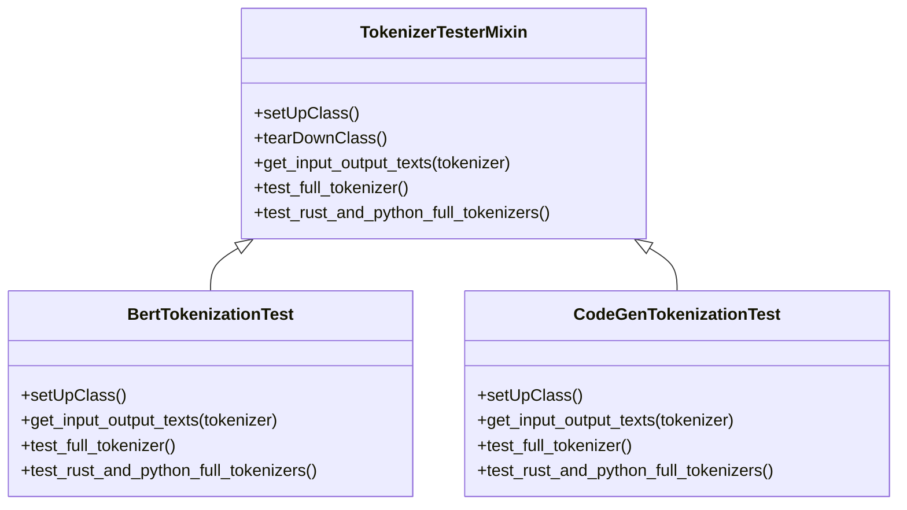
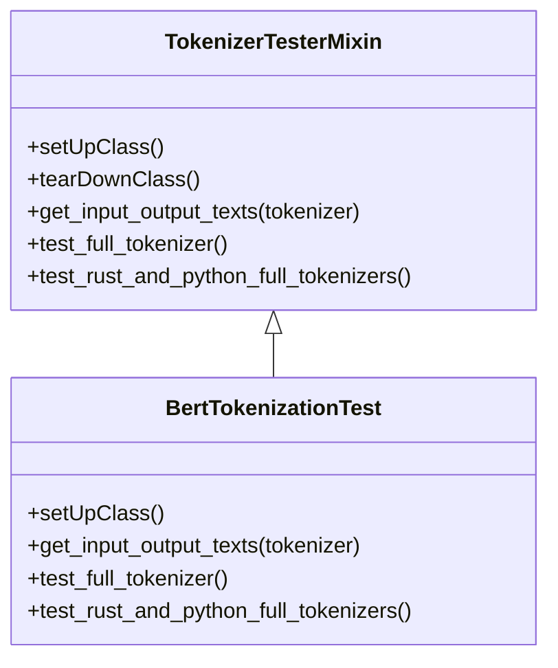
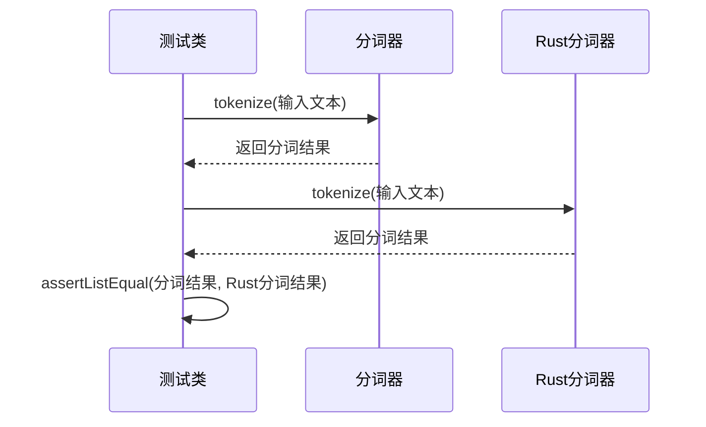
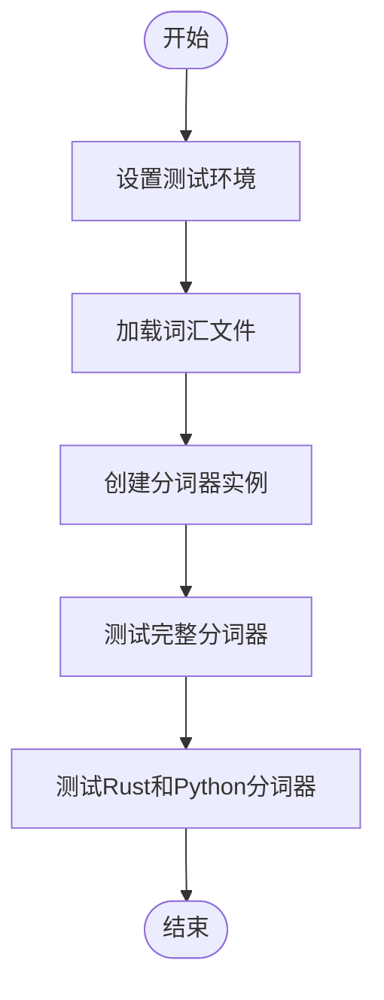
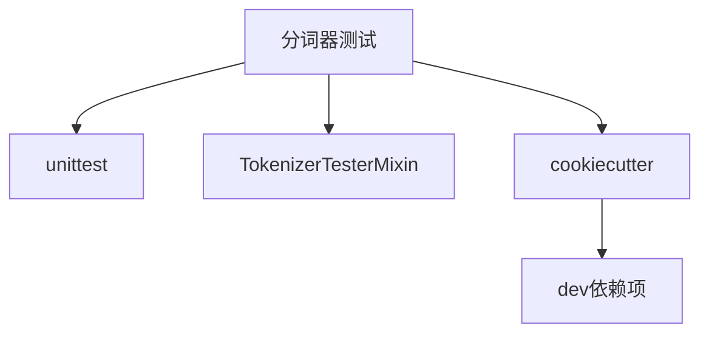

# 贡献分词器测试

<cite>
**本文档中引用的文件**  
- [test_tokenization_{{cookiecutter.lowercase_modelname}}.py](file://templates/adding_a_missing_tokenization_test/cookiecutter-template-{{cookiecutter.modelname}}/test_tokenization_{{cookiecutter.lowercase_modelname}}.py)
- [README.md](file://templates/adding_a_missing_tokenization_test/README.md)
- [cookiecutter.json](file://templates/adding_a_missing_tokenization_test/cookiecutter.json)
- [test_tokenization_common.py](file://tests/test_tokenization_common.py)
- [test_tokenization_utils.py](file://tests/tokenization/test_tokenization_utils.py)
- [test_tokenization_fast.py](file://tests/tokenization/test_tokenization_fast.py)
- [test_tokenization_bert.py](file://tests/models/bert/test_tokenization_bert.py)
</cite>

## 目录
1. [简介](#简介)
2. [项目结构](#项目结构)
3. [核心组件](#核心组件)
4. [架构概述](#架构概述)
5. [详细组件分析](#详细组件分析)
6. [依赖分析](#依赖分析)
7. [性能考虑](#性能考虑)
8. [故障排除指南](#故障排除指南)
9. [结论](#结论)

## 简介
本文档旨在为开发者提供详细的指南，指导如何为缺失的分词器实现添加测试用例。通过使用 `templates/adding_a_missing_tokenization_test` 模板，开发者可以确保分词器的正确性和一致性。文档将详细介绍如何使用 `tests/tokenization/` 目录下的测试框架，编写测试以验证分词、编码、解码和特殊标记处理等功能。此外，还将说明如何使用 cookiecutter 模板生成测试文件，并确保测试覆盖边界情况和异常处理。强调与现有分词器测试的一致性，包括测试命名约定和断言方法。最后，提供调试技巧，如使用 print 调试和断点调试。

## 项目结构
本项目遵循 Hugging Face Transformers 库的标准结构，分词器测试文件位于 `tests/tokenization/` 目录下。每个模型的分词器测试文件通常位于 `tests/models/<model_name>/` 目录中，文件名格式为 `test_tokenization_<model_name>.py`。模板文件位于 `templates/adding_a_missing_tokenization_test/` 目录中，包含生成新测试文件所需的 cookiecutter 模板。

```mermaid
graph TD
A[transformers] --> B[templates]
A --> C[tests]
B --> D[adding_a_missing_tokenization_test]
C --> E[tokenization]
C --> F[models]
D --> G[cookiecutter-template-{{cookiecutter.modelname}}]
G --> H[test_tokenization_{{cookiecutter.lowercase_modelname}}.py]
E --> I[test_tokenization_common.py]
E --> J[test_tokenization_utils.py]
F --> K[bert]
K --> L[test_tokenization_bert.py]
```

**图示来源**
- [templates/adding_a_missing_tokenization_test](file://templates/adding_a_missing_tokenization_test)
- [tests/tokenization](file://tests/tokenization)
- [tests/models/bert](file://tests/models/bert)

**本节来源**
- [templates/adding_a_missing_tokenization_test/README.md](file://templates/adding_a_missing_tokenization_test/README.md)
- [tests/tokenization/test_tokenization_utils.py](file://tests/tokenization/test_tokenization_utils.py)

## 核心组件
分词器测试的核心组件包括 `TokenizerTesterMixin` 类，该类提供了通用的测试方法和断言。每个具体的分词器测试类继承自 `TokenizerTesterMixin` 和 `unittest.TestCase`，并根据需要重写特定的方法。例如，`BertTokenizationTest` 类继承自 `TokenizerTesterMixin`，并实现了 `setUpClass` 方法来设置测试环境。

**本节来源**
- [test_tokenization_common.py](file://tests/test_tokenization_common.py)
- [test_tokenization_bert.py](file://tests/models/bert/test_tokenization_bert.py)

## 架构概述
分词器测试的架构基于 `TokenizerTesterMixin` 类，该类提供了一系列通用的测试方法，如 `test_full_tokenizer`、`test_rust_and_python_full_tokenizers` 等。这些方法可以被不同的分词器测试类继承和重用。每个具体的分词器测试类需要实现 `setUpClass` 方法来初始化测试环境，并根据需要重写特定的测试方法。



**图示来源**
- [test_tokenization_common.py](file://tests/test_tokenization_common.py)
- [test_tokenization_bert.py](file://tests/models/bert/test_tokenization_bert.py)
- [test_tokenization_codegen.py](file://tests/models/codegen/test_tokenization_codegen.py)

## 详细组件分析
### 分词器测试类分析
分词器测试类的主要职责是验证分词器的正确性和一致性。每个测试类需要实现 `setUpClass` 方法来初始化测试环境，包括创建临时目录、加载词汇文件等。`get_input_output_texts` 方法用于提供输入和输出文本，以便进行分词和解码测试。

#### 对于对象导向的组件：


**图示来源**
- [test_tokenization_common.py](file://tests/test_tokenization_common.py)
- [test_tokenization_bert.py](file://tests/models/bert/test_tokenization_bert.py)

#### 对于API/服务组件：


**图示来源**
- [test_tokenization_bert.py](file://tests/models/bert/test_tokenization_bert.py)

#### 对于复杂逻辑组件：


**图示来源**
- [test_tokenization_bert.py](file://tests/models/bert/test_tokenization_bert.py)

**本节来源**
- [test_tokenization_bert.py](file://tests/models/bert/test_tokenization_bert.py)
- [test_tokenization_codegen.py](file://tests/models/codegen/test_tokenization_codegen.py)

## 依赖分析
分词器测试依赖于 `unittest` 框架和 `transformers` 库中的 `TokenizerTesterMixin` 类。此外，还需要安装 `dev` 依赖项以使用 `cookiecutter` 工具生成测试文件。`cookiecutter` 模板文件位于 `templates/adding_a_missing_tokenization_test/` 目录中，包含生成新测试文件所需的所有配置。



**图示来源**
- [templates/adding_a_missing_tokenization_test/cookiecutter.json](file://templates/adding_a_missing_tokenization_test/cookiecutter.json)
- [tests/test_tokenization_common.py](file://tests/test_tokenization_common.py)

**本节来源**
- [templates/adding_a_missing_tokenization_test/README.md](file://templates/adding_a_missing_tokenization_test/README.md)
- [tests/test_tokenization_common.py](file://tests/test_tokenization_common.py)

## 性能考虑
分词器测试的性能主要取决于分词器本身的实现。为了确保测试的高效性，建议在测试中使用较小的词汇文件和简短的测试文本。此外，可以使用 `@slow` 装饰器标记耗时较长的测试，以便在需要时跳过这些测试。

## 故障排除指南
在编写和运行分词器测试时，可能会遇到一些常见问题。以下是一些调试技巧：

- **使用 print 调试**：在测试方法中添加 `print` 语句，输出中间结果，帮助定位问题。
- **使用断点调试**：在 IDE 中设置断点，逐步执行测试代码，观察变量的变化。
- **检查词汇文件**：确保词汇文件正确加载，且内容符合预期。
- **检查分词器配置**：确保分词器的配置参数正确设置，特别是 `do_lower_case` 和 `strip_accents` 等选项。

**本节来源**
- [test_tokenization_bert.py](file://tests/models/bert/test_tokenization_bert.py)
- [test_tokenization_codegen.py](file://tests/models/codegen/test_tokenization_codegen.py)

## 结论
通过使用 `templates/adding_a_missing_tokenization_test` 模板，开发者可以轻松地为缺失的分词器实现添加测试用例。本文档详细介绍了如何使用 `tests/tokenization/` 目录下的测试框架，编写测试以验证分词、编码、解码和特殊标记处理等功能。强调了与现有分词器测试的一致性，包括测试命名约定和断言方法。提供了调试技巧，帮助开发者快速定位和解决问题。希望本文档能为开发者提供有价值的参考，确保分词器的正确性和一致性。