# 推理性能优化

<cite>
**本文档中引用的文件**
- [run_generation.py](file://examples/pytorch/text-generation/run_generation.py)
- [continuous_batching.py](file://examples/pytorch/continuous_batching.py)
- [cache.py](file://src/transformers/generation/continuous_batching/cache.py)
- [scheduler.py](file://src/transformers/generation/continuous_batching/scheduler.py)
- [configuration_utils.py](file://src/transformers/generation/configuration_utils.py)
- [quantizer_gptq.py](file://src/transformers/quantizers/quantizer_gptq.py)
- [quantizer_awq.py](file://src/transformers/quantizers/quantizer_awq.py)
- [cache_utils.py](file://src/transformers/cache_utils.py)
- [quantization_config.py](file://src/transformers/utils/quantization_config.py)
- [awq.py](file://src/transformers/integrations/awq.py)
- [eager_paged.py](file://src/transformers/integrations/eager_paged.py)
- [flash_paged.py](file://src/transformers/integrations/flash_paged.py)
- [sdpa_paged.py](file://src/transformers/integrations/sdpa_paged.py)
</cite>

## 目录
1. [简介](#简介)
2. [连续批处理机制](#连续批处理机制)
3. [KV缓存量化技术](#kv缓存量化技术)
4. [分页注意力架构](#分页注意力架构)
5. [量化模型推理优化](#量化模型推理优化)
6. [性能调优参数](#性能调优参数)
7. [实际应用案例](#实际应用案例)
8. [性能监控与分析](#性能监控与分析)
9. [最佳实践建议](#最佳实践建议)
10. [总结](#总结)

## 简介

量化模型在推理阶段的性能优化是现代大语言模型部署的关键技术。本文档深入探讨了transformers框架中实现的多种性能优化技术，包括连续批处理、KV缓存量化、分页注意力等核心机制，以及如何通过合理的参数配置实现低延迟高并发的推理服务。

这些优化技术的核心目标是在保证模型输出质量的前提下，最大化推理吞吐量并最小化内存占用，这对于大规模生产环境中的模型服务至关重要。

## 连续批处理机制

### 架构概述

连续批处理（Continuous Batching）是一种先进的推理优化技术，它允许系统同时处理多个请求，即使这些请求的输入长度各不相同。这种机制通过动态聚合请求来提高GPU利用率，显著提升整体吞吐量。

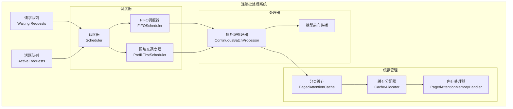

**图表来源**
- [cache.py](file://src/transformers/generation/continuous_batching/cache.py#L1-L50)
- [scheduler.py](file://src/transformers/generation/continuous_batching/scheduler.py#L1-L50)
- [continuous_api.py](file://src/transformers/generation/continuous_batching/continuous_api.py#L157-L190)

### 调度策略

系统提供了两种主要的调度策略：

#### FIFO调度器
FIFO调度器按照请求到达的顺序进行处理，优先考虑解码请求，同时包含安全边际机制防止缓存耗尽。

#### 预填充优先调度器  
预填充优先调度器优先处理分割的预填充请求，确保部分完成的提示能够尽快完成处理。

**章节来源**
- [scheduler.py](file://src/transformers/generation/continuous_batching/scheduler.py#L150-L200)

### 缓存管理系统

分页注意力缓存系统采用三层架构设计：

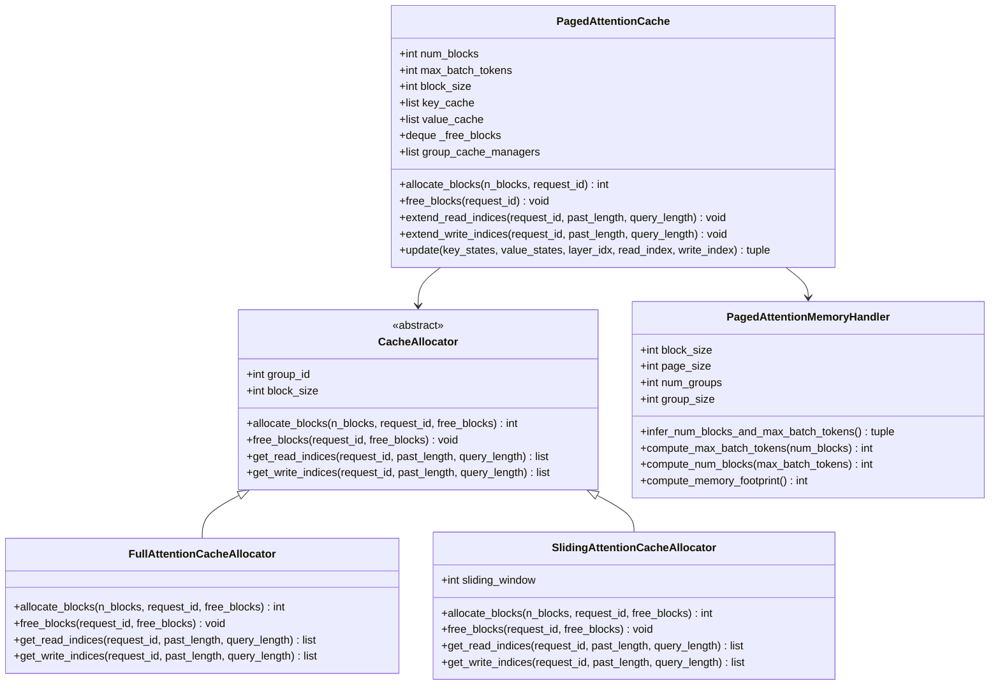

**图表来源**
- [cache.py](file://src/transformers/generation/continuous_batching/cache.py#L60-L150)
- [cache_manager.py](file://src/transformers/generation/continuous_batching/cache_manager.py#L1-L50)

**章节来源**
- [cache.py](file://src/transformers/generation/continuous_batching/cache.py#L60-L200)

## KV缓存量化技术

### 量化缓存架构

KV缓存量化技术通过使用较低精度的数据类型来存储键值状态，显著减少内存占用，同时保持模型性能。

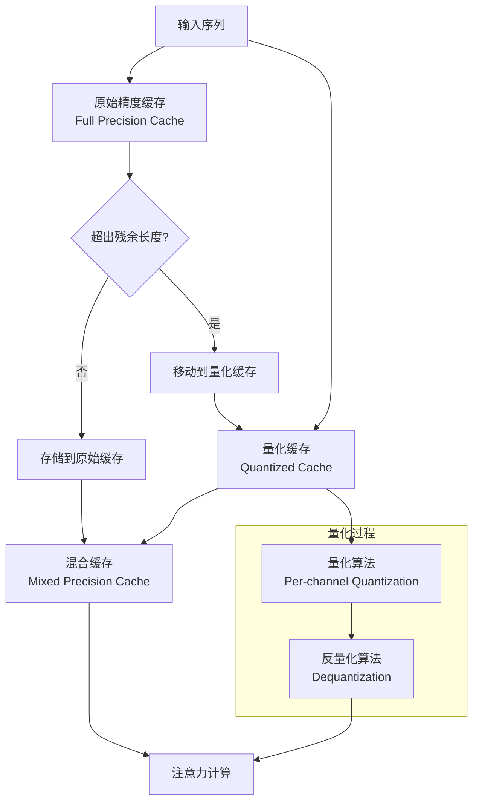

**图表来源**
- [cache_utils.py](file://src/transformers/cache_utils.py#L1079-L1150)

### 量化后端支持

系统支持多种量化后端：

| 后端类型 | 特点 | 适用场景 |
|---------|------|----------|
| Quanto | 高效的PyTorch量化库 | CPU/GPU通用，低延迟推理 |
| HQQ | 高质量量化算法 | 对精度要求较高的场景 |
| GPTQ | 专为GPT模型优化 | 大规模语言模型部署 |
| AWQ | 加速权重量化 | 实时推理服务 |

**章节来源**
- [cache_utils.py](file://src/transformers/cache_utils.py#L1079-L1200)

## 分页注意力架构

### 分页机制原理

分页注意力通过将缓存空间划分为固定大小的页面块来管理内存，实现高效的内存分配和回收。

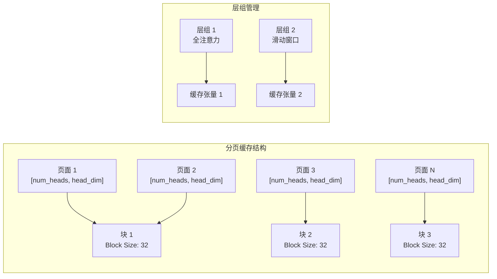

**图表来源**
- [cache.py](file://src/transformers/generation/continuous_batching/cache.py#L60-L120)

### 内存优化算法

内存处理器使用二次规划算法自动确定最优的缓存块数量和最大批次令牌数：

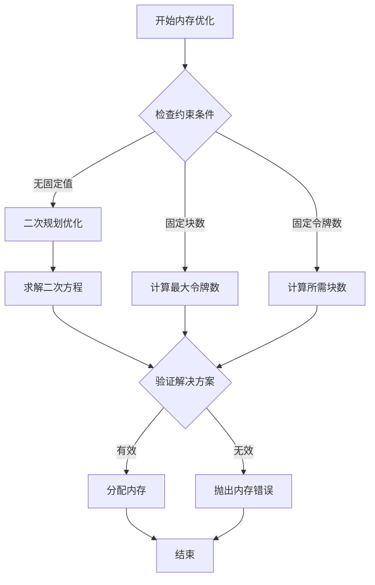

**图表来源**
- [cache.py](file://src/transformers/generation/continuous_batching/cache.py#L400-L500)

**章节来源**
- [cache.py](file://src/transformers/generation/continuous_batching/cache.py#L400-L600)

## 量化模型推理优化

### GPTQ量化优化

GPTQ（Generative Pre-trained Transformer Quantization）提供了高效的4位量化方案：

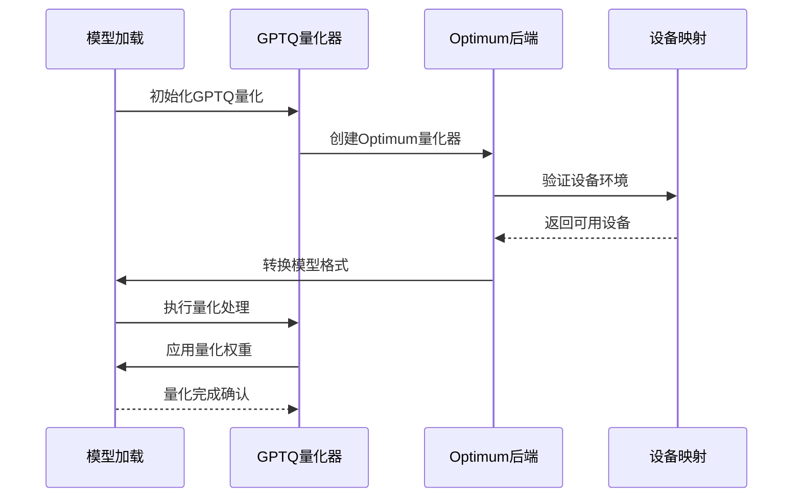

**图表来源**
- [quantizer_gptq.py](file://src/transformers/quantizers/quantizer_gptq.py#L30-L80)

### AWQ量化优化

AWQ（Activation-aware Weight Quantization）提供了激活感知的量化策略：

| 参数 | 默认值 | 说明 | 性能影响 |
|------|--------|------|----------|
| bits | 4 | 量化位宽 | 更低位宽减少内存但可能影响精度 |
| group_size | 128 | 分组大小 | 影响量化精度和计算效率 |
| zero_point | true | 零点偏移 | 改善对称分布的量化效果 |
| backend | AUTOAWQ | 量化后端 | 不同后端影响推理速度 |
| fuse_max_seq_len | None | 融合序列长度 | 影响编译优化程度 |

**章节来源**
- [quantizer_awq.py](file://src/transformers/quantizers/quantizer_awq.py#L44-L94)
- [quantization_config.py](file://src/transformers/utils/quantization_config.py#L885-L965)

### 注意力实现优化

系统支持多种注意力实现方式：

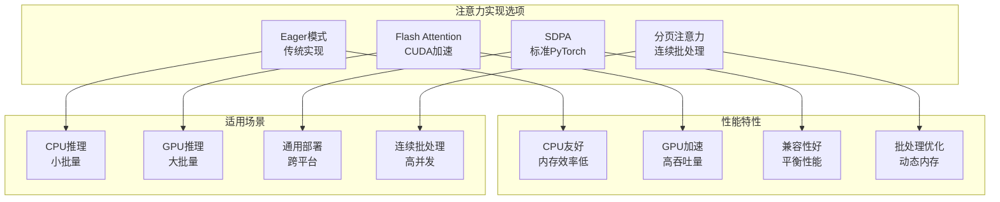

**图表来源**
- [eager_paged.py](file://src/transformers/integrations/eager_paged.py#L1-L20)
- [flash_paged.py](file://src/transformers/integrations/flash_paged.py#L1-L42)
- [sdpa_paged.py](file://src/transformers/integrations/sdpa_paged.py#L1-L16)

**章节来源**
- [awq.py](file://src/transformers/integrations/awq.py#L126-L152)

## 性能调优参数

### 核心推理参数

GenerationConfig提供了丰富的参数来控制推理行为：

| 参数类别 | 关键参数 | 推荐值 | 作用说明 |
|---------|----------|--------|----------|
| 批处理控制 | max_batch_size | 32-128 | 最大批处理大小 |
| 预填充优化 | prefill_chunk_size | 512-2048 | 预填充分块大小 |
| 内存管理 | num_blocks | 自动推断 | 分页缓存块数量 |
| 缓存配置 | block_size | 32 | 缓存块大小 |
| 性能优化 | use_cache | true | 启用KV缓存 |
| 并发控制 | max_batch_tokens | 自动推断 | 最大批次令牌数 |

### 连续批处理配置

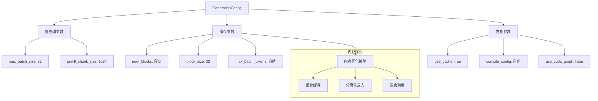

**图表来源**
- [configuration_utils.py](file://src/transformers/generation/configuration_utils.py#L323-L355)

**章节来源**
- [configuration_utils.py](file://src/transformers/generation/configuration_utils.py#L323-L400)

### 量化参数调优

针对不同量化方案的推荐参数：

#### GPTQ参数配置
```python
# GPTQ量化推荐配置
gptq_config = GPTQConfig(
    bits=4,
    group_size=128,
    desc_act=False,
    sym=True,
    damp_percent=0.1,
    use_exllama=True,
    max_input_length=2048
)
```

#### AWQ参数配置
```python
# AWQ量化推荐配置
awq_config = AwqConfig(
    bits=4,
    group_size=128,
    zero_point=True,
    version=AWQLinearVersion.GEMM,
    backend=AwqBackendPackingMethod.AUTOAWQ,
    do_fuse=True,
    fuse_max_seq_len=2048
)
```

**章节来源**
- [quantization_config.py](file://src/transformers/utils/quantization_config.py#L688-L724)

## 实际应用案例

### 基准测试脚本分析

连续批处理基准测试展示了完整的优化流程：

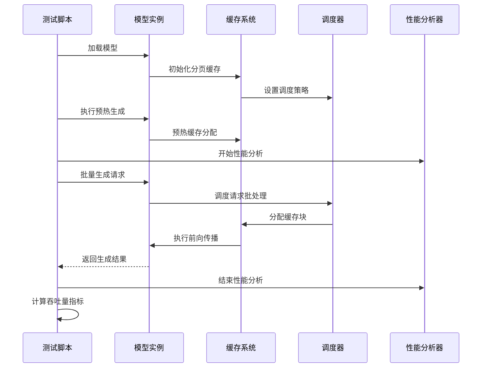

**图表来源**
- [continuous_batching.py](file://examples/pytorch/continuous_batching.py#L270-L300)

### 文本生成优化案例

文本生成示例展示了完整的推理优化配置：

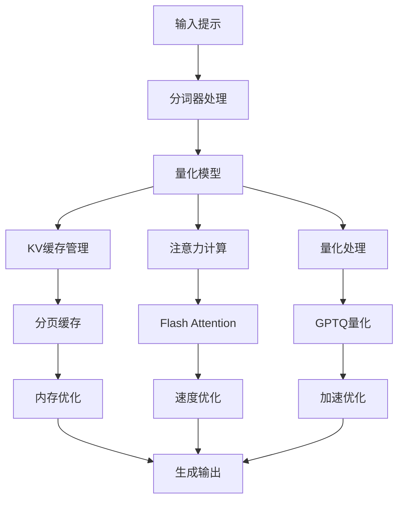

**图表来源**
- [run_generation.py](file://examples/pytorch/text-generation/run_generation.py#L1-L50)

**章节来源**
- [continuous_batching.py](file://examples/pytorch/continuous_batching.py#L270-L301)
- [run_generation.py](file://examples/pytorch/text-generation/run_generation.py#L300-L450)

## 性能监控与分析

### 内存使用监控

系统提供了完善的内存监控机制：

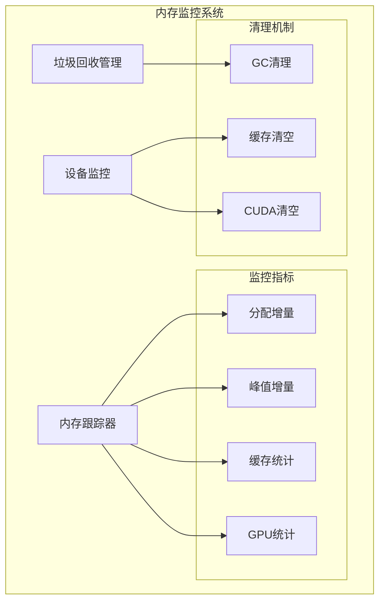

**图表来源**
- [trainer_utils.py](file://src/transformers/trainer_utils.py#L592-L619)

### 性能指标收集

基准测试框架提供了详细的性能指标：

| 指标类型 | 指标名称 | 单位 | 说明 |
|---------|----------|------|------|
| 吞吐量指标 | tok_per_sec | tokens/second | 每秒生成的令牌数 |
| 时间指标 | gen_time | seconds | 总生成时间 |
| 内存指标 | token_count | tokens | 总生成令牌数 |
| 缓存指标 | num_blocks | blocks | 使用的缓存块数 |
| 缓存指标 | max_batch_tokens | tokens | 最大批次令牌数 |

**章节来源**
- [continuous_batching.py](file://examples/pytorch/continuous_batching.py#L100-L150)

## 最佳实践建议

### 系统级优化建议

1. **硬件选择**
   - 使用支持Tensor Core的GPU（如A100、H100）
   - 确保充足的GPU内存（至少16GB以上）
   - 考虑使用NVLink连接多GPU

2. **软件配置**
   - 启用混合精度训练（bfloat16或fp16）
   - 使用适当的注意力实现（Flash Attention优先）
   - 启用模型编译优化

3. **内存管理**
   - 合理设置分页缓存大小
   - 监控内存使用情况
   - 定期执行内存清理

### 参数调优策略

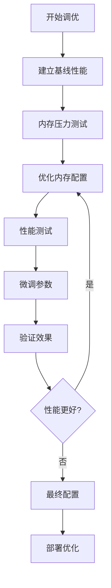

### 量化方案选择指南

| 场景需求 | 推荐方案 | 参数配置 | 性能特点 |
|---------|----------|----------|----------|
| 实时推理 | AWQ + 分页注意力 | bits=4, group_size=128 | 低延迟，高吞吐 |
| 批处理 | GPTQ + 动态缓存 | bits=4, use_exllama=true | 内存效率高 |
| 精度优先 | HQQ + 混合精度 | bits=4, view_as_float=true | 精度损失小 |
| 兼容性 | Quanto + SDPA | bits=4, axis=1 | 跨平台兼容 |

## 总结

量化模型在推理阶段的性能优化是一个多层次的技术体系，涉及硬件、软件、算法等多个层面的协同优化。通过本文档的深入分析，我们可以看到：

1. **连续批处理机制**通过动态聚合请求显著提升了GPU利用率和系统吞吐量
2. **KV缓存量化技术**实现了内存使用的大幅降低，同时保持模型性能
3. **分页注意力架构**提供了灵活的内存管理策略，适应不同的应用场景
4. **多种量化方案**为不同需求提供了针对性的优化选择

这些技术的综合运用，使得现代大语言模型能够在保持高质量输出的同时，实现高效的推理服务。随着技术的不断发展，我们期待看到更多创新的优化方法出现，进一步推动AI模型在生产环境中的广泛应用。

对于开发者而言，理解这些优化技术的工作原理和适用场景，能够帮助更好地配置和部署量化模型，实现最佳的性能表现。同时，持续关注相关技术的发展动态，及时采用新的优化方案，也是保持系统竞争力的重要策略。