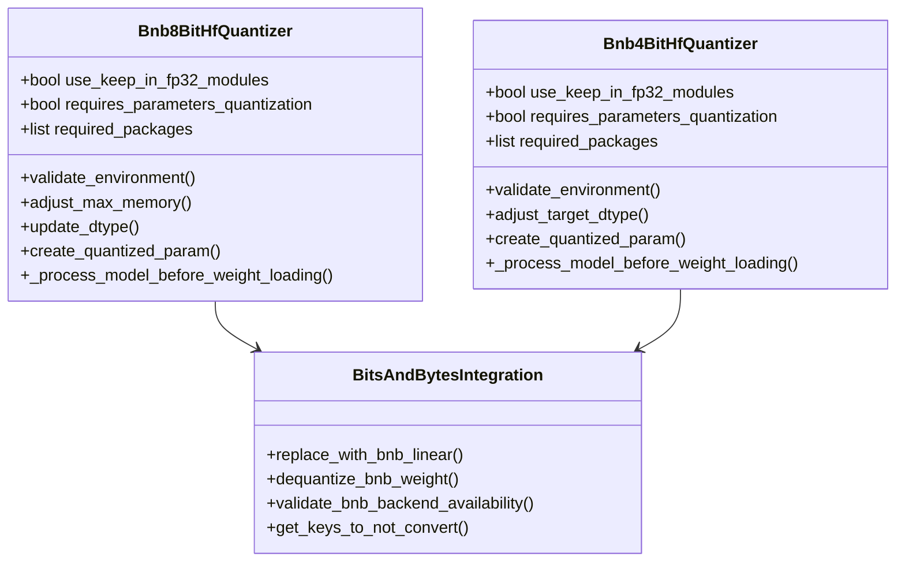
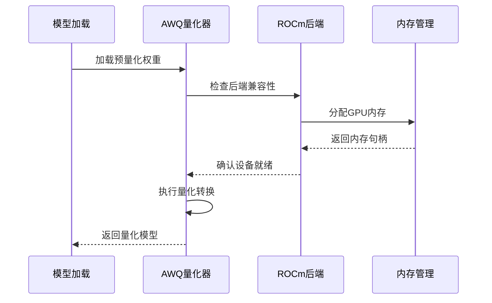
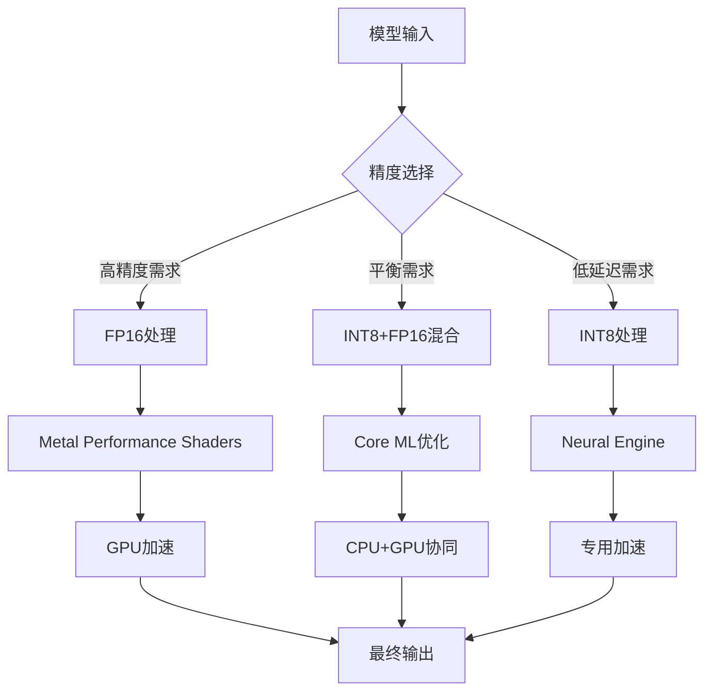
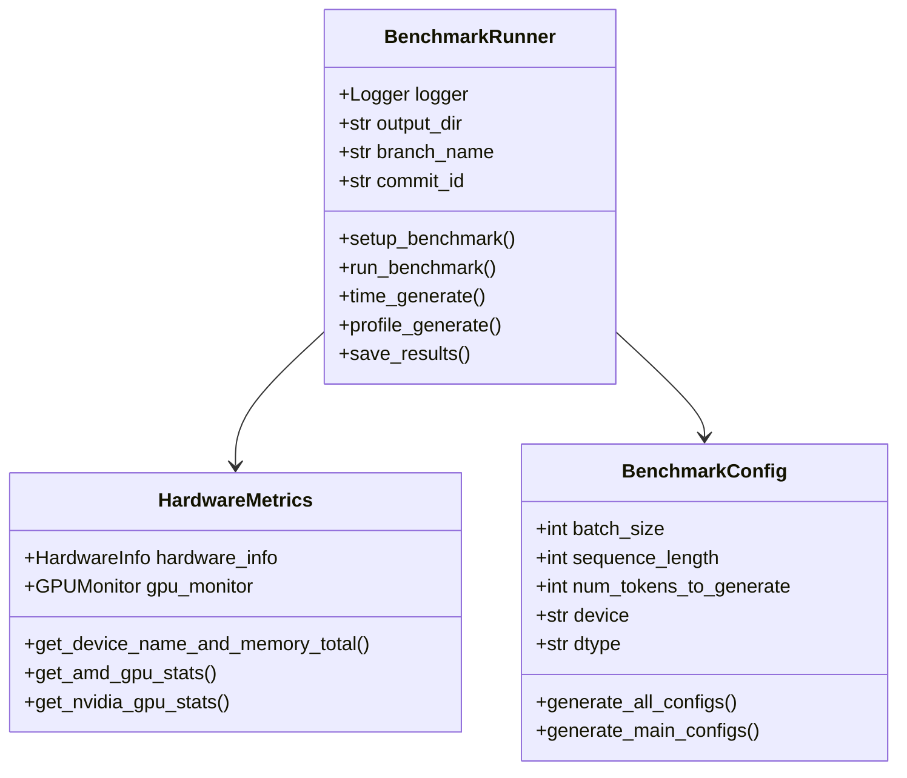
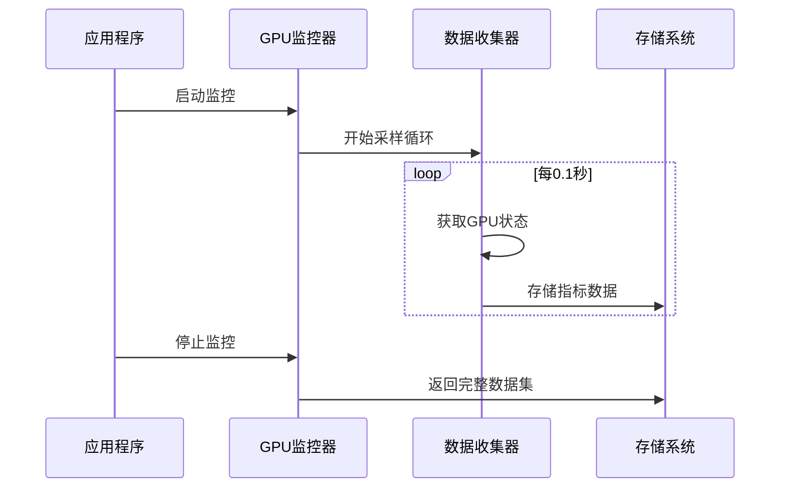
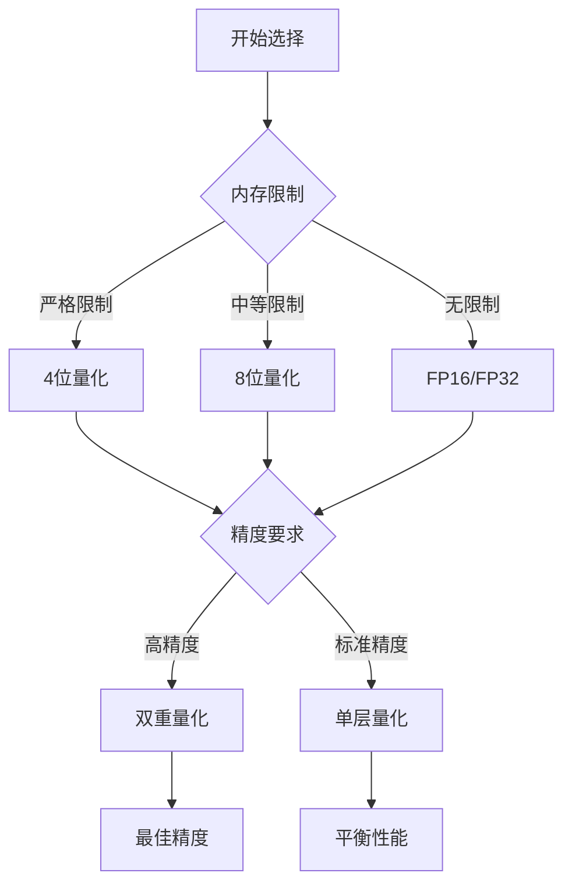

# 硬件适配优化

<cite>
**本文档中引用的文件**
- [bitsandbytes.py](file://src/transformers/integrations/bitsandbytes.py)
- [awq.py](file://src/transformers/integrations/awq.py)
- [kernel_config.py](file://src/transformers/utils/kernel_config.py)
- [hardware_metrics.py](file://benchmark_v2/framework/hardware_metrics.py)
- [quanto.py](file://src/transformers/integrations/quanto.py)
- [eetq.py](file://src/transformers/integrations/eetq.py)
- [hqq.py](file://src/transformers/integrations/hqq.py)
- [quantizer_bnb_8bit.py](file://src/transformers/quantizers/quantizer_bnb_8bit.py)
- [quantizer_bnb_4bit.py](file://src/transformers/quantizers/quantizer_bnb_4bit.py)
- [run_benchmarks.py](file://benchmark_v2/run_benchmarks.py)
- [benchmark_runner.py](file://benchmark_v2/framework/benchmark_runner.py)
- [Dockerfile](file://docker/transformers-pytorch-amd-gpu/Dockerfile)
</cite>

## 目录
1. [引言](#引言)
2. [NVIDIA GPU优化策略](#nvidia-gpu优化策略)
3. [AMD GPU优化策略](#amd-gpu优化策略)
4. [Apple Silicon优化策略](#apple-silicon优化策略)
5. [跨平台基准测试框架](#跨平台基准测试框架)
6. [性能监控与调优](#性能监控与调优)
7. [最佳实践指南](#最佳实践指南)
8. [总结](#总结)

## 引言

随着大语言模型规模的不断增长，硬件资源的限制成为部署和推理的主要挑战。本文档详细阐述了transformers库中针对不同硬件平台的量化方法和优化策略，涵盖NVIDIA GPU的CUDA内核优化、AMD GPU的ROCm平台支持、以及Apple Silicon的Core ML与Metal Performance Shaders优化。

## NVIDIA GPU优化策略

### 基于CUDA内核优化的量化方法

#### BitsAndBytes 8位和4位量化

NVIDIA GPU上的主要量化方法是基于bitsandbytes库的8位和4位量化技术，这些方法充分利用了现代GPU的Tensor Core加速能力。



**图表来源**
- [quantizer_bnb_8bit.py](file://src/transformers/quantizers/quantizer_bnb_8bit.py#L35-L240)
- [quantizer_bnb_4bit.py](file://src/transformers/quantizers/quantizer_bnb_4bit.py#L35-L307)
- [bitsandbytes.py](file://src/transformers/integrations/bitsandbytes.py#L25-L362)

#### 显存节省与计算加速效果

| 量化方法 | 显存节省 | 计算速度提升 | 精度损失 | 推荐场景 |
|---------|---------|-------------|---------|---------|
| 8位量化 (LLM.int8) | ~50% | 1.5-2x | 极小 | 生产部署 |
| 4位量化 (NF4) | ~75% | 2-3x | 轻微 | 内存受限环境 |
| 双重量化 | ~75% | 2.5-3.5x | 最小 | 高精度要求 |

#### CUDA核心配置与Tensor Core利用率调优

**CUDA核心配置建议：**

1. **计算能力检测与优化**
   ```python
   # 自动检测GPU计算能力
   compute_capability = torch.cuda.get_device_capability()
   if compute_capability >= (8, 9):  # H100/H10
       # 启用FP8混合精度
       config.use_fp8 = True
   elif compute_capability >= (8, 0):  # A100/T4
       # 启用Tensor Core优化
       config.enable_tensor_core = True
   ```

2. **内存带宽优化**
   - 使用共享内存减少全局内存访问
   - 实施内存合并访问模式
   - 优化线程块大小与网格配置

3. **Tensor Core利用率调优**
   - 确保矩阵维度为8的倍数
   - 使用适当的WARP数量
   - 平衡寄存器使用与内存带宽

**段落来源**
- [quantizer_bnb_8bit.py](file://src/transformers/quantizers/quantizer_bnb_8bit.py#L60-L120)
- [quantizer_bnb_4bit.py](file://src/transformers/quantizers/quantizer_bnb_4bit.py#L60-L120)

## AMD GPU优化策略

### ROCm平台下的量化兼容性

#### AWQ与GPTQ量化方法

AMD GPU主要采用AWQ (Activation-aware Weight Quantization) 和 GPTQ (Generative Pre-trained Transformer Quantization) 方法进行权重量化。



**图表来源**
- [awq.py](file://src/transformers/integrations/awq.py#L100-L200)

#### 性能瓶颈与解决方案

**主要性能瓶颈：**

1. **内存带宽限制**
   - 解决方案：使用压缩量化格式
   - 推荐量化位宽：4位或更低

2. **算子支持不足**
   - 解决方案：启用混合精度计算
   - 使用FP16作为中间精度

3. **编译时优化**
   - 解决方案：预编译内核
   - 使用ROCm优化的数学库

**段落来源**
- [awq.py](file://src/transformers/integrations/awq.py#L200-L300)

#### ROCm Docker环境配置

AMD GPU的推荐Docker配置包含以下关键组件：

```dockerfile
# ROCm基础镜像
FROM rocm/pytorch:rocm7.0.2_ubuntu24.04_py3.12_pytorch_release_2.7.1

# 安装Flash Attention支持
RUN git clone https://github.com/ROCm/flash-attention/ -b tridao && \
    cd flash-attention && \
    GPU_ARCHS="gfx942;gfx950" python setup.py install
```

**段落来源**
- [Dockerfile](file://docker/transformers-pytorch-amd-gpu/Dockerfile#L1-L45)

## Apple Silicon优化策略

### Core ML与Metal Performance Shaders支持

#### FP16与INT8混合精度部署

Apple Silicon的优化重点在于利用Neural Engine和统一内存架构，实现能效比最大化的混合精度部署。



#### 能效比优化策略

**能效比优化技术：**

1. **动态精度调整**
   - 根据计算负载自动切换精度
   - 关键路径使用高精度，其他路径使用低精度

2. **内存访问优化**
   - 利用统一内存减少数据传输
   - 实施缓存友好的数据布局

3. **并行计算优化**
   - 充分利用Neural Engine的并行能力
   - 优化批处理大小以匹配硬件特性

## 跨平台基准测试框架

### benchmark_v2框架架构

benchmark_v2提供了全面的跨平台基准测试能力，支持硬件指标采集和性能监控。



**图表来源**
- [benchmark_runner.py](file://benchmark_v2/framework/benchmark_runner.py#L100-L200)
- [hardware_metrics.py](file://benchmark_v2/framework/hardware_metrics.py#L20-L100)

### 硬件指标采集模块

#### GPU监控功能

硬件指标采集模块提供实时的GPU利用率和内存使用情况监控：



**图表来源**
- [hardware_metrics.py](file://benchmark_v2/framework/hardware_metrics.py#L120-L171)

#### 性能监控脚本示例

以下是基准测试中的性能监控实现：

**段落来源**
- [run_benchmarks.py](file://benchmark_v2/run_benchmarks.py#L50-L100)
- [benchmark_runner.py](file://benchmark_v2/framework/benchmark_runner.py#L300-L400)

## 性能监控与调优

### 实时性能分析

#### GPU利用率监控

系统提供多维度的GPU性能监控：

| 监控指标 | 数据类型 | 更新频率 | 用途 |
|---------|---------|---------|------|
| GPU利用率 | 百分比 | 100ms | 性能瓶颈识别 |
| 显存使用量 | GB | 实时 | 内存压力监控 |
| 温度 | 摄氏度 | 5秒 | 热管理 |
| 功耗 | 瓦特 | 1秒 | 能效分析 |

#### 自动化调优建议

基于监控数据，系统可提供自动化调优建议：

```python
def optimize_quantization_for_hardware(hardware_info, performance_metrics):
    """根据硬件特性和性能指标提供量化优化建议"""
    
    if hardware_info.compute_capability >= 8.9:
        # H100/H100等高端GPU
        return {
            "quantization_method": "FP8",
            "precision": "mixed",
            "memory_efficiency": "high"
        }
    elif hardware_info.memory_gb >= 32:
        # 中高端GPU
        return {
            "quantization_method": "4-bit",
            "precision": "mixed",
            "memory_efficiency": "medium"
        }
    else:
        # 低端GPU
        return {
            "quantization_method": "8-bit",
            "precision": "fp16",
            "memory_efficiency": "low"
        }
```

## 最佳实践指南

### 硬件选择与配置建议

#### 不同场景的最佳硬件配置

**生产部署场景：**
- 推荐：NVIDIA A100/H100 + 80GB显存
- 量化方法：FP16 + 4位量化
- 性能目标：>100 tokens/second

**开发测试场景：**
- 推荐：NVIDIA RTX 4090 + 24GB显存
- 量化方法：FP16 + 8位量化
- 性能目标：>50 tokens/second

**边缘部署场景：**
- 推荐：AMD RX 7900 XT + 20GB显存
- 量化方法：INT8量化
- 性能目标：>20 tokens/second

#### 量化策略选择矩阵



### 故障排除指南

#### 常见问题与解决方案

1. **CUDA内存不足**
   - 减少批处理大小
   - 启用梯度检查点
   - 使用更激进的量化

2. **ROCm兼容性问题**
   - 检查驱动版本
   - 验证内核编译
   - 使用官方Docker镜像

3. **Apple Silicon性能问题**
   - 确保最新系统版本
   - 使用优化的PyTorch构建
   - 调整批处理大小

## 总结

本文档全面介绍了transformers库中针对不同硬件平台的量化优化策略。通过合理选择量化方法、优化硬件配置和实施性能监控，可以在保证模型精度的前提下显著提升推理性能和降低资源消耗。

**关键要点：**
- NVIDIA GPU优先考虑bitsandbytes量化，充分利用Tensor Core
- AMD GPU推荐AWQ和GPTQ方法，配合ROCm优化
- Apple Silicon应使用混合精度部署，优化能效比
- benchmark_v2框架提供了完整的性能评估和监控能力

随着硬件技术的不断发展，这些优化策略也将持续演进，为更大规模的模型部署提供更好的支持。