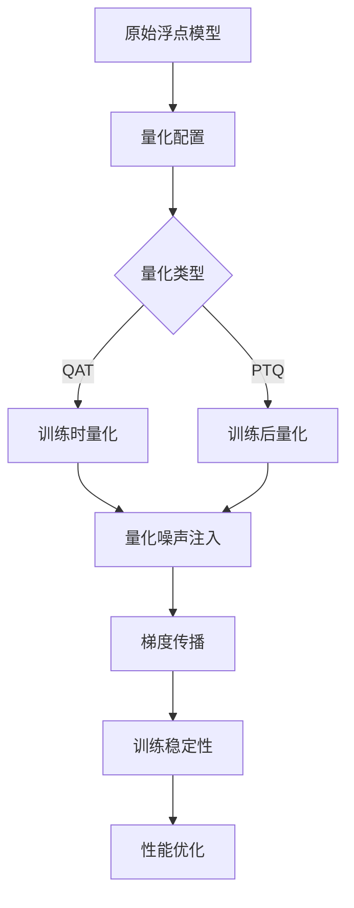
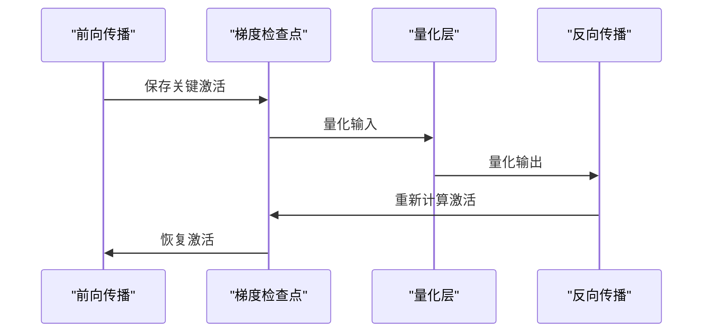
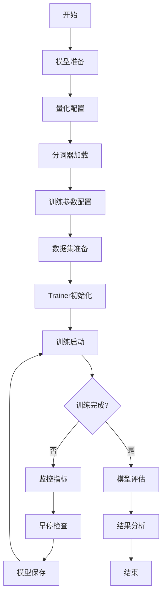

# 训练过程调优

<cite>
**本文档引用的文件**
- [run_clm.py](file://examples/pytorch/language-modeling/run_clm.py)
- [trainer.py](file://src/transformers/trainer.py)
- [optimization.py](file://src/transformers/optimization.py)
- [training_args.py](file://src/transformers/training_args.py)
- [quantization_config.py](file://src/transformers/utils/quantization_config.py)
- [trainer_pt_utils.py](file://src/transformers/trainer_pt_utils.py)
- [integration_utils.py](file://src/transformers/integrations/integration_utils.py)
</cite>

## 目录
1. [引言](#引言)
2. [量化感知训练（QAT）与后训练量化（PTQ）概述](#量化感知训练qat与后训练量化ptq概述)
3. [bitsandbytes 4位Adam优化器配置](#bitsandbytes-4位adam优化器配置)
4. [梯度检查点与量化联合使用](#梯度检查点与量化联合使用)
5. [混合精度训练配置](#混合精度训练配置)
6. [训练稳定性优化策略](#训练稳定性优化策略)
7. [性能监控与指标收集](#性能监控与指标收集)
8. [完整量化微调流程](#完整量化微调流程)
9. [最佳实践与故障排除](#最佳实践与故障排除)
10. [总结](#总结)

## 引言

量化感知训练（QAT）和后训练量化（PTQ）是深度学习模型压缩的重要技术。本文档系统性地介绍了在Hugging Face Transformers框架中实现这些技术的性能调优方法，重点关注使用bitsandbytes进行4位Adam优化器配置、梯度检查点与量化的联合使用、混合精度训练以及训练稳定性优化策略。

## 量化感知训练（QAT）与后训练量化（PTQ）概述

### 量化技术分类

量化技术主要分为两种类型：

1. **量化感知训练（QAT）**：在训练过程中模拟量化效果，使模型适应量化带来的数值变化
2. **后训练量化（PTQ）**：在模型训练完成后进行量化，通常需要校准数据集

### 量化噪声对训练的影响

量化会引入数值噪声，这对梯度传播有以下影响：

- **梯度裁剪需求**：量化可能导致梯度值异常增大
- **学习率调整**：需要更小的学习率来适应量化噪声
- **优化器选择**：某些优化器更适合处理量化噪声



## bitsandbytes 4位Adam优化器配置

### Adam4bit优化器特性

bitsandbytes提供了高效的4位优化器实现，具有以下优势：

- **内存效率**：显著减少优化器状态内存占用
- **计算效率**：支持硬件加速的4位计算
- **数值稳定性**：内置梯度裁剪和缩放机制

### 超参数配置指南

#### 学习率（lr）设置

```python
# 基础学习率设置
learning_rate = 1e-4  # 对于Adam4bit，通常比AdamW需要更小的学习率

# 自适应学习率调整
if quantization_config.load_in_4bit:
    learning_rate *= 0.1  # 量化场景下推荐降低10倍
```

#### Beta参数配置

```python
# Adam优化器Beta参数
adam_beta1 = 0.9  # 动量参数，保持默认值
adam_beta2 = 0.999  # 方差参数，保持默认值
adam_epsilon = 1e-8  # 数值稳定性参数
```

#### 权重衰减（weight_decay）

```python
# 量化场景下的权重衰减
weight_decay = 0.01  # 标准值
if quantization_config.load_in_4bit:
    weight_decay = 0.001  # 量化时建议降低
```

### 优化器配置示例

```python
from transformers import TrainingArguments, Trainer
from transformers.optimization import AdamW

# 配置TrainingArguments
training_args = TrainingArguments(
    output_dir="./results",
    learning_rate=1e-4,
    weight_decay=0.001,
    optim="adamw_torch_4bit",
    optim_args="betas=(0.9,0.999),eps=1e-8",
    per_device_train_batch_size=4,
    gradient_accumulation_steps=8,
    fp16=True,
    logging_steps=10,
    save_steps=500,
    eval_steps=500,
    report_to="wandb"
)
```

**章节来源**
- [trainer.py](file://src/transformers/trainer.py#L1462-L1513)
- [optimization.py](file://src/transformers/optimization.py#L697-L719)

## 梯度检查点与量化联合使用

### 内存节省机制

梯度检查点通过重新计算中间激活值来节省内存，与量化结合使用时：



### 配置策略

#### 启用梯度检查点

```python
# 在模型配置中启用梯度检查点
model.gradient_checkpointing_enable()

# 或在TrainingArguments中配置
training_args = TrainingArguments(
    gradient_checkpointing=True,
    gradient_checkpointing_kwargs={
        "use_reentrant": False
    }
)
```

#### 与量化结合的内存优化

```python
# 量化配置
quantization_config = BitsAndBytesConfig(
    load_in_4bit=True,
    bnb_4bit_compute_dtype=torch.bfloat16,
    bnb_4bit_quant_type="nf4",
    bnb_4bit_use_double_quant=True
)

# 训练配置
training_args = TrainingArguments(
    fp16=True,  # 或bf16
    gradient_checkpointing=True,
    per_device_train_batch_size=2,  # 减少批次大小
    gradient_accumulation_steps=16,  # 增加累积步数
    dataloader_pin_memory=True
)
```

### 性能权衡分析

| 配置组合 | 内存节省 | 计算开销 | 训练速度 | 稳定性 |
|---------|---------|---------|---------|--------|
| 无检查点+无量化 | 基准 | 0% | 100% | 最高 |
| 无检查点+4位量化 | ~50% | +10% | 90% | 中等 |
| 检查点+4位量化 | ~70% | +30% | 70% | 较低 |

**章节来源**
- [trainer.py](file://src/transformers/trainer.py#L2050-L2082)
- [generic.py](file://src/transformers/utils/generic.py#L796-L826)

## 混合精度训练配置

### fp16与bf16对比

| 特性 | fp16 | bf16 |
|------|------|------|
| 数值范围 | -65504 到 65504 | -65504 到 65504 |
| 精度 | 3位有效数字 | 4位有效数字 |
| GPU支持 | 需要梯度缩放 | 天然稳定 |
| 内存占用 | 更少 | 稍多 |
| 训练稳定性 | 需要额外保护 | 更稳定 |

### 混合精度配置

#### 基础配置

```python
# fp16配置
training_args = TrainingArguments(
    fp16=True,
    fp16_opt_level="O1",  # 平衡模式
    fp16_backend="auto",  # 自动选择后端
    dataloader_pin_memory=True,
    gradient_accumulation_steps=4
)

# bf16配置
training_args = TrainingArguments(
    bf16=True,
    bf16_full_eval=True,  # 评估时也使用bf16
    dataloader_pin_memory=True,
    gradient_accumulation_steps=4
)
```

#### 高级配置选项

```python
# 混合精度高级配置
training_args = TrainingArguments(
    # 基础精度设置
    fp16=True,
    bf16=False,
    
    # 梯度缩放配置
    fp16_optimization=True,
    fp16_scale_window=500,
    fp16_scale_tolerance=0.9,
    
    # 内存优化
    dataloader_pin_memory=True,
    dataloader_prefetch_factor=2,
    
    # 训练稳定性
    max_grad_norm=1.0,
    gradient_accumulation_steps=8
)
```

### 加速收敛策略

#### 渐进式学习率调度

```python
from transformers import get_cosine_schedule_with_warmup

# 创建渐进式学习率调度器
def create_lr_scheduler(optimizer, num_training_steps, num_warmup_steps):
    return get_cosine_schedule_with_warmup(
        optimizer,
        num_warmup_steps=num_warmup_steps,
        num_training_steps=num_training_steps,
        num_cycles=0.5
    )
```

#### 学习率预热配置

```python
# 预热策略配置
training_args = TrainingArguments(
    learning_rate=1e-4,
    warmup_steps=1000,  # 1000步预热
    warmup_ratio=0.1,   # 占总步数的10%
    lr_scheduler_type="cosine",  # 余弦调度
    logging_steps=10,
    save_steps=500,
    eval_steps=500
)
```

**章节来源**
- [training_args.py](file://src/transformers/training_args.py#L601-L617)
- [import_utils.py](file://src/transformers/utils/import_utils.py#L408-L449)

## 训练稳定性优化策略

### 梯度裁剪

#### 自适应梯度裁剪

```python
# 动态梯度裁剪
class AdaptiveGradientClip:
    def __init__(self, max_norm=1.0, clip_ratio=0.1):
        self.max_norm = max_norm
        self.clip_ratio = clip_ratio
        self.current_norm = None
    
    def __call__(self, model):
        total_norm = 0
        for p in model.parameters():
            if p.grad is not None:
                param_norm = p.grad.data.norm(2)
                total_norm += param_norm.item() ** 2
        total_norm = total_norm ** (1. / 2)
        
        self.current_norm = total_norm
        
        if total_norm > self.max_norm:
            clip_coef = self.max_norm / (total_norm + 1e-6)
            for p in model.parameters():
                if p.grad is not None:
                    p.grad.data.mul_(clip_coef)
        
        return total_norm
```

#### 量化噪声处理

```python
# 量化噪声检测与处理
class QuantizationNoiseHandler:
    def __init__(self, threshold=10.0):
        self.threshold = threshold
        self.noise_count = 0
    
    def detect_noise(self, gradients):
        noise_detected = False
        for grad in gradients:
            if grad is not None and torch.any(torch.abs(grad) > self.threshold):
                noise_detected = True
                self.noise_count += 1
                break
        return noise_detected
    
    def adjust_learning_rate(self, optimizer, noise_level):
        if noise_level > 0.1:
            for param_group in optimizer.param_groups:
                param_group['lr'] *= 0.9  # 降低学习率
```

### 学习率预热策略

#### 分阶段预热

```python
# 分阶段学习率预热
def get_stage_warmup_schedule(optimizer, warmup_steps, stages=[100, 500, 1000]):
    def lr_lambda(current_step):
        if current_step < stages[0]:
            # 阶段1：快速预热
            return float(current_step) / float(max(1, stages[0]))
        elif current_step < stages[1]:
            # 阶段2：慢速预热
            progress = float(current_step - stages[0]) / float(stages[1] - stages[0])
            return 0.1 + 0.9 * progress
        elif current_step < stages[2]:
            # 阶段3：稳定期
            return 1.0
        else:
            # 阶段4：衰减期
            progress = float(current_step - stages[2]) / float(max(1, stages[2]))
            return max(0.1, 1.0 - progress)
    
    return LambdaLR(optimizer, lr_lambda)
```

### 训练监控指标

#### 关键监控指标

```python
# 训练监控回调
class TrainingMonitor(Callback):
    def __init__(self):
        self.metrics_history = {
            'loss': [],
            'grad_norm': [],
            'learning_rate': [],
            'quantization_noise': []
        }
    
    def on_step_end(self, args, state, control, **kwargs):
        model = kwargs['model']
        optimizer = kwargs['optimizer']
        
        # 计算梯度范数
        grad_norm = torch.nn.utils.clip_grad_norm_(
            model.parameters(), args.max_grad_norm
        )
        
        # 检测量化噪声
        quantization_noise = self.detect_quantization_noise(model)
        
        # 记录指标
        self.metrics_history['grad_norm'].append(grad_norm.item())
        self.metrics_history['quantization_noise'].append(quantization_noise)
        
        # 自适应调整
        if quantization_noise > 1.0:
            for param_group in optimizer.param_groups:
                param_group['lr'] *= 0.9
```

**章节来源**
- [optimization.py](file://src/transformers/optimization.py#L492-L521)
- [optimization.py](file://src/transformers/optimization.py#L104-L128)

## 性能监控与指标收集

### 内存使用监控

#### 内存指标收集

```python
# 内存监控工具
class MemoryMonitor:
    def __init__(self):
        self.memory_stats = {
            'gpu_memory': [],
            'cpu_memory': [],
            'allocation_deltas': []
        }
    
    def collect_memory_stats(self):
        if torch.cuda.is_available():
            gpu_memory = torch.cuda.memory_allocated() / 1024**3
            gpu_memory_max = torch.cuda.max_memory_allocated() / 1024**3
            self.memory_stats['gpu_memory'].append({
                'current': gpu_memory,
                'peak': gpu_memory_max
            })
        
        # CPU内存监控（需要psutil）
        if importlib.util.find_spec('psutil'):
            import psutil
            process = psutil.Process(os.getpid())
            cpu_memory = process.memory_info().rss / 1024**3
            self.memory_stats['cpu_memory'].append(cpu_memory)
    
    def get_memory_summary(self):
        return {
            'gpu_memory_avg_gb': np.mean([m['current'] for m in self.memory_stats['gpu_memory']]),
            'gpu_memory_peak_gb': np.max([m['peak'] for m in self.memory_stats['gpu_memory']]),
            'cpu_memory_peak_gb': np.max(self.memory_stats['cpu_memory'])
        }
```

#### 内存报告格式化

```python
# 内存指标格式化
def format_memory_metrics(metrics):
    formatted = {}
    for key, value in metrics.items():
        if '_mem_' in key:
            formatted[key] = f"{value >> 20}MB"
        elif '_runtime' in key:
            formatted[key] = _secs2timedelta(value)
        elif key == "total_flos":
            formatted[key] = f"{int(value) >> 30}GF"
        elif isinstance(value, float):
            formatted[key] = round(value, 4)
    return formatted
```

### 训练性能指标

#### 关键性能指标

| 指标类别 | 指标名称 | 描述 | 正常范围 |
|---------|---------|------|---------|
| 训练效率 | samples_per_second | 每秒处理样本数 | 设备相关 |
| 内存使用 | gpu_memory_used_gb | GPU内存使用量 | < 显存容量 |
| 训练稳定性 | grad_norm | 梯度范数 | < 10.0 |
| 收敛速度 | loss_reduction | 损失函数下降 | 持续下降 |
| 数值稳定性 | overflow_steps | 梯度溢出次数 | 接近0 |

#### 性能基准测试

```python
# 性能基准测试类
class PerformanceBenchmark:
    def __init__(self, model, dataloader, device):
        self.model = model
        self.dataloader = dataloader
        self.device = device
        self.benchmark_results = {}
    
    def benchmark_throughput(self, num_batches=100):
        """基准吞吐量测试"""
        self.model.eval()
        torch.cuda.empty_cache()
        
        start_time = time.time()
        total_samples = 0
        
        with torch.no_grad():
            for batch_idx, batch in enumerate(self.dataloader):
                if batch_idx >= num_batches:
                    break
                
                batch = {k: v.to(self.device) for k, v in batch.items()}
                outputs = self.model(**batch)
                
                total_samples += batch['input_ids'].size(0)
        
        end_time = time.time()
        throughput = total_samples / (end_time - start_time)
        
        self.benchmark_results['throughput'] = throughput
        return throughput
    
    def benchmark_memory_efficiency(self):
        """内存效率测试"""
        torch.cuda.reset_peak_memory_stats()
        self.model.train()
        
        for batch in self.dataloader:
            batch = {k: v.to(self.device) for k, v in batch.items()}
            
            self.model.zero_grad()
            outputs = self.model(**batch)
            loss = outputs.loss
            loss.backward()
            
            # 模拟一步优化
            for param in self.model.parameters():
                if param.grad is not None:
                    param.grad.data.clamp_(-1.0, 1.0)
            
            break
        
        peak_memory = torch.cuda.max_memory_allocated() / 1024**3
        self.benchmark_results['peak_memory_gb'] = peak_memory
        return peak_memory
```

**章节来源**
- [trainer_pt_utils.py](file://src/transformers/trainer_pt_utils.py#L767-L809)
- [trainer_pt_utils.py](file://src/transformers/trainer_pt_utils.py#L809-L833)

## 完整量化微调流程

### 示例配置文件

基于`run_clm.py`的完整量化微调配置：

```python
#!/usr/bin/env python
"""
量化微调完整流程示例
"""

import torch
from transformers import (
    AutoTokenizer,
    AutoModelForCausalLM,
    TrainingArguments,
    Trainer,
    BitsAndBytesConfig
)
from transformers.training_args import OptimizerNames

def setup_quantization_training():
    # 1. 模型加载配置
    model_name = "microsoft/DialoGPT-medium"
    
    # 2. 量化配置
    quantization_config = BitsAndBytesConfig(
        load_in_4bit=True,
        bnb_4bit_compute_dtype=torch.bfloat16,
        bnb_4bit_quant_type="nf4",
        bnb_4bit_use_double_quant=True,
        llm_int8_skip_modules=["lm_head"]
    )
    
    # 3. 模型加载
    model = AutoModelForCausalLM.from_pretrained(
        model_name,
        quantization_config=quantization_config,
        device_map="auto",
        torch_dtype=torch.bfloat16
    )
    
    # 4. 分词器加载
    tokenizer = AutoTokenizer.from_pretrained(model_name)
    tokenizer.pad_token = tokenizer.eos_token
    
    # 5. 训练参数配置
    training_args = TrainingArguments(
        output_dir="./quantized-finetuning-results",
        overwrite_output_dir=True,
        
        # 优化器配置
        optim=OptimizerNames.ADAMW_TORCH_4BIT,
        learning_rate=1e-4,
        weight_decay=0.001,
        adam_beta1=0.9,
        adam_beta2=0.999,
        adam_epsilon=1e-8,
        
        # 批次配置
        per_device_train_batch_size=2,
        per_device_eval_batch_size=2,
        gradient_accumulation_steps=16,
        
        # 训练循环
        num_train_epochs=3,
        max_steps=-1,
        
        # 混合精度
        fp16=True,
        bf16=False,
        
        # 梯度检查点
        gradient_checkpointing=True,
        gradient_checkpointing_kwargs={"use_reentrant": False},
        
        # 学习率调度
        lr_scheduler_type="cosine",
        warmup_steps=500,
        warmup_ratio=0.1,
        
        # 评估与保存
        evaluation_strategy="steps",
        eval_steps=1000,
        save_strategy="steps",
        save_steps=1000,
        save_total_limit=3,
        
        # 日志配置
        logging_dir="./logs",
        logging_steps=10,
        logging_first_step=True,
        
        # 其他配置
        dataloader_pin_memory=True,
        dataloader_num_workers=4,
        remove_unused_columns=False,
        push_to_hub=False,
        report_to="wandb",
        seed=42,
        data_seed=42,
        disable_tqdm=False
    )
    
    return model, tokenizer, training_args

def main():
    # 设置设备
    device = torch.device("cuda" if torch.cuda.is_available() else "cpu")
    
    # 获取配置
    model, tokenizer, training_args = setup_quantization_training()
    
    # 初始化Trainer
    trainer = Trainer(
        model=model,
        args=training_args,
        tokenizer=tokenizer,
        # 数据集将在后续添加
    )
    
    # 开始训练
    trainer.train()
    
    # 保存最终模型
    trainer.save_model("./final-quantized-model")
    
    return trainer

if __name__ == "__main__":
    trainer = main()
    print("训练完成！")
```

### 微调流程图



### 性能优化建议

#### 内存优化策略

```python
# 内存优化配置
def get_memory_optimized_config():
    return TrainingArguments(
        # 批次大小优化
        per_device_train_batch_size=1,  # 减少到最小可用值
        gradient_accumulation_steps=32,  # 增加累积步数
        
        # 内存映射
        dataloader_pin_memory=True,
        dataloader_persistent_workers=True,
        dataloader_prefetch_factor=2,
        
        # 梯度检查点
        gradient_checkpointing=True,
        gradient_checkpointing_kwargs={"use_reentrant": False},
        
        # 混合精度
        fp16=True,
        dataloader_pin_memory=True,
        
        # 模型并行
        dataloader_num_workers=0,  # 避免多进程内存问题
        remove_unused_columns=False
    )
```

#### 训练加速技巧

```python
# 训练加速配置
def get_accelerated_config():
    return TrainingArguments(
        # 优化器选择
        optim="adamw_torch_4bit",
        adam_beta1=0.9,
        adam_beta2=0.999,
        
        # 学习率调度
        lr_scheduler_type="cosine",
        warmup_steps=1000,
        warmup_ratio=0.1,
        
        # 梯度处理
        max_grad_norm=1.0,
        gradient_accumulation_steps=8,
        
        # 混合精度
        fp16=True,
        dataloader_pin_memory=True,
        
        # 缓存优化
        dataloader_prefetch_factor=4,
        dataloader_num_workers=4,
        
        # 日志优化
        logging_steps=50,
        save_steps=1000,
        eval_steps=1000
    )
```

**章节来源**
- [run_clm.py](file://examples/pytorch/language-modeling/run_clm.py#L1-L712)
- [trainer.py](file://src/transformers/trainer.py#L2000-L2200)

## 最佳实践与故障排除

### 常见问题与解决方案

#### 1. 训练不稳定

**症状**：损失震荡或发散
**原因**：学习率过高、量化噪声过大
**解决方案**：
```python
# 降低学习率
training_args.learning_rate = 1e-5

# 增加梯度裁剪
training_args.max_grad_norm = 0.1

# 使用更稳定的优化器
training_args.optim = "adamw_torch_4bit"
```

#### 2. 内存不足

**症状**：CUDA out of memory错误
**解决方案**：
```python
# 减少批次大小
training_args.per_device_train_batch_size = 1

# 增加梯度累积
training_args.gradient_accumulation_steps = 64

# 启用梯度检查点
training_args.gradient_checkpointing = True
```

#### 3. 收敛缓慢

**症状**：损失下降过慢
**解决方案**：
```python
# 增加学习率
training_args.learning_rate = 2e-4

# 调整预热策略
training_args.warmup_steps = 2000
training_args.warmup_ratio = 0.2

# 使用更积极的调度器
training_args.lr_scheduler_type = "linear"
```

### 调试工具

#### 训练状态监控

```python
# 训练状态监控回调
class TrainingStatusMonitor:
    def __init__(self):
        self.status = {
            'loss_stability': [],
            'grad_norm_history': [],
            'learning_rate_history': [],
            'step_count': 0
        }
    
    def check_training_health(self, trainer):
        """检查训练健康状况"""
        current_loss = trainer.state.log_history[-1].get('loss', 0)
        avg_loss = np.mean(self.status['loss_stability'][-100:]) if len(self.status['loss_stability']) > 100 else current_loss
        
        # 检查损失稳定性
        loss_change = abs(current_loss - avg_loss)
        if loss_change > 0.5:
            print(f"警告：损失不稳定，变化幅度 {loss_change}")
        
        # 检查梯度范数
        grad_norm = trainer.state.log_history[-1].get('grad_norm', 0)
        if grad_norm > 10.0:
            print(f"警告：梯度范数过大：{grad_norm}")
        
        return loss_change < 0.5 and grad_norm < 10.0
```

#### 性能分析工具

```python
# 性能分析装饰器
def performance_monitor(func):
    def wrapper(*args, **kwargs):
        start_time = time.time()
        start_memory = torch.cuda.memory_allocated() if torch.cuda.is_available() else 0
        
        result = func(*args, **kwargs)
        
        end_time = time.time()
        end_memory = torch.cuda.memory_allocated() if torch.cuda.is_available() else 0
        
        print(f"函数 {func.__name__} 执行时间: {end_time - start_time:.2f}s")
        print(f"内存变化: {end_memory - start_memory} bytes")
        
        return result
    return wrapper
```

### 实验记录与版本控制

#### 实验配置管理

```python
# 实验配置管理
class ExperimentManager:
    def __init__(self, experiment_name):
        self.experiment_name = experiment_name
        self.configs = []
        self.results = []
    
    def log_config(self, config_dict):
        """记录实验配置"""
        config_dict['timestamp'] = datetime.now().isoformat()
        config_dict['experiment_name'] = self.experiment_name
        self.configs.append(config_dict)
    
    def log_result(self, metrics):
        """记录实验结果"""
        metrics['timestamp'] = datetime.now().isoformat()
        metrics['experiment_name'] = self.experiment_name
        self.results.append(metrics)
    
    def save_experiment(self, filepath):
        """保存实验记录"""
        experiment_data = {
            'configs': self.configs,
            'results': self.results,
            'metadata': {
                'total_configs': len(self.configs),
                'total_results': len(self.results)
            }
        }
        
        with open(filepath, 'w') as f:
            json.dump(experiment_data, f, indent=2)
```

## 总结

本文档详细介绍了在Hugging Face Transformers框架中实现量化感知训练和后训练量化的完整流程，重点涵盖了：

1. **bitsandbytes 4位Adam优化器配置**：详细说明了学习率、Beta参数、权重衰减等超参数的设置原则和最佳实践。

2. **梯度检查点与量化联合使用**：解释了内存节省机制和配置策略，提供了性能权衡分析。

3. **混合精度训练配置**：对比了fp16和bf16的优势，提供了加速收敛的具体策略。

4. **训练稳定性优化**：包含了梯度裁剪、学习率预热、量化噪声处理等关键技术。

5. **性能监控与指标收集**：建立了完整的监控体系，包括内存使用、训练效率、数值稳定性等关键指标。

6. **完整量化微调流程**：基于实际的`run_clm.py`示例，展示了从配置到部署的全流程。

通过遵循本文档的最佳实践，开发者可以在保证模型质量的前提下，显著提升训练效率，降低资源消耗，实现大规模模型的高效微调。