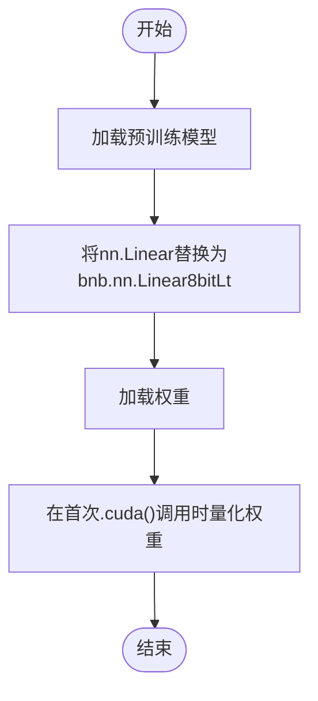
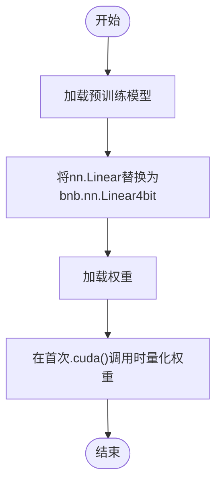
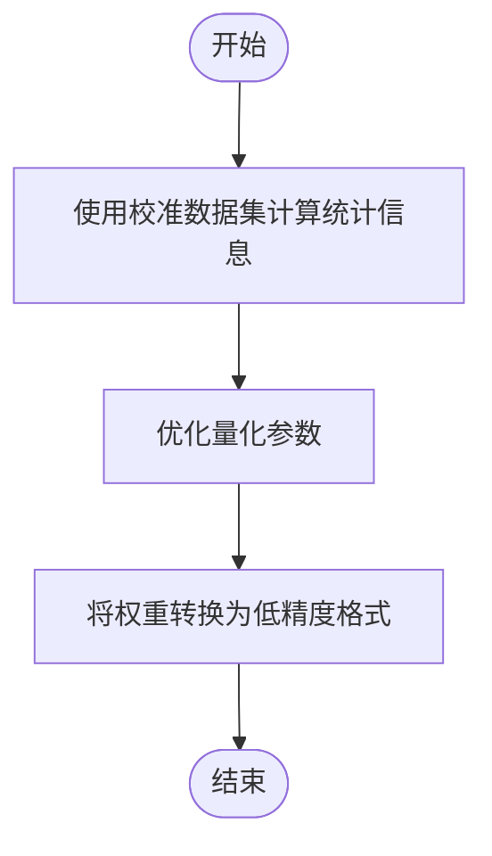
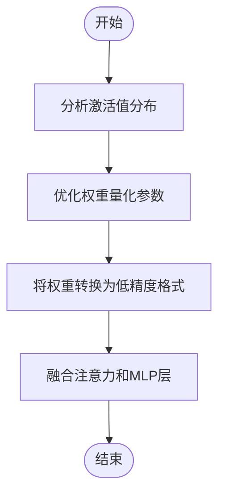
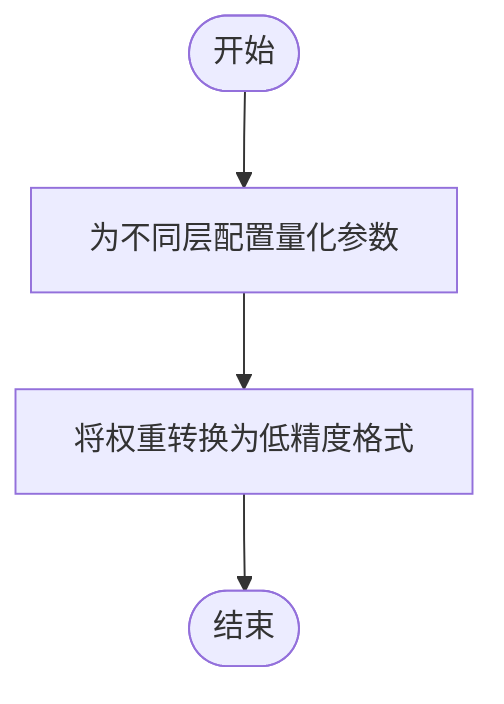
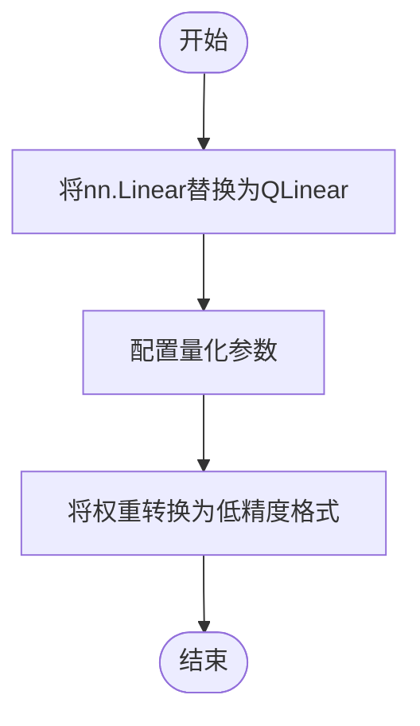
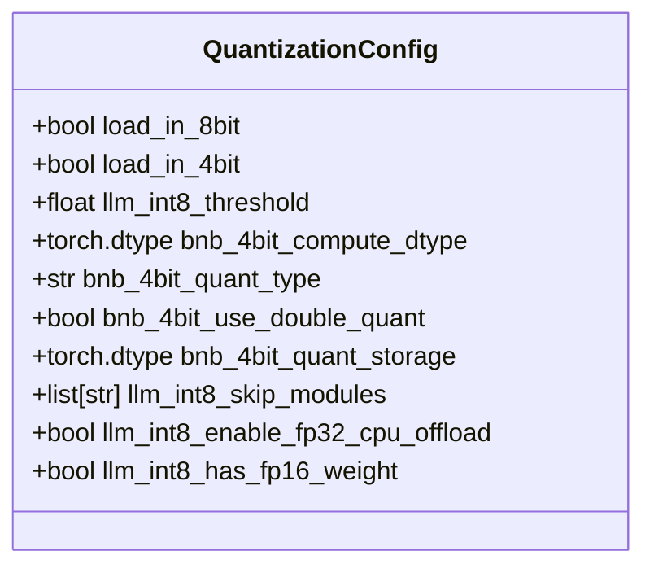

# 模型量化

<cite>
**本文档中引用的文件**   
- [quantization_config.py](file://src/transformers/utils/quantization_config.py)
- [bitsandbytes.py](file://src/transformers/integrations/bitsandbytes.py)
- [awq.py](file://src/transformers/integrations/awq.py)
- [quanto.py](file://src/transformers/integrations/quanto.py)
- [hqq.py](file://src/transformers/integrations/hqq.py)
- [base.py](file://src/transformers/quantizers/base.py)
- [auto.py](file://src/transformers/quantizers/auto.py)
- [quantizer_bnb_8bit.py](file://src/transformers/quantizers/quantizer_bnb_8bit.py)
- [quantizer_bnb_4bit.py](file://src/transformers/quantizers/quantizer_bnb_4bit.py)
- [quantizer_gptq.py](file://src/transformers/quantizers/quantizer_gptq.py)
- [custom_quantization.py](file://examples/quantization/custom_quantization.py)
- [custom_quantization_int8_example.py](file://examples/quantization/custom_quantization_int8_example.py)
</cite>

## 目录
1. [简介](#简介)
2. [量化方法概述](#量化方法概述)
3. [BitsAndBytes量化](#bitsandbytes量化)
4. [GPTQ量化](#gptq量化)
5. [AWQ量化](#awq量化)
6. [HQQ量化](#hqq量化)
7. [Quanto量化](#quanto量化)
8. [量化配置](#量化配置)
9. [量化模型的加载与推理](#量化模型的加载与推理)
10. [量化模型的微调](#量化模型的微调)
11. [性能对比](#性能对比)
12. [常见问题排查](#常见问题排查)

## 简介
模型量化是一种通过降低模型权重和激活值的精度来减少模型大小和计算需求的技术。在transformers库中，支持多种量化方法，包括8位和4位量化（如bnb_8bit、bnb_4bit）、GPTQ、AWQ、HQQ、Quanto等。这些方法可以在保持模型性能的同时显著减少显存占用和提高推理速度。

**Section sources**
- [quantization_config.py](file://src/transformers/utils/quantization_config.py#L1-L50)

## 量化方法概述
transformers库支持多种量化方法，每种方法都有其独特的算法特点和适用场景。主要的量化方法包括：
- **BitsAndBytes**: 支持8位和4位量化，通过LLM.int8()和FP4/NF4量化技术实现。
- **GPTQ**: 一种后训练量化方法，通过校准数据集来优化量化参数。
- **AWQ**: 激活感知权重量化，考虑激活值的分布来优化量化过程。
- **HQQ**: 半二次量化，支持动态配置不同层的量化参数。
- **Quanto**: 一种灵活的量化框架，支持多种量化类型。

**Section sources**
- [quantization_config.py](file://src/transformers/utils/quantization_config.py#L1-L100)

## BitsAndBytes量化
BitsAndBytes量化是transformers库中最常用的量化方法之一，支持8位和4位量化。它通过将线性层替换为8位或4位量化版本来实现。

### 8位量化（bnb_8bit）
8位量化使用LLM.int8()技术，将模型权重转换为8位整数，同时保留一些关键权重为16位浮点数以保持数值稳定性。这种方法可以显著减少显存占用，同时保持较高的推理精度。



**Diagram sources**
- [bitsandbytes.py](file://src/transformers/integrations/bitsandbytes.py#L1-L50)
- [quantizer_bnb_8bit.py](file://src/transformers/quantizers/quantizer_bnb_8bit.py#L1-L30)

### 4位量化（bnb_4bit）
4位量化使用FP4或NF4数据类型，通过双重量化进一步压缩模型。这种方法在保持较高精度的同时，可以将模型大小减少到原来的1/4。



**Diagram sources**
- [bitsandbytes.py](file://src/transformers/integrations/bitsandbytes.py#L1-L50)
- [quantizer_bnb_4bit.py](file://src/transformers/quantizers/quantizer_bnb_4bit.py#L1-L30)

**Section sources**
- [quantization_config.py](file://src/transformers/utils/quantization_config.py#L1-L200)
- [bitsandbytes.py](file://src/transformers/integrations/bitsandbytes.py#L1-L100)
- [quantizer_bnb_8bit.py](file://src/transformers/quantizers/quantizer_bnb_8bit.py#L1-L50)
- [quantizer_bnb_4bit.py](file://src/transformers/quantizers/quantizer_bnb_4bit.py#L1-L50)

## GPTQ量化
GPTQ是一种后训练量化方法，通过在校准数据集上优化量化参数来最小化量化误差。它支持2、3、4、8位量化，并且可以通过不同的后端（如auto-gptq和gptqmodel）来实现。

### 算法特点
GPTQ通过以下步骤实现量化：
1. 使用校准数据集计算每个权重的统计信息。
2. 根据统计信息确定最佳的量化参数（如缩放因子和零点）。
3. 将权重转换为低精度格式。



**Diagram sources**
- [quantizer_gptq.py](file://src/transformers/quantizers/quantizer_gptq.py#L1-L30)

**Section sources**
- [quantization_config.py](file://src/transformers/utils/quantization_config.py#L1-L300)
- [quantizer_gptq.py](file://src/transformers/quantizers/quantizer_gptq.py#L1-L50)

## AWQ量化
AWQ（Activation-aware Weight Quantization）是一种考虑激活值分布的量化方法。它通过分析激活值的分布来优化权重的量化过程，从而减少量化误差。

### 算法特点
AWQ的主要特点包括：
- **激活感知**: 考虑激活值的分布来优化量化参数。
- **灵活的后端支持**: 支持多种后端，如autoawq和llm-awq。
- **高效的推理**: 通过融合注意力和MLP层来提高推理效率。



**Diagram sources**
- [awq.py](file://src/transformers/integrations/awq.py#L1-L50)

**Section sources**
- [quantization_config.py](file://src/transformers/utils/quantization_config.py#L1-L400)
- [awq.py](file://src/transformers/integrations/awq.py#L1-L100)

## HQQ量化
HQQ（Half-Quadratic Quantization）是一种支持动态配置的量化方法，允许对不同层使用不同的量化参数。它特别适用于需要精细控制量化过程的场景。

### 算法特点
HQQ的主要特点包括：
- **动态配置**: 允许为不同层设置不同的量化参数。
- **灵活的量化粒度**: 支持按通道或按权重组进行量化。
- **易于集成**: 通过简单的API即可集成到现有模型中。



**Diagram sources**
- [hqq.py](file://src/transformers/integrations/hqq.py#L1-L30)

**Section sources**
- [quantization_config.py](file://src/transformers/utils/quantization_config.py#L1-L500)
- [hqq.py](file://src/transformers/integrations/hqq.py#L1-L50)

## Quanto量化
Quanto是一种灵活的量化框架，支持多种量化类型，包括int2、int4、int8和float8。它通过将线性层替换为量化版本来实现模型压缩。

### 算法特点
Quanto的主要特点包括：
- **多类型支持**: 支持多种量化类型。
- **简单的API**: 提供简洁的API来配置和应用量化。
- **高效的推理**: 通过优化的内核实现高效的推理。



**Diagram sources**
- [quanto.py](file://src/transformers/integrations/quanto.py#L1-L30)

**Section sources**
- [quantization_config.py](file://src/transformers/utils/quantization_config.py#L1-L600)
- [quanto.py](file://src/transformers/integrations/quanto.py#L1-L50)

## 量化配置
量化配置（QuantizationConfig）是控制量化过程的核心组件。它定义了量化方法、精度、分组大小等参数。

### 配置参数
常见的量化配置参数包括：
- **load_in_8bit/load_in_4bit**: 是否启用8位或4位量化。
- **llm_int8_threshold**: LLM.int8()的异常值阈值。
- **bnb_4bit_compute_dtype**: 4位量化的计算数据类型。
- **bnb_4bit_quant_type**: 4位量化的数据类型（FP4或NF4）。
- **bnb_4bit_use_double_quant**: 是否使用双重量化。



**Diagram sources**
- [quantization_config.py](file://src/transformers/utils/quantization_config.py#L1-L700)

**Section sources**
- [quantization_config.py](file://src/transformers/utils/quantization_config.py#L1-L700)

## 量化模型的加载与推理
加载和推理量化模型的过程与普通模型类似，但需要指定量化配置。

### 加载量化模型
```python
from transformers import AutoModelForCausalLM, BitsAndBytesConfig

# 定义量化配置
quantization_config = BitsAndBytesConfig(
    load_in_4bit=True,
    bnb_4bit_compute_dtype=torch.float16,
    bnb_4bit_quant_type="nf4",
    bnb_4bit_use_double_quant=True,
)

# 加载量化模型
model = AutoModelForCausalLM.from_pretrained(
    "meta-llama/Llama-2-7b-hf",
    quantization_config=quantization_config,
    device_map="auto"
)
```

### 推理
```python
from transformers import AutoTokenizer

tokenizer = AutoTokenizer.from_pretrained("meta-llama/Llama-2-7b-hf")
inputs = tokenizer("Hello, how are you?", return_tensors="pt").to("cuda")

outputs = model.generate(**inputs, max_new_tokens=50)
print(tokenizer.decode(outputs[0], skip_special_tokens=True))
```

**Section sources**
- [quantization_config.py](file://src/transformers/utils/quantization_config.py#L1-L800)
- [bitsandbytes.py](file://src/transformers/integrations/bitsandbytes.py#L1-L150)

## 量化模型的微调
量化模型的微调可以通过QLoRA（Quantized Low-Rank Adaptation）等技术实现。这些技术允许在保持大部分模型参数不变的情况下，仅微调少量参数。

### QLoRA微调
```python
from peft import LoraConfig, get_peft_model

# 定义LoRA配置
lora_config = LoraConfig(
    r=8,
    lora_alpha=16,
    target_modules=["q_proj", "v_proj"],
    lora_dropout=0.05,
    bias="none",
    task_type="CAUSAL_LM"
)

# 应用LoRA到量化模型
model = get_peft_model(model, lora_config)

# 微调模型
# ... 训练代码 ...
```

**Section sources**
- [quantization_config.py](file://src/transformers/utils/quantization_config.py#L1-L900)
- [bitsandbytes.py](file://src/transformers/integrations/bitsandbytes.py#L1-L200)

## 性能对比
不同的量化方法在精度、速度和显存占用方面有不同的表现。以下是一些常见的性能对比指标：

| 量化方法 | 显存节省 | 推理速度 | 精度损失 |
|---------|--------|--------|--------|
| bnb_8bit | ~50%   | ~1.5x  | 低     |
| bnb_4bit | ~75%   | ~2x    | 中     |
| GPTQ     | ~75%   | ~2x    | 低     |
| AWQ      | ~75%   | ~2.5x  | 低     |
| HQQ      | ~75%   | ~2x    | 低     |
| Quanto   | ~75%   | ~2x    | 中     |

**Section sources**
- [quantization_config.py](file://src/transformers/utils/quantization_config.py#L1-L1000)

## 常见问题排查
### 量化后精度下降
- **原因**: 量化过程中丢失了重要的权重信息。
- **解决方案**: 调整量化参数，如增加分组大小或使用更精细的量化方法。

### 兼容性问题
- **原因**: 某些硬件或软件环境不支持特定的量化方法。
- **解决方案**: 确保安装了正确的依赖库版本，并检查硬件兼容性。

**Section sources**
- [quantization_config.py](file://src/transformers/utils/quantization_config.py#L1-L1100)
- [bitsandbytes.py](file://src/transformers/integrations/bitsandbytes.py#L1-L250)