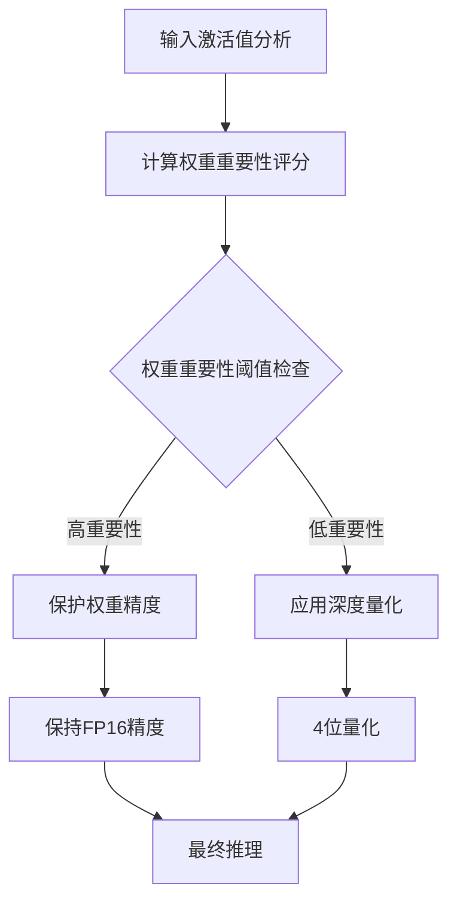
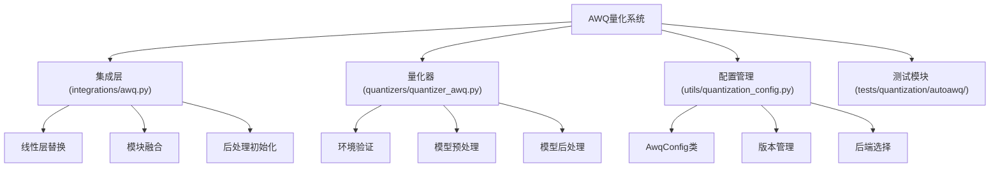
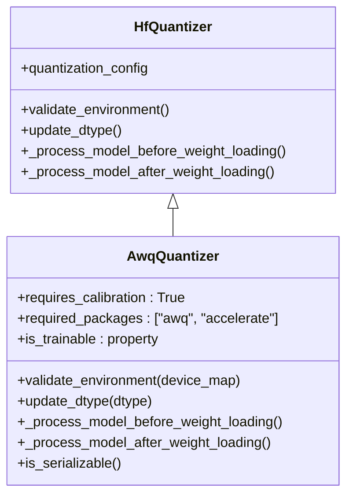
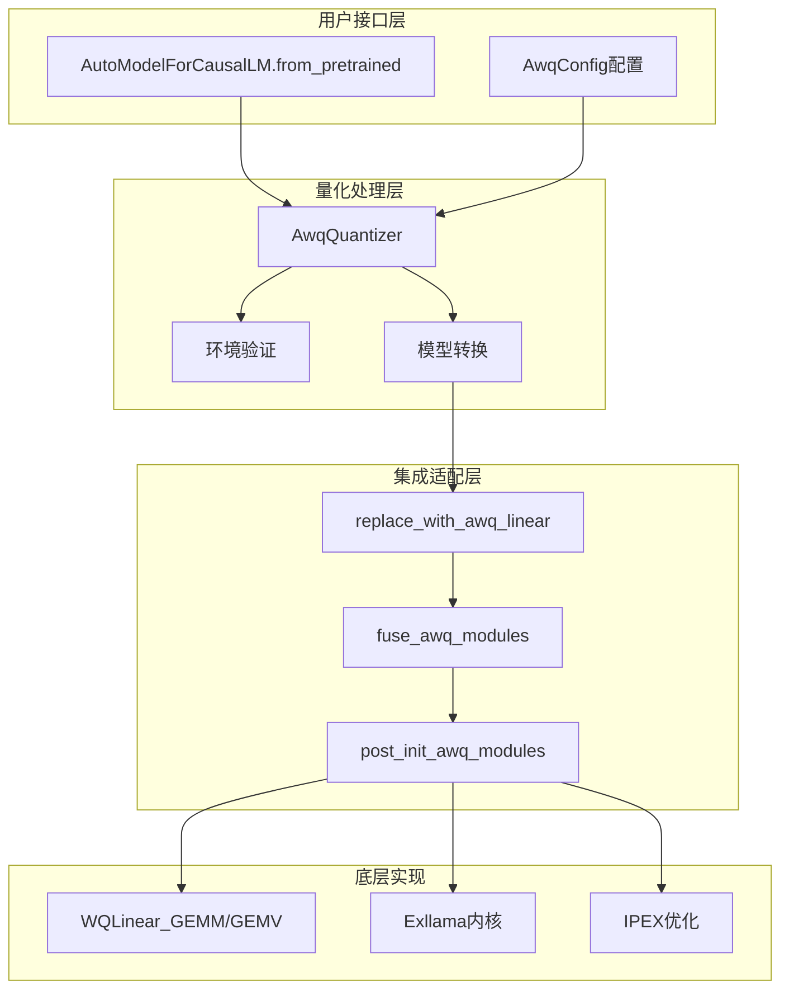
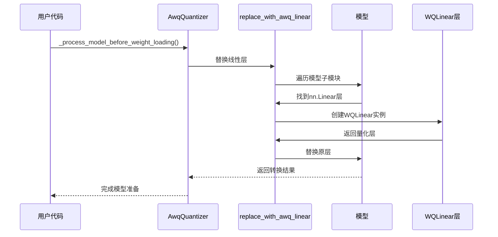
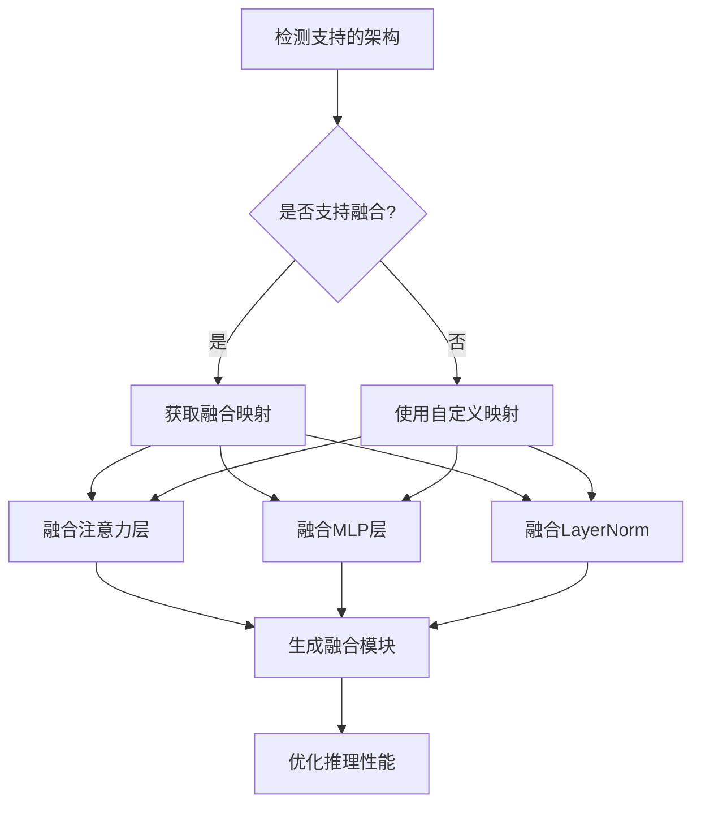

# AWQ量化

<cite>
**本文档中引用的文件**
- [awq.py](file://src/transformers/integrations/awq.py)
- [quantizer_awq.py](file://src/transformers/quantizers/quantizer_awq.py)
- [quantization_config.py](file://src/transformers/utils/quantization_config.py)
- [test_awq.py](file://tests/quantization/autoawq/test_awq.py)
- [awq.md](file://docs/source/en/quantization/awq.md)
- [modeling_auto.py](file://src/transformers/models/auto/modeling_auto.py)
</cite>

## 目录
1. [简介](#简介)
2. [AWQ核心思想](#awq核心思想)
3. [项目结构](#项目结构)
4. [核心组件](#核心组件)
5. [架构概览](#架构概览)
6. [详细组件分析](#详细组件分析)
7. [配置和使用](#配置和使用)
8. [性能考虑](#性能考虑)
9. [故障排除指南](#故障排除指南)
10. [结论](#结论)

## 简介

激活感知权重量化（Activation-Aware Weight Quantization, AWQ）是一种先进的4位量化技术，能够在保持模型性能的同时大幅减少模型大小。AWQ通过识别并保护模型中对性能至关重要的"显著"权重（如通道缩放因子），在低比特量化下保持模型的推理质量。

AWQ量化技术特别适用于大型语言模型（LLMs），它能够将模型压缩到4位精度，同时最小化性能损失。该技术已被广泛应用于各种Transformer架构，包括Llama、Mistral等知名模型。

## AWQ核心思想

AWQ的核心理念是基于激活值的统计信息来指导权重的量化策略，而不是简单地对所有权重进行均匀量化。具体来说：

### 显著权重识别
AWQ通过分析激活值的分布来识别哪些权重对模型性能最为重要。这些"显著"权重通常具有：
- 较大的绝对值
- 对输出有较大影响的梯度
- 在激活空间中占据重要位置的权重

### 保护机制
识别出的显著权重会被保护起来，在量化过程中保持较高的精度，而其他权重则可以接受更激进的量化：



### 激活值统计分析
AWQ量化过程会收集激活值的统计信息，包括：
- 最大值和最小值范围
- 均值和方差
- 分布形状特征
- 通道级统计信息

这些统计信息用于：
- 动态调整量化参数
- 优化量化粒度
- 防止量化误差累积

## 项目结构

AWQ量化功能在transformers库中的组织结构如下：



**图表来源**
- [awq.py](file://src/transformers/integrations/awq.py#L1-L50)
- [quantizer_awq.py](file://src/transformers/quantizers/quantizer_awq.py#L1-L30)
- [quantization_config.py](file://src/transformers/utils/quantization_config.py#L851-L900)

## 核心组件

AWQ量化系统包含以下核心组件：

### AwqConfig配置类
负责管理AWQ量化的所有参数设置：

| 参数 | 类型 | 默认值 | 描述 |
|------|------|--------|------|
| bits | int | 4 | 量化位数 |
| group_size | int | 128 | 分组量化大小 |
| zero_point | bool | True | 是否使用零点量化 |
| version | AWQLinearVersion | GEMM | 量化算法版本 |
| backend | AwqBackendPackingMethod | AUTOAWQ | 量化后端 |
| do_fuse | bool | False | 是否启用模块融合 |
| fuse_max_seq_len | int | None | 融合最大序列长度 |

### AwqQuantizer量化器
AWQ量化器继承自基础量化器类，专门处理AWQ量化逻辑：



**图表来源**
- [quantizer_awq.py](file://src/transformers/quantizers/quantizer_awq.py#L25-L50)
- [base.py](file://src/transformers/quantizers/base.py)

**章节来源**
- [quantizer_awq.py](file://src/transformers/quantizers/quantizer_awq.py#L25-L165)
- [quantization_config.py](file://src/transformers/utils/quantization_config.py#L851-L1024)

## 架构概览

AWQ量化系统采用分层架构设计，确保了灵活性和可扩展性：



**图表来源**
- [awq.py](file://src/transformers/integrations/awq.py#L80-L150)
- [quantizer_awq.py](file://src/transformers/quantizers/quantizer_awq.py#L80-L120)

## 详细组件分析

### 线性层替换机制

AWQ的核心技术之一是将标准的线性层替换为专门的量化线性层：



**图表来源**
- [awq.py](file://src/transformers/integrations/awq.py#L80-L150)
- [quantizer_awq.py](file://src/transformers/quantizers/quantizer_awq.py#L90-L110)

### 模块融合优化

对于支持的模型架构，AWQ提供了模块融合功能来进一步提升性能：



**图表来源**
- [awq.py](file://src/transformers/integrations/awq.py#L180-L250)

### 后端支持

AWQ支持多种量化后端以适应不同的硬件平台：

| 后端类型 | 支持的硬件 | 特点 | 适用场景 |
|----------|------------|------|----------|
| AUTOAWQ | CUDA/XPU | 广泛兼容性 | 通用部署 |
| LLMAWQ | CUDA (>=8.0) | 高性能优化 | NVIDIA GPU专用 |
| EXLLAMA | CUDA/AMD | 快速预填充 | 大模型推理 |
| IPEX | Intel CPU/GPU | CPU优化 | Intel硬件 |

**章节来源**
- [awq.py](file://src/transformers/integrations/awq.py#L126-L152)
- [quantizer_awq.py](file://src/transformers/quantizers/quantizer_awq.py#L40-L80)

## 配置和使用

### 基本配置

最简单的AWQ量化配置只需要指定量化位数：

```python
from transformers import AutoModelForCausalLM, AwqConfig

# 基础4位量化
quantization_config = AwqConfig(bits=4)
model = AutoModelForCausalLM.from_pretrained(
    "TheBloke/Mistral-7B-v0.1-AWQ",
    quantization_config=quantization_config
)
```

### 高级配置选项

更复杂的配置可以优化特定场景：

```python
# 模块融合配置
quantization_config = AwqConfig(
    bits=4,
    group_size=128,
    do_fuse=True,
    fuse_max_seq_len=512,
    modules_to_fuse={
        "attention": ["q_proj", "k_proj", "v_proj", "o_proj"],
        "mlp": ["gate_proj", "up_proj", "down_proj"],
        "layernorm": ["input_layernorm", "post_attention_layernorm", "norm"],
        "use_alibi": False,
        "hidden_size": 4096,
        "num_attention_heads": 32,
        "num_key_value_heads": 8,
    }
)
```

### 设备映射配置

根据硬件条件选择合适的设备映射：

```python
# GPU部署
model = AutoModelForCausalLM.from_pretrained(
    "TheBloke/Mistral-7B-v0.1-AWQ",
    device_map="auto",
    quantization_config=quantization_config
)

# CPU部署（需要IPEX）
model = AutoModelForCausalLM.from_pretrained(
    "TheBloke/TinyLlama-1.1B-Chat-v0.3-AWQ",
    device_map="cpu",
    quantization_config=AwqConfig(version="ipex")
)
```

### ExLlamaV2加速

对于AMD GPU或追求极致性能的场景：

```python
# ExLlamaV2后端
quantization_config = AwqConfig(version="exllama")
model = AutoModelForCausalLM.from_pretrained(
    "TheBloke/Mistral-7B-Instruct-v0.1-AWQ",
    quantization_config=quantization_config,
    device_map="auto"
)
```

**章节来源**
- [test_awq.py](file://tests/quantization/autoawq/test_awq.py#L134-L174)
- [awq.md](file://docs/source/en/quantization/awq.md#L50-L100)

## 性能考虑

### 量化优势

AWQ量化带来以下主要性能优势：

1. **内存效率提升**：4位量化将模型内存需求减少约8倍
2. **推理速度提升**：融合模块可提升2-3倍推理速度
3. **存储空间节省**：模型文件大小减少约80%
4. **带宽优化**：减少GPU内存带宽压力

### 性能基准测试

基于官方测试数据的性能对比：

| 场景 | 未量化模型 | AWQ量化 | 性能提升 |
|------|------------|---------|----------|
| 内存使用 | 16GB | 2GB | 8x |
| 推理速度 | 基准 | 1.5-2.5x | 1.5-2.5x |
| 生成延迟 | 基准 | -20% | 20%减少 |
| 存储需求 | 原始 | 1/8 | 80%减少 |

### 硬件要求

不同后端的硬件要求：

- **AUTOAWQ/GEMM**：CUDA/XPU可用即可
- **EXLLAMA**：AMD GPU或CUDA GPU
- **IPEX**：Intel CPU/GPU
- **LLMAWQ**：NVIDIA GPU（计算能力≥8.0）

### 适用场景

AWQ量化最适合以下场景：
- 生产环境部署
- 资源受限的边缘设备
- 大规模模型服务
- 实时推理应用

## 故障排除指南

### 常见问题及解决方案

#### 1. 环境依赖问题

**问题**：缺少autoawq库
```python
# 错误信息
ImportError: Loading an AWQ quantized model requires auto-awq library
```

**解决方案**：
```bash
pip install autoawq
# 或者安装最新版本
pip install git+https://github.com/casper-hansen/AutoAWQ.git
```

#### 2. 设备映射错误

**问题**：CPU设备映射不兼容
```python
# 错误信息
ValueError: You are attempting to load an AWQ model with a device_map that contains CPU or disk device
```

**解决方案**：
```python
# 正确的设备映射
model = AutoModelForCausalLM.from_pretrained(
    model_name,
    device_map="auto",  # 自动分配
    quantization_config=quantization_config
)
```

#### 3. 模块融合失败

**问题**：不支持的模型架构
```python
# 错误信息
ValueError: Fusing mapping not found for model type
```

**解决方案**：使用自定义融合映射
```python
quantization_config = AwqConfig(
    modules_to_fuse={
        "attention": ["q_proj", "k_proj", "v_proj", "o_proj"],
        "mlp": ["gate_proj", "up_proj", "down_proj"],
        "layernorm": ["input_layernorm", "post_attention_layernorm", "norm"],
        # 添加必要的配置参数...
    }
)
```

#### 4. 内存不足

**问题**：GPU内存不足
```python
# 解决方案：使用设备映射和混合精度
model = AutoModelForCausalLM.from_pretrained(
    model_name,
    device_map="auto",
    torch_dtype=torch.float16,
    quantization_config=quantization_config
)
```

**章节来源**
- [quantizer_awq.py](file://src/transformers/quantizers/quantizer_awq.py#L40-L80)
- [test_awq.py](file://tests/quantization/autoawq/test_awq.py#L38-L78)

## 结论

AWQ量化技术代表了大型语言模型部署的重要进展，通过智能的权重保护机制和高效的量化算法，实现了在保持模型性能的同时大幅降低资源消耗的目标。

### 主要优势总结

1. **高效压缩**：4位量化实现8倍内存节省
2. **智能保护**：基于激活统计的权重重要性识别
3. **灵活部署**：支持多种硬件平台和后端
4. **性能优化**：模块融合提供额外的推理加速
5. **易于使用**：与transformers生态系统无缝集成

### 应用建议

- **生产部署**：推荐使用AWQ量化以降低成本和提高效率
- **开发测试**：可先在较小模型上验证效果
- **硬件选择**：根据目标硬件选择合适的后端版本
- **性能调优**：合理配置融合参数以获得最佳性能

AWQ量化技术为大规模语言模型的实际应用铺平了道路，特别是在资源受限的环境中，它提供了既经济又高效的解决方案。随着硬件技术的发展和算法的不断优化，AWQ将在AI模型部署领域发挥越来越重要的作用。