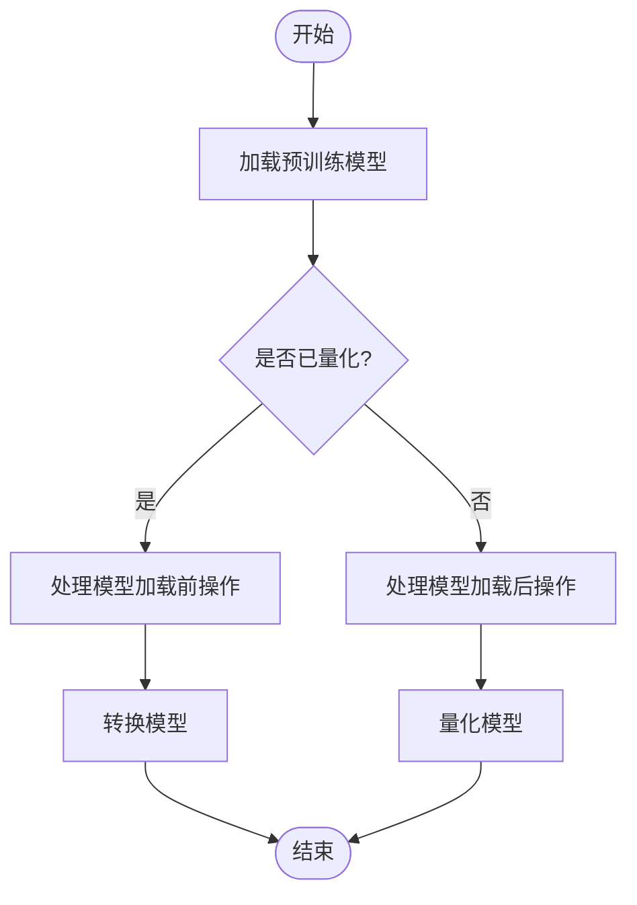
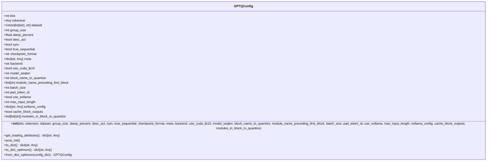
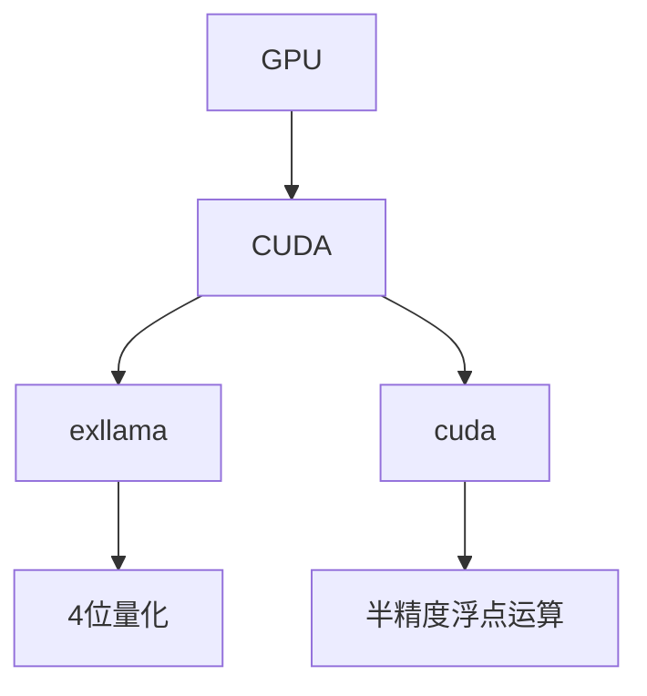
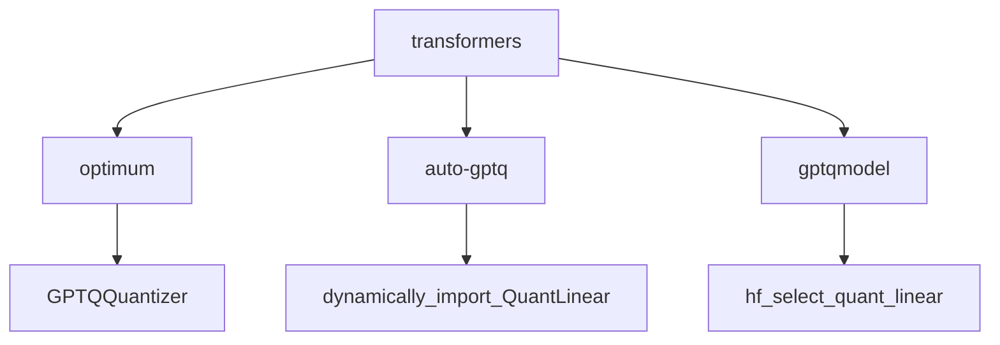

# GPTQ量化

<cite>
**本文档中引用的文件**  
- [quantizer_gptq.py](file://src/transformers/quantizers/quantizer_gptq.py)
- [quantization_config.py](file://src/transformers/utils/quantization_config.py)
- [test_gptq.py](file://tests/quantization/gptq/test_gptq.py)
</cite>

## 目录
1. [介绍](#介绍)
2. [GPTQ算法工作流程](#gptq算法工作流程)
3. [GPTQConfig配置](#gptqconfig配置)
4. [模型加载与使用](#模型加载与使用)
5. [量化模型特征与命名约定](#量化模型特征与命名约定)
6. [硬件与内核依赖](#硬件与内核依赖)
7. [依赖关系分析](#依赖关系分析)

## 介绍
GPTQ（Generalized Post-Training Quantization）是一种后训练量化（PTQ）方法，用于在不显著降低模型性能的情况下减小大型语言模型的大小和推理成本。在transformers库中，GPTQ通过与optimum、auto-gptq和gptqmodel库的集成来实现，允许用户轻松地对预训练模型进行量化。该文档全面介绍了GPTQ在transformers库中的集成方式，包括其工作流程、配置选项、模型加载方法以及相关的硬件依赖。

**Section sources**
- [quantizer_gptq.py](file://src/transformers/quantizers/quantizer_gptq.py#L1-L124)
- [quantization_config.py](file://src/transformers/utils/quantization_config.py#L619-L847)

## GPTQ算法工作流程
GPTQ算法通过逐层处理模型来最小化量化误差，从而保持模型精度。其工作流程包括使用校准数据集对模型权重进行优化。具体来说，GPTQ首先加载预训练模型，然后使用指定的校准数据集（如wikitext2、c4等）来校准量化参数。量化过程是逐层进行的，这意味着每一层的量化都使用了通过先前量化层的输入，这有助于更准确地模拟量化后的模型行为。

在transformers库中，GPTQ量化由`GptqHfQuantizer`类管理，该类负责在模型加载前后处理量化相关的操作。当加载一个非预量化模型时，`_process_model_after_weight_loading`方法会调用`optimum_quantizer.quantize_model`来执行量化过程。对于已经预量化的模型，`_process_model_before_weight_loading`方法会处理模型转换。



**Diagram sources**
- [quantizer_gptq.py](file://src/transformers/quantizers/quantizer_gptq.py#L108-L123)
- [quantizer_gptq.py](file://src/transformers/quantizers/quantizer_gptq.py#L81-L106)

**Section sources**
- [quantizer_gptq.py](file://src/transformers/quantizers/quantizer_gptq.py#L108-L123)
- [quantizer_gptq.py](file://src/transformers/quantizers/quantizer_gptq.py#L81-L106)

## GPTQConfig配置
`GPTQConfig`类是GPTQ量化配置的核心，它包含了所有必要的参数来定义量化过程。这些参数包括量化位数（bits）、分组大小（group_size）、阻尼百分比（damp_percent）、是否使用对称量化（sym）等。`GPTQConfig`还支持指定校准数据集、tokenizer以及后端选择（如exllama或cuda）。



**Diagram sources**
- [quantization_config.py](file://src/transformers/utils/quantization_config.py#L619-L847)

**Section sources**
- [quantization_config.py](file://src/transformers/utils/quantization_config.py#L619-L847)

## 模型加载与使用
在transformers库中，可以通过`AutoModelForCausalLM.from_pretrained`方法加载使用GPTQ量化的模型。需要提供`quantization_config`参数来指定量化配置。例如，可以使用以下代码加载一个4位量化的模型：

```python
from transformers import AutoModelForCausalLM, AutoTokenizer, GPTQConfig

model_id = "bigscience/bloom-560m"
quantization_config = GPTQConfig(bits=4, dataset="c4", tokenizer=AutoTokenizer.from_pretrained(model_id))
model = AutoModelForCausalLM.from_pretrained(model_id, quantization_config=quantization_config)
```

**Section sources**
- [test_gptq.py](file://tests/quantization/gptq/test_gptq.py#L0-L199)

## 量化模型特征与命名约定
使用GPTQ量化的模型通常具有特定的文件后缀，如`.int4`或`.gptq`，以表明其量化格式。在Hugging Face Hub上，这些模型的命名通常遵循一定的约定，例如包含量化位数（如4bit）和使用的量化方法（如gptq）。这有助于用户快速识别模型的量化状态和兼容性。

**Section sources**
- [test_gptq.py](file://tests/quantization/gptq/test_gptq.py#L240-L267)

## 硬件与内核依赖
GPTQ量化对特定硬件（如CUDA）和内核（如exllama、cuda）有依赖。例如，`use_exllama`参数可以启用exllama后端，这对于4位量化特别有用。此外，`use_cuda_fp16`参数允许在支持的硬件上使用优化的CUDA内核进行半精度浮点运算。这些依赖确保了量化模型在目标硬件上的高效运行。



**Diagram sources**
- [quantizer_gptq.py](file://src/transformers/quantizers/quantizer_gptq.py#L59-L79)

**Section sources**
- [quantizer_gptq.py](file://src/transformers/quantizers/quantizer_gptq.py#L59-L79)

## 依赖关系分析
GPTQ在transformers库中的实现依赖于多个外部库，包括optimum、auto-gptq和gptqmodel。这些库提供了量化算法的具体实现和优化内核。`GptqHfQuantizer`类通过`required_packages`属性声明了这些依赖，并在初始化时检查它们的存在性和版本兼容性。这种设计确保了量化功能的稳定性和可维护性。



**Diagram sources**
- [quantizer_gptq.py](file://src/transformers/quantizers/quantizer_gptq.py#L40-L57)

**Section sources**
- [quantizer_gptq.py](file://src/transformers/quantizers/quantizer_gptq.py#L40-L57)