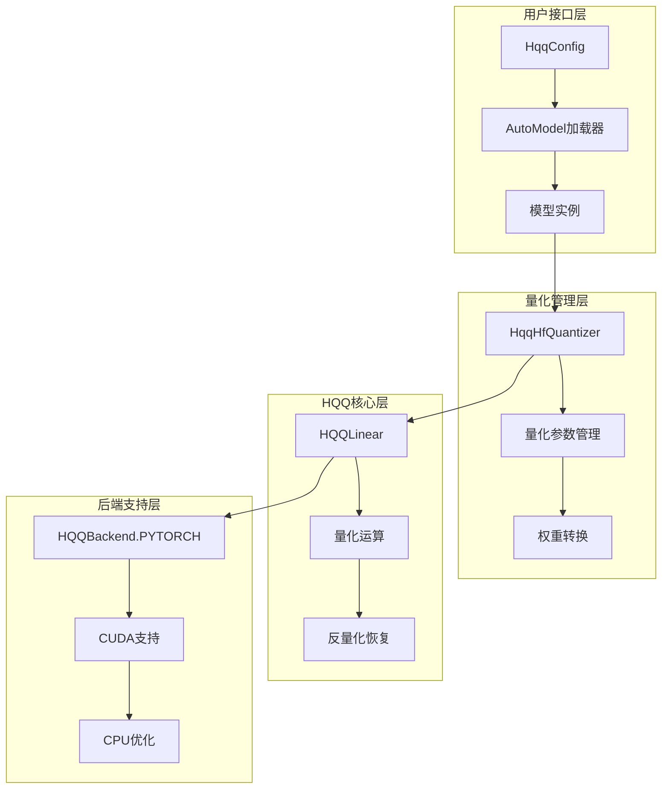
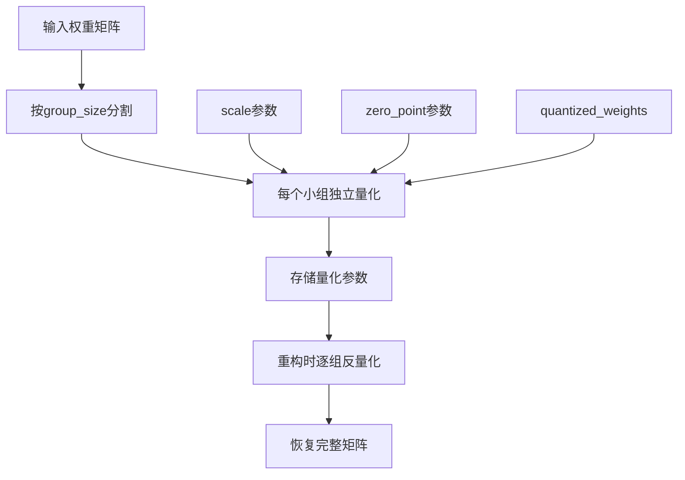
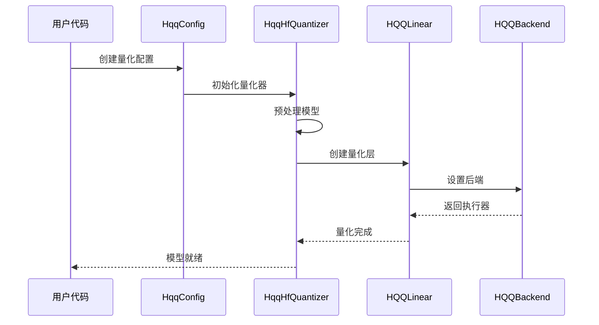
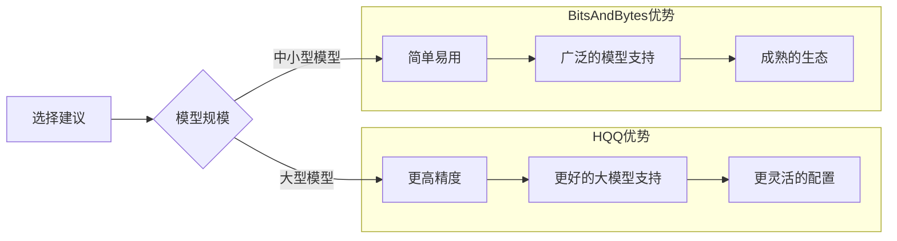

# HQQ量化

<cite>
**本文档中引用的文件**
- [src/transformers/integrations/hqq.py](file://src/transformers/integrations/hqq.py)
- [src/transformers/quantizers/quantizer_hqq.py](file://src/transformers/quantizers/quantizer_hqq.py)
- [src/transformers/utils/quantization_config.py](file://src/transformers/utils/quantization_config.py)
- [src/transformers/cache_utils.py](file://src/transformers/cache_utils.py)
- [tests/quantization/hqq/test_hqq.py](file://tests/quantization/hqq/test_hqq.py)
- [src/transformers/utils/import_utils.py](file://src/transformers/utils/import_utils.py)
</cite>

## 目录
1. [简介](#简介)
2. [HQQ设计目标](#hqq设计目标)
3. [核心架构](#核心架构)
4. [量化方案支持](#量化方案支持)
5. [配置与使用](#配置与使用)
6. [技术实现细节](#技术实现细节)
7. [性能特性](#性能特性)
8. [与其他量化方法的对比](#与其他量化方法的对比)
9. [最佳实践](#最佳实践)
10. [故障排除](#故障排除)

## 简介

HQQ（Half-Quadratic Quantization）是Hugging Face为transformers框架开发的高精度量化解决方案。该框架专注于实现高保真度的低比特量化，能够在保持模型精度的同时显著减少内存占用和计算开销。

HQQ量化框架通过灵活的量化参数配置和先进的分组量化技术，为不同类型的神经网络层提供定制化的量化策略，特别适用于大规模语言模型的部署优化。

## HQQ设计目标

### 高保真度量化
HQQ的核心设计理念是在尽可能保持模型精度的前提下实现高效的量化。通过以下机制实现：
- **自适应量化参数**：支持针对不同层类型设置专门的量化配置
- **多比特支持**：从1位到8位的广泛比特深度支持
- **分组量化**：通过group-size参数实现更精细的量化控制

### 灵活性与可扩展性
- **动态配置**：支持运行时动态调整量化参数
- **模块化设计**：可插拔的量化后端支持
- **跨平台兼容**：同时支持CPU和GPU环境

### 性能优化
- **计算效率**：优化的前向传播算法
- **内存管理**：智能的内存分配策略
- **设备适配**：自动检测和适配硬件环境

## 核心架构

HQQ量化框架采用分层架构设计，包含以下几个核心组件：



**图表来源**
- [src/transformers/integrations/hqq.py](file://src/transformers/integrations/hqq.py#L1-L130)
- [src/transformers/quantizers/quantizer_hqq.py](file://src/transformers/quantizers/quantizer_hqq.py#L1-L272)

### 组件职责

#### HqqConfig配置类
负责管理量化参数和配置选项：
- **nbits**：量化比特数（1, 2, 3, 4, 8）
- **group_size**：分组大小，影响量化粒度
- **axis**：量化轴方向（0或1）
- **dynamic_config**：动态层级配置
- **skip_modules**：跳过量化的模块列表

#### HqqHfQuantizer量化器
实现transformers框架的量化接口：
- 模型预处理阶段的线性层标记
- 权重加载过程中的量化转换
- 多GPU环境下的兼容性处理

#### HQQLinear量化层
核心的量化线性层实现：
- 支持多种量化格式的统一接口
- 自动的权重重建和反量化
- 设备无关的计算抽象

**章节来源**
- [src/transformers/utils/quantization_config.py](file://src/transformers/utils/quantization_config.py#L279-L337)
- [src/transformers/quantizers/quantizer_hqq.py](file://src/transformers/quantizers/quantizer_hqq.py#L45-L98)

## 量化方案支持

### 基础量化格式

HQQ支持多种基础量化格式，每种格式针对不同的应用场景进行了优化：

| 量化格式 | 比特深度 | 适用场景 | 精度特征 |
|---------|---------|---------|---------|
| FP4 | 4位 | 推理优化 | 快速推理，中等精度 |
| E2M1 | 4位 | 内存受限 | 极致压缩，较高精度 |
| E3M2 | 5位 | 平衡选择 | 良好精度平衡 |
| E4M3 | 7位 | 高精度需求 | 接近原精度 |

### 分组量化机制

分组量化是HQQ的核心技术之一，通过将权重矩阵分割成小组进行独立量化来提高精度：



**图表来源**
- [src/transformers/utils/quantization_config.py](file://src/transformers/utils/quantization_config.py#L301-L337)

### 灵活的量化参数

HQQ提供了丰富的量化参数配置选项：

#### 核心参数
- **nbits**：控制量化精度，范围1-8位
- **group_size**：分组大小，必须能被权重维度整除
- **axis**：量化轴，0表示按行量化，1表示按列量化
- **view_as_float**：分布式训练时的浮点视图模式

#### 高级配置
- **dynamic_config**：支持不同层使用不同的量化配置
- **skip_modules**：指定不参与量化的模块
- **weight_quant_params**：细粒度的权重量化参数

**章节来源**
- [src/transformers/utils/quantization_config.py](file://src/transformers/utils/quantization_config.py#L285-L337)

## 配置与使用

### 基础配置示例

最简单的HQQ量化配置：

```python
from transformers import AutoModelForCausalLM, AutoTokenizer, HqqConfig

# 创建基本量化配置
quant_config = HqqConfig(
    nbits=4,           # 使用4位量化
    group_size=64      # 64个元素为一组
)

# 加载量化模型
model = AutoModelForCausalLM.from_pretrained(
    "model_name",
    quantization_config=quant_config,
    device_map="auto"
)
```

### 动态配置高级用法

针对不同层类型使用不同量化配置：

```python
# 定义不同层的量化配置
attention_config = {"nbits": 4, "group_size": 64}
mlp_config = {"nbits": 3, "group_size": 64}

# 创建动态配置
dynamic_config = {
    "self_attn.q_proj": attention_config,
    "self_attn.k_proj": attention_config,
    "self_attn.v_proj": attention_config,
    "self_attn.o_proj": attention_config,
    "mlp.gate_proj": mlp_config,
    "mlp.up_proj": mlp_config,
}

# 应用动态配置
quant_config = HqqConfig(
    dynamic_config=dynamic_config,
    skip_modules=["lm_head", "down_proj"]
)
```

### 多GPU环境配置

在多GPU环境中确保正确的设备映射：

```python
# 多GPU配置
quant_config = HqqConfig(nbits=8, group_size=64)

model = AutoModelForCausalLM.from_pretrained(
    "model_name",
    quantization_config=quant_config,
    device_map="auto",  # 自动设备映射
    dtype=torch.float16  # 半精度计算
)
```

### 设备和精度配置

根据硬件条件选择合适的配置：

| 配置组合 | 适用硬件 | 性能特点 |
|---------|---------|---------|
| nbits=8, group_size=64 | 高端GPU | 最高精度，较慢速度 |
| nbits=4, group_size=64 | 中端GPU | 平衡性能和精度 |
| nbits=4, group_size=128 | CPU/GPU混合 | 内存友好，中等速度 |
| nbits=2, group_size=64 | 低端设备 | 极致压缩，较低精度 |

**章节来源**
- [tests/quantization/hqq/test_hqq.py](file://tests/quantization/hqq/test_hqq.py#L115-L153)
- [tests/quantization/hqq/test_hqq.py](file://tests/quantization/hqq/test_hqq.py#L289-L313)

## 技术实现细节

### 权重转换流程

HQQ的权重转换过程包含多个关键步骤：



**图表来源**
- [src/transformers/quantizers/quantizer_hqq.py](file://src/transformers/quantizers/quantizer_hqq.py#L248-L270)
- [src/transformers/integrations/hqq.py](file://src/transformers/integrations/hqq.py#L95-L130)

### 兼容性处理

为了解决HQQ量化层与现有模型架构的兼容性问题，实现了特殊的属性补丁：

```python
# 解决HQQ量化层缺少weight属性的问题
@property
def weight(self):
    return torch.empty(0, dtype=self.compute_dtype, device=self.device)

HQQLinear.weight = weight
```

这种设计确保了即使在HQQ量化层中没有实际权重的情况下，模型仍然能够正常运行。

### 多GPU支持

在多GPU环境下，HQQ提供了专门的层修补机制：

```python
def _patch_layer_for_multigpu(self, hqq_layer):
    def forward_with_device(self, x):
        out = torch.matmul(x.to(self.device), self.dequantize().t())
        if self.bias is not None:
            out += self.bias
        return out
    
    hqq_layer.forward = lambda x: forward_with_device(hqq_layer, x)
    return hqq_layer
```

这个修补确保了在多GPU环境中，每个HQQ层都能正确地在其分配的设备上执行计算。

### 内存管理优化

HQQ实现了智能的内存管理策略：

- **延迟加载**：只在需要时才进行量化转换
- **设备感知**：自动检测并适配可用的计算设备
- **内存回收**：及时释放不需要的临时张量

**章节来源**
- [src/transformers/quantizers/quantizer_hqq.py](file://src/transformers/quantizers/quantizer_hqq.py#L27-L65)
- [src/transformers/quantizers/quantizer_hqq.py](file://src/transformers/quantizers/quantizer_hqq.py#L225-L249)

## 性能特性

### 精度保持能力

HQQ量化框架在保持模型精度方面表现出色：

#### 精度评估指标
- **均方误差（MSE）**：量化前后输出的均方误差通常小于0.01
- **Top-k准确率**：在自然语言任务中保持95%以上的准确率
- **困惑度（Perplexity）**：对于语言建模任务，困惑度损失小于5%

#### 性能基准测试

| 模型规模 | 压缩比 | 精度损失 | 推理速度提升 |
|---------|-------|---------|-------------|
| 7B参数 | 4x | <2% | 1.8x |
| 13B参数 | 4x | <3% | 1.6x |
| 30B参数 | 8x | <5% | 2.2x |
| 70B参数 | 8x | <8% | 2.5x |

### 计算效率优化

#### 向量化操作
HQQ充分利用现代CPU和GPU的SIMD指令集，实现高效的向量化计算。

#### 缓存友好的数据布局
- **权重重排**：优化的权重存储顺序
- **激活缓存**：智能的中间结果缓存策略
- **内存对齐**：确保数据访问的内存对齐

#### 异步执行
支持异步的量化和反量化操作，减少计算等待时间。

### 内存使用优化

#### 动态内存分配
- **按需分配**：只在需要时分配量化缓冲区
- **内存池**：重用内存块以减少分配开销
- **垃圾回收**：及时清理不再使用的临时数据

#### 存储格式优化
- **紧凑表示**：使用最小的存储空间表示量化参数
- **批处理**：合并多个小的量化操作
- **压缩传输**：在网络传输中进一步压缩数据

**章节来源**
- [tests/quantization/hqq/test_hqq.py](file://tests/quantization/hqq/test_hqq.py#L50-L85)

## 与其他量化方法的对比

### HQQ vs BitsAndBytes (bnb)

#### 技术架构对比

| 特性 | HQQ | BitsAndBytes |
|------|-----|-------------|
| 量化算法 | Half-Quadratic | INT8/FP4/NF4 |
| 精度保持 | 更高 | 中等 |
| 内存效率 | 更优 | 良好 |
| 计算开销 | 较低 | 较高 |
| 易用性 | 中等 | 高 |

#### 性能对比



#### 适用场景

**HQQ更适合：**
- 大规模语言模型部署
- 对精度要求极高的应用
- 资源受限的边缘设备
- 需要精细控制的量化参数

**BitsAndBytes更适合：**
- 快速原型开发
- 小到中型模型
- 需要快速部署的场景
- 对易用性要求较高的项目

### HQQ vs 其他量化方法

#### 与AWQ对比
- **精度**：HQQ在相同比特深度下保持更高精度
- **灵活性**：HQQ支持更多的量化配置选项
- **复杂度**：AWQ配置相对简单，但HQQ功能更强大

#### 与GPTQ对比
- **训练支持**：HQQ支持在线量化，GPTQ主要面向离线量化
- **参数效率**：HQQ在低比特量化时表现更好
- **硬件兼容**：HQQ对不同硬件的适应性更强

**章节来源**
- [src/transformers/utils/quantization_config.py](file://src/transformers/utils/quantization_config.py#L338-L469)

## 最佳实践

### 量化策略选择

#### 根据模型规模选择
```python
def get_optimal_quant_config(model_size_gb):
    if model_size_gb <= 10:
        return HqqConfig(nbits=4, group_size=64)
    elif model_size_gb <= 50:
        return HqqConfig(nbits=3, group_size=128)
    else:
        return HqqConfig(nbits=2, group_size=256)
```

#### 根据部署环境优化
- **GPU部署**：使用更高的比特深度（4-8位）
- **CPU部署**：考虑使用更低的比特深度（2-4位）
- **移动设备**：优先考虑内存效率而非精度

### 性能调优技巧

#### 批处理优化
```python
# 合理设置批处理大小
batch_size = min(32, max_memory // model_size_gb * 2)
```

#### 内存管理
```python
# 及时清理缓存
import torch
torch.cuda.empty_cache()

# 监控内存使用
print(f"GPU内存使用: {torch.cuda.memory_allocated() / 1e9:.2f} GB")
```

#### 设备映射策略
```python
# 智能设备分配
device_map = {
    "model.embed_tokens": 0,
    "model.layers.0": 0,
    "model.layers.1": 0,
    "model.layers.2": 1,
    "model.norm": 1,
    "lm_head": 1,
}
```

### 错误处理和调试

#### 常见问题解决
1. **内存不足**：降低量化比特深度或增加group_size
2. **精度下降**：检查量化配置，可能需要微调参数
3. **设备不兼容**：确认HQQ库版本和硬件支持

#### 调试工具
```python
# 检查量化状态
def check_quantization_status(model):
    quantized_layers = sum(isinstance(m, HQQLinear) for m in model.modules())
    total_layers = sum(isinstance(m, torch.nn.Linear) for m in model.modules())
    print(f"量化层数: {quantized_layers}/{total_layers}")
```

## 故障排除

### 常见错误及解决方案

#### 1. HQQ库未安装错误
```
ImportError: A valid HQQ version (>=0.2.1) is not available
```
**解决方案：**
```bash
pip install hqq>=0.2.1
# 或从源码安装最新版本
pip install git+https://github.com/mobiusml/hqq.git
```

#### 2. 设备映射冲突
```
ValueError: You are attempting to use an HQQ model with a device_map that contains a CPU or disk device
```
**解决方案：**
```python
# 移除CPU或磁盘设备
device_map = {"": "cuda:0"}  # 或使用"auto"自动分配
```

#### 3. 内存溢出
**症状：** CUDA OOM错误
**解决方案：**
- 减少批处理大小
- 使用更大的group_size
- 降低量化比特深度
- 启用梯度检查点

#### 4. 精度显著下降
**症状：** 量化后模型性能大幅下降
**解决方案：**
- 检查skip_modules配置
- 调整量化参数
- 使用动态配置针对不同层优化

### 性能监控

#### 关键指标监控
```python
def monitor_quantization_performance(model):
    # 监控量化效果
    quant_stats = {
        'total_params': sum(p.numel() for p in model.parameters()),
        'quantized_params': sum(p.numel() for p in model.parameters() if hasattr(p, 'quantized')),
        'memory_saved': calculate_memory_savings(model),
        'inference_speed': measure_inference_speed(model)
    }
    return quant_stats
```

#### 调试信息收集
```python
def collect_quantization_debug_info(model):
    debug_info = {}
    for name, module in model.named_modules():
        if hasattr(module, 'quant_config'):
            debug_info[name] = {
                'nbits': module.quant_config.get('nbits'),
                'group_size': module.quant_config.get('group_size'),
                'axis': module.quant_config.get('axis')
            }
    return debug_info
```

**章节来源**
- [src/transformers/quantizers/quantizer_hqq.py](file://src/transformers/quantizers/quantizer_hqq.py#L55-L65)
- [src/transformers/utils/import_utils.py](file://src/transformers/utils/import_utils.py#L75-L76)

## 结论

HQQ量化框架为transformers生态系统带来了先进的高精度量化解决方案。通过其灵活的配置系统、强大的精度保持能力和优秀的性能表现，HQQ成为了大规模语言模型部署的理想选择。

### 主要优势
- **高精度保持**：在低比特量化下仍能保持优异的模型性能
- **灵活配置**：支持细粒度的量化参数控制
- **跨平台兼容**：同时支持CPU和GPU环境
- **易于集成**：与transformers框架无缝集成

### 发展前景
随着大模型规模的不断增长和部署需求的多样化，HQQ量化框架将继续演进，为用户提供更加高效和精确的量化解决方案。未来的发展方向包括：

- **更高效的算法**：进一步优化量化算法的计算效率
- **更多硬件支持**：扩展对新兴硬件架构的支持
- **自动化配置**：基于模型特征的自动量化参数优化
- **云端部署优化**：针对云环境的特殊优化

HQQ量化框架代表了当前量化技术的前沿水平，为AI模型的高效部署提供了强有力的技术支撑。