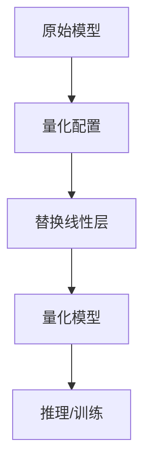
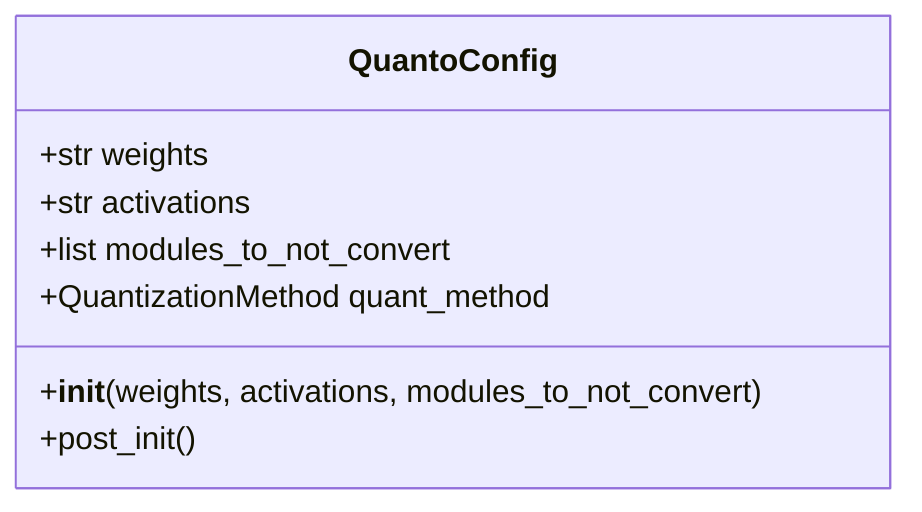
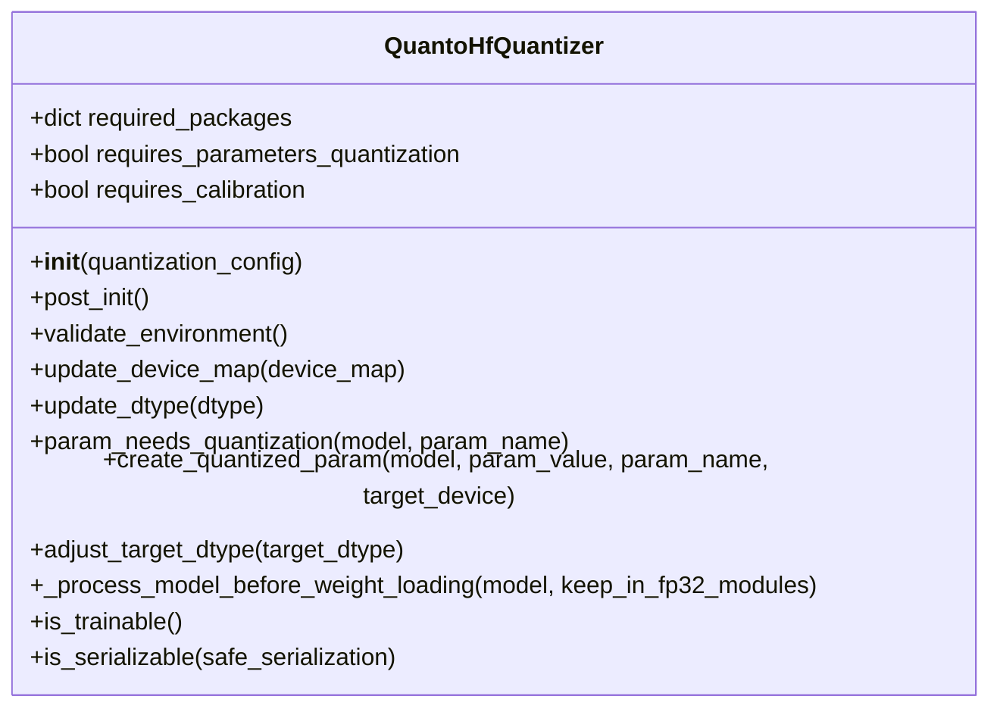
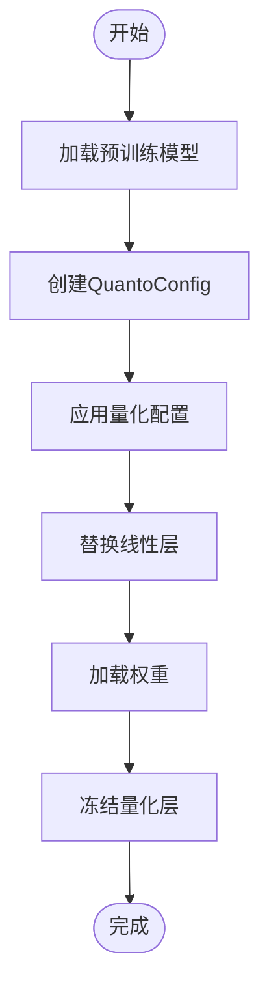

# Quanto量化

<cite>
**本文档中引用的文件**  
- [quanto.py](file://src/transformers/integrations/quanto.py)
- [quantizer_quanto.py](file://src/transformers/quantizers/quantizer_quanto.py)
- [quantization_config.py](file://src/transformers/utils/quantization_config.py)
- [test_quanto.py](file://tests/quantization/quanto_integration/test_quanto.py)
- [quanto.md](file://docs/source/en/quantization/quanto.md)
</cite>

## 目录
1. [引言](#引言)
2. [Quanto集成概述](#quanto集成概述)
3. [核心组件分析](#核心组件分析)
4. [量化工作流程](#量化工作流程)
5. [配置与使用](#配置与使用)
6. [性能与优势](#性能与优势)
7. [结论](#结论)

## 引言
Quanto是Hugging Face生态系统中一个基于PyTorch原生功能的量化解决方案，专为与Optimum库集成而设计。它提供了一种高效的方法来减少深度学习模型的内存占用和计算需求，同时保持较高的精度。本文档详细介绍了Quanto在transformers库中的集成方式，包括其支持的数据类型、工作流程、配置方法以及性能优势。

## Quanto集成概述

Quanto通过将模型中的线性层替换为量化版本来实现模型压缩。这种集成允许用户在不牺牲太多精度的情况下显著减少模型大小和推理时间。Quanto特别适用于包含`torch.nn.Linear`层的各种模态模型。



**图源**
- [quanto.py](file://src/transformers/integrations/quanto.py#L0-L98)
- [quantizer_quanto.py](file://src/transformers/quantizers/quantizer_quanto.py#L0-L165)

**节源**
- [quanto.py](file://src/transformers/integrations/quanto.py#L0-L98)
- [quantizer_quanto.py](file://src/transformers/quantizers/quantizer_quanto.py#L0-L165)

## 核心组件分析

### QuantoConfig类
`QuantoConfig`是配置量化过程的核心类，它定义了量化参数，包括权重和激活的量化类型以及不需要量化的模块列表。



**图源**
- [quantization_config.py](file://src/transformers/utils/quantization_config.py#L1180-L1250)

**节源**
- [quantization_config.py](file://src/transformers/utils/quantization_config.py#L1180-L1250)

### 量化器实现
`QuantoHfQuantizer`类负责管理量化过程，包括验证环境、更新设备映射和数据类型，以及创建量化参数。



**图源**
- [quantizer_quanto.py](file://src/transformers/quantizers/quantizer_quanto.py#L0-L165)

**节源**
- [quantizer_quanto.py](file://src/transformers/quantizers/quantizer_quanto.py#L0-L165)

## 量化工作流程

Quanto的量化工作流程主要包括两个阶段：校准（calibration）和量化（quantize）。然而，根据文档，transformers库的集成主要支持权重量化，而激活量化、校准和量化感知训练需要直接使用Quanto库。



**图源**
- [quanto.py](file://src/transformers/integrations/quanto.py#L0-L98)
- [quantizer_quanto.py](file://src/transformers/quantizers/quantizer_quanto.py#L0-L165)

**节源**
- [quanto.py](file://src/transformers/integrations/quanto.py#L0-L98)
- [quantizer_quanto.py](file://src/transformers/quantizers/quantizer_quanto.py#L0-L165)

## 配置与使用

### 配置量化
使用`QuantoConfig`可以轻松配置量化参数。以下是一个典型的配置示例：

```python
from transformers import QuantoConfig

quant_config = QuantoConfig(weights="int8")
```

### 加载和量化模型
虽然文档提到了`load_and_quantize_model`函数，但在代码库中并未找到该函数的具体实现。相反，量化是通过在`from_pretrained`方法中传递`quantization_config`参数来完成的。

```python
from transformers import AutoModelForCausalLM, QuantoConfig

quant_config = QuantoConfig(weights="int8")
model = AutoModelForCausalLM.from_pretrained(
    "meta-llama/Llama-3.1-8B", 
    dtype="auto", 
    device_map="auto", 
    quantization_config=quant_config
)
```

**节源**
- [quanto.md](file://docs/source/en/quantization/quanto.md#L0-L69)
- [test_quanto.py](file://tests/quantization/quanto_integration/test_quanto.py#L0-L199)

## 性能与优势

### 推理速度和内存效率
Quanto通过量化技术显著提高了模型的推理速度和内存效率。支持INT8、INT4和FP4等数据类型，使得模型可以在资源受限的设备上运行。

### 与PyTorch生态的紧密集成
Quanto的优势在于其与PyTorch生态的紧密集成，支持`torch.compile`以进一步加速生成过程。

```python
import torch
from transformers import AutoModelForSpeechSeq2Seq, QuantoConfig

quant_config = QuantoConfig(weights="int8")
model = AutoModelForSpeechSeq2Seq.from_pretrained(
  "openai/whisper-large-v2",
  dtype="auto",
  device_map="auto",
  quantization_config=quant_config
)

model = torch.compile(model)
```

**节源**
- [quanto.md](file://docs/source/en/quantization/quanto.md#L0-L69)

## 结论
Quanto为transformers库提供了一个强大且灵活的量化解决方案。通过利用PyTorch的原生功能，Quanto能够有效地压缩模型，提高推理速度和内存效率，同时保持较高的精度。尽管transformers库的集成主要支持权重量化，但Quanto库本身提供了更高级的功能，如激活量化、校准和量化感知训练，为研究人员和开发者提供了广泛的工具集。