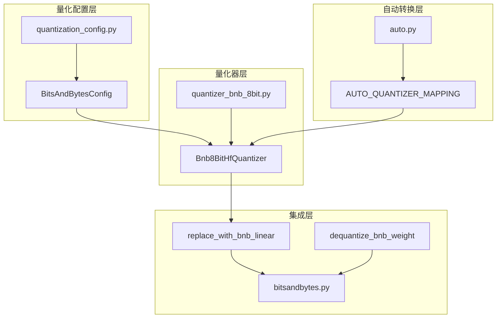
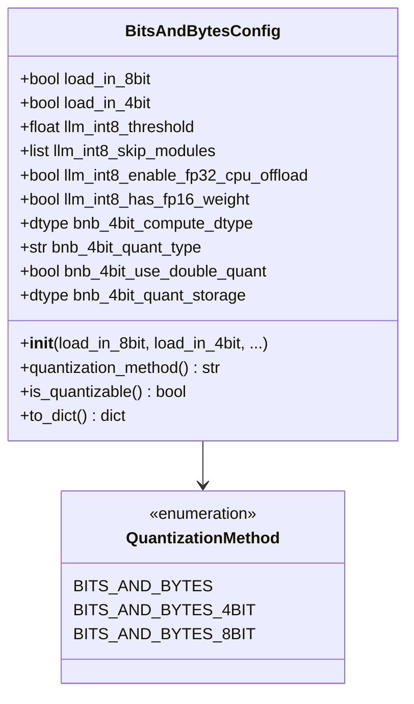
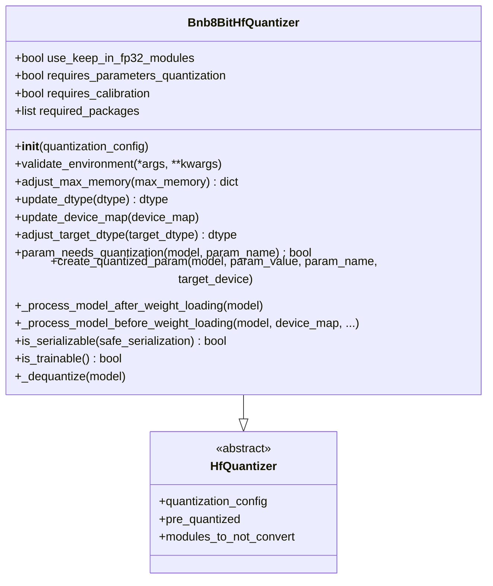
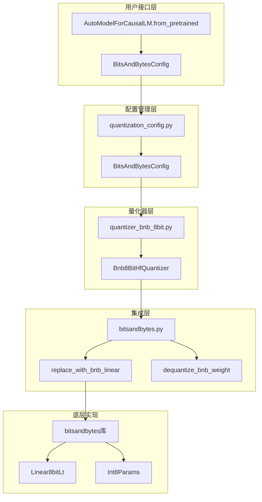
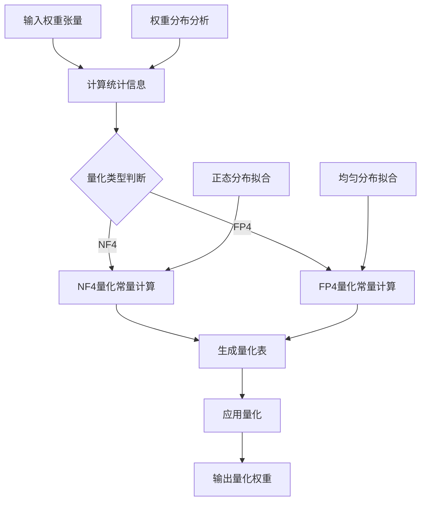
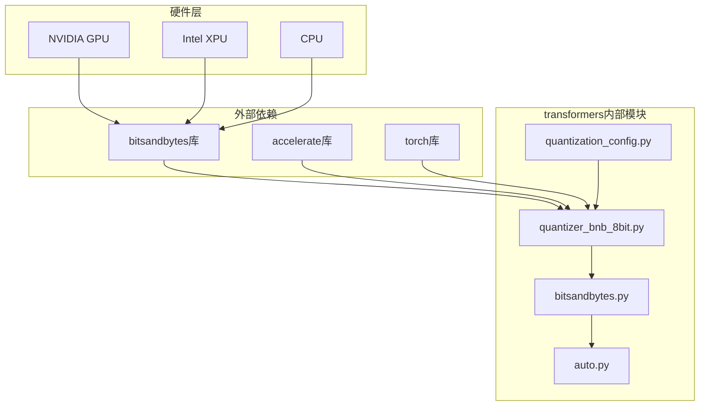

# bitsandbytes 8位量化

<cite>
**本文档中引用的文件**
- [bitsandbytes.py](file://src/transformers/integrations/bitsandbytes.py)
- [quantizer_bnb_8bit.py](file://src/transformers/quantizers/quantizer_bnb_8bit.py)
- [quantization_config.py](file://src/transformers/utils/quantization_config.py)
- [bitsandbytes.md](file://docs/source/en/quantization/bitsandbytes.md)
- [auto.py](file://src/transformers/quantizers/auto.py)
- [test_4bit.py](file://tests/quantization/bnb/test_4bit.py)
</cite>

## 目录
1. [简介](#简介)
2. [项目结构](#项目结构)
3. [核心组件](#核心组件)
4. [架构概览](#架构概览)
5. [详细组件分析](#详细组件分析)
6. [依赖关系分析](#依赖关系分析)
7. [性能考虑](#性能考虑)
8. [故障排除指南](#故障排除指南)
9. [结论](#结论)

## 简介

bitsandbytes是一个为大型语言模型提供量化的轻量级Python库，它通过硬件加速器函数的轻量级包装器实现了内存高效的量化工具。该库使用户能够在有限的计算资源下运行大型模型，通过减少模型的内存占用来实现这一目标。

bitsandbytes提供了两种主要的量化功能：
- **LLM.int8()**：一种8位量化方法，通过动态保留关键计算的高精度来防止信息丢失，从而实现无显著性能损失的大模型推理
- **QLoRA**：一种4位量化技术，在保持可训练性的同时进一步压缩模型

## 项目结构

bitsandbytes在transformers库中的实现主要分布在以下几个关键模块中：



**图表来源**
- [quantization_config.py](file://src/transformers/utils/quantization_config.py#L442-L468)
- [quantizer_bnb_8bit.py](file://src/transformers/quantizers/quantizer_bnb_8bit.py#L35-L50)
- [auto.py](file://src/transformers/quantizers/auto.py#L65-L111)

**章节来源**
- [quantization_config.py](file://src/transformers/utils/quantization_config.py#L442-L639)
- [quantizer_bnb_8bit.py](file://src/transformers/quantizers/quantizer_bnb_8bit.py#L1-L241)

## 核心组件

### BitsAndBytesConfig配置类

BitsAndBytesConfig是bitsandbytes量化的主配置类，负责管理所有量化相关的参数设置：



**图表来源**
- [quantization_config.py](file://src/transformers/utils/quantization_config.py#L442-L468)
- [quantization_config.py](file://src/transformers/utils/quantization_config.py#L558-L580)

### Bnb8BitHfQuantizer量化器

Bnb8BitHfQuantizer是专门处理8位量化的量化器，负责模型加载过程中的权重转换：



**图表来源**
- [quantizer_bnb_8bit.py](file://src/transformers/quantizers/quantizer_bnb_8bit.py#L35-L50)
- [quantizer_bnb_8bit.py](file://src/transformers/quantizers/quantizer_bnb_8bit.py#L144-L175)

**章节来源**
- [quantizer_bnb_8bit.py](file://src/transformers/quantizers/quantizer_bnb_8bit.py#L35-L241)

## 架构概览

bitsandbytes 8位量化在transformers中的整体架构如下：



**图表来源**
- [quantization_config.py](file://src/transformers/utils/quantization_config.py#L442-L468)
- [quantizer_bnb_8bit.py](file://src/transformers/quantizers/quantizer_bnb_8bit.py#L35-L50)
- [bitsandbytes.py](file://src/transformers/integrations/bitsandbytes.py#L40-L80)

## 详细组件分析

### NF4（Normal Float 4）数据类型

NF4是一种专门为从正态分布初始化的权重设计的4位数据类型，来源于QLoRA论文。它在训练4位基础模型时应该被使用。

#### NF4的优势
- **专为正态分布设计**：针对从正态分布初始化的权重进行了优化
- **训练友好**：在4位量化的基础上保持了更好的训练稳定性
- **内存效率**：相比FP4提供更好的精度保持能力

#### NF4与FP4的区别
- **数据分布假设**：NF4假设权重来自正态分布，而FP4没有这种假设
- **量化精度**：NF4在相同条件下通常提供更好的量化精度
- **适用场景**：NF4更适合训练，FP4更适合推理

### 量化常量的计算方法

bitsandbytes使用动态量化策略，量化常量在运行时根据权重分布计算：



**图表来源**
- [quantization_config.py](file://src/transformers/utils/quantization_config.py#L568-L569)
- [test_4bit.py](file://tests/quantization/bnb/test_4bit.py#L722-L751)

### 8位量化在矩阵乘法中的计算优化

bitsandbytes通过以下机制优化8位量化矩阵乘法：

#### 1. 动态阈值处理
- **异常值检测**：使用`llm_int8_threshold`参数识别并特殊处理异常值
- **混合精度计算**：对超过阈值的值使用fp16精度，其余使用int8精度
- **性能平衡**：在精度和性能之间找到最佳平衡点

#### 2. 内存优化策略
- **延迟量化**：在首次`.cuda()`调用时才进行实际量化
- **设备感知**：根据可用设备动态调整量化策略
- **内存池管理**：优化中间计算结果的内存使用

#### 3. 计算优化
- **向量化操作**：利用SIMD指令加速量化计算
- **内存合并访问**：优化内存访问模式以提高带宽利用率
- **流水线处理**：重叠计算和内存传输以提高吞吐量

**章节来源**
- [quantizer_bnb_8bit.py](file://src/transformers/quantizers/quantizer_bnb_8bit.py#L144-L175)
- [bitsandbytes.py](file://src/transformers/integrations/bitsandbytes.py#L40-L80)

### BitsAndBytesConfig配置示例

以下是使用BitsAndBytesConfig配置8位量化的典型代码模式：

```python
# 基本8位量化配置
from transformers import AutoModelForCausalLM, BitsAndBytesConfig

# 配置8位量化
quantization_config = BitsAndBytesConfig(
    load_in_8bit=True,
    llm_int8_threshold=6.0,  # 异常值阈值
    llm_int8_enable_fp32_cpu_offload=False,  # 是否启用CPU卸载
    llm_int8_skip_modules=None,  # 跳过的模块列表
    llm_int8_has_fp16_weight=False  # 是否使用fp16权重
)

# 加载量化模型
model_8bit = AutoModelForCausalLM.from_pretrained(
    "bigscience/bloom-1b7",
    device_map="auto",
    quantization_config=quantization_config
)
```

#### 参数详解

| 参数名 | 类型 | 默认值 | 说明 |
|--------|------|--------|------|
| `load_in_8bit` | bool | False | 启用8位量化 |
| `llm_int8_threshold` | float | 6.0 | 异常值检测阈值 |
| `llm_int8_enable_fp32_cpu_offload` | bool | False | 启用CPU卸载 |
| `llm_int8_skip_modules` | list | None | 跳过量化的模块列表 |
| `llm_int8_has_fp16_weight` | bool | False | 使用fp16权重 |

**章节来源**
- [quantization_config.py](file://src/transformers/utils/quantization_config.py#L442-L468)
- [bitsandbytes.md](file://docs/source/en/quantization/bitsandbytes.md#L80-L120)

## 依赖关系分析

bitsandbytes 8位量化涉及多个层次的依赖关系：



**图表来源**
- [quantizer_bnb_8bit.py](file://src/transformers/quantizers/quantizer_bnb_8bit.py#L25-L35)
- [auto.py](file://src/transformers/quantizers/auto.py#L65-L111)

### 版本兼容性要求

| 组件 | 最低版本 | 推荐版本 | 说明 |
|------|----------|----------|------|
| bitsandbytes | 0.37.0 | 最新版本 | 支持8位量化的必需库 |
| accelerate | 0.21.0 | 最新版本 | 分布式训练和设备管理 |
| torch | 1.13.0 | 最新版本 | PyTorch框架版本 |

**章节来源**
- [quantizer_bnb_8bit.py](file://src/transformers/quantizers/quantizer_bnb_8bit.py#L55-L75)

## 性能考虑

### 显存节省效果

bitsandbytes 8位量化通常能够减少约50%的显存占用：

- **理论节省**：从16位浮点数（2字节）到8位整数（1字节）
- **实际效果**：对于大模型（>176B参数），显存使用量可减少40-50%
- **影响因素**：模型架构、批次大小、序列长度等

### 对推理速度的影响

8位量化对推理速度的影响取决于多种因素：

#### 正面影响
- **内存带宽提升**：减少内存访问次数，提高带宽利用率
- **缓存效率**：更大的模型可以完全装入GPU缓存
- **并行度提高**：更多的激活可以在GPU上同时处理

#### 潜在负面影响
- **量化误差**：精度损失可能导致需要更多的迭代
- **混合精度开销**：异常值的特殊处理增加了计算复杂度

### GPU架构性能表现

#### Ampere架构（A100, RTX 30系列）
- **最佳性能**：原生支持Tensor Core，8位计算效率最高
- **推荐配置**：使用`llm_int8_threshold=6.0`获得最佳平衡
- **内存带宽**：充分利用高带宽内存（HBM）

#### Hopper架构（H100）
- **先进优化**：支持更高效的混合精度计算
- **新特性**：利用BF16和FP8的组合优化
- **扩展性**：支持更大规模的模型部署

#### 早期架构（Pascal, Volta）
- **基本支持**：仍可使用，但性能不如新架构
- **限制**：可能需要调整阈值参数
- **兼容性**：确保驱动程序和CUDA版本兼容

## 故障排除指南

### 常见问题及解决方案

#### 1. 内存不足错误
**症状**：`RuntimeError: CUDA out of memory`
**解决方案**：
- 启用CPU卸载：设置`llm_int8_enable_fp32_cpu_offload=True`
- 使用自定义设备映射
- 减少批次大小或序列长度

#### 2. 量化模型无法保存
**症状**：保存量化模型时报错
**解决方案**：
- 确保使用最新版本的bitsandbytes
- 检查模型是否完全加载到GPU
- 使用`safetensors`格式保存

#### 3. 性能下降明显
**症状**：量化后推理速度变慢
**解决方案**：
- 调整`llm_int8_threshold`参数
- 检查是否有过多异常值
- 考虑使用双重量化

#### 4. 数值不稳定
**症状**：量化模型输出不稳定或产生NaN
**解决方案**：
- 增加`llm_int8_threshold`值
- 检查模型权重范围
- 考虑跳过某些敏感模块

**章节来源**
- [quantizer_bnb_8bit.py](file://src/transformers/quantizers/quantizer_bnb_8bit.py#L75-L95)
- [bitsandbytes.py](file://src/transformers/integrations/bitsandbytes.py#L320-L362)

### 不支持梯度计算的限制

bitsandbytes 8位量化的一个重要限制是不支持梯度计算，这意味着：

#### 限制说明
- **仅适用于推理**：不能用于模型微调或训练
- **冻结权重**：量化后的权重被视为固定不变
- **不可逆过程**：一旦量化，无法直接恢复原始精度

#### 应用场景
- **模型部署**：生产环境中的推理服务
- **批量处理**：大规模文本生成任务
- **边缘计算**：资源受限的设备部署

#### 替代方案
对于需要微调的场景，可以考虑：
- **QLoRA**：4位量化配合LoRA适配器
- **混合精度**：结合FP16和INT8
- **分层量化**：只量化部分层

## 结论

bitsandbytes 8位量化为transformers库提供了强大而灵活的模型压缩解决方案。通过动态量化策略、智能阈值处理和硬件优化，它能够在保持模型性能的同时显著减少内存使用。

### 主要优势
- **内存效率**：通常减少50%显存占用
- **硬件兼容**：支持多种GPU架构
- **易于使用**：简单的配置即可启用
- **稳定可靠**：经过大量测试验证

### 适用场景
- 大模型推理部署
- 资源受限环境
- 批量处理任务
- 边缘设备推理

### 发展趋势
随着硬件技术的进步和算法的优化，bitsandbytes 8位量化将继续演进，为更大规模的模型部署提供更高效的解决方案。