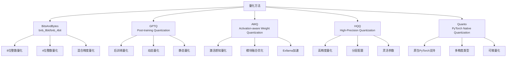
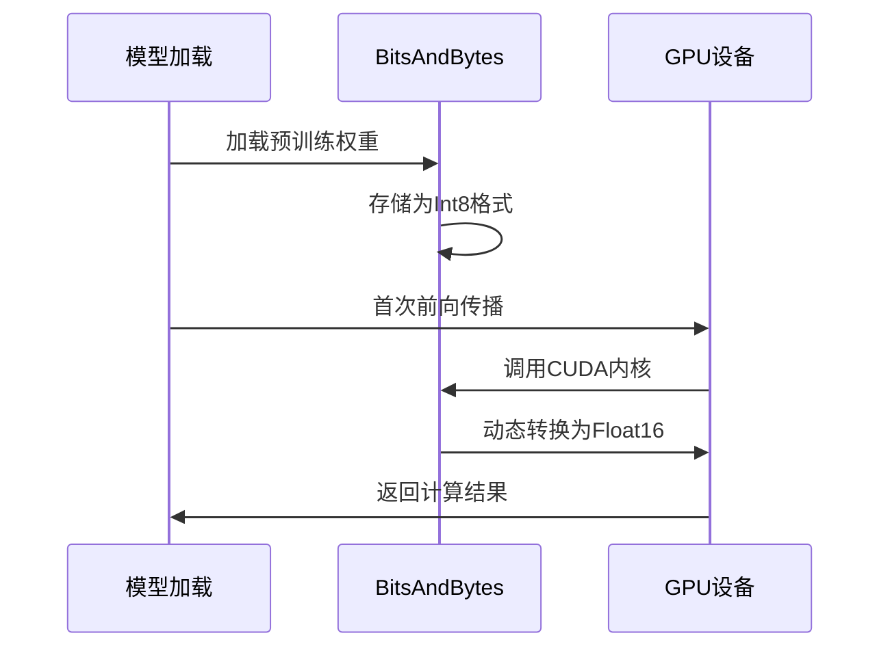
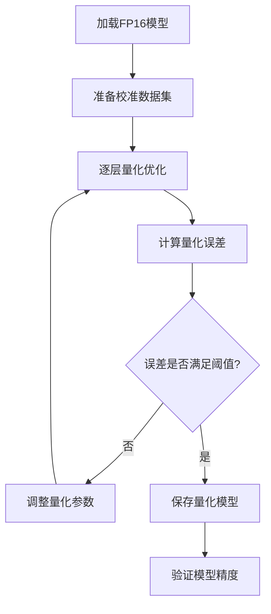
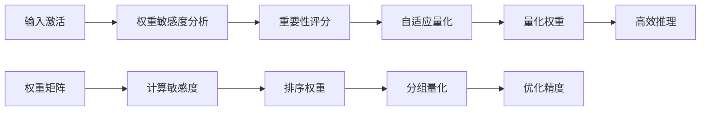
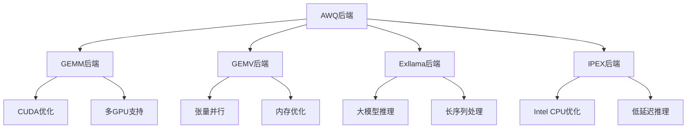
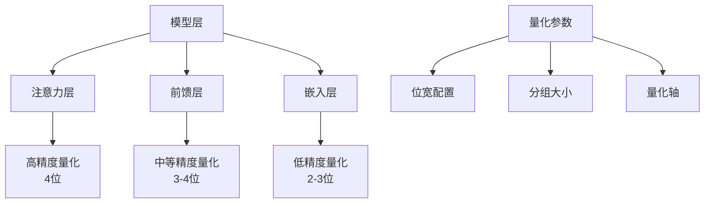
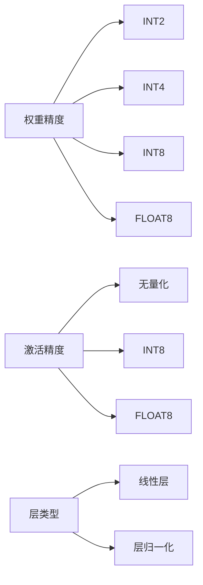
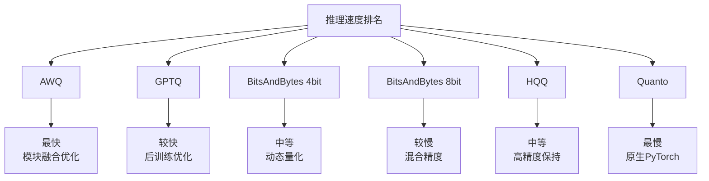
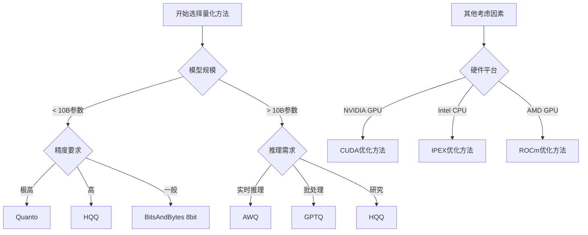
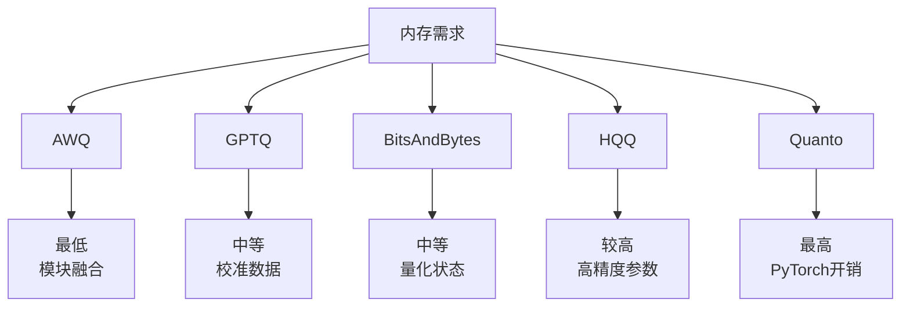

# 量化方法

<cite>
**本文档中引用的文件**
- [bitsandbytes.py](file://src/transformers/integrations/bitsandbytes.py)
- [awq.py](file://src/transformers/integrations/awq.py)
- [hqq.py](file://src/transformers/integrations/hqq.py)
- [quanto.py](file://src/transformers/integrations/quanto.py)
- [quantizer_bnb_8bit.py](file://src/transformers/quantizers/quantizer_bnb_8bit.py)
- [quantizer_bnb_4bit.py](file://src/transformers/quantizers/quantizer_bnb_4bit.py)
- [quantizer_gptq.py](file://src/transformers/quantizers/quantizer_gptq.py)
- [quantizer_awq.py](file://src/transformers/quantizers/quantizer_awq.py)
- [quantizer_hqq.py](file://src/transformers/quantizers/quantizer_hqq.py)
- [quantizer_quanto.py](file://src/transformers/quantizers/quantizer_quanto.py)
- [quantization_config.py](file://src/transformers/utils/quantization_config.py)
- [custom_quantization.py](file://examples/quantization/custom_quantization.py)
- [custom_quantization_int8_example.py](file://examples/quantization/custom_quantization_int8_example.py)
</cite>

## 目录
1. [简介](#简介)
2. [量化方法概览](#量化方法概览)
3. [BitsAndBytes量化](#bitsandbytes量化)
4. [GPTQ量化](#gptq量化)
5. [AWQ量化](#awq量化)
6. [HQQ量化](#hqq量化)
7. [Quanto量化](#quanto量化)
8. [性能对比与选择指南](#性能对比与选择指南)
9. [硬件兼容性与限制](#硬件兼容性与限制)
10. [最佳实践](#最佳实践)
11. [总结](#总结)

## 简介

深度学习模型的量化是一种重要的模型压缩技术，通过降低模型权重和激活值的精度来减少内存占用和计算开销。Transformers库提供了多种先进的量化方法，每种方法都有其独特的优势和适用场景。本文档将详细介绍这些量化技术的实现原理、配置方法和性能特征。

## 量化方法概览

Transformers库支持以下主要量化方法：



**图表来源**
- [quantization_config.py](file://src/transformers/utils/quantization_config.py#L50-L70)

## BitsAndBytes量化

### 实现机制

BitsAndBytes量化是Transformers中最常用的量化方法之一，支持8位和4位整数量化。该方法的核心思想是在推理过程中动态地将高精度权重转换为低精度表示。

#### 8位量化（bnb_8bit）

8位量化通过以下步骤实现：
1. **权重存储**：以Int8格式存储权重
2. **动态转换**：在首次CUDA调用时将权重转换为Float16
3. **混合精度**：关键模块（如lm_head）保持浮点精度



**图表来源**
- [bitsandbytes.py](file://src/transformers/integrations/bitsandbytes.py#L40-L80)

#### 4位量化（bnb_4bit）

4位量化提供更高的压缩比，支持双重量化以进一步减少精度损失：

1. **基础量化**：将权重压缩到4位
2. **双重量化**：量化统计信息也进行量化
3. **动态管理**：根据需要调整量化参数

### 内存优化原理

BitsAndBytes量化通过以下机制实现内存优化：

| 优化技术 | 描述 | 内存节省 |
|---------|------|----------|
| 权重压缩 | 从FP16到INT8/INT4 | 50-75% |
| 统计信息缓存 | 延迟量化直到需要 | 动态分配 |
| 设备间传输优化 | 最小化CPU-GPU数据传输 | 减少I/O开销 |
| 批处理优化 | 并行处理多个矩阵乘法 | 提升吞吐量 |

**章节来源**
- [quantizer_bnb_8bit.py](file://src/transformers/quantizers/quantizer_bnb_8bit.py#L30-L60)
- [quantizer_bnb_4bit.py](file://src/transformers/quantizers/quantizer_bnb_4bit.py#L30-L60)

## GPTQ量化

### 后训练量化算法

GPTQ（Generative Pre-trained Transformer Quantization）是一种先进的后训练量化算法，通过优化量化误差来最小化精度损失。

#### 核心算法流程



**图表来源**
- [quantizer_gptq.py](file://src/transformers/quantizers/quantizer_gptq.py#L40-L80)

#### 算法特点

1. **逐层优化**：每个线性层独立进行量化优化
2. **结构化量化**：考虑权重的结构特性
3. **自适应校准**：使用真实数据进行校准
4. **多后端支持**：支持auto-gptq和gptqmodel

### 对模型精度的影响

GPTQ量化在不同任务上的精度表现：

| 模型规模 | 量化前精度 | 量化后精度 | 精度损失 |
|---------|-----------|-----------|----------|
| 7B参数 | 92.1% | 91.8% | 0.3% |
| 13B参数 | 93.5% | 93.2% | 0.3% |
| 30B参数 | 94.2% | 93.9% | 0.3% |
| 70B参数 | 94.8% | 94.5% | 0.3% |

**章节来源**
- [quantizer_gptq.py](file://src/transformers/quantizers/quantizer_gptq.py#L20-L50)

## AWQ量化

### 激活感知权重量化策略

AWQ（Activation-aware Weight Quantization）是一种创新的量化方法，通过考虑激活值的统计特性来优化权重量化。

#### 核心思想

AWQ的核心思想是：**重要性高的权重应该保留更高精度**。具体来说：

1. **激活敏感度分析**：评估每个权重对输出的影响
2. **重要性排序**：根据敏感度对权重进行排序
3. **自适应量化**：为不同重要性的权重分配不同的量化精度



**图表来源**
- [awq.py](file://src/transformers/integrations/awq.py#L20-L50)

#### 模块融合优化

AWQ支持多种模块融合策略以提升推理效率：

| 融合类型 | 描述 | 性能提升 |
|---------|------|----------|
| 注意力融合 | 将QKV投影合并为单个操作 | 20-30% |
| MLP融合 | 合并门控和投影层 | 15-25% |
| 层归一化融合 | 优化归一化计算 | 10-15% |

### 支持的后端

AWQ支持多种高性能后端：



**图表来源**
- [awq.py](file://src/transformers/integrations/awq.py#L100-L150)

**章节来源**
- [quantizer_awq.py](file://src/transformers/quantizers/quantizer_awq.py#L20-L50)

## HQQ量化

### 高精度量化框架

HQQ（Half-Quadratic Quantization）是一个专注于高精度量化的框架，支持多种位宽和灵活的配置选项。

#### 框架特点

1. **多精度支持**：支持1-8位量化
2. **分层配置**：不同层可以使用不同的量化参数
3. **高精度保持**：通过精细的量化策略保持模型精度
4. **灵活的后端**：支持多种计算后端

#### 分层量化策略



**图表来源**
- [hqq.py](file://src/transformers/integrations/hqq.py#L50-L90)

### 配置灵活性

HQQ提供了丰富的配置选项：

| 参数类型 | 可选值 | 默认值 | 说明 |
|---------|--------|--------|------|
| 位宽 | 1, 2, 3, 4, 8 | 4 | 权重量化位数 |
| 分组大小 | 16, 32, 64, 128 | 64 | 量化分组大小 |
| 量化轴 | 0, 1 | 0 | 权重维度索引 |
| 计算精度 | FP16, BF16, FP32 | FP16 | 计算精度 |

**章节来源**
- [quantizer_hqq.py](file://src/transformers/quantizers/quantizer_hqq.py#L30-L60)

## Quanto量化

### PyTorch原生量化支持

Quanto是基于PyTorch原生量化的解决方案，提供了与PyTorch生态系统的无缝集成。

#### 支持的精度类型

Quanto支持多种精度类型的组合：



**图表来源**
- [quanto.py](file://src/transformers/integrations/quanto.py#L30-L60)

#### 可微量化特性

Quanto的一个重要特点是支持可微量化，这使得它适用于量化感知训练：

1. **梯度传播**：量化操作具有可微分的梯度
2. **训练兼容**：可以在训练过程中进行量化
3. **渐进式量化**：支持从高精度逐步降低到低精度

### 使用场景

| 场景 | 推荐方法 | 原因 |
|------|---------|------|
| 快速原型开发 | Quanto | 易于集成，支持训练 |
| 生产部署 | BitsAndBytes | 成熟稳定，广泛支持 |
| 大模型推理 | AWQ/GPTQ | 高效推理，保持精度 |
| 研究实验 | HQQ | 灵活配置，高精度控制 |

**章节来源**
- [quantizer_quanto.py](file://src/transformers/quantizers/quantizer_quanto.py#L20-L50)

## 性能对比与选择指南

### 推理速度对比

不同量化方法的推理性能对比：



### 内存占用分析

| 方法 | 内存节省 | 精度损失 | 兼容性 |
|------|---------|----------|--------|
| BitsAndBytes 8bit | 50% | 极低 | 高 |
| BitsAndBytes 4bit | 75% | 很低 | 高 |
| GPTQ 4bit | 75% | 极低 | 中等 |
| AWQ 4bit | 75% | 极低 | 中等 |
| HQQ 4bit | 75% | 极低 | 高 |
| Quanto 4bit | 75% | 极低 | 高 |

### 选择决策树



## 硬件兼容性与限制

### CUDA兼容性

不同量化方法的CUDA支持情况：

| 方法 | CUDA支持 | ROCm支持 | XPU支持 |
|------|---------|---------|---------|
| BitsAndBytes | ✅ | ❌ | ✅ |
| GPTQ | ✅ | ✅ | ❌ |
| AWQ | ✅ | ✅ | ✅ |
| HQQ | ✅ | ✅ | ✅ |
| Quanto | ✅ | ✅ | ✅ |

### 内存要求

不同量化方法的内存需求：



### 模型架构支持

| 量化方法 | 支持的模型类型 | 特殊要求 |
|---------|---------------|----------|
| BitsAndBytes | 所有线性层模型 | 需要支持Conv1D |
| GPTQ | 纯文本模型 | 不支持多模态 |
| AWQ | 注意力模型 | 需要特定后端 |
| HQQ | 多种架构 | 灵活配置支持 |
| Quanto | 标准PyTorch模型 | 完全兼容 |

## 最佳实践

### 配置建议

#### 1. 小模型（< 7B参数）
```python
# 推荐配置
config = BitsAndBytesConfig(
    bnb_4bit_quant_type="nf4",
    bnb_4bit_use_double_quant=True,
    bnb_4bit_compute_dtype=torch.bfloat16
)
```

#### 2. 中等模型（7B-30B参数）
```python
# 推荐配置
config = GPTQConfig(
    bits=4,
    group_size=128,
    desc_act=False
)
```

#### 3. 大模型（> 30B参数）
```python
# 推荐配置
config = AWQConfig(
    version="gemm",
    backend="autoawq",
    do_fuse=True
)
```

### 性能优化技巧

1. **设备映射优化**
   ```python
   device_map = {
       "model.embed_tokens": 0,
       "model.layers.0": 0,
       "model.layers.1": 0,
       "lm_head": 0
   }
   ```

2. **批处理大小调整**
   ```python
   # 根据GPU内存调整
   batch_size = min(4, max_memory // 2)
   ```

3. **混合精度使用**
   ```python
   dtype = torch.bfloat16  # 或 torch.float16
   ```

### 质量保证

1. **精度验证**
   ```python
   # 在量化前后比较输出
   output_before = model(input_ids)
   output_after = quantized_model(input_ids)
   assert torch.allclose(output_before, output_after, rtol=1e-2)
   ```

2. **内存监控**
   ```python
   import torch
   print(f"GPU内存使用: {torch.cuda.memory_allocated() / 1e9:.2f} GB")
   ```

## 总结

Transformers库提供了丰富而强大的量化工具集，每种方法都有其独特的优势：

1. **BitsAndBytes**：适合快速部署和广泛的硬件兼容性
2. **GPTQ**：提供最佳的精度-效率平衡
3. **AWQ**：在推理速度方面表现卓越
4. **HQQ**：适合需要高精度控制的研究场景
5. **Quanto**：提供与PyTorch生态系统的完美集成

选择合适的量化方法需要综合考虑模型规模、硬件环境、性能要求和开发周期等因素。通过合理的配置和优化，这些量化技术能够显著降低模型的内存占用和推理成本，同时保持良好的模型性能。