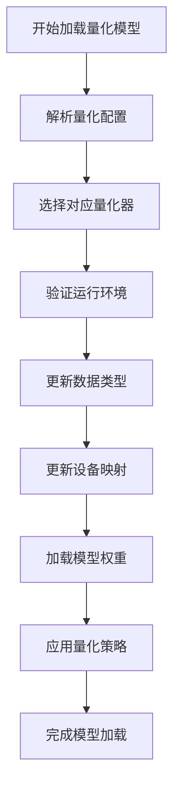
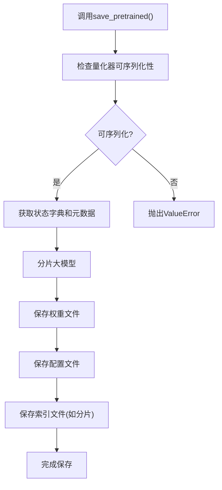

# 量化模型加载与保存

<cite>
**本文档引用的文件**   
- [modeling_utils.py](file://src/transformers/modeling_utils.py#L3447-L3870)
- [quantization_config.py](file://src/transformers/utils/quantization_config.py#L0-L2084)
- [auto.py](file://src/transformers/quantizers/auto.py#L0-L333)
- [base.py](file://src/transformers/quantizers/base.py#L0-L406)
- [test_fp_quant.py](file://tests/quantization/fp_quant_integration/test_fp_quant.py#L85-L111)
- [test_higgs.py](file://tests/quantization/higgs/test_higgs.py#L129-L152)
- [test_quanto.py](file://tests/quantization/quanto_integration/test_quanto.py#L218-L232)
</cite>

## 目录
1. [量化模型加载流程](#量化模型加载流程)
2. [量化配置与设备映射](#量化配置与设备映射)
3. [量化模型保存机制](#量化模型保存机制)
4. [从Hugging Face Hub加载最佳实践](#从hugging-face-hub加载最佳实践)
5. [模型兼容性检查](#模型兼容性检查)
6. [本地模型导出注意事项](#本地模型导出注意事项)

## 量化模型加载流程

量化模型的加载主要通过`AutoModel.from_pretrained()`方法配合量化配置类实现。加载流程首先通过`AutoHfQuantizer`类根据量化配置自动选择正确的量化器，然后在模型加载过程中应用相应的量化策略。对于预量化模型，系统会自动识别并应用相应的量化配置。

**Section sources**
- [auto.py](file://src/transformers/quantizers/auto.py#L302-L332)
- [modeling_utils.py](file://src/transformers/modeling_utils.py#L4659-L4681)

## 量化配置与设备映射

量化配置类如`BitsAndBytesConfig`、`GPTQConfig`等用于定义量化参数。`device_map`参数对于多GPU部署至关重要，不同量化方法有不同的设备映射策略。例如，bitsandbytes量化会根据CUDA可用性自动设置设备映射，而GPTQ量化则默认使用CPU设备映射。用户可以通过设置`device_map="auto"`来实现自动设备分配，或提供自定义的设备映射字典来精确控制模型各部分的部署位置。

**Diagram sources**
- [auto.py](file://src/transformers/quantizers/auto.py#L302-L332)
- [base.py](file://src/transformers/quantizers/base.py#L147-L177)

**Section sources**
- [quantization_config.py](file://src/transformers/utils/quantization_config.py#L0-L2084)
- [auto.py](file://src/transformers/quantizers/auto.py#L0-L333)

## 量化模型保存机制

量化模型的保存通过`save_pretrained()`方法实现，该方法会持久化量化配置和权重。保存过程首先检查量化器的可序列化性，然后将模型状态字典和元数据一起保存。对于某些量化方法（如quanto），仅支持安全序列化（safe_serialization=True）。保存的模型包含完整的量化配置，确保后续可以正确加载和恢复量化状态。

**Diagram sources**
- [modeling_utils.py](file://src/transformers/modeling_utils.py#L3447-L3870)
- [test_quanto.py](file://tests/quantization/quanto_integration/test_quanto.py#L218-L232)

**Section sources**
- [modeling_utils.py](file://src/transformers/modeling_utils.py#L3447-L3870)
- [test_fp_quant.py](file://tests/quantization/fp_quant_integration/test_fp_quant.py#L85-L111)

## 从Hugging Face Hub加载最佳实践

从Hugging Face Hub加载量化模型的最佳实践包括：首先使用`AutoQuantizationConfig.from_pretrained()`从模型仓库加载量化配置，然后将其传递给`AutoModel.from_pretrained()`。确保安装了必要的依赖包（如optimum-quanto用于quanto量化）。对于大型量化模型，建议使用`device_map="auto"`实现自动设备分配，并设置适当的`max_memory`参数来优化内存使用。

**Section sources**
- [auto.py](file://src/transformers/quantizers/auto.py#L0-L333)
- [test_higgs.py](file://tests/quantization/higgs/test_higgs.py#L129-L152)

## 模型兼容性检查

模型兼容性检查机制通过`AutoHfQuantizer.supports_quant_method()`方法实现。该机制在加载模型时验证量化方法是否受支持，对于不支持的量化类型会发出警告并跳过量化。用户可以通过检查模型配置中的`quantization_config`属性来确认模型的量化状态。此外，系统会检查量化器的环境依赖，确保必要的库已正确安装。

**Section sources**
- [auto.py](file://src/transformers/quantizers/auto.py#L0-L333)
- [base.py](file://src/transformers/quantizers/base.py#L0-L406)

## 本地模型导出注意事项

本地模型导出时需要注意：确保使用`safe_serialization=True`以保证跨平台兼容性；对于不支持传统序列化的量化方法（如quanto），必须使用安全序列化；保存完整的模型配置，包括量化配置；考虑模型大小，必要时使用分片保存。导出的模型应包含所有必要的文件（配置文件、权重文件、分片索引等），以便后续正确加载。

**Section sources**
- [modeling_utils.py](file://src/transformers/modeling_utils.py#L3447-L3870)
- [test_quanto.py](file://tests/quantization/quanto_integration/test_quanto.py#L218-L232)