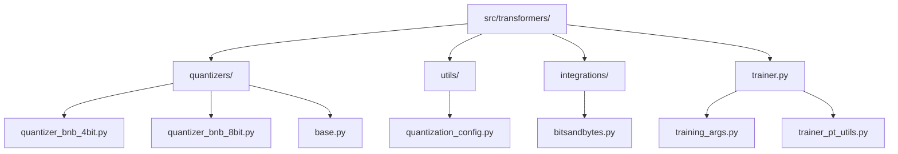
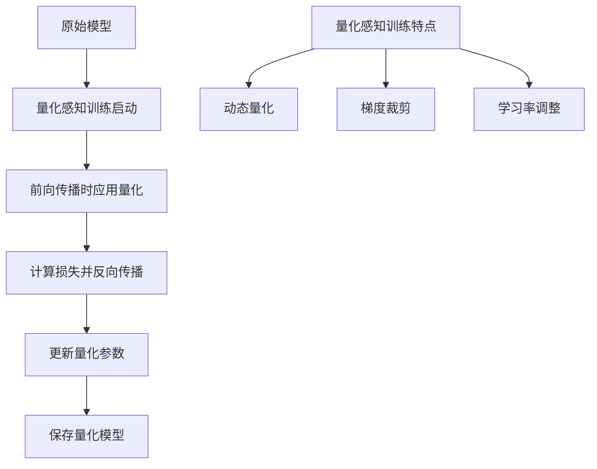
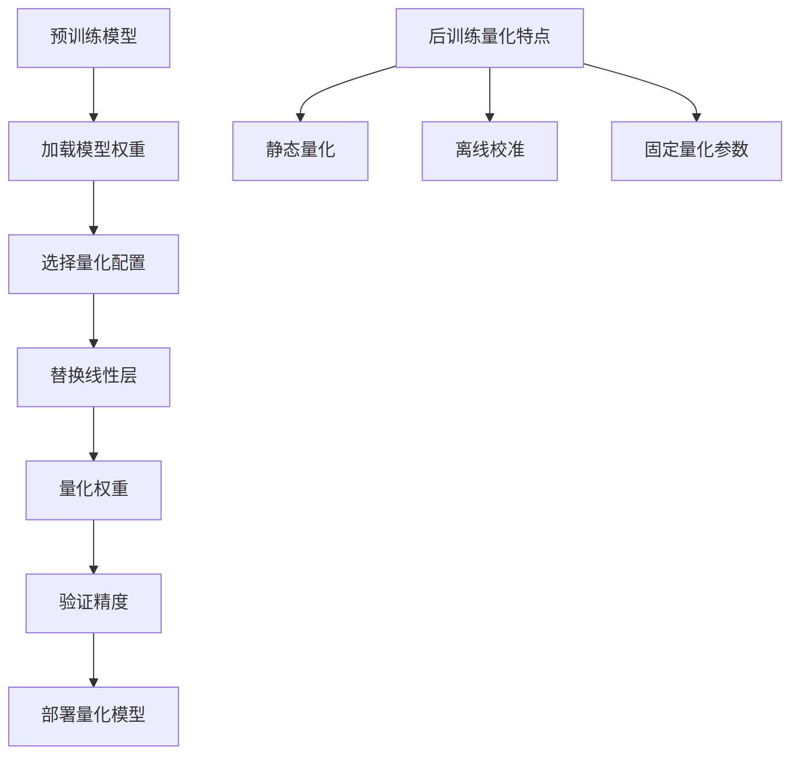
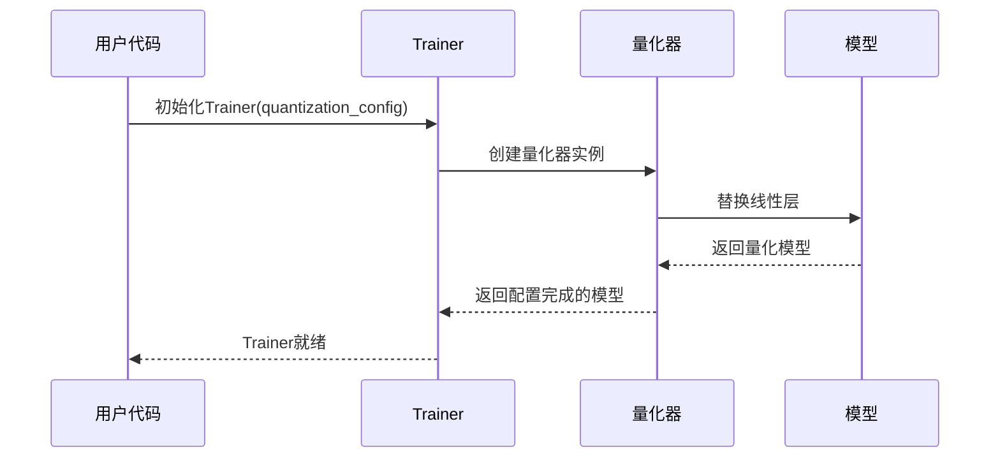
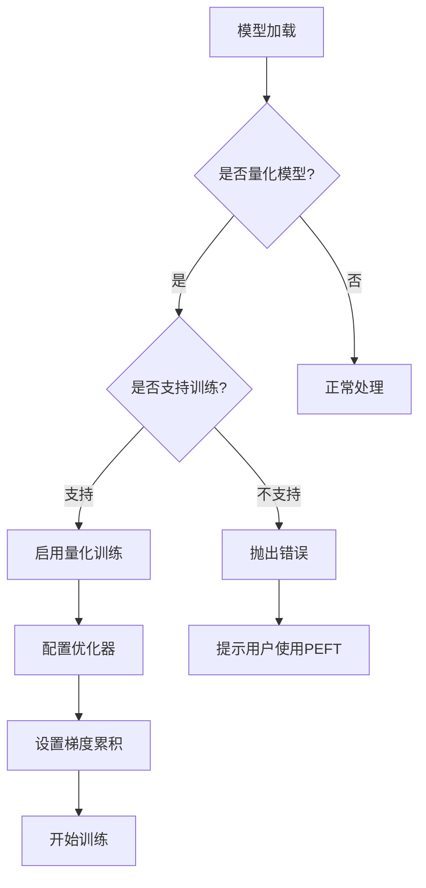
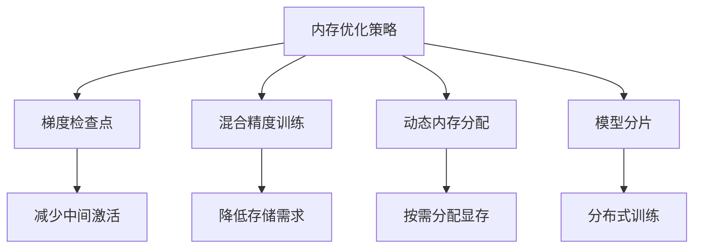
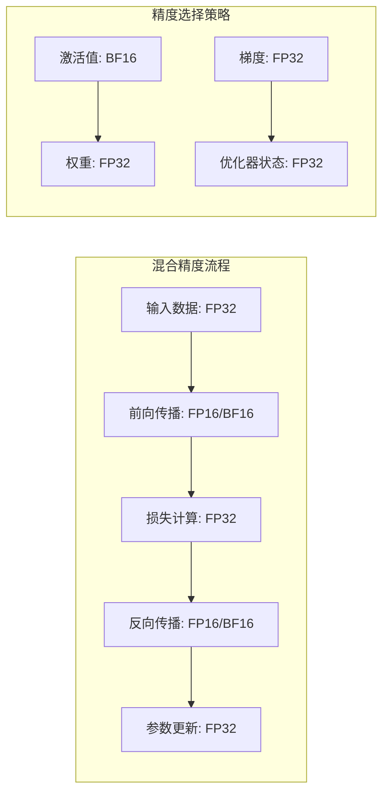
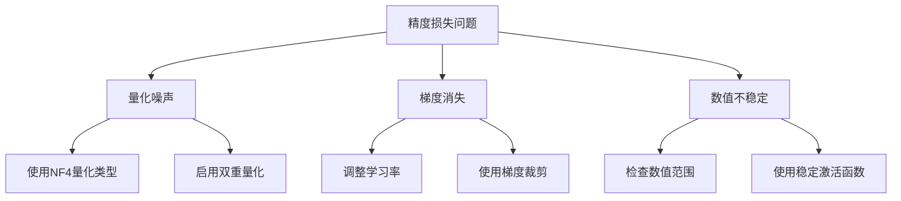
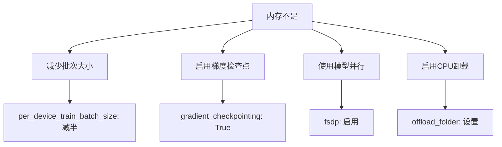
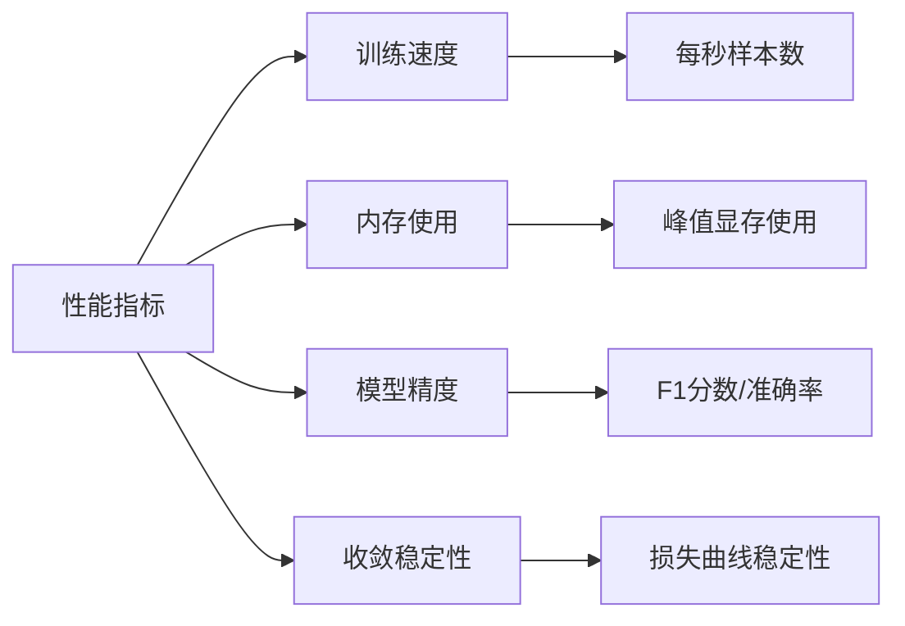

# 量化模型微调集成

<cite>
**本文档中引用的文件**
- [trainer.py](file://src/transformers/trainer.py)
- [quantization_config.py](file://src/transformers/utils/quantization_config.py)
- [bitsandbytes.py](file://src/transformers/integrations/bitsandbytes.py)
- [quantizer_bnb_4bit.py](file://src/transformers/quantizers/quantizer_bnb_4bit.py)
- [training_args.py](file://src/transformers/training_args.py)
- [custom_quantization.py](file://examples/quantization/custom_quantization.py)
- [custom_quantization_int8_example.py](file://examples/quantization/custom_quantization_int8_example.py)
</cite>

## 目录
1. [简介](#简介)
2. [项目结构概览](#项目结构概览)
3. [量化感知训练与后训练量化](#量化感知训练与后训练量化)
4. [量化配置详解](#量化配置详解)
5. [Trainer框架集成](#trainer框架集成)
6. [完整训练脚本示例](#完整训练脚本示例)
7. [内存管理策略](#内存管理策略)
8. [混合精度训练配置](#混合精度训练配置)
9. [常见问题与解决方案](#常见问题与解决方案)
10. [最佳实践建议](#最佳实践建议)

## 简介

量化模型微调是深度学习领域的重要技术，它通过降低模型权重和激活值的精度来减少内存占用和计算开销，同时尽可能保持模型性能。本文档深入讲解如何在Hugging Face Transformers的Trainer框架中集成量化模型进行微调，涵盖量化感知训练与后训练量化的配置差异、内存管理策略以及混合精度训练的实现方法。

## 项目结构概览

Transformers库中的量化相关组件主要分布在以下目录结构中：



**图表来源**
- [trainer.py](file://src/transformers/trainer.py#L1-L50)
- [quantization_config.py](file://src/transformers/utils/quantization_config.py#L1-L50)

**章节来源**
- [trainer.py](file://src/transformers/trainer.py#L1-L100)
- [quantization_config.py](file://src/transformers/utils/quantization_config.py#L1-L100)

## 量化感知训练与后训练量化

### 量化感知训练（QAT）

量化感知训练是在训练过程中模拟量化效果，使模型能够适应量化带来的精度损失。这种方法需要特殊的训练策略和优化器配置。



**图表来源**
- [quantizer_bnb_4bit.py](file://src/transformers/quantizers/quantizer_bnb_4bit.py#L131-L158)
- [bitsandbytes.py](file://src/transformers/integrations/bitsandbytes.py#L61-L85)

### 后训练量化（PTQ）

后训练量化是在模型训练完成后进行的量化过程，通常更简单但可能带来更大的精度损失。



**图表来源**
- [custom_quantization_int8_example.py](file://examples/quantization/custom_quantization_int8_example.py#L171-L197)
- [custom_quantization.py](file://examples/quantization/custom_quantization.py#L40-L78)

**章节来源**
- [quantizer_bnb_4bit.py](file://src/transformers/quantizers/quantizer_bnb_4bit.py#L112-L223)
- [bitsandbytes.py](file://src/transformers/integrations/bitsandbytes.py#L196-L221)

## 量化配置详解

### BitsAndBytesConfig配置

BitsAndBytesConfig是量化配置的核心类，提供了丰富的量化选项：

| 参数名称 | 类型 | 默认值 | 描述 |
|---------|------|--------|------|
| load_in_4bit | bool | False | 是否启用4位量化 |
| load_in_8bit | bool | False | 是否启用8位量化 |
| bnb_4bit_compute_dtype | torch.dtype | torch.float32 | 计算数据类型 |
| bnb_4bit_quant_type | str | "fp4" | 量化数据类型（fp4/nf4） |
| bnb_4bit_use_double_quant | bool | False | 是否使用双重量化 |
| bnb_4bit_quant_storage | torch.dtype | torch.uint8 | 存储类型 |

### 量化配置差异对比

```mermaid
graph LR
subgraph "后训练量化配置"
A1[load_in_4bit: True]
A2[bnb_4bit_compute_dtype: torch.float32]
A3[bnb_4bit_quant_type: "fp4"]
A4[bnb_4bit_use_double_quant: False]
end
subgraph "量化感知训练配置"
B1[load_in_4bit: True]
B2[bnb_4bit_compute_dtype: torch.bfloat16]
B3[bnb_4bit_quant_type: "nf4"]
B4[bnb_4bit_use_double_quant: True]
B5[requires_grad: True]
end
A1 --> B1
A2 --> B2
A3 --> B3
A4 --> B4
```

**图表来源**
- [quantization_config.py](file://src/transformers/utils/quantization_config.py#L392-L610)
- [quantization_config.py](file://src/transformers/utils/quantization_config.py#L429-L440)

**章节来源**
- [quantization_config.py](file://src/transformers/utils/quantization_config.py#L392-L610)
- [quantization_config.py](file://src/transformers/utils/quantization_config.py#L470-L499)

## Trainer框架集成

### Trainer初始化配置

在Trainer中集成量化模型需要正确配置量化参数：



**图表来源**
- [trainer.py](file://src/transformers/trainer.py#L400-L500)
- [bitsandbytes.py](file://src/transformers/integrations/bitsandbytes.py#L61-L85)

### 量化模型检测机制

Trainer会自动检测量化模型并进行相应的处理：



**图表来源**
- [trainer.py](file://src/transformers/trainer.py#L500-L600)

**章节来源**
- [trainer.py](file://src/transformers/trainer.py#L400-L700)
- [bitsandbytes.py](file://src/transformers/integrations/bitsandbytes.py#L61-L150)

## 完整训练脚本示例

### 基础4位量化训练示例

以下是一个完整的4位量化训练脚本示例：

```python
# 量化配置示例路径：[quantization_config.py](file://src/transformers/utils/quantization_config.py#L392-L610)
# Trainer初始化示例路径：[trainer.py](file://src/transformers/trainer.py#L400-L500)
```

### 高级量化训练配置

对于更复杂的量化训练场景，可以使用以下配置：

```python
# 高级量化配置示例路径：[quantization_config.py](file://src/transformers/utils/quantization_config.py#L429-L440)
# 内存管理示例路径：[trainer.py](file://src/transformers/trainer.py#L200-L300)
```

**章节来源**
- [trainer.py](file://src/transformers/trainer.py#L1187-L1216)
- [training_args.py](file://src/transformers/training_args.py#L1613-L1623)

## 内存管理策略

### 量化模型内存优化

量化模型训练中的内存管理至关重要：



### 内存使用监控

Trainer提供了内置的内存监控功能：


**图表来源**
- [trainer.py](file://src/transformers/trainer.py#L200-L300)

**章节来源**
- [trainer.py](file://src/transformers/trainer.py#L200-L400)
- [quantizer_bnb_4bit.py](file://src/transformers/quantizers/quantizer_bnb_4bit.py#L203-L223)

## 混合精度训练配置

### 自动混合精度（AMP）

混合精度训练结合了不同精度的数据类型以提高训练效率：



### 混合精度配置参数

| 参数名称 | 推荐值 | 描述 |
|---------|--------|------|
| fp16 | False | 是否启用FP16训练 |
| bf16 | True | 是否启用BF16训练 |
| tf32 | False | 是否启用TF32加速 |
| gradient_accumulation_steps | 4 | 梯度累积步数 |
| dataloader_pin_memory | True | 是否固定内存 |

**章节来源**
- [training_args.py](file://src/transformers/training_args.py#L1613-L1623)
- [trainer.py](file://src/transformers/trainer.py#L1728-L1752)

## 常见问题与解决方案

### 精度损失问题

量化训练中最常见的问题是精度损失：



### 内存不足解决方案

当遇到内存不足时，可以采用以下策略：



### 性能优化建议

1. **硬件优化**：使用支持Tensor Core的GPU
2. **软件优化**：启用编译器优化
3. **算法优化**：选择合适的量化策略

**章节来源**
- [trainer.py](file://src/transformers/trainer.py#L500-L700)
- [quantizer_bnb_4bit.py](file://src/transformers/quantizers/quantizer_bnb_4bit.py#L112-L129)

## 最佳实践建议

### 量化训练最佳实践

1. **渐进式量化**：从8位量化开始，逐步过渡到4位量化
2. **校准数据集**：使用代表性数据进行量化参数校准
3. **定期评估**：在训练过程中定期评估模型精度
4. **备份原模型**：保留未量化的原始模型作为备份

### 性能监控指标



### 部署注意事项

1. **兼容性检查**：确保目标环境支持量化模型
2. **推理优化**：使用专门的推理引擎
3. **版本管理**：维护量化模型的不同版本
4. **回退机制**：准备未量化的回退方案

通过遵循这些最佳实践，可以在保持模型性能的同时最大化硬件利用率，实现高效的量化模型微调。