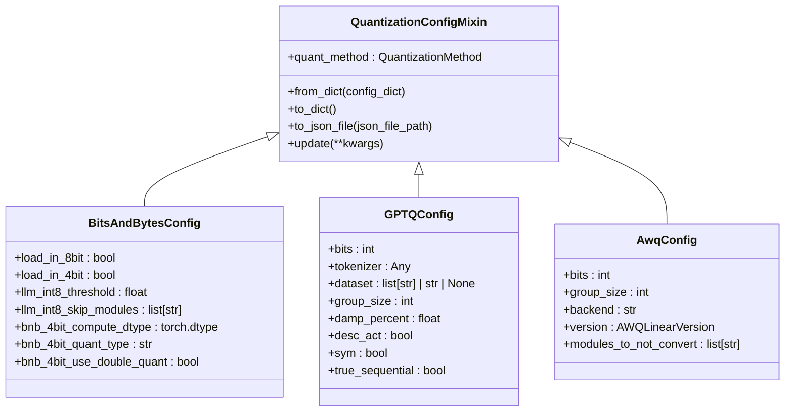
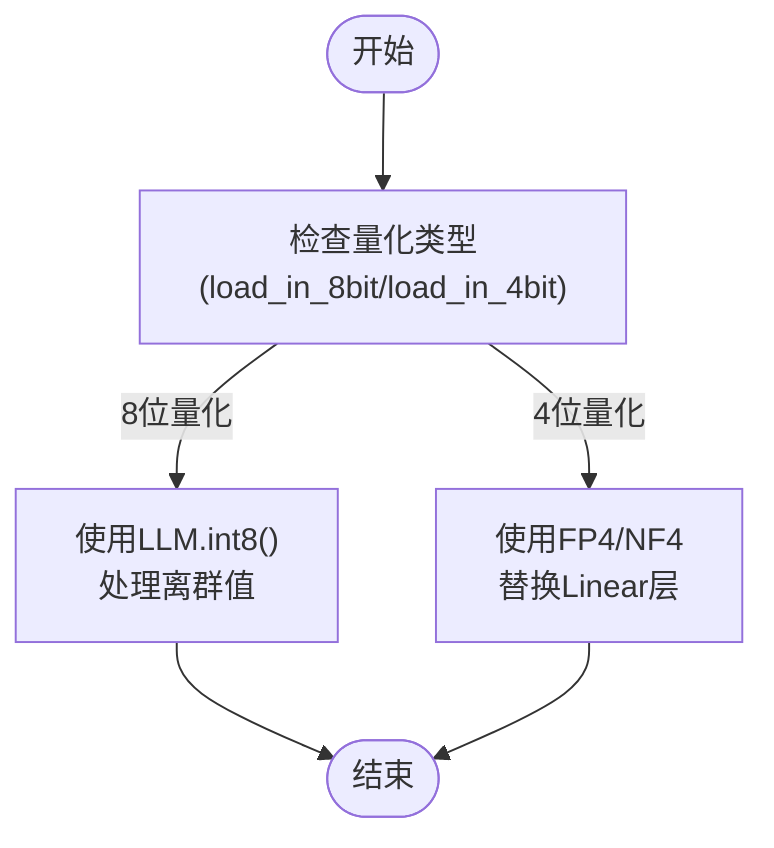
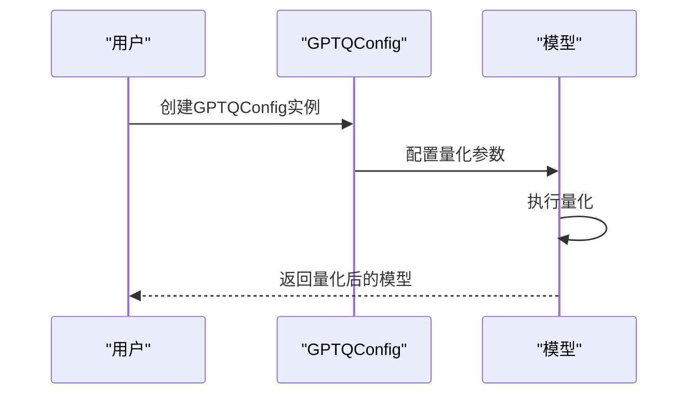
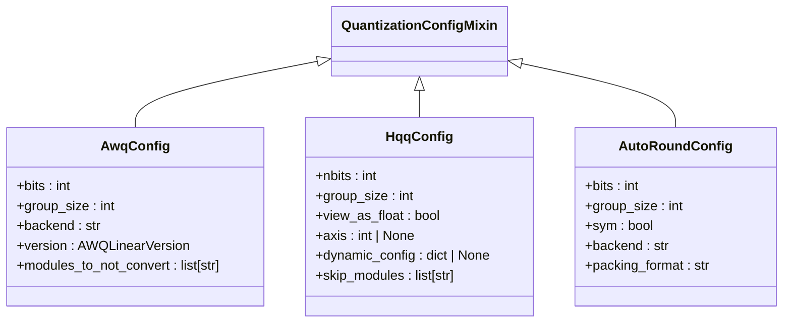
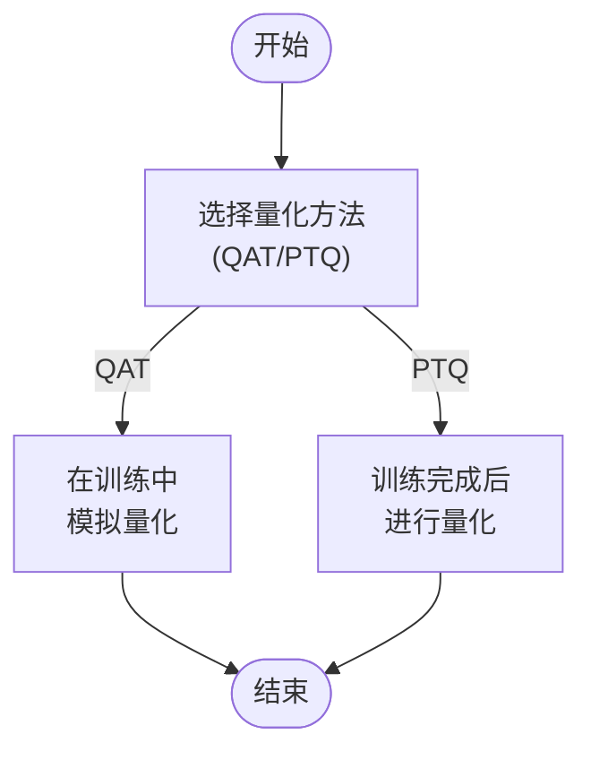

# 量化配置与使用

<cite>
**本文档中引用的文件**
- [quantization_config.py](file://src/transformers/utils/quantization_config.py)
- [bitsandbytes.py](file://src/transformers/integrations/bitsandbytes.py)
- [awq.py](file://src/transformers/integrations/awq.py)
- [custom_quantization.py](file://examples/quantization/custom_quantization.py)
- [custom_quantization_int8_example.py](file://examples/quantization/custom_quantization_int8_example.py)
- [auto.py](file://src/transformers/quantizers/auto.py)
- [base.py](file://src/transformers/quantizers/base.py)
</cite>

## 目录
1. [引言](#引言)
2. [量化配置基础](#量化配置基础)
3. [BitsAndBytesConfig详解](#bitsandbytesconfig详解)
4. [GPTQConfig详解](#gptqconfig详解)
5. [其他量化配置类](#其他量化配置类)
6. [量化模型的加载与使用](#量化模型的加载与使用)
7. [量化感知训练与后训练量化](#量化感知训练与后训练量化)
8. [量化模型的保存与加载](#量化模型的保存与加载)
9. [配置参数详细说明](#配置参数详细说明)
10. [最佳实践](#最佳实践)

## 引言
量化技术是深度学习模型优化的重要手段，通过降低模型权重和激活值的精度来减少模型的内存占用和计算开销，同时尽量保持模型的性能。在Hugging Face Transformers库中，提供了多种量化配置类，如BitsAndBytesConfig、GPTQConfig等，用于设置量化参数并应用于预训练模型。本文档将深入讲解这些量化配置的使用方法和最佳实践，帮助用户根据硬件资源和性能需求选择合适的量化策略。

## 量化配置基础
量化配置类是Hugging Face Transformers库中用于定义量化参数的核心组件。这些配置类继承自`QuantizationConfigMixin`，并提供了丰富的参数来控制量化过程。主要的量化配置类包括`BitsAndBytesConfig`、`GPTQConfig`、`AwqConfig`等，每种配置类对应不同的量化方法和技术。



**图表来源**
- [quantization_config.py](file://src/transformers/utils/quantization_config.py#L191-L398)

**本节来源**
- [quantization_config.py](file://src/transformers/utils/quantization_config.py#L191-L398)

## BitsAndBytesConfig详解
`BitsAndBytesConfig`是用于配置bitsandbytes库量化的核心类，支持8位和4位量化。该配置类提供了丰富的参数来控制量化过程，包括计算数据类型、最小值、离群值阈值等关键选项。

### 主要参数
- `load_in_8bit`：布尔值，指示是否启用8位量化。
- `load_in_4bit`：布尔值，指示是否启用4位量化。
- `llm_int8_threshold`：浮点数，用于设置离群值检测的阈值，超出此阈值的隐藏状态值将被视为离群值并在fp16中进行操作。
- `llm_int8_skip_modules`：字符串列表，指定不进行8位量化的模块名称。
- `bnb_4bit_compute_dtype`：torch.dtype，设置计算类型，可能与输入类型不同。
- `bnb_4bit_quant_type`：字符串，设置4位量化层中的量化数据类型，支持FP4和NF4。
- `bnb_4bit_use_double_quant`：布尔值，指示是否使用嵌套量化，即对第一次量化的量化常数再次进行量化。



**图表来源**
- [bitsandbytes.py](file://src/transformers/integrations/bitsandbytes.py#L100-L200)

**本节来源**
- [quantization_config.py](file://src/transformers/utils/quantization_config.py#L369-L398)
- [bitsandbytes.py](file://src/transformers/integrations/bitsandbytes.py#L100-L200)

## GPTQConfig详解
`GPTQConfig`是用于配置GPTQ（Generalized Post-Training Quantization）量化的核心类，支持2、3、4、8位量化。该配置类提供了详细的参数来控制量化过程，包括分组大小、阻尼百分比、是否使用对称量化等。

### 主要参数
- `bits`：整数，指定要量化的位数，支持2、3、4、8位。
- `tokenizer`：预训练的分词器，用于处理数据集。
- `dataset`：用于量化的数据集，可以是字符串或字符串列表。
- `group_size`：整数，指定量化分组大小，推荐值为128。
- `damp_percent`：浮点数，指定Hessian对角线平均值的百分比用于阻尼，推荐值为0.1。
- `desc_act`：布尔值，指示是否按激活大小递减的顺序量化列。
- `sym`：布尔值，指示是否使用对称量化。
- `true_sequential`：布尔值，指示是否在单个Transformer块内执行顺序量化。



**图表来源**
- [quantization_config.py](file://src/transformers/utils/quantization_config.py#L595-L622)

**本节来源**
- [quantization_config.py](file://src/transformers/utils/quantization_config.py#L595-L622)

## 其他量化配置类
除了`BitsAndBytesConfig`和`GPTQConfig`，Hugging Face Transformers库还提供了多种其他量化配置类，以支持不同的量化方法和技术。

### AwqConfig
`AwqConfig`用于配置AWQ（Activation-aware Weight Quantization）量化，支持GEMM、GEMV、Exllama等后端。

### HqqConfig
`HqqConfig`用于配置HQQ（Half-Quadratic Quantization）量化，支持不同的位数和分组大小。

### AutoRoundConfig
`AutoRoundConfig`用于配置AutoRound量化，支持不同的位数和分组大小。



**图表来源**
- [quantization_config.py](file://src/transformers/utils/quantization_config.py#L821-L854)

**本节来源**
- [quantization_config.py](file://src/transformers/utils/quantization_config.py#L821-L854)

## 量化模型的加载与使用
在Hugging Face Transformers库中，可以通过`AutoModelForCausalLM.from_pretrained`方法加载预训练模型，并应用量化配置。以下是一个完整的代码示例，展示如何在加载预训练模型时应用量化配置。

```python
from transformers import AutoModelForCausalLM, AutoTokenizer
from transformers.utils.quantization_config import BitsAndBytesConfig

# 创建量化配置
quantization_config = BitsAndBytesConfig(
    load_in_4bit=True,
    bnb_4bit_compute_dtype=torch.float16,
    bnb_4bit_quant_type="nf4",
    bnb_4bit_use_double_quant=True
)

# 加载预训练模型并应用量化配置
model = AutoModelForCausalLM.from_pretrained(
    "facebook/opt-350m",
    quantization_config=quantization_config,
    device_map="auto"
)

# 加载分词器
tokenizer = AutoTokenizer.from_pretrained("facebook/opt-350m")

# 使用模型进行推理
input_text = "Hello, how are you?"
inputs = tokenizer(input_text, return_tensors="pt").to("cuda")
outputs = model.generate(**inputs, max_length=50)
print(tokenizer.decode(outputs[0], skip_special_tokens=True))
```

**本节来源**
- [custom_quantization.py](file://examples/quantization/custom_quantization.py#L30-L78)
- [custom_quantization_int8_example.py](file://examples/quantization/custom_quantization_int8_example.py#L200-L252)

## 量化感知训练与后训练量化
量化感知训练（Quantization-Aware Training, QAT）和后训练量化（Post-Training Quantization, PTQ）是两种主要的量化方法。QAT在训练过程中模拟量化效果，而PTQ在模型训练完成后进行量化。

### 量化感知训练
QAT通过在训练过程中引入量化操作，使模型适应量化带来的精度损失。这种方法通常能获得更好的性能，但需要重新训练模型。

### 后训练量化
PTQ在模型训练完成后进行量化，不需要重新训练模型。这种方法简单快捷，但可能会影响模型性能。



**图表来源**
- [quantization_config.py](file://src/transformers/utils/quantization_config.py#L1855-L1877)

**本节来源**
- [quantization_config.py](file://src/transformers/utils/quantization_config.py#L1855-L1877)

## 量化模型的保存与加载
量化模型的保存和加载是量化流程中的重要环节。Hugging Face Transformers库提供了简单的方法来保存和加载量化后的模型。

### 保存量化模型
```python
# 保存量化模型
model.save_pretrained("path/to/quantized_model")
tokenizer.save_pretrained("path/to/quantized_model")
```

### 加载量化模型
```python
# 加载量化模型
model = AutoModelForCausalLM.from_pretrained(
    "path/to/quantized_model",
    device_map="auto"
)
tokenizer = AutoTokenizer.from_pretrained("path/to/quantized_model")
```

**本节来源**
- [custom_quantization_int8_example.py](file://examples/quantization/custom_quantization_int8_example.py#L230-L252)

## 配置参数详细说明
以下表格列出了主要量化配置类的参数及其说明，帮助用户根据硬件资源和性能需求做出合适的选择。

| 配置类 | 参数 | 类型 | 默认值 | 说明 |
| --- | --- | --- | --- | --- |
| BitsAndBytesConfig | load_in_8bit | bool | False | 是否启用8位量化 |
| BitsAndBytesConfig | load_in_4bit | bool | False | 是否启用4位量化 |
| BitsAndBytesConfig | llm_int8_threshold | float | 6.0 | 离群值检测阈值 |
| BitsAndBytesConfig | llm_int8_skip_modules | list[str] | None | 不进行8位量化的模块 |
| BitsAndBytesConfig | bnb_4bit_compute_dtype | torch.dtype | torch.float32 | 计算数据类型 |
| BitsAndBytesConfig | bnb_4bit_quant_type | str | "fp4" | 4位量化数据类型 |
| BitsAndBytesConfig | bnb_4bit_use_double_quant | bool | False | 是否使用嵌套量化 |
| GPTQConfig | bits | int | 4 | 量化位数 |
| GPTQConfig | group_size | int | 128 | 量化分组大小 |
| GPTQConfig | damp_percent | float | 0.1 | 阻尼百分比 |
| GPTQConfig | desc_act | bool | False | 是否按激活大小递减顺序量化 |
| GPTQConfig | sym | bool | True | 是否使用对称量化 |
| GPTQConfig | true_sequential | bool | True | 是否在单个Transformer块内执行顺序量化 |

**本节来源**
- [quantization_config.py](file://src/transformers/utils/quantization_config.py#L191-L398)

## 最佳实践
在使用量化配置时，以下是一些最佳实践建议：

1. **选择合适的量化方法**：根据模型的特性和硬件资源选择合适的量化方法。对于需要高精度的应用，建议使用QAT；对于需要快速部署的应用，建议使用PTQ。
2. **调整量化参数**：根据模型的性能和硬件资源调整量化参数，如分组大小、阻尼百分比等。
3. **验证量化效果**：在量化后，验证模型的性能和精度，确保量化没有显著影响模型的性能。
4. **保存和加载量化模型**：使用Hugging Face Transformers库提供的方法保存和加载量化模型，确保模型的正确持久化。

**本节来源**
- [quantization_config.py](file://src/transformers/utils/quantization_config.py#L191-L398)
- [bitsandbytes.py](file://src/transformers/integrations/bitsandbytes.py#L100-L200)
- [awq.py](file://src/transformers/integrations/awq.py#L100-L200)