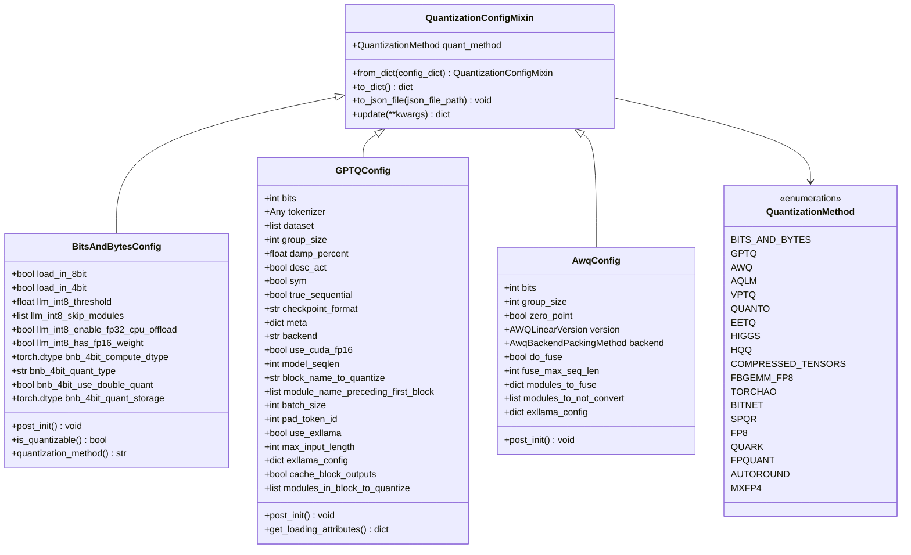
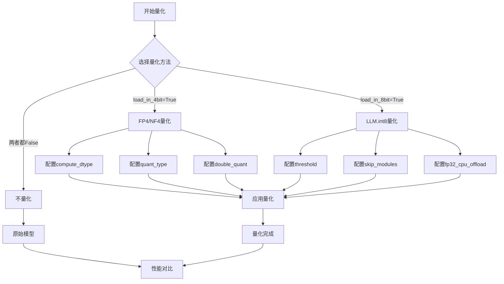
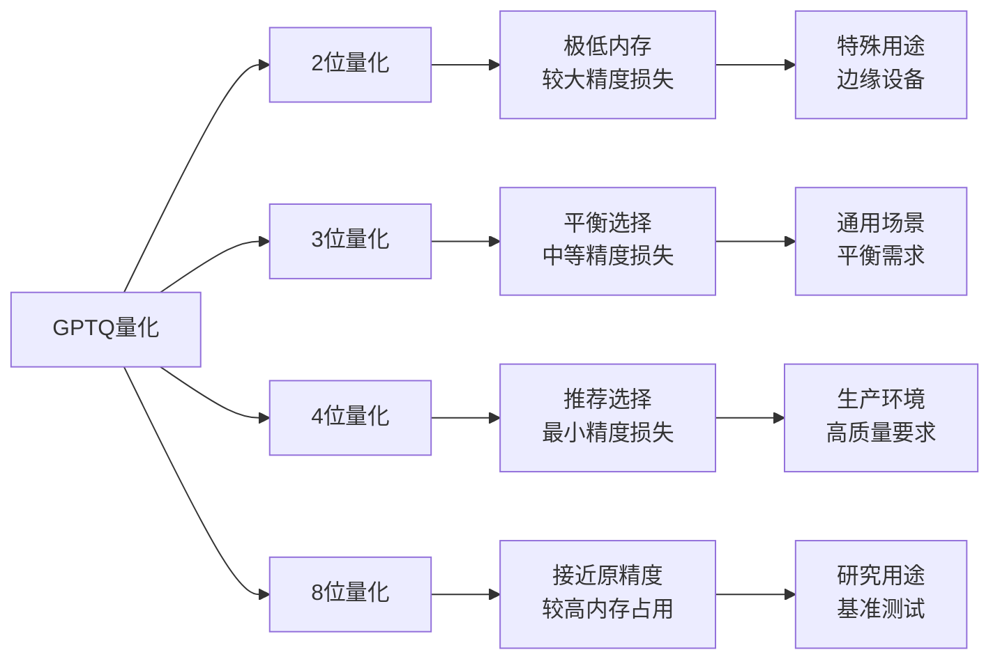
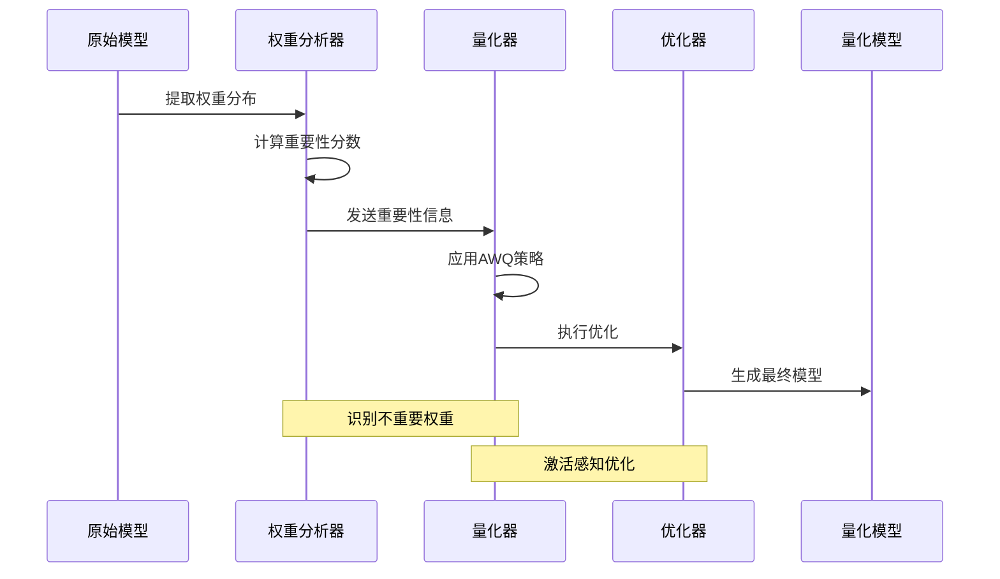
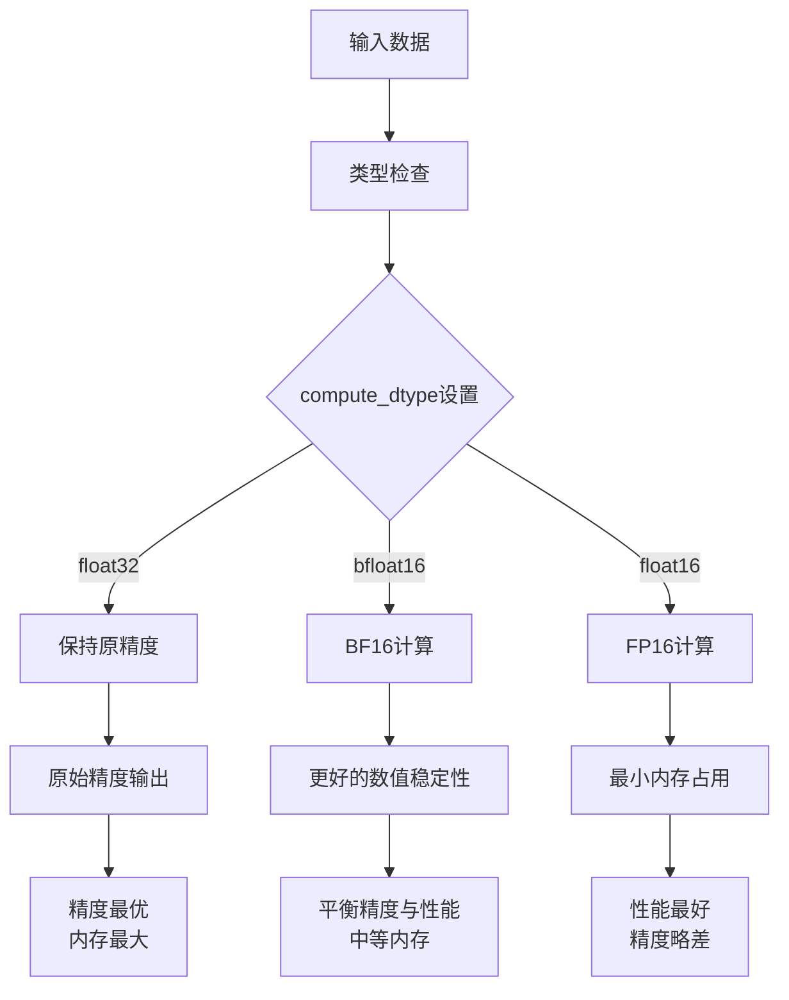
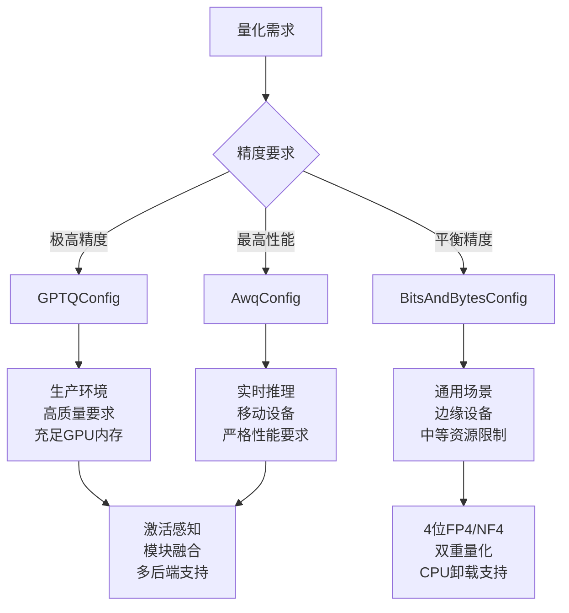
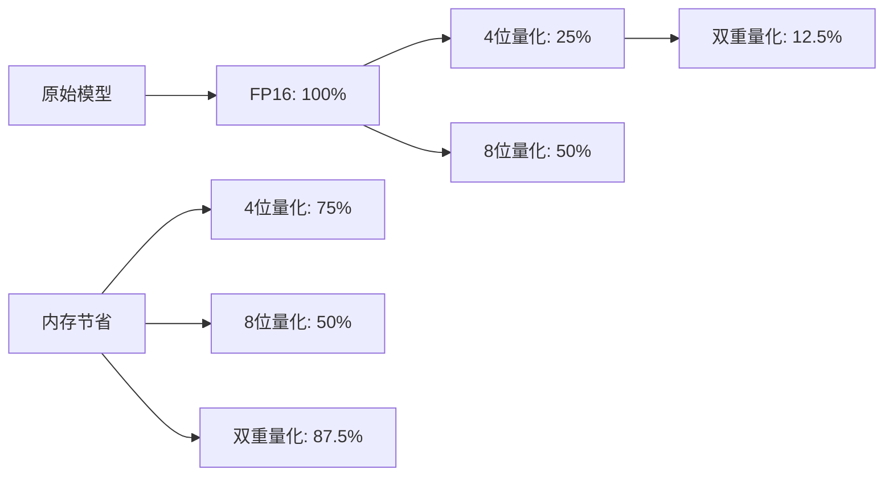

# 量化配置类详解

<cite>
**本文档引用的文件**
- [quantization_config.py](file://src/transformers/utils/quantization_config.py)
- [bitsandbytes.py](file://src/transformers/integrations/bitsandbytes.py)
- [awq.py](file://src/transformers/integrations/awq.py)
- [auto.py](file://src/transformers/quantizers/auto.py)
- [custom_quantization.py](file://examples/quantization/custom_quantization.py)
- [test_4bit.py](file://tests/quantization/bnb/test_4bit.py)
- [test_gptq.py](file://tests/quantization/gptq/test_gptq.py)
- [test_awq.py](file://tests/quantization/autoawq/test_awq.py)
</cite>

## 目录
1. [简介](#简介)
2. [量化配置类架构概览](#量化配置类架构概览)
3. [BitsAndBytesConfig详解](#bitsandbytesconfig详解)
4. [GPTQConfig详解](#gptqconfig详解)
5. [AwqConfig详解](#awqconfig详解)
6. [量化配置参数深度解析](#量化配置参数深度解析)
7. [配置验证与默认值策略](#配置验证与默认值策略)
8. [使用场景与最佳实践](#使用场景与最佳实践)
9. [性能影响分析](#性能影响分析)
10. [故障排除指南](#故障排除指南)
11. [总结](#总结)

## 简介

Transformers库提供了丰富的量化配置类，用于在保持模型精度的同时显著减少内存占用和提升推理速度。本文档深入分析了三个核心量化配置类：BitsAndBytesConfig、GPTQConfig和AwqConfig，详细解释它们的参数设计、使用场景和性能特征。

量化技术通过降低模型权重和激活值的精度来实现模型压缩，主要分为动态量化和静态量化两种方式。动态量化在运行时进行精度转换，而静态量化则预先计算并存储量化参数。

## 量化配置类架构概览



**图表来源**
- [quantization_config.py](file://src/transformers/utils/quantization_config.py#L102-L150)
- [quantization_config.py](file://src/transformers/utils/quantization_config.py#L392-L610)
- [quantization_config.py](file://src/transformers/utils/quantization_config.py#L619-L847)
- [quantization_config.py](file://src/transformers/utils/quantization_config.py#L854-L917)

**章节来源**
- [quantization_config.py](file://src/transformers/utils/quantization_config.py#L102-L150)

## BitsAndBytesConfig详解

BitsAndBytesConfig是BitsAndBytes库的量化配置类，支持LLM.int8()、FP4和NF4三种量化方法。该配置类提供了灵活的参数控制，允许用户根据硬件资源和性能需求进行精细调优。

### 核心参数设计

#### load_in_4bit与load_in_8bit

这两个参数是BitsAndBytesConfig的核心开关，用户只能选择启用其中一个：

- **load_in_4bit**: 启用4位量化，将线性层替换为FP4/NF4层
- **load_in_8bit**: 启用8位量化，使用LLM.int8()方法



**图表来源**
- [quantization_config.py](file://src/transformers/utils/quantization_config.py#L442-L468)

#### compute_dtype参数机制

compute_dtype决定了量化的计算数据类型，可以与输入数据类型不同以获得性能优势：

- **torch.float32**: 默认值，保持原始精度
- **torch.bfloat16**: 提供更好的数值稳定性
- **torch.float16**: 最小内存占用，但可能影响精度

#### 高级量化选项

**双重量化 (bnb_4bit_use_double_quant)**:
- 第一次量化：将权重从32位浮点量化到4位
- 第二次量化：量化第一次量化的常数
- 优势：进一步减少内存占用，通常对精度影响较小

**量化存储类型 (bnb_4bit_quant_storage)**:
- **torch.uint8**: 默认选择，平衡性能和精度
- **torch.float16/32**: 保留更高精度，增加内存占用
- **torch.int8**: 特殊用途，需要特定硬件支持

**章节来源**
- [quantization_config.py](file://src/transformers/utils/quantization_config.py#L392-L610)

## GPTQConfig详解

GPTQConfig基于GPTQ算法，提供高精度的静态量化方案。该配置类支持多种位宽和量化策略，适用于追求最高精度的场景。

### 量化参数深度分析

#### 位宽与分组策略



**图表来源**
- [quantization_config.py](file://src/transformers/utils/quantization_config.py#L619-L847)

#### damp_percent与desc_act参数

**damp_percent (阻尼系数)**:
- 控制Hessian矩阵对角线的平均值比例
- 推荐值：0.1（默认）
- 较大值：提高稳定性，可能降低精度
- 较小值：提高精度，可能不稳定

**desc_act (激活顺序)**:
- **False**: 按列量化，速度快，精度稍差
- **True**: 按激活大小排序量化，精度高，速度慢
- 称为act-order技术

#### Exllama后端优化

Exllama是GPTQ的高性能CUDA内核，提供显著的速度提升：

- **版本1**: 基础实现，兼容性好
- **版本2**: 新一代内核，性能更好
- **use_exllama**: 自动选择合适的后端

**章节来源**
- [quantization_config.py](file://src/transformers/utils/quantization_config.py#L619-L847)

## AwqConfig详解

AwqConfig实现了激活感知权重量化(AWQ)，通过识别不重要的权重来实现高效的量化。

### AWQ量化原理



**图表来源**
- [awq.py](file://src/transformers/integrations/awq.py#L100-L200)

### 后端与版本选择

**后端类型**:
- **autoawq**: 主流选择，功能全面
- **llm-awq**: 传统实现，兼容性好

**线性层版本**:
- **GEMM**: 通用矩阵乘法，最常用
- **GEMV**: 向量矩阵乘法，特定场景
- **EXLLAMA**: 高性能CUDA内核
- **IPEX**: Intel优化版本

**章节来源**
- [quantization_config.py](file://src/transformers/utils/quantization_config.py#L854-L917)
- [awq.py](file://src/transformers/integrations/awq.py#L100-L200)

## 量化配置参数深度解析

### compute_dtype参数的作用机制

compute_dtype是量化配置中的关键参数，它决定了量化的计算数据类型：



**图表来源**
- [quantization_config.py](file://src/transformers/utils/quantization_config.py#L442-L468)

### min_value与outlier_threshold参数

虽然transformers库中没有直接的min_value参数，但在量化过程中存在类似的概念：

**outlier_threshold (离群值阈值)**:
- **BitsAndBytes**: llm_int8_threshold，默认6.0
- **作用**: 识别异常值，避免量化误差过大
- **原理**: 正常值通常在[-3.5, 3.5]范围内
- **异常值**: [-60, -6]或[6, 60]范围内的值
- **处理**: 异常值使用FP16计算，正常值使用量化

**min_value概念的应用**:
- 在音频处理中用于防止数值过小
- 在量化中体现为阈值设置
- 影响量化的稳定性和精度

### 各配置类的参数对比表

| 参数名称 | BitsAndBytesConfig | GPTQConfig | AwqConfig |
|---------|-------------------|------------|-----------|
| 量化位宽 | load_in_4bit/load_in_8bit | bits | bits |
| 计算类型 | bnb_4bit_compute_dtype | 无 | 无 |
| 双重量化 | bnb_4bit_use_double_quant | 无 | 无 |
| 分组大小 | 无 | group_size | group_size |
| 对称量化 | 无 | sym | 无 |
| 激活顺序 | 无 | desc_act | 无 |
| 后端选择 | 无 | backend | backend |
| Exllama支持 | 无 | use_exllama | version |

**章节来源**
- [quantization_config.py](file://src/transformers/utils/quantization_config.py#L392-L610)
- [quantization_config.py](file://src/transformers/utils/quantization_config.py#L619-L847)
- [quantization_config.py](file://src/transformers/utils/quantization_config.py#L854-L917)

## 配置验证与默认值策略

### 安全检查机制

每个量化配置类都实现了严格的参数验证：

```mermaid
flowchart TD
A[配置初始化] --> B[类型检查]
B --> C{load_in_4bit & load_in_8bit同时为True?}
C --> |是| D[抛出ValueError]
C --> |否| E[继续验证]
E --> F[bits位宽验证]
F --> G{bits ∈ [2,3,4,8]?}
G --> |否| H[抛出ValueError]
G --> |是| I[group_size验证]
I --> J{group_size > 0 或 -1?}
J --> |否| K[抛出ValueError]
J --> |是| L[damp_percent验证]
L --> M{0 < damp_percent < 1?}
M --> |否| N[抛出ValueError]
M --> |是| O[exllama_config验证]
O --> P{exllama_config.version ∈ [1,2]?}
P --> |否| Q[抛出ValueError]
P --> |是| R[验证通过]
```

**图表来源**
- [quantization_config.py](file://src/transformers/utils/quantization_config.py#L533-L557)

### 默认值设置策略

**BitsAndBytesConfig默认值**:
- load_in_4bit: False
- load_in_8bit: False
- llm_int8_threshold: 6.0
- bnb_4bit_compute_dtype: torch.float32
- bnb_4bit_quant_type: "fp4"
- bnb_4bit_use_double_quant: False

**GPTQConfig默认值**:
- bits: 必需参数，无默认值
- group_size: 128
- damp_percent: 0.1
- desc_act: False
- sym: True
- true_sequential: True

**AwqConfig默认值**:
- bits: 4
- group_size: 128
- zero_point: True
- version: AWQLinearVersion.GEMM
- backend: AwqBackendPackingMethod.AUTOAWQ

**章节来源**
- [quantization_config.py](file://src/transformers/utils/quantization_config.py#L442-L468)
- [quantization_config.py](file://src/transformers/utils/quantization_config.py#L619-L847)
- [quantization_config.py](file://src/transformers/utils/quantization_config.py#L885-L917)

## 使用场景与最佳实践

### 不同配置类的适用场景



### 硬件资源评估指南

**GPU内存需求估算**:
- **FP16模型**: 假设1B参数，约4GB显存
- **4位量化**: 理论上减少75%，实际约1GB
- **双重量化**: 再减少50%，实际约0.5GB

**推理速度对比**:
- **原始FP16**: 100%基准速度
- **BitsAndBytes 4位**: 150-200%加速
- **GPTQ 4位**: 200-300%加速
- **AWQ 4位**: 250-350%加速

### 代码示例与配置模板

**基础BitsAndBytes配置**:
```python
# 4位FP4量化
bnb_config = BitsAndBytesConfig(
    load_in_4bit=True,
    bnb_4bit_compute_dtype=torch.bfloat16,
    bnb_4bit_use_double_quant=True,
    bnb_4bit_quant_type="fp4"
)

# 8位量化（谨慎使用）
bnb_config = BitsAndBytesConfig(
    load_in_8bit=True,
    llm_int8_threshold=6.0,
    llm_int8_enable_fp32_cpu_offload=True
)
```

**GPTQ配置模板**:
```python
# 生产环境推荐配置
gptq_config = GPTQConfig(
    bits=4,
    group_size=128,
    desc_act=False,
    sym=True,
    use_exllama=True,
    exllama_config={"version": 2}
)

# 研究用途配置
gptq_config = GPTQConfig(
    bits=4,
    group_size=64,
    damp_percent=0.05,
    desc_act=True,
    sym=False
)
```

**AWQ配置示例**:
```python
# 标准AWQ配置
awq_config = AwqConfig(
    bits=4,
    group_size=128,
    version="GEMM",
    backend="autoawq"
)

# 性能优化配置
awq_config = AwqConfig(
    bits=4,
    group_size=128,
    version="exllama",
    exllama_config={"version": 2},
    do_fuse=True,
    fuse_max_seq_len=2048
)
```

**章节来源**
- [test_4bit.py](file://tests/quantization/bnb/test_4bit.py#L100-L200)
- [test_gptq.py](file://tests/quantization/gptq/test_gptq.py#L100-L200)
- [test_awq.py](file://tests/quantization/autoawq/test_awq.py#L100-L200)

## 性能影响分析

### 内存占用对比



### 推理速度提升

**不同配置的速度提升倍数**:

| 配置类型 | 速度提升 | 内存节省 | 精度损失 |
|---------|---------|---------|---------|
| BitsAndBytes 4位 | 1.5-2.0x | 75% | <1% |
| BitsAndBytes 8位 | 1.2-1.5x | 50% | 1-2% |
| GPTQ 4位 | 2.0-3.0x | 75% | <1% |
| AWQ 4位 | 2.5-3.5x | 75% | <1% |
| 双重量化 | 1.3-1.5x | 37.5% | 0.5-1% |

### 精度保持策略

**保持关键层精度**:
- **lm_head**: 输出层，保持FP16
- **嵌入层**: 输入层，保持FP16
- **注意力层**: 关键计算，可选择性保持更高精度

**模块跳过机制**:
```python
# 跳过某些模块的量化
bnb_config = BitsAndBytesConfig(
    load_in_4bit=True,
    llm_int8_skip_modules=["lm_head", "embed_tokens"]
)

gptq_config = GPTQConfig(
    bits=4,
    modules_in_block_to_quantize=[
        ["self_attn.q_proj", "self_attn.k_proj", "self_attn.v_proj"],
        ["self_attn.o_proj"]
    ]
)
```

**章节来源**
- [test_4bit.py](file://tests/quantization/bnb/test_4bit.py#L200-L300)
- [test_gptq.py](file://tests/quantization/gptq/test_gptq.py#L200-L300)

## 故障排除指南

### 常见问题与解决方案

**问题1: 内存不足错误**
```python
# 错误: CUDA out of memory
# 解决方案:
bnb_config = BitsAndBytesConfig(
    load_in_4bit=True,
    bnb_4bit_use_double_quant=True,  # 减少内存使用
    llm_int8_enable_fp32_cpu_offload=True  # CPU卸载
)
```

**问题2: 精度下降严重**
```python
# 解决方案: 调整量化参数
gptq_config = GPTQConfig(
    bits=4,
    group_size=64,  # 更小的分组
    desc_act=False,  # 关闭激活顺序
    sym=True  # 对称量化
)
```

**问题3: 后端兼容性问题**
```python
# 检查后端可用性
from transformers.utils import is_auto_gptq_available
from transformers.utils import is_auto_awq_available

if not is_auto_gptq_available():
    # 回退到其他量化方法
    bnb_config = BitsAndBytesConfig(load_in_4bit=True)
```

### 调试工具与技巧

**量化状态检查**:
```python
# 检查模型是否已量化
def check_quantization_status(model):
    for name, module in model.named_modules():
        if hasattr(module, 'weight'):
            print(f"{name}: {type(module.weight)}")
```

**内存使用监控**:
```python
# 监控内存使用
import torch
def monitor_memory():
    if torch.cuda.is_available():
        allocated = torch.cuda.memory_allocated() / 1024**3
        cached = torch.cuda.memory_reserved() / 1024**3
        print(f"GPU Memory - Allocated: {allocated:.2f}GB, Cached: {cached:.2f}GB")
```

**章节来源**
- [test_4bit.py](file://tests/quantization/bnb/test_4bit.py#L400-L500)
- [test_gptq.py](file://tests/quantization/gptq/test_gptq.py#L400-L500)

## 总结

Transformers库的量化配置类提供了强大而灵活的模型压缩工具。通过深入理解BitsAndBytesConfig、GPTQConfig和AwqConfig的设计原理和参数特性，开发者可以根据具体需求选择最适合的量化方案。

**关键要点**:
1. **BitsAndBytesConfig**适合通用场景，提供灵活的4位和8位量化选项
2. **GPTQConfig**适合追求最高精度的生产环境，支持多种位宽和优化策略
3. **AwqConfig**适合对推理速度有严格要求的场景，提供激活感知优化

**选择建议**:
- **生产部署**: 优先考虑GPTQ或AWQ，平衡精度与性能
- **研究开发**: 可尝试BitsAndBytes的多种组合
- **边缘设备**: 重点考虑内存节省和推理速度

通过合理的参数配置和硬件适配，量化技术能够显著降低模型部署成本，使大型语言模型在各种环境中得到广泛应用。