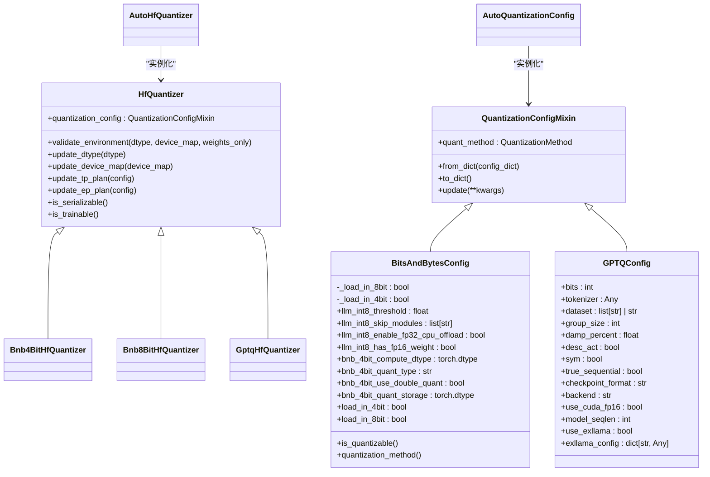
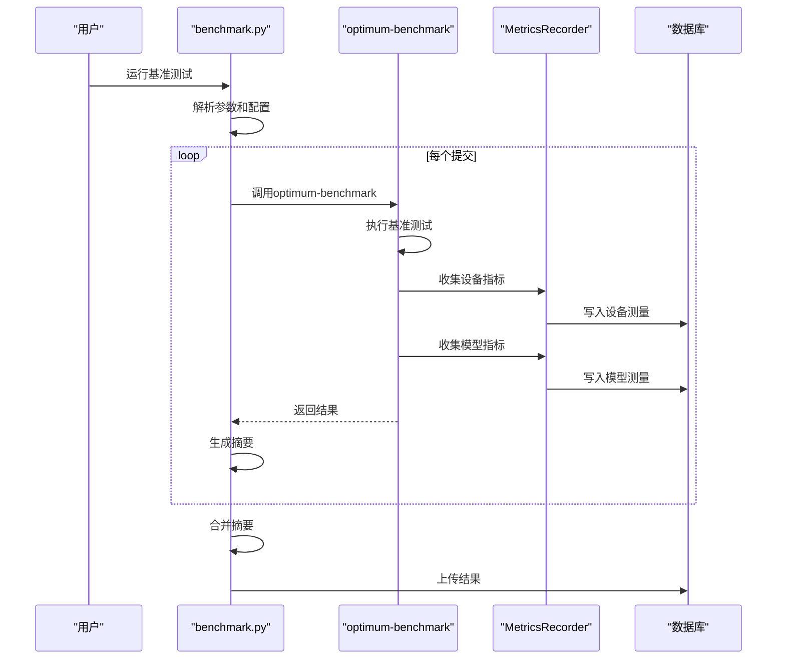
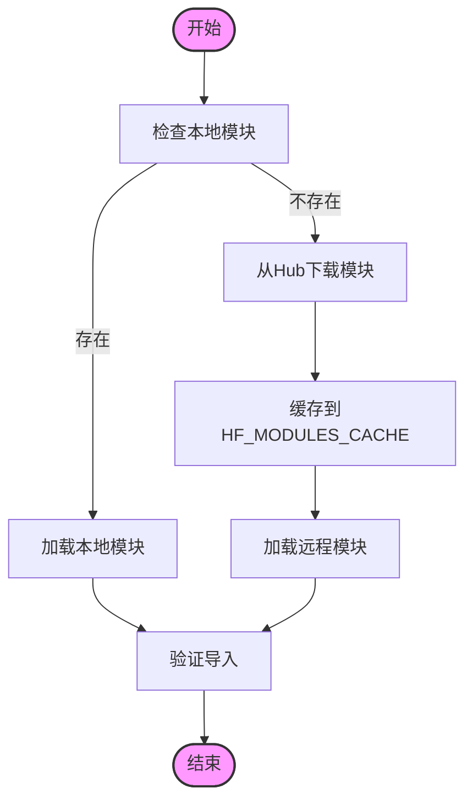
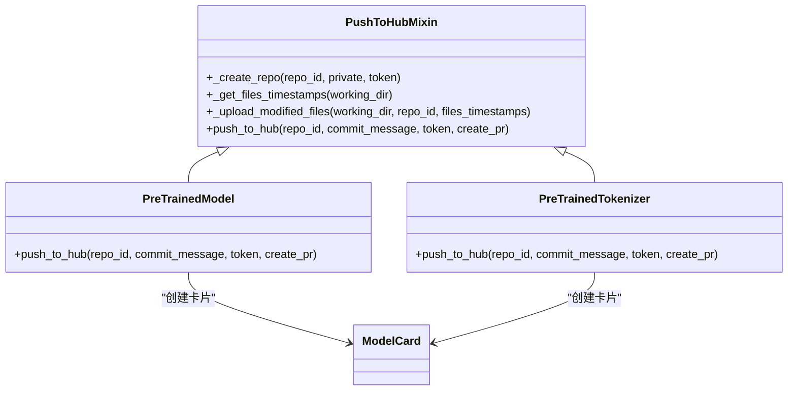
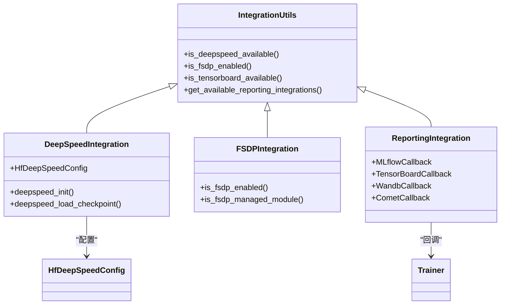

# 高级功能

<cite>
**本文档中引用的文件**
- [__init__.py](file://src/transformers/quantizers/__init__.py)
- [auto.py](file://src/transformers/quantizers/auto.py)
- [quantization_config.py](file://src/transformers/utils/quantization_config.py)
- [README.md](file://benchmark/README.md)
- [benchmark.py](file://benchmark/benchmark.py)
- [README.md](file://examples/modular-transformers/README.md)
- [modeling_my_new_model2.py](file://examples/modular-transformers/modeling_my_new_model2.py)
- [base.py](file://src/transformers/pipelines/base.py)
- [custom_quantization.py](file://examples/quantization/custom_quantization.py)
- [dynamic_module_utils.py](file://src/transformers/dynamic_module_utils.py)
- [hub.py](file://src/transformers/utils/hub.py)
- [__init__.py](file://src/transformers/integrations/__init__.py)
</cite>

## 目录
1. [模型量化技术](#模型量化技术)
2. [基准测试框架](#基准测试框架)
3. [扩展开发支持](#扩展开发支持)
4. [Hugging Face Hub集成](#hugging-face-hub集成)
5. [推理引擎和训练框架集成](#推理引擎和训练框架集成)

## 模型量化技术

transformers库提供了全面的模型量化支持，通过`quantizers`模块实现多种量化方法。核心量化功能由`AutoHfQuantizer`和`AutoQuantizationConfig`类管理，它们根据量化配置自动实例化正确的量化器。

量化配置通过`QuantizationConfigMixin`基类定义，支持多种量化方法，包括8位和4位量化。`BitsAndBytesConfig`类支持LLM.int8()、FP4和NF4量化，通过`load_in_8bit`和`load_in_4bit`参数控制。对于4位量化，可以配置`bnb_4bit_compute_dtype`、`bnb_4bit_quant_type`等参数来优化性能和精度。

**图源**
- [auto.py](file://src/transformers/quantizers/auto.py#L1-L334)
- [quantization_config.py](file://src/transformers/utils/quantization_config.py#L1-L2084)

**量化方法实现**

8位量化通过`BitsAndBytesConfig`的`load_in_8bit=True`参数启用，使用LLM.int8()技术，其中异常值在FP16中处理，其余计算在INT8中进行。4位量化通过`load_in_4bit=True`启用，支持FP4和NF4数据类型。GPTQ量化通过`GPTQConfig`类配置，支持2、3、4、8位量化，具有`group_size`、`damp_percent`等参数来控制量化质量。

用户可以通过`register_quantization_config`和`register_quantizer`装饰器注册自定义量化配置和量化器，实现扩展。例如，`custom_quantization.py`示例展示了如何创建自定义量化配置和量化器。

**高级量化技巧**

性能优化包括使用`bnb_4bit_compute_dtype`设置计算类型（如bfloat16），使用`bnb_4bit_use_double_quant`进行双重量化以减少存储空间。对于GPTQ量化，`desc_act=False`可以加速推理，但可能略微降低困惑度。`true_sequential=True`确保在单个Transformer块内也进行顺序量化，提高量化质量。

**节源**
- [auto.py](file://src/transformers/quantizers/auto.py#L1-L334)
- [quantization_config.py](file://src/transformers/utils/quantization_config.py#L1-L2084)
- [custom_quantization.py](file://examples/quantization/custom_quantization.py#L1-L79)

## 基准测试框架

transformers库的基准测试框架位于`benchmark/`目录，基于`optimum-benchmark`库构建，提供了全面的性能评估功能。框架通过`benchmark.py`脚本运行，支持多配置、多提交的比较测试。

**图源**
- [benchmark.py](file://benchmark/benchmark.py#L1-L325)
- [README.md](file://benchmark/README.md#L1-L50)

**功能和使用方法**

基准测试框架支持通过命令行参数配置测试，如`--config-dir`指定配置目录，`--config-name`指定配置名称，`--commit`指定要测试的提交。支持的指标包括`decode.latency.mean`、`per_token.throughput.value`等。框架会自动为每个提交创建临时目录，并在测试完成后生成摘要报告。

`MetricsRecorder`类是线程安全的，允许在后台线程中收集设备测量（如CPU利用率、GPU内存），同时在主线程中执行模型测量。这确保了测量的准确性，避免了测量过程对模型性能的影响。

**最佳实践**

使用基准测试框架时，建议使用`--multirun`参数进行多配置测试，以便比较不同配置下的性能。通过`--metrics`参数指定关注的指标，避免生成不必要的数据。对于生产环境测试，建议在稳定的硬件环境中运行，并确保测试期间没有其他资源密集型任务。

**节源**
- [benchmark.py](file://benchmark/benchmark.py#L1-L325)
- [README.md](file://benchmark/README.md#L1-L50)

## 扩展开发支持

transformers库提供了强大的扩展开发支持，允许用户添加新模型、自定义分词器和创建新的Pipeline类型。扩展开发主要通过动态模块加载和自定义类注册机制实现。

**添加新模型**

通过`dynamic_module_utils.py`中的工具，用户可以动态加载和注册自定义模型。`get_class_from_dynamic_module`函数可以从远程或本地模块中加载类，支持从Hugging Face Hub加载自定义代码。`create_dynamic_module`函数创建动态模块目录，`get_cached_module_file`下载并缓存模块文件。

**图源**
- [dynamic_module_utils.py](file://src/transformers/dynamic_module_utils.py#L1-L812)

**自定义分词器**

用户可以通过继承`PreTrainedTokenizer`创建自定义分词器。`custom_tokenization.py`示例展示了如何创建继承自`BertTokenizer`的自定义分词器。分词器可以通过`AutoTokenizer`自动加载，只要在模型配置中正确设置`tokenizer_class`。

**创建新Pipeline类型**

通过继承`Pipeline`基类，用户可以创建新的Pipeline类型。`base.py`中的`Pipeline`类提供了统一的接口，包括`__init__`、`__call__`等方法。新的Pipeline类型需要实现`_sanitize_parameters`、`preprocess`、`_forward`和`postprocess`方法。

**模块化转换器**

`modular-transformers`示例展示了如何使用`libcst`解析器将模块化文件转换为单文件模型。`modular_model_converter.py`工具使用AST表示解析模块化文件，构建类依赖映射，然后合并代码生成单文件模型。这对于开发和维护大型模型非常有用。

**节源**
- [dynamic_module_utils.py](file://src/transformers/dynamic_module_utils.py#L1-L812)
- [base.py](file://src/transformers/pipelines/base.py#L1-L1378)
- [README.md](file://examples/modular-transformers/README.md#L1-L20)
- [modeling_my_new_model2.py](file://examples/modular-transformers/modeling_my_new_model2.py#L1-L273)

## Hugging Face Hub集成

transformers库与Hugging Face Hub深度集成，提供模型上传、下载和管理功能。核心集成通过`hub.py`中的`PushToHubMixin`类实现，该类为模型、分词器等组件提供`push_to_hub`方法。

**图源**
- [hub.py](file://src/transformers/utils/hub.py#L1-L1104)

**上传模型**

`push_to_hub`方法将模型或分词器上传到指定的仓库。它会自动创建仓库（如果不存在），上传所有相关文件，并创建提交。支持通过`commit_message`、`commit_description`参数自定义提交信息，通过`create_pr=True`创建拉取请求。

**下载模型**

`from_pretrained`方法从Hub下载模型，支持通过`revision`参数指定分支、标签或提交ID。`cached_file`函数管理缓存，确保文件只下载一次。`has_file`函数检查仓库中是否存在特定文件，无需下载整个仓库。

**最佳实践**

上传模型时，建议使用有意义的`repo_id`，并提供详细的`commit_message`。对于大型模型，考虑使用`max_shard_size`参数分片上传。在CI/CD流程中，可以使用`create_pr=True`创建拉取请求，以便进行代码审查。

**节源**
- [hub.py](file://src/transformers/utils/hub.py#L1-L1104)

## 推理引擎和训练框架集成

transformers库通过`integrations`模块与多种推理引擎和训练框架集成。集成通过条件导入实现，确保只在相关依赖可用时加载。

**图源**
- [__init__.py](file://src/transformers/integrations/__init__.py#L1-L301)

**DeepSpeed集成**

DeepSpeed集成通过`deepspeed`子模块提供，支持ZeRO优化、模型并行等高级训练功能。`HfDeepSpeedConfig`类管理DeepSpeed配置，`deepspeed_init`函数初始化DeepSpeed引擎。集成支持在`Trainer`中使用DeepSpeed，通过`deepspeed`参数指定配置文件。

**FSDP集成**

FSDP（Fully Sharded Data Parallel）集成通过`fsdp`子模块提供，支持分片数据并行训练。`is_fsdp_enabled`函数检查是否启用了FSDP，`is_fsdp_managed_module`函数检查模块是否由FSDP管理。集成与PyTorch的FSDP功能无缝协作。

**报告工具集成**

库集成了多种报告工具，如TensorBoard、Wandb、MLflow等。这些集成通过回调类实现，如`TensorBoardCallback`、`WandbCallback`，可以在训练过程中自动记录指标。`get_reporting_integration_callbacks`函数根据可用性返回相应的回调列表。

**其他集成**

还包括与`bitsandbytes`（8位和4位量化）、`peft`（参数高效微调）、`accelerate`（分布式训练）等库的集成。这些集成通过`replace_with_bnb_linear`、`PeftAdapterMixin`等函数和类实现，提供透明的性能优化和功能扩展。

**节源**
- [__init__.py](file://src/transformers/integrations/__init__.py#L1-L301)